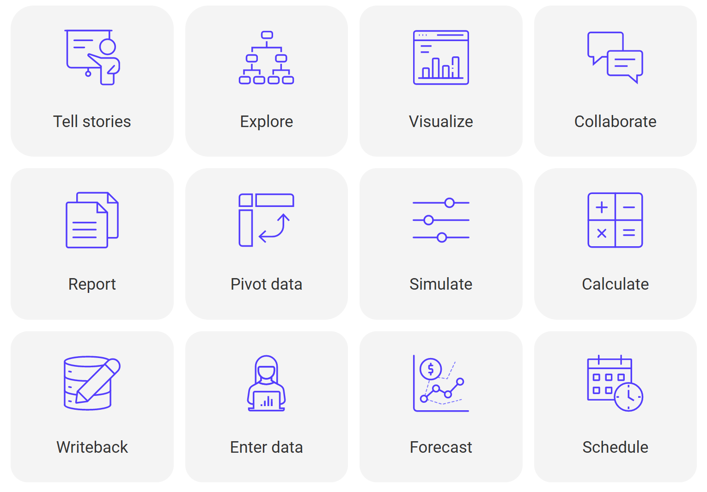

# Introduction to Inforiver

Inforiver offers the **fastest** way to build Power BI reports, using a comprehensive set of **features** enabled by cutting-edge **user experience**.

## **Use cases supported**

You can leverage Inforiver to support several use cases such as the following:

1. Storytelling with annotations
2. Free-form data exploration
3. Visualizations
4. Commenting & collaboration
5. Formatted and paginated reports
6. Spreadsheet-like pivot analysis
7. What-If simulations
8. Visual-level formula & calculations
9. Write back data to databases and shared drives
10. Manual data entry & capture
11. Forecasting, planning & budgeting
12. Scheduling

<figure><figcaption></figcaption></figure>

## 5 reasons to get started with Inforiver

#### **1. Your productivity suite for data**

The Inforiver matrix & charts together constitute a **productivity suite for your data**.&#x20;

#### **2. Frequently asked features**

Inforiver delivers capabilities available in other BI & visualization software (such as Tableau, Spotfire, Qlik, Cognos and SAP BusinessObjects) but not in Power BI.&#x20;

#### **3. Rich user experience**

With Inforiver, report creators and consumers can perform a wide variety of user actions unlike what they have experienced in traditional BI & visualization software.&#x20;

#### **4. Accelerate your digital transformation**

Automate your Excel-based processes by consolidating legacy BI reports and dashboards into Power BI, and eliminating data silos with governed datasets.&#x20;

#### **5. Best practices and standards**

Inforiver adopts a business-responsive design, that can help users deliver [IBCS-compliant](https://inforiver.com/ibcs-reports-powerbi/) business, management, variance, and performance reports in a single click.&#x20;

Learn more about the [5 reasons to get started with Inforiver](introduction-to-inforiver/why-inforiver.md).
