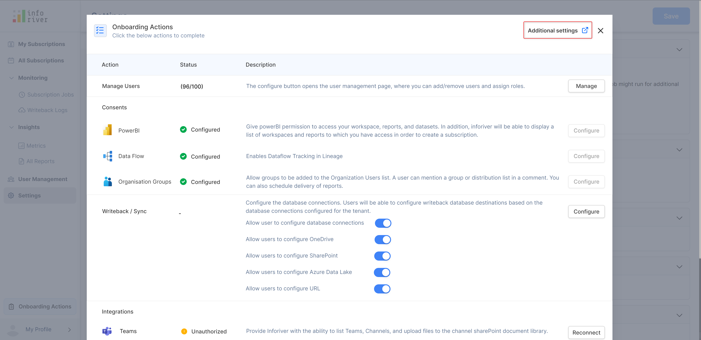
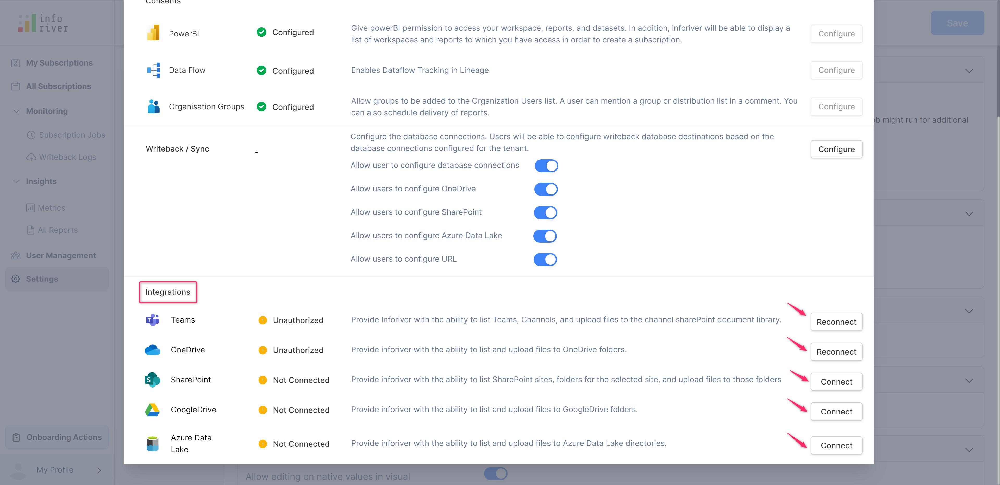

# Onboard actions

Onboarding actions facilitate admins with a one-page checklist for user management and settings.&#x20;

With onboard actions, you can configure and manage necessary configurations such as user management, consents, writeback/sync, and integrations settings in a single click.

Select 'onboard actions' on the admin console page

<figure><figcaption>
Onboarding options
</figcaption></figure>

A pop-up opens showing the action, status, and description details of the configurations.

<figure><figcaption>
Onboarding actions page
</figcaption></figure>

Click on 'Additional settings' to navigate to the settings page.&#x20;

<figure><figcaption>
Additional settings option
</figcaption></figure>

### 1. Manage users&#x20;

It is the user management configuration where you can add/remove users and assign user roles. Clicking on 'Manage' will navigate you to the user management page.

<figure><figcaption>
Manage users configuration
</figcaption></figure>

### 2. Consents

Power BI permission, data flow tracking, and organization group configurations are managed under consent. Clicking on 'Configure' will navigate you to the settings page.

<figure><figcaption>
Consents configuration
</figcaption></figure>

### 3. Writeback/sync

You can configure the database connections and writeback destinations in a single click.

Clicking on 'Configure' will navigate you to the settings page where you can do the additional settings.

<figure><figcaption>
Writeback configuration
</figcaption></figure>

### 4. Integrations

You can configure and schedule external destinations such as Teams, OneDrive, SharePoint, and Google Drive.&#x20;

<figure><figcaption>
Integration configuration
</figcaption></figure>

If you try to disconnect the integrations,  a pop-up opens with a warning message showing the list of schedules linked with it. Click 'Ok' to confirm disconnection.

<figure><figcaption>
Disconnect integrations modal
</figcaption></figure>


Another way to access 'Integrations' is to click on 'My profile' and then select 'My Integrations'.


In the next section, we'll be covering [Enterprise themes.](../advanced-topics/wrieback-matrix-themes.md)
