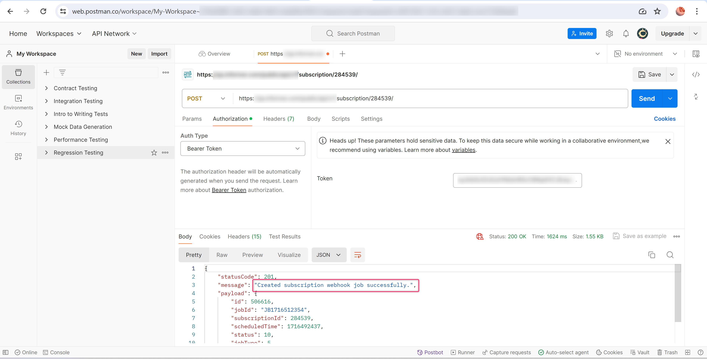

# API token

We provide an API token management system in the admin console where admins can create and manage API tokens. These tokens can then be integrated into any external application to initiate a subscription job, refresh a semantic data input model, or both. This way, any authorized user can start a subscription job or refresh the semantic model with a simple click of a button from an external application without logging in to the admin console or the report.&#x20;

Let us now see the process of creating an API token.

## 1. Create API Token

1. To create a new API token, click **Create API Token** in the API token screen.

<figure><figcaption>
Create API token
</figcaption></figure>

2. In the next screen, you can enter the details of the token.

**Token name:** Enter a name for the token.

**Expiry:** Set the token's validity to 30/60/90 days, or you can set any custom date within a year.

**Description:** Enter an optional description of the token.

**Permission:** You can set either or both of the following permissions: execute a new subscription, and refresh a semantic data input model.

After entering the details, click **Generate**.

<figure><figcaption>
Generate token
</figcaption></figure>

3. A new token will be generated. Ensure it is copied, as it becomes irretrievable after closing the window.

<figure><figcaption>
Copy the token
</figcaption></figure>

Now with this token, we can initiate a scheduled subscription and refresh the semantic data input model externally from any application.

## **2. Trigger subscriptions from external applications**

By integrating the [created API token](api-token.md#create-api-token) into the required application, you can create an API that triggers the required subscription job. Let us now demonstrate this with the help of the Postman application.

1. You can choose the required subscription from the subscription list or [create a new one.](../../working-with-inforiver/11.-scheduling-reports/create-new-subscription/) Let us run the subscription shown below using the API token.

<figure><figcaption>
Scheduled Subscription
</figcaption></figure>

2. We will now trigger the subscription job using Postman.

<figure><figcaption>
Subscription details
</figcaption></figure>

<figure><figcaption>
Subscription job triggered
</figcaption></figure>

3. The report is delivered to the intended recipients as scheduled.

<figure><figcaption>
Report delivered
</figcaption></figure>

## **3. Refresh semantic data input source using API**

Inforiver also provides an API to refresh single-select and multi-select dropdowns that use semantic data models. You can generate API tokens from the admin console and trigger ad-hoc semantic model refreshes using the API.

1. To generate the token, in the API token management screen, check the ‘Refresh Semantic Data Input’ option and generate the token. The token needs to be saved to a file for future access.

<figure><figcaption>
Refresh Semantic Data Input
</figcaption></figure>

2. &#x20;The sample report has a [single-select data input column](../../working-with-inforiver/4.-adding-business-logic-and-formulae/insert-manual-input-columns/dropdown/#id-1.-creating-a-list-of-values) and uses a semantic data input model. Instead of a scheduled refresh, the semantic model is set to be refreshed manually by the user when required.

<figure><figcaption>
LOV with semantic data model 
</figcaption></figure>

3. After creating the single select, navigate to manage measures and edit the single select. You'll be able to see a **Refresh Link** in the Options section - this is the API endpoint.

<figure><figcaption>
API refresh link
</figcaption></figure>

3. Let's trigger the semantic data model refresh, as demonstrated below using Postman. Use the token generated in STEP 1 in the admin console for authorization. You need to pass the **semantic-refresh=true** parameter to the API endpoint.

<figure><figcaption>
Successfully triggered the refresh of semantic data input
</figcaption></figure>

5. The dropdown options are refreshed with the latest values from the semantic model.

<figure><figcaption>
Refreshed values in the single-select
</figcaption></figure>
