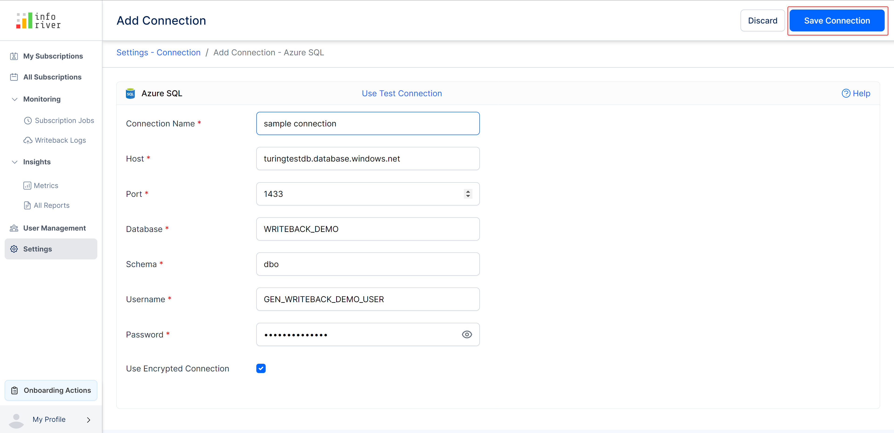
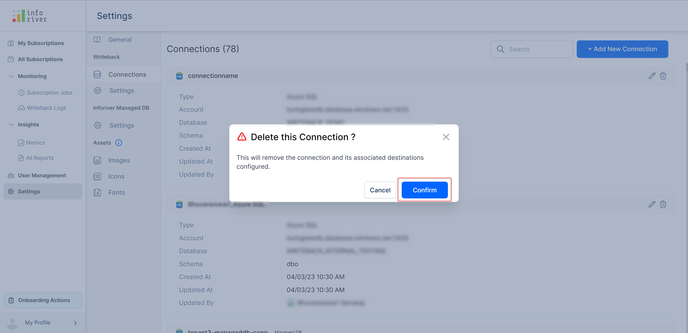

# Writeback

## 1. Connections

With connection settings, the administrator can view, manage, and configure all the available writeback connections.&#x20;

This page lists all the writeback destination connections. Inforiver provides comprehensive filters and search bars to access your connections quickly. &#x20;

* The _search bar_ narrows down the list based on the full/partial connection name that is keyed in.&#x20;
* The _Connection Type_ filter can be used to view all the connections to a particular type of destination.&#x20;
* The _Updated By_ filter can be used to search for connections that a particular user has updated.&#x20;

<figure><figcaption>
Connections
</figcaption></figure>

### 1.1. Add a new connection

To add a new connection, click the 'Add new connection' button to open the _Create Connection_ modal.&#x20;

<figure><figcaption>
Add New Connection
</figcaption></figure>

In the _Create Connection_ modal, you can select the required writeback destination. Click Continue to open the _Add Connection_ page.

<figure><figcaption>
Select writeback destination
</figcaption></figure>

On the 'Add connection' page, enter all your connection-related details.

Enter the connection name and click 'Save connection' to complete the connection creation process.

<figure><figcaption>
Save connection
</figcaption></figure>

The created connection will be listed on the Connections page.

<figure><figcaption>
Connection created
</figcaption></figure>

### 1.2. Edit/Delete connection

You can edit the available connections using the edit icon(pencil) available on the top right corner of each connection.

<figure><figcaption>
Edit connection
</figcaption></figure>

Clicking the pencil icon will open the 'Edit connection' page where you can edit or make changes to the connection.

<figure><figcaption>
make changes to connection
</figcaption></figure>

To delete any created connection, click on the 'Trash' icon on the top-right corner of the connection.

<figure><figcaption>
Delete connection
</figcaption></figure>

This will open up a 'Confirmation' modal. Click 'Confirm' to permanently delete the connection.

<figure><figcaption>
Confirm deletion
</figcaption></figure>


You can set role-based access control for writeback connections which is explained in [this section.](../../working-with-inforiver/12.-data-writeback/settings/writeback-security-settings.md#id-2.-role-based-access-control-for-writeback-admin-connections)


## 2. Settings

The writeback settings let admins configure various access settings for the users. The admin can configure the following settings:

<figure><figcaption>
Allowed Destination Types
</figcaption></figure>

#### **Settings**

Users will be able to add destinations based on the settings configured by the admin. Admins can restrict users from creating destinations altogether or restrict the creation of certain types of destinations. For example, the admin can prevent users from creating database destinations by disabling the _Allow users to configure database connections_ option. When the toggle button for a particular destination type is disabled, users will only be able to use admin-configured destinations and cannot create their own.

The settings configured in the admin console will be applied to the Add Destination page as well. Users will only see the destination types they have permission to add.

<figure><figcaption>
Destination settings applied in the Add destination page
</figcaption></figure>


In addition to the above settings, you can configure user access control for writeback destinations which is explained [here](../../working-with-inforiver/12.-data-writeback/settings/writeback-security-settings.md#id-4.-user-access-control-to-manage-writeback-destinations).


In this section, we have covered the writeback settings. Navigate to the next chapter to learn more about the [managed DB settings](managed-db.md).
