# Assets

The assets settings make asset management easier by displaying all the assets (images, icons, and fonts) used in the Inforiver visual in a common dashboard. You can easily view, add, update, or delete any asset.

## 1. Overview

Every assets page (Image, Icons, and fonts) contains the following columns:

<figure>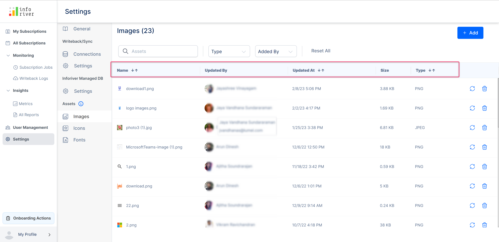<figcaption>
Assets page columns
</figcaption></figure>

* **Name** - Displays the name of the asset
* **Updated by** - The name of the user who uploaded this asset
* **Updated at** - The date and time at which the asset was updated at. You can also sort this column in ascending or descending order by clicking on the up or down arrows respectively.
* **Size** - The file size of the asset
* **Type** - The file extension or type of the asset. You can also sort this column in ascending or descending order by clicking on the up or down arrows respectively.

Every added asset also has a reload and delete icon. Clicking on the 'Reload' and 'Trash' icons will update and delete the asset respectively.&#x20;

<figure>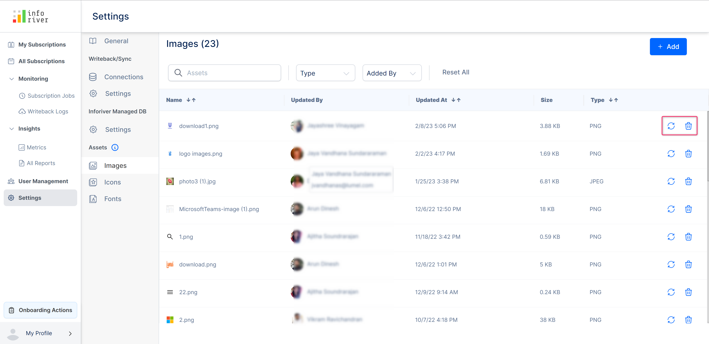<figcaption>
Asset page icons
</figcaption></figure>

The following filter options are present at the top of the page:

* **Search bar** - Here you can search for any asset by entering its name

<figure>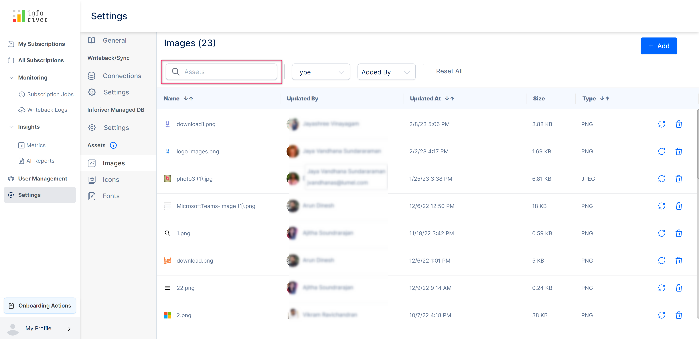<figcaption>
Search bar filter option
</figcaption></figure>

* **Type** - With this drop-down, you can filter assets by their type.

<figure><figcaption>
Type filter
</figcaption></figure>

* **Added by** - Using this drop-down you can filter the assets based on the user who added them.

<figure><figcaption>
Added by filter
</figcaption></figure>

* **Reset all -** Clicking on this link will reset or clear all the applied filters.

<figure>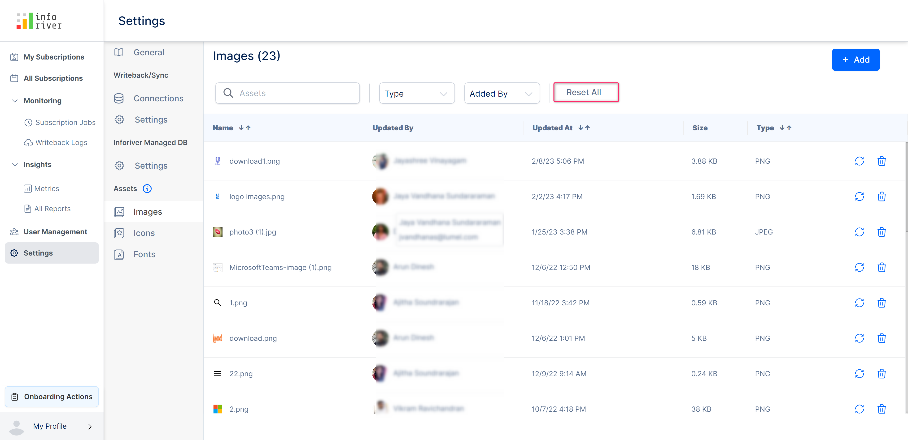<figcaption>
Reset all fiter
</figcaption></figure>

## 2. Uploading assets

You can upload images, icons, and fonts. Let's look at the steps on how to upload each of these assets.

### a) Images

To add an image, click the 'Add' button on the top right corner of the page.

<figure>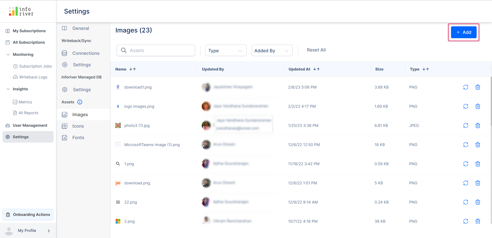<figcaption>
Add images button
</figcaption></figure>

This will open up the file manager in your system to select the image to be added.

<figure>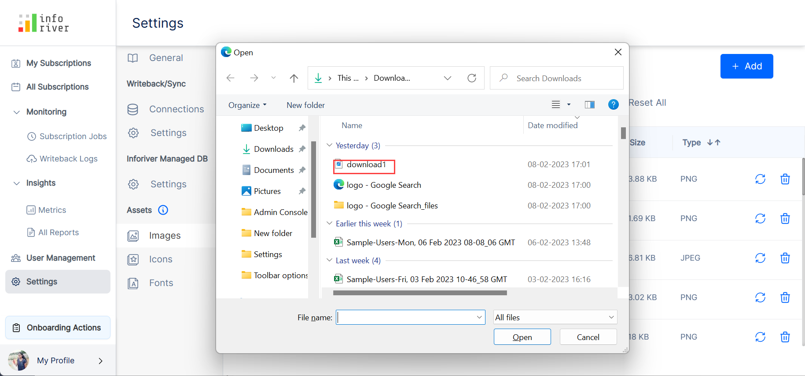<figcaption>
Select image file modal
</figcaption></figure>

The selected image asset gets added.&#x20;

### b) Icons

To upload an icon, click the 'Add' button at the top-right.

<figure>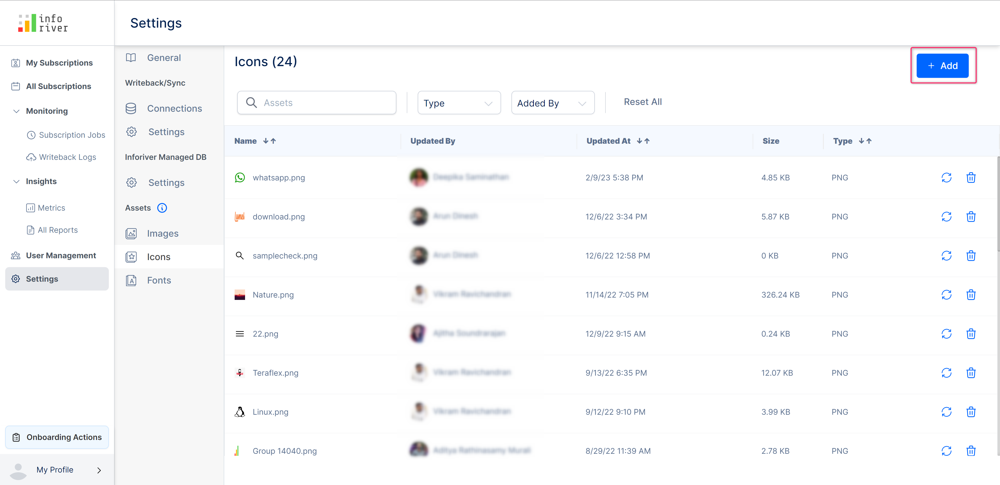<figcaption>
Add icons button
</figcaption></figure>

This will open up the file manager in your system to select the icon to be added.

<figure><figcaption>
Select icon from file manager
</figcaption></figure>

The selected icon asset gets added.

### c) Fonts

The fonts settings display the list of all the added custom fonts.&#x20;

You can add/upload a custom font by clicking on the 'Add' button at the top right corner of the screen.&#x20;

<figure>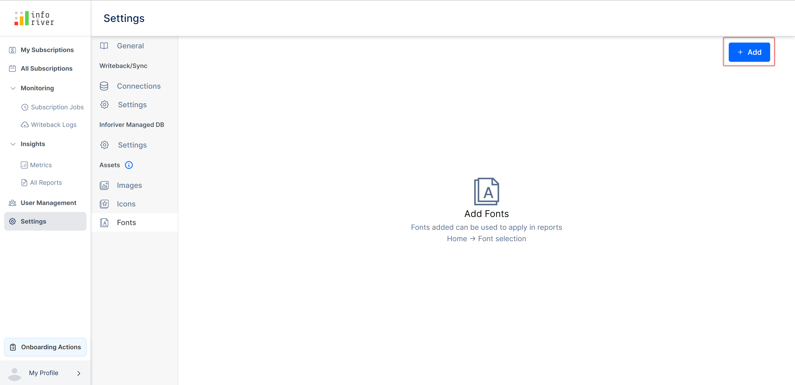<figcaption>
Add custom font
</figcaption></figure>

This will open up the 'Add font' modal. In this modal, enter a font name.&#x20;

Click the 'Choose file' button to upload your custom font files for regular and other font styles.&#x20;


The 'Add' becomes get enabled only after uploading the custom font files for all the font styles.


<figure>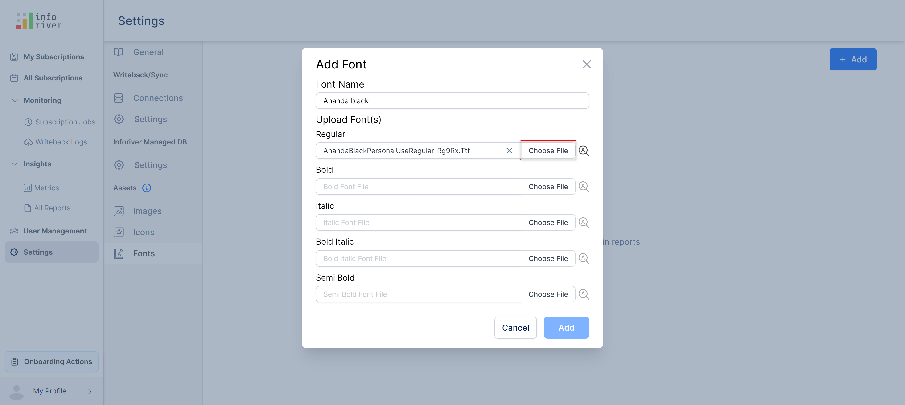<figcaption>
Choose font file
</figcaption></figure>

You can also view a preview of your uploaded custom font styles by clicking on the 'Search bar' icon displayed next to the corresponding font styles.

<figure>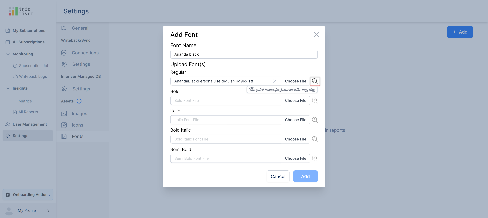<figcaption>
Add font modal
</figcaption></figure>

Click 'Add' to add complete the process.


Only custom fonts with the type TTF format can be uploaded


The added font will get displayed on the screen.&#x20;

<figure><figcaption>
List of all fonts
</figcaption></figure>

You can edit the uploaded font by clicking on the 'Pencil' icon next to the font list item.

<figure>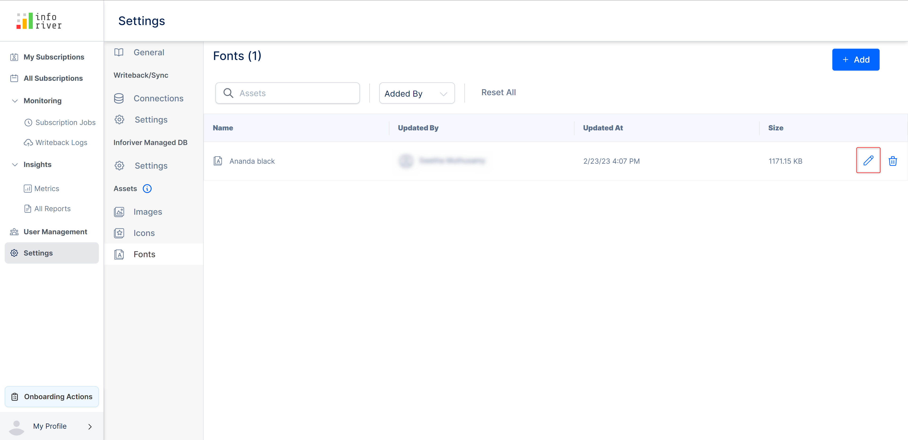<figcaption>
Edit font icon
</figcaption></figure>

This will open up the 'Edit font' modal, in which you make all the necessary edits and click 'Update' to save the changes.

<figure>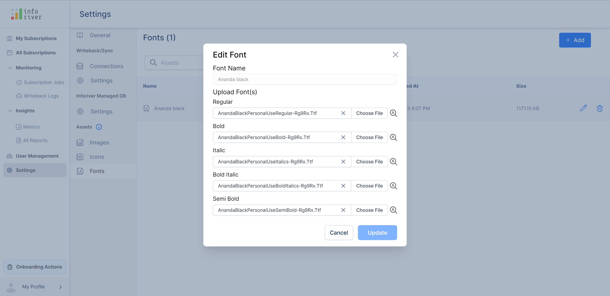<figcaption>
Edit font modal
</figcaption></figure>

To delete the added font, click the 'Trash' icon of an added font list item.

<figure><figcaption>
Delete fonts
</figcaption></figure>

This will open up the 'Delete' confirmation modal. Click 'Delete' to confirm the deletion.

<figure>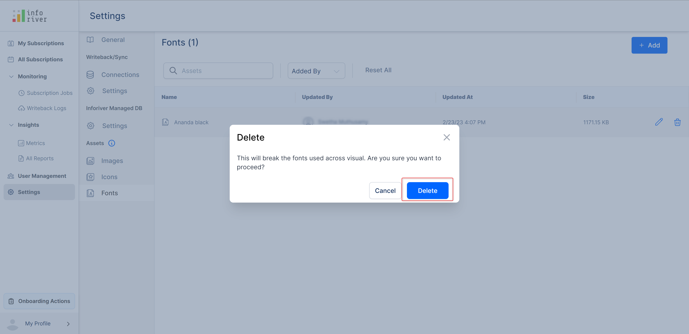<figcaption>
Delete fonts confirmation modal
</figcaption></figure>

All the custom fonts which are added to a particular tenant get listed when you log in and map to the same tenant.

The custom fonts can be viewed in the exported PDF if the page setup is done with the custom fonts.


The custom fonts are not supported in the exported excel.


In this section, we have covered asset settings. Navigate to the next chapter to learn more about the [onboard actions](../onboard-actions.md).
