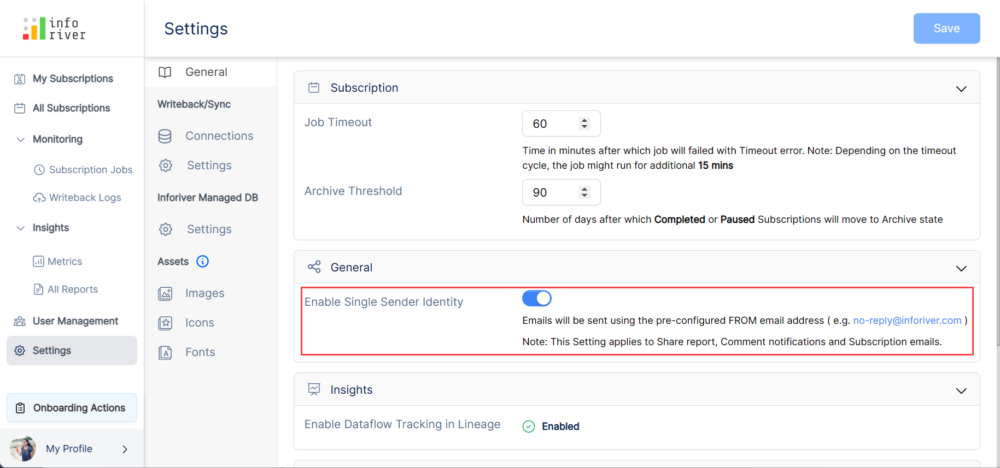
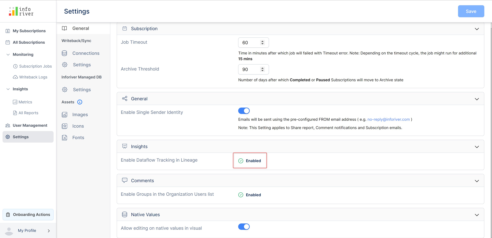
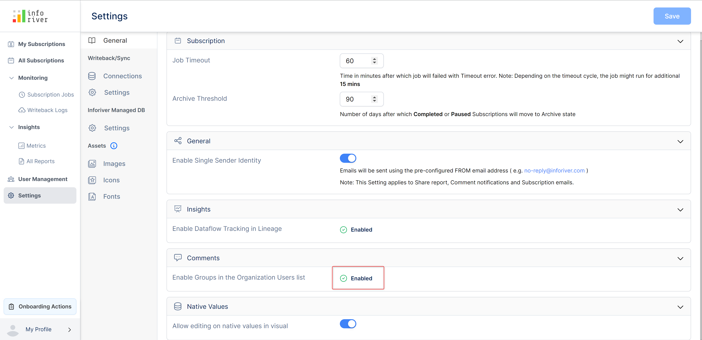

# General

General includes settings of the subscription timeout, single sender identity, insights, comments, and native.

## 1. Subscription

Under this section, you can set the time for running the job and the threshold time to move the job to archive status.

### a) Job time out&#x20;

You can set the time out in minutes to run the scheduled job. If a job exceeds the specified time limit, the job will fail with a timeout error.

<figure><figcaption>
Job timeout option
</figcaption></figure>


Depending upon the timeout cycle, the job runs for an additional 15 minutes


### b) Archive threshold&#x20;

Here you can specify the value after which the completed or paused schedules will be moved to the archived state.

<figure><figcaption>
Active threshold option
</figcaption></figure>


You cannot edit, reuse or perform any operations on the jobs in the archived state.


## 2. General

### a) Enable single sender identity

If this option is enabled, then the emails will be sent using the pre-configured FROM email address like 'no-reply@inforiver.com'.&#x20;


This setting also applies to share reports, comment notifications, and subscription emails


<figure><figcaption>
Enable single sender identity option
</figcaption></figure>

## 3. Insights

### a) Enable dataflow tracking in lineage

It's a backend feature. While logging, the data flow tracking in lineage will be enabled by default.&#x20;

<figure><figcaption>
Insights option
</figcaption></figure>

## 4. Comments

### a) Enable groups in the organization users list

This option is enabled by default so that groups are added to the organization's users list. A user can mention a group or the distribution list in comments, comment digest, or email destination.&#x20;

<figure><figcaption>
Comments option
</figcaption></figure>

## 5. Native

### a) Allow editing on native values in the visual

Enabling this option will allow editing the native values in the visual.

<figure><figcaption>
Native values option
</figcaption></figure>

In this section, we have covered the general settings. Navigate to the next chapter to learn more about the [writeback settings.](writeback.md)
