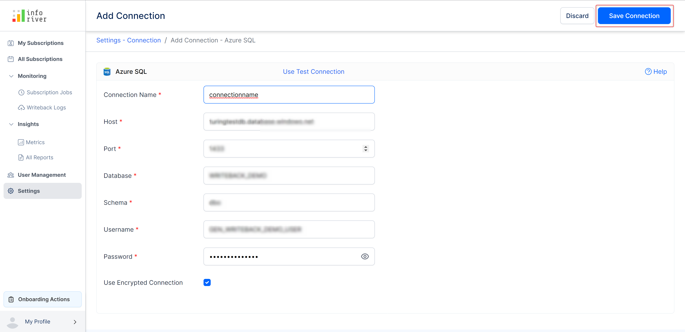
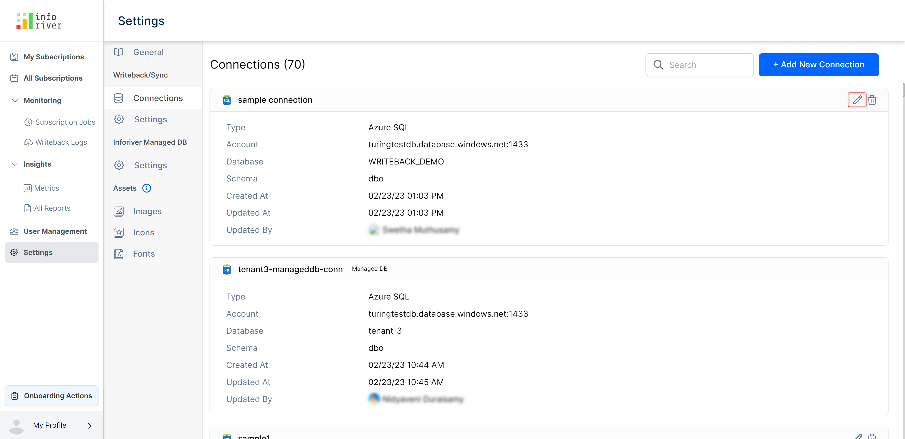
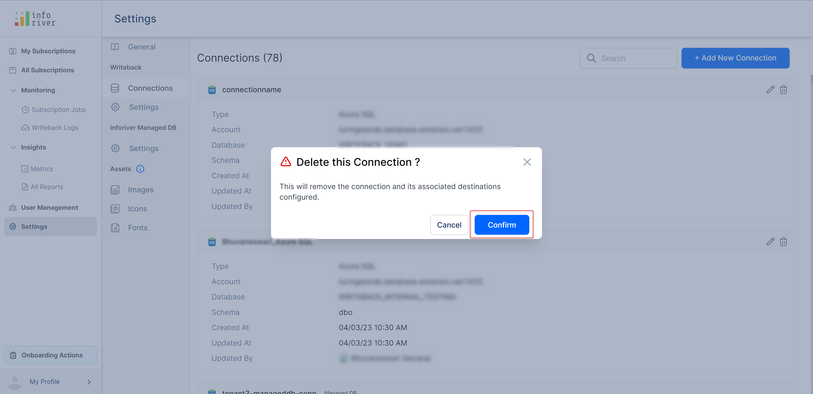

# Writeback

## 1. Connections

With connection settings, the administrator can view, manage and configure all the available DB connections.&#x20;

This page by default lists the available database connections. You can use the search bar at the top right corner of the page to search and find the required connections.&#x20;

Enter the search text, and Inforiver will narrow down the matches as soon as you start typing in the search box.&#x20;

You can select the required item from the list.

To add a new connection, click the 'Add new connection' button.&#x20;

<figure><figcaption></figcaption></figure>

This will open up the 'Create connection' modal in which you can select the required destination or writeback option.

<figure><figcaption>
Create connection modal
</figcaption></figure>

Click 'Continue' and the 'Add connection' page will open up.

<figure><figcaption>
Create connection
</figcaption></figure>

On the 'Add connection' page, you can enter all your connection-related details.

Enter the connection name and click 'Save connection' to complete the connection creation process.

<figure><figcaption></figcaption></figure>

The created connection will get listed on the page.

<figure><figcaption></figcaption></figure>

You can edit the available connections by using the edit icon(pencil) available on the top right corner of the page.

<figure><figcaption></figcaption></figure>

Clicking the pencil icon will open the 'Edit connection' page where you can edit or make changes to the connection.

<figure><figcaption></figcaption></figure>

To delete any created connection, click on the 'Trash' icon on the top-right corner of the page.

<figure><figcaption></figcaption></figure>

This will open up a 'Confirmation' modal. Click 'Confirm' to permanently delete the connection.

<figure><figcaption></figcaption></figure>

## 2. Settings

The writeback settings let admins configure various access settings for the users. The admin can configure the following settings:

<figure><figcaption>
Writeback/sync settings
</figcaption></figure>

#### **i) Allow users to configure database connections**&#x20;

By enabling this option you can allow users to configure their own DB connections. Disabling this option will let the users use the admin-configured DB.

#### **ii) Allow users to configure OneDrive**&#x20;

Enabling this option will allow users to configure the OneDrive writeback destination.

#### **iii) Allow users to configure SharePoint**&#x20;

Enabling this option will allow users to configure the SharePoint writeback destination.

#### **iv) Allow users to configure URL**&#x20;

Enabling this option will allow users to configure the URL.

In this section, we have covered the writeback settings. Navigate to the next chapter to learn more about the [managed DB settings](managed-db.md).
