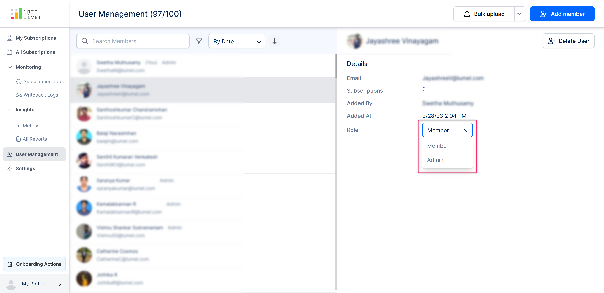
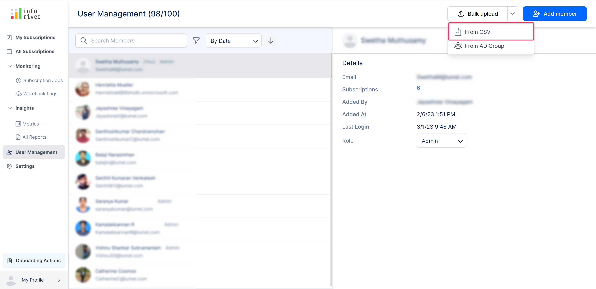
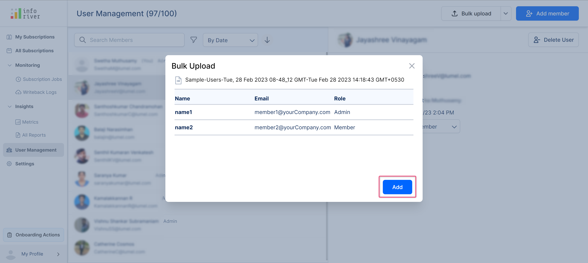
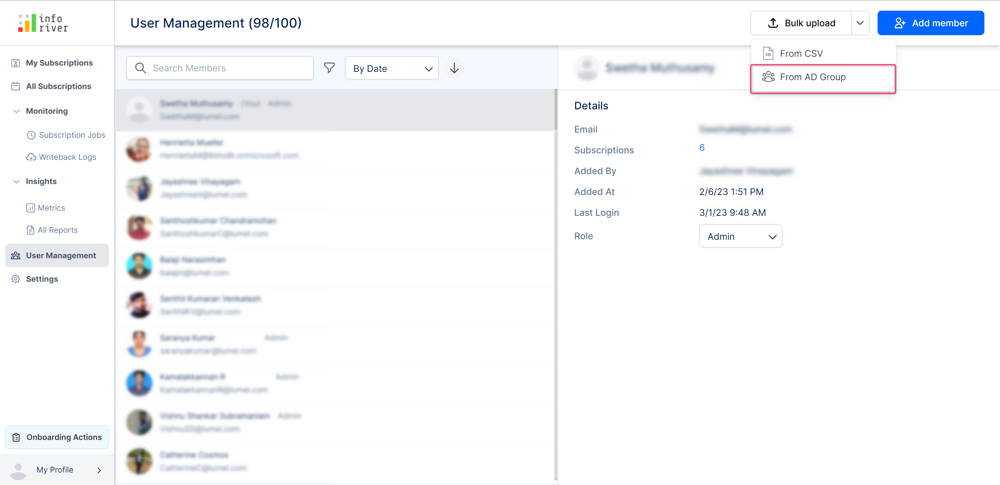
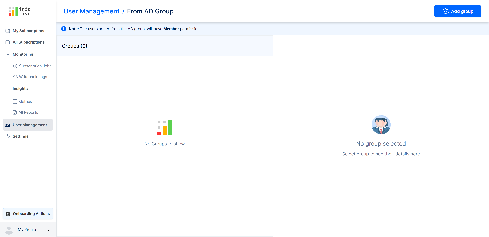
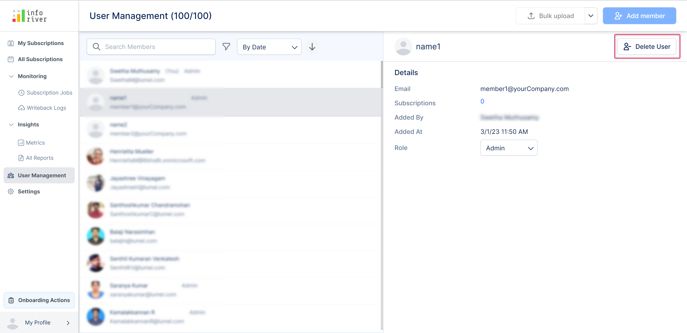
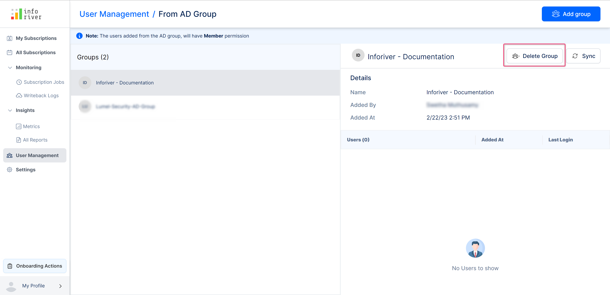

# User management

With the user management feature, you can manage all the users and members of your team/organization in an easy-to-use dashboard. You can add, or remove users, grant/revoke permissions and also manage the user roles in reports.

<figure><figcaption>
User management console
</figcaption></figure>

## 1. Overview&#x20;

The left half of the page displays a list of all the users in the team. Whereas the right half displays a summary of the selected user. By default, the admin is displayed as the first member in the list.

<figure><figcaption>
User management dashboard screen
</figcaption></figure>


The user management feature is available only for the workspace admins


A summary displays the following details:

* **Email** - The email id of the user
* **Subscriptions** - Number of subscriptions created by the user
* **Added by** - The name of the member who added this user
* **Added at** - The date and the time at which the user was added at
* **Last login** - The date and the time at which the user last logged in to the console
* **Role** - This drop-down displays the current role of the user. The user role gets dynamically updated based on the option selected from the drop-down.
* **Delete user** - Clicking on this button will delete the user


You can add only the maximum limit of users configured for the tenant.


The left half has the following options to filter the users' list:

* **Search bar -** In the search bar, you can type any input and the users' list will get dynamically filtered based on the entered input. Click the 'x' to remove all the entered input.

<figure><figcaption></figcaption></figure>

* **Filter icon -** Clicking on the filter icon will display the options to filter the users' list based on their roles. The list can be filtered to display 'All members', users with the 'Admin' role, or users with the 'Members' role. \
  \
  By default, the 'All members' option is selected. Only one option can be selected. The users' list gets dynamically updated based on the selected value.

<figure><figcaption></figcaption></figure>

* **Filter drop-down -** With this drop-down, you can sort the users either by date or by name. The list gets filtered based on the drop-down option as well as the direction of the sort arrow.

<figure><figcaption></figcaption></figure>

* **Sort arrow -** If the sort arrow points up, then the list is sorted in the 'Ascending' order for the filter chosen in the drop-down. If the sort arrow points down, then the list is sorted in the 'Descending' order. This option is set to descending by default.

<figure><figcaption></figcaption></figure>

In the following image, the users' list is sorted 'By name' and in 'Ascending' order

<figure><figcaption></figcaption></figure>

## 2. Add member

Click 'Add Member' to add a single member to the application. A pop-up opens as shown.

<figure><figcaption></figcaption></figure>

Enter the user's email id in the textbox provided and click 'Add'.

<figure><figcaption></figcaption></figure>

<figure><figcaption>
Add member button
</figcaption></figure>


You will get a warning message if the given email id already exists.


The user gets added and the below message will be shown.

<figure><figcaption>
User added successfully toast
</figcaption></figure>

You can choose the 'role' for the added user as either 'member' or 'admin'.

<figure><figcaption>
Update user role
</figcaption></figure>

## 3. Bulk upload from CSV

You can choose the 'Bulk upload from CSV' option to add multiple users at a time by uploading the user details in a CSV file.&#x20;

From the 'Bulk upload' drop-down, select the 'From CSV' option.

<figure><figcaption>
Bulk upload from CSV option
</figcaption></figure>

In the modal that opens up, click on the 'Upload' button and select the CSV file that you need to upload.

<figure><figcaption>
Upload CSV button
</figcaption></figure>

Click the 'Download sample' link to download a sample CSV file and update the user details in the same format given in the downloaded file.

<figure><figcaption>
Downloaded sample CSV file
</figcaption></figure>


You can also configure the roles of the users as either members or as admins in the CSV file before uploading.


Click 'Upload', and upload the CSV file from the file manager in your system.

After the CSV file is uploaded,  click 'Add' in the 'Bulk Upload' modal that displays all the uploaded CSV data.

<figure><figcaption>
Bulk upload add option 
</figcaption></figure>

On successful addition of the users, the users with their corresponding roles get added.

## 4. Bulk upload from AD Group&#x20;

With Inforiver, you can bulk upload from the 'AD Group' to add a group of users at a time without having to manually add or upload a file.

Click the down caret icon in the 'Bulk upload' button on the 'User management' page. From the drop-down select the 'From AD group' option.&#x20;

<figure><figcaption>
Bulk upload from AD group
</figcaption></figure>

Clicking on this option will open the 'From AD group' page. By default, no groups are added and the page is displayed as shown below.

<figure><figcaption>
Default screen
</figcaption></figure>

To add a group, click on the 'Add group' button at the top right corner of the page. This will open up the 'Add group' pop-up.

Enter the group name or select the group name from the drop-down.

<figure><figcaption>
Add group modal
</figcaption></figure>

In the below image, 'Inforiver-Documentation' has been added. Once someone from the group logs in, an account will be created for the user on the user management page with member access to the workspace.

<figure><figcaption>
Add group button
</figcaption></figure>

The 'Derived from' field shows the AD group name that the member belongs to.

You can see the following details of the members of the AD group such as the date and time when they are added and their last login details as shown.

<figure><figcaption>
AD member details
</figcaption></figure>

You can delete the added group by clicking on the 'Delete group' button in the top right corner as highlighted in the below image.

<figure><figcaption></figcaption></figure>

Clicking on this button will open up a 'Delete group' confirmation modal. Click 'Delete' to confirm the deletion.

<figure><figcaption></figcaption></figure>

## 5. Delete user

The delete option is available only for the users added who are manually added through the 'Add member' option and 'bulk uploaded' via CSV file.

Select the user from the list and click 'Delete User'.

<figure><figcaption>
Delete user option
</figcaption></figure>

A pop-up opens as shown.

<figure><figcaption>
Delete user confirmation modal
</figcaption></figure>

Click 'Remove', to remove the user from the user management page.


All the schedules and jobs created by the user will be deleted and cannot be retrieved.


The delete option is not available for the users added through the AD group as shown.

<figure><figcaption>
No delete option
</figcaption></figure>

However, you can contact the respective support team and make a request to delete the particular user from the AD Group list.

If any changes/updates are made in the Active Directory AD group, click the 'Sync' button to synchronize or update those changes to the AD group data in the user management dashboard.

<figure><figcaption>
Sync AD group data
</figcaption></figure>

You can delete the entire group by clicking 'Delete group' button.

<figure><figcaption>
Delete group option
</figcaption></figure>

A delete group confirmation modal opens up, click 'Delete' to confirm the deletion.

<figure><figcaption>
Delete group confirmation modal
</figcaption></figure>

When an AD group is deleted, then the member accounts associated with that group also get removed from the workspace.


The user can belong to more than one AD group and if the user is removed from a group or the entire group is deleted, the user account will not get removed as the user still holds the member permission in the other groups.&#x20;


In this section, we covered user management. Navigate to the next section to learn more about [settings](settings/).
