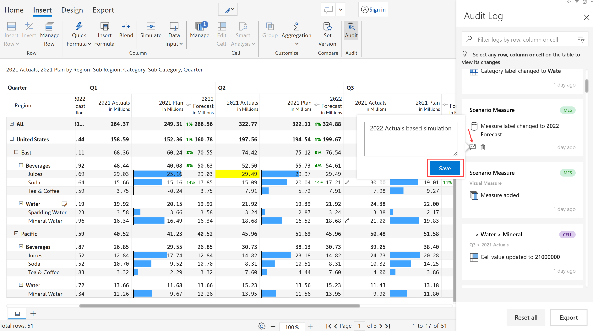

# Audit log

Inforiver provides an interactive, filterable, exportable and comment-enabled audit log to track changes to your report.

In the **Insert** tab, click on the **Audit** option. The Audit side panel opens showing a list of all the changes made to the report. &#x20;

<figure><figcaption>
Audit log
</figcaption></figure>

### 1. Track changes

Let's look at some of the changes that are captured in the audit log below:

1.1. In the below image, you can see that the measure, row and column that are added to the visual are captured along with a description and timestamp.

<figure><figcaption>
Adding fields
</figcaption></figure>

1.2. The below image captures the following changes - Inserting a new simulation column and renaming it to 2022 Forecast. Notice the tag 'MES' to indicate that these logs are related to a measure.

<figure><figcaption>
Simulation measure
</figcaption></figure>

1.3. Cells that are edited are captured in the audit log as shown. The tag 'CEL' is displayed to indicate cell-level changes.

<figure><figcaption>
Cell value edit
</figcaption></figure>

1.4. Any data field that is removed is also captured as a 'Data change in measures'.&#x20;

<figure><figcaption>
Measure removed
</figcaption></figure>

1.5. The audit log also captures the details listed below:

* User details along with timestamp when the report is modified.
* Changes to settings like default values will be recorded in the audit trail for data input columns/measures and rows.
* Measure resets will be recorded.

<figure><figcaption>
Audit log
</figcaption></figure>


In the 'Home' tab, changes are captured only for the 'Show/Hide' option and number formatting options available in the 'Number' section.

Changes made using any of the options in the 'Insert' tab are captured.&#x20;

The audit log does not capture changes made using options in the 'Display' and 'Export' tabs.


### 2. Filter & comment

2.1. You can select any row/cell/column from the list displayed to filter the audit log and highlight the area in the visual in which the changes are made.&#x20;

In the below image, the cell highlighted in blue in the side panel has been selected. For that particular cell, there is only a value update which is shown in the side panel and it is also highlighted in the table.

<figure><figcaption>
Highlight in the visual
</figcaption></figure>

2.2. You can also select any row, column or cell in the visual to view the changes made to it.

East -> Mineral Water row has been selected in the below image. A list of changes made to the row gets displayed in the side panel. Row level changes have a 'ROW' tag.

The first log shows that a row reordering has been made and the next two logs show edits to the Q3 2021 Actuals cell.

<figure><figcaption>
Changes listed in audit log
</figcaption></figure>

2.3. You can also add comments in the audit log. Hover over a log, click on the 'comment' icon, type in the editor and click 'Save'.&#x20;

<figure><figcaption>
Comment
</figcaption></figure>

2.4. Using the 'Search' option, you can search for any row/column/cell within the audit log. Inforiver starts narrowing down the matches as soon as you start typing. You can select the required item from the list.

<figure><figcaption>
Search
</figcaption></figure>

2.5. There is also an advanced filter option where you can filter based on the type of change, date range and logs with comments:

Type - You can filter the log based on data editing, formatting or data entry.&#x20;

Date range - You can filter the logs that fall within a date range by selecting the 'From' and 'To' dates from the date picker.

Filter logs with comments - You can filter only the logs with comments.

<figure><figcaption>
Filter
</figcaption></figure>

When you have multiple users entering and updating values in a data input field, you would need to track the changes made by each user. You can filter the data entry audit log based on the username. Choose 'Data entry' in the Type dropdown to be able to select the username. This feature is available in reading mode as well.

<figure><figcaption>
Filter data entry audit based on username
</figcaption></figure>

### 3. Export

3.1. Click 'Export' to export the audit log as an Excel file to do any further analysis.&#x20;


Export is supported only in Power BI service.


<figure><figcaption>
Export audit log
</figcaption></figure>

3.2. The downloaded audit log contains several fields which are explained below.

Activity - You can see the type of change such as a change in data, row reorder, data measure rename etc.&#x20;

Level - Indicates the magnitude of change. For example, a change to a data source cell is marked 'Critical'.

Change - Description for the change such as the name of the field that was added/removed, label change etc.

Selection type - Indicates whether the change affected the entire table/matrix or specific row/column/cell.

Selection - In case the change was applicable to a row/column/cell, the particular selection is mentioned.

Comments - If the log has any comment added, the comment is shown.

<figure><figcaption>
Downloaded excel
</figcaption></figure>

### 4. Delete & reset

4.1. You can individually delete any of the audit logs by clicking on the respective 'Delete' icon.

<figure><figcaption>
Delete
</figcaption></figure>

4.2. Click on 'Reset all' to reset all the audit logs. Note that this does not reset the changes in the visual.&#x20;

<figure><figcaption>
Reset logs
</figcaption></figure>

In the next section, we'll be covering [template rows](../working-with-inforiver/4.-adding-business-logic-and-formulae/insert-calculated-rows/template-rows.md).
