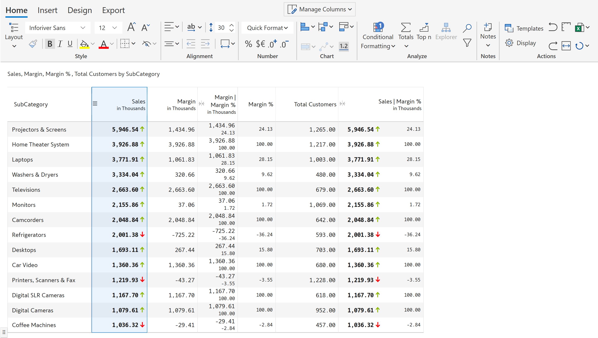

# Blend measures

Inforiver allows you to blend two measures in a single column along with formatting, including conditional formatting.&#x20;

Let's blend the Sales and Margin% columns in a single column.&#x20;

a) In the 'Insert' tab, click on the 'Blend' option in the 'Column' section. A blank measure gets inserted and the 'Blend measure' side panel opens.&#x20;

<figure><figcaption>
Blend
</figcaption></figure>

b) Enter the title and select the measures as shown from the dropdown. Click 'Create'.

<figure><figcaption>
Blend measure panel
</figcaption></figure>

c) The columns are blended to create a single column. Note that Margin % is displayed below Sales. This is because we have used the default 'Vertical' as 'Blend direction'.

<figure><figcaption>
Blend measures vertically
</figcaption></figure>

d) If you want to display in a horizontal orientation, change the 'Blend direction' to 'Horizontal' and click 'update'.

<figure><figcaption>
Blend measures horizontally
</figcaption></figure>

e) The horizontal blending is shown.

<figure><figcaption>
Horizontal blending
</figcaption></figure>

f) The other way to blend the columns is by selecting the columns to be combined and clicking the 'Blend' option from the Insert tab. For example, let's blend the Margin and Margin% columns in a single column.&#x20;

Select the columns and click 'Blend'.

<figure><figcaption>
Blend by selecting columns
</figcaption></figure>

g) The 'Blend measure' side panel opens, enter the title and click 'Create'.

<figure><figcaption>
Blend measure panel
</figcaption></figure>

h) The columns are blended into a single column.

<figure><figcaption>
Blended column
</figcaption></figure>

i) If you want to view only the blended columns, click on 'Manage Columns' from the toolbar. You can see a list showing the row and column headers and measures.

<figure><figcaption>
Manage columns
</figcaption></figure>

j) Unselect the original source columns which you want to hide in the visual. You can now see only the blended columns.

<figure><figcaption>
Hiding source columns
</figcaption></figure>


When two columns are blended, the formatting of the source columns including conditional formatting is retained in the new merged column. &#x20;


**Example 1:** Consider an example where the font style and size are changed in the source columns.

a) Let's change the font style to bold for the 'Sales' column. You can see that the same style has been copied to the Sales values of the merged column (Sales| Margin %).

<figure><figcaption>
Blend font style
</figcaption></figure>

b) Let's keep the 'Sales' as it is and reduce the font size of the 'Margin %' column.

<figure><figcaption>
Formatting font size
</figcaption></figure>

c) You can see that the values in the merged columns reflect the change.

<figure><figcaption>
Blend font size
</figcaption></figure>

**Example 2:** Consider the below example where conditional formatting is applied to the 'Sales' column.&#x20;

a) To view the conditional formatting rule, in the 'Home' tab, click on the 'Conditional formatting' drop-down and select 'Manage rules'.&#x20;

<figure><figcaption>
Manage rules
</figcaption></figure>

b) A side panel opens showing a list of all the rules. Click on the 'Edit' icon next to the rule Icons - Margin %.

<figure><figcaption>
Conditional formatting panel
</figcaption></figure>

c) Let's try changing the icon position and see what happens to the source and merged columns.

<figure><figcaption>
Icon position
</figcaption></figure>

d) When you change the icon position from 'Right of data' to 'Left of data' and select 'Apply', you can see that the icons in both columns shift over.&#x20;

<figure><figcaption>
Blend conditional formatting
</figcaption></figure>

**Example 3:** Let's see how to blend the two measures in a single column with data bars. Follow the steps shown below:

a)  Select the columns and click 'Blend'.

<figure><figcaption>
Data bars
</figcaption></figure>

b) The 'Blend measure' side panel opens, enter the title and click 'Create'.

<figure><figcaption>
Blend measure panel
</figcaption></figure>

c) You can see the two values along with the data bars in a single column.

<figure><figcaption>
Blended data bars
</figcaption></figure>
