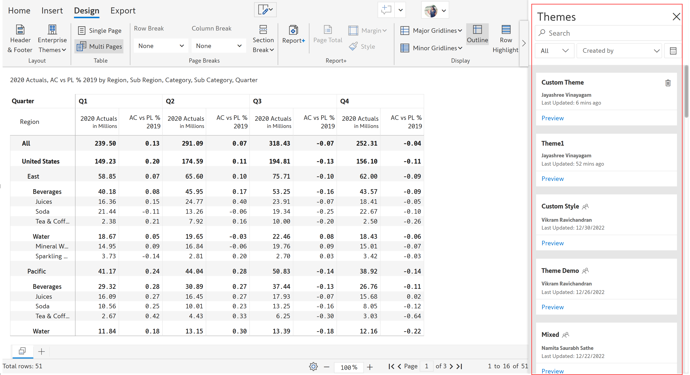
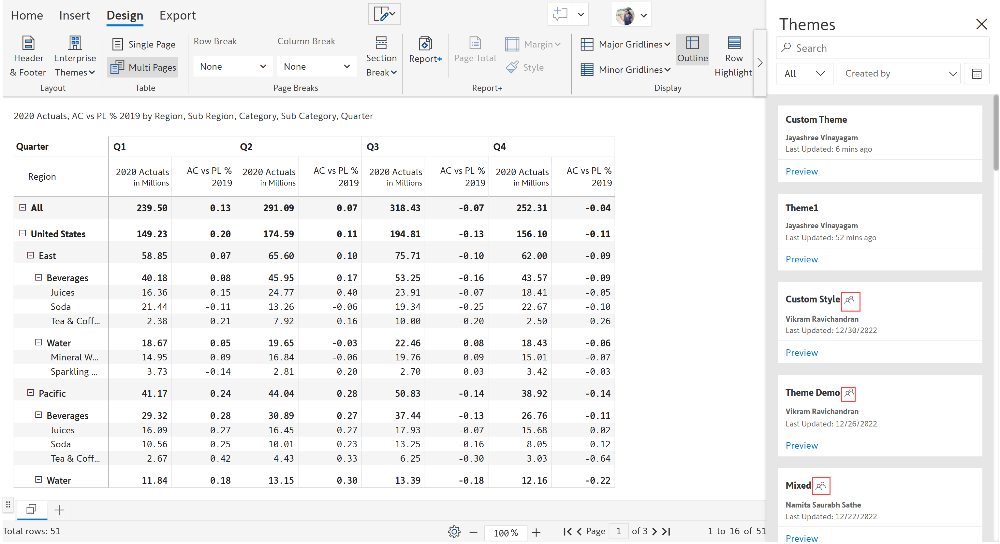
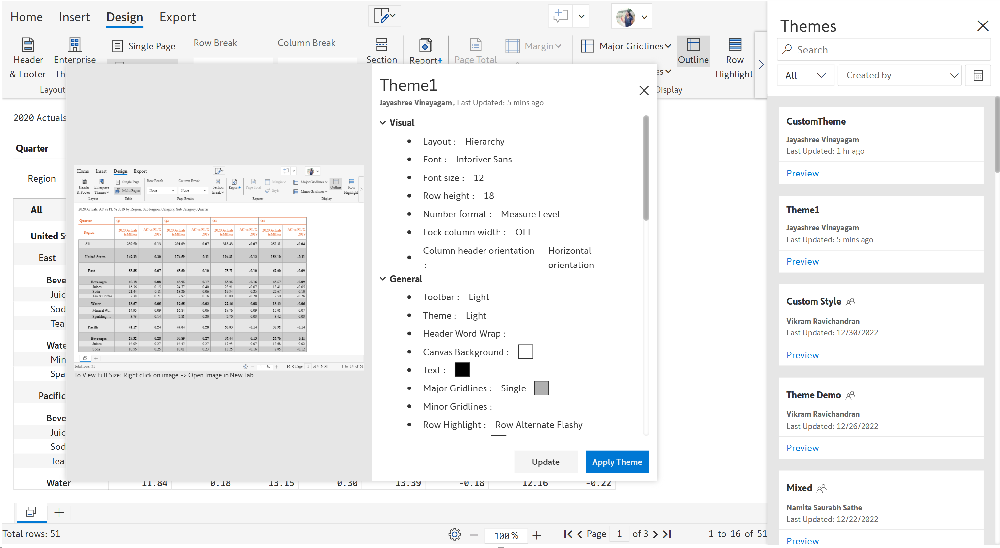
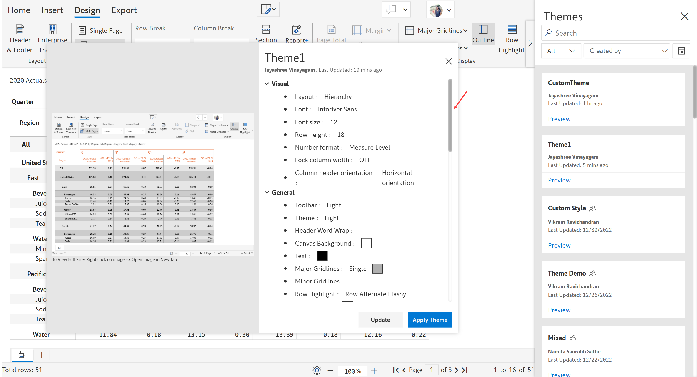
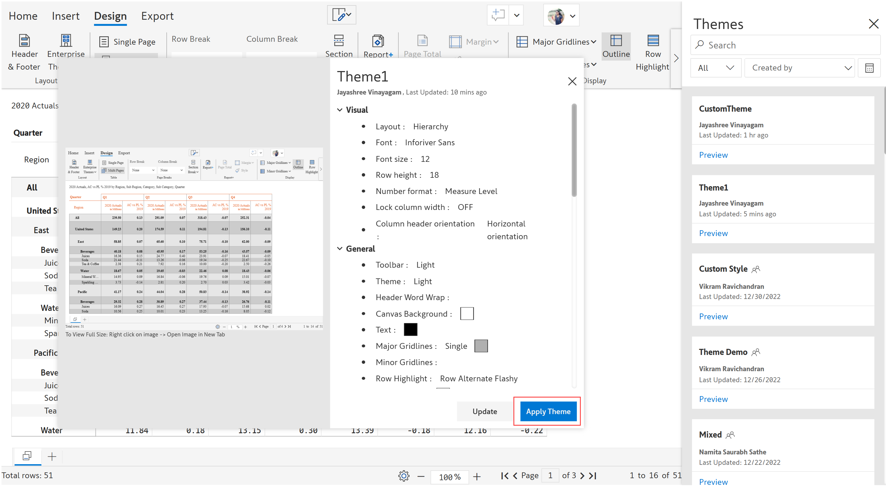
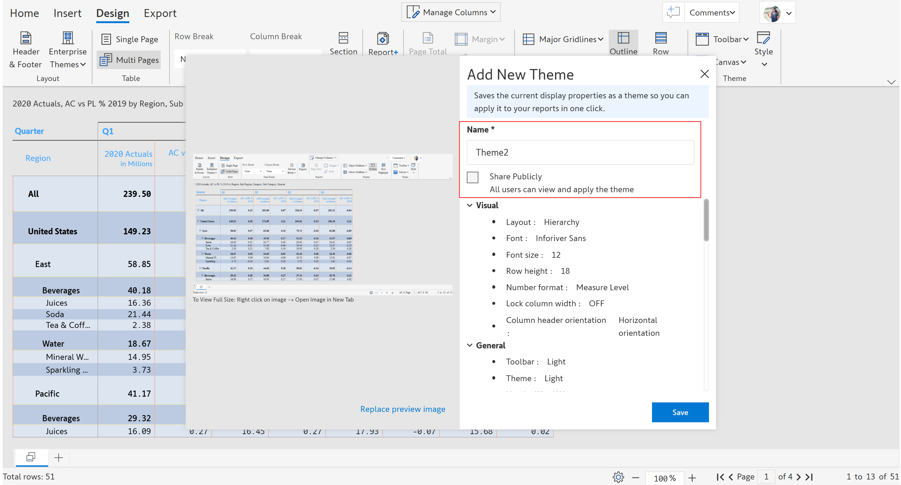

# Enterprise themes

With Inforiver's Enterprise themes feature, you can create and upload custom themes to the repository which can be accessed by others in the organization.&#x20;


The enterprise themes feature is available only in Inforiver Enterprise.


## 1. View & apply a theme

You can view the existing theme configurations created by other users in the organization and apply them to your report in a single click.&#x20;

a) In the 'Design' tab, click 'Enterprise themes'. Select 'View themes'.

<figure><figcaption>
View themes
</figcaption></figure>

b) A side panel opens showing a list of the themes along with the author name and timestamp.

<figure><figcaption>
Theme panel
</figcaption></figure>

c) A shared theme is identified by an icon as shown in the below image.

<figure><figcaption>
Shared themes
</figcaption></figure>

d) You can select the desired theme from the list and click 'Preview' to see a preview.

<figure><figcaption>
Preview option
</figcaption></figure>

e) A dialog box opens showing the preview of the selected theme as well as the display configurations.

<figure><figcaption>
Preview and configurations
</figcaption></figure>


To view the full size of the preview image, right-click on the image and select the 'Open image in New tab' option from the drop-down.


f) You can scroll down and view the display configurations such as Visual, General, Hierarchy, Number settings, Header & footer and Report+.

<figure><figcaption>
Scroll &#x26; view display settings
</figcaption></figure>

g) Click 'Apply theme' to apply the theme properties to your report.&#x20;

<figure><figcaption>
Apply theme
</figcaption></figure>

h) The theme gets applied and you will get a toast message as shown.

<figure><figcaption>
Toast message
</figcaption></figure>


You can click 'Undo' in the toast message, to revert to the original settings.


## 2. Create a new theme

You can save the display properties of a report as a theme and add it to the repository which can be applied to the other reports. Let's create a new theme with the display settings as shown in the below image.

a) In the 'Design' tab, click the 'Enterprise themes' dropdown and select 'Add new theme'.

<figure><figcaption>
Add new theme
</figcaption></figure>

b) A dialog box opens as shown below.

<figure><figcaption>
Dialog box
</figcaption></figure>

c) A screenshot of the report is shown as the preview image by default. But you can replace the preview image by clicking the 'Replace preview image' option.

<figure><figcaption>
Preview
</figcaption></figure>

d) Enter the theme 'Name' in the textbox provided. You can select the 'Share publicly' checkbox so that all the users in the workspace can view and use the theme.

<figure><figcaption>
Theme name and access
</figcaption></figure>


If the 'Share publicly' checkbox is unselected, the theme will be saved only to your account and will be visible only to you. It cannot be viewed and accessed by others.


e) Click 'Save' to save the settings and add it as a theme.&#x20;

<figure><figcaption>
Saving theme
</figcaption></figure>

f) After saving, the theme gets added and the below message is shown.

<figure><figcaption>
Message
</figcaption></figure>

## 3. Update a theme

You can update display configurations in a previously created theme if required.&#x20;


You can update only the themes created by you.&#x20;


You can see the currently existing theme in the below image.&#x20;

<figure><figcaption>
Existing theme
</figcaption></figure>

We need to update this theme with the following - 'grey' canvas background and header text in 'blue' as shown below.

<figure><figcaption>
Update theme
</figcaption></figure>

a) In the 'Design' tab, click the 'Enterprise themes' drop-down and select 'View themes'.

<figure><figcaption>
View themes
</figcaption></figure>

b) From the side panel, select the theme that you want to update with the current settings. Click 'Preview' of the theme.

<figure><figcaption>
Select theme
</figcaption></figure>

c) A dialog box opens. Click 'Update' to update the theme with the current configuration.&#x20;

<figure><figcaption>
Update
</figcaption></figure>

d) You can see the preview image of the updated theme and you can change the theme name and access if required. Click 'Save'.&#x20;

<figure><figcaption>
Update theme
</figcaption></figure>


Click 'Cancel' to remove the applied formatting and reset it to the original format.


e) The theme gets updated successfully and the below message is shown.

<figure><figcaption>
Theme updated
</figcaption></figure>

## 4. Search & filter&#x20;

You can search themes by name, and filter by type, author or date range.&#x20;

a) Let's search for a theme starting with the name 'Custom'. Inforiver starts narrowing down the matches as soon as you start typing in the search box. You can select the required item from the list.

<figure><figcaption>
Search
</figcaption></figure>

b) You can filter based on the 'type', 'username' and 'date range'.

Type - You can filter the themes based on All, Public or My themes

Username - Filter the themes by the username

Date range - You can filter the themes that fall within a date range by selecting the 'From' and 'To' dates from the date picker

<figure><figcaption>
Filter
</figcaption></figure>

c) You can individually delete any of the themes by clicking on the respective 'Delete' icon.

<figure><figcaption>
Delete
</figcaption></figure>

To learn more about Inforiver, visit the [resources](../resources.md) page.
