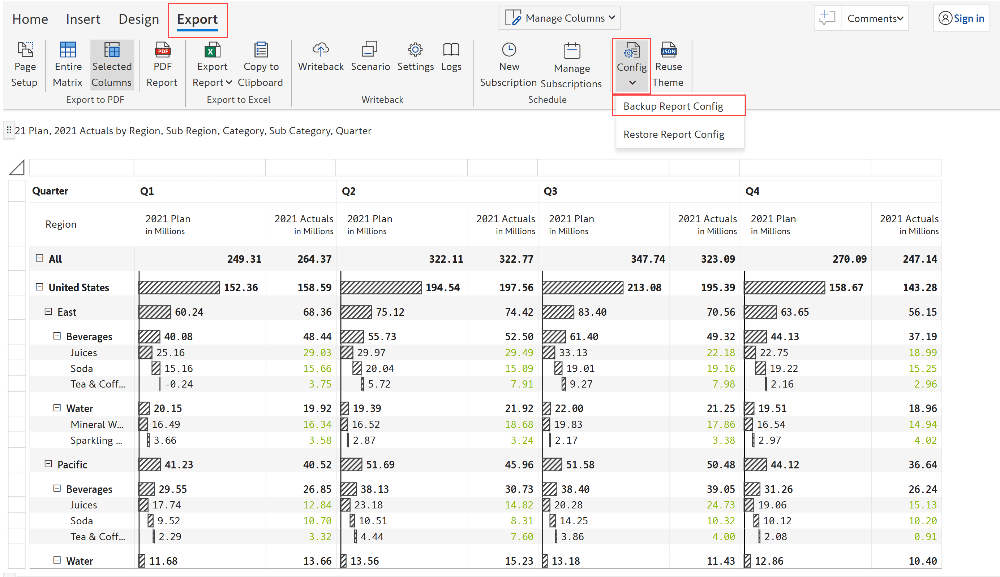
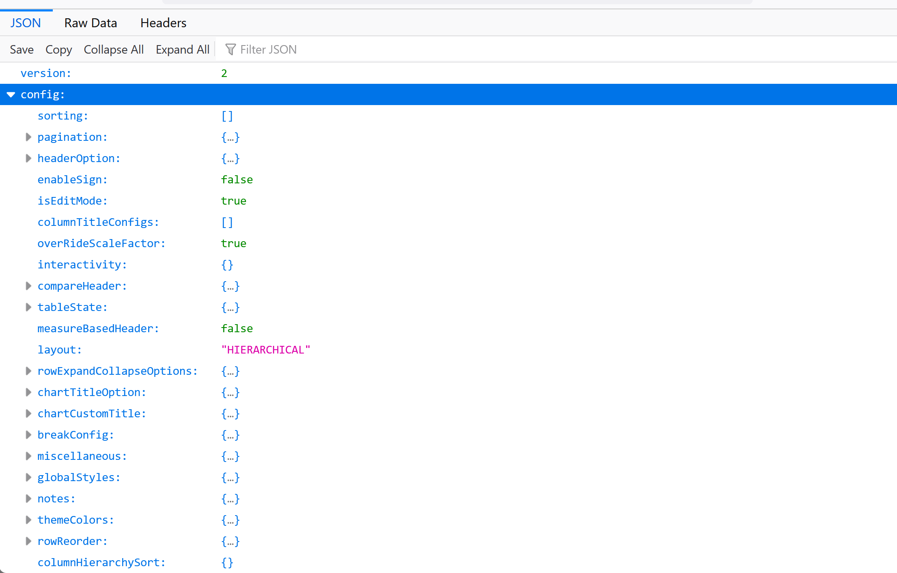
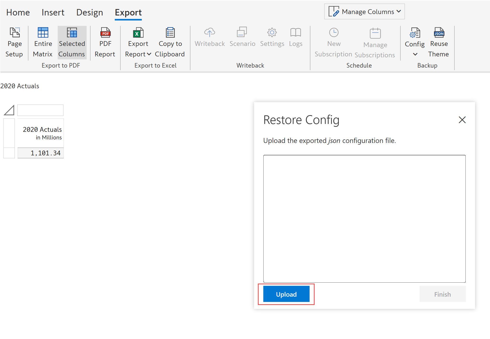
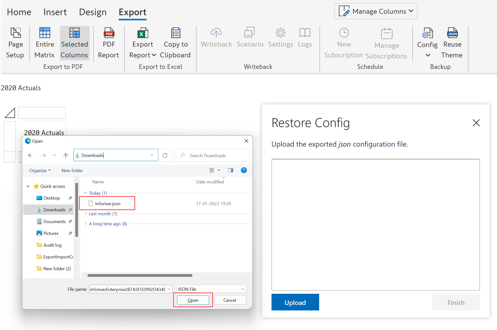
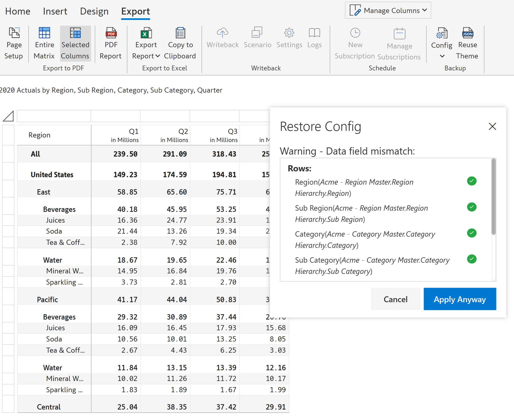

# Backup & restore report config

Inforiver allows you to import/export the visual configuration as a JSON file. The JSON file can be saved to your local system and also shared with other users.

### 1. Backup report config

a) In the 'Export' tab of the toolbar, click 'Config' in the 'Backup' section. Select 'Backup report config' to backup configurations.

<figure><figcaption>
Backup report config
</figcaption></figure>

b) A pop-up appears showing a warning, click 'Download'.

<figure><figcaption>
Pop-up
</figcaption></figure>

c) Your visual data will be downloaded in a .JSON format which can be used in other reports.

<figure><figcaption>
JSON file
</figcaption></figure>

### 2. Restore report config

To restore and apply the configurations from an exported .JSON file, follow the steps given below:

a) To a blank Inforiver visual, add a field to enable it. In the 'Export' tab of the toolbar, Click 'Config' in the 'Backup' section. Select 'Restore report config' from the drop-down.

<figure><figcaption>
Restore report config
</figcaption></figure>

b)  Click 'Upload' and navigate to the location of the exported config file.

<figure><figcaption>
Upload .JSON file
</figcaption></figure>

c) Select the .json format exported file and click 'Open'.

<figure><figcaption>
Upload .JSON file
</figcaption></figure>

d) It shows a warning message since we have not mapped the data fields correctly. You can see which fields need to be added.

<figure><figcaption>
Warning message
</figcaption></figure>

e) As you add the fields, the red cross will turn to green ticks. Click 'Apply'.


Even if the added data fields are not an exact match, you can still apply the configurations by clicking on the 'Apply Anyway' option. &#x20;


<figure><figcaption>
Adding fields
</figcaption></figure>

f) Select 'Yes' to apply the imported configuration. Note that this action cannot be undone.

<figure><figcaption>
Restoring config
</figcaption></figure>

h) Your visual gets updated with the configurations from the exported file.

<figure><figcaption>
Restored configuration
</figcaption></figure>


Another option to reuse report configurations is using the [Enterprise Themes](entrprise-themes.md) feature. You can easily create and add custom themes to the repository which can be accessed by others in the organization.&#x20;

Note however that not all the configurations can be saved as a theme. Only the properties in general, hierarchy and number tabs of display settings, toolbar options in Report+, and a few others can be saved.&#x20;

The Enterprise themes option is available only in Inforiver Writeback Matrix.&#x20;

