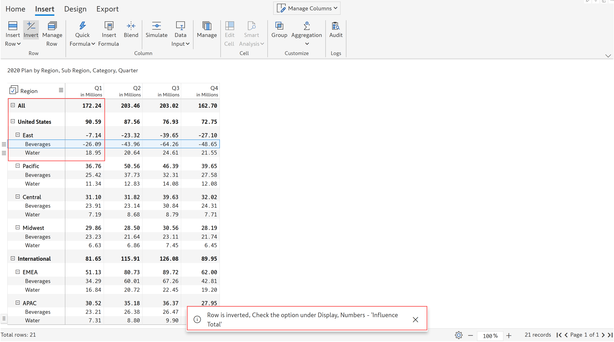

# Invert sign

In the case of financial reports such as the P\&L statement, data for expense or deduction items are often shown as positive numbers. This is especially true when the income and expense values come from different tables. However, the report might need to be updated with the negative sign operator for two main purposes.

(a) for performing aggregations, say for naturally aggregating revenue & expense accounts to calculate profit, or

(b) to display +/- signs in the table to indicate which accounts are added vs. deducted.

This can be easily achieved using the 'Invert' option in Inforiver.&#x20;

### 1. Cell level

You can invert cells or rows and display the negative signs at a cell level. You can also define whether the negative signs should influence the total or not.&#x20;

Let’s invert the 'Beverages' row in the 'East' subregion.&#x20;

a) Select the required row. In the ‘Insert’ tab of the toolbar, click the ‘Invert’ option.

<figure><figcaption>
Invert sign
</figcaption></figure>

b) The row 'East -> Beverages' is inverted and you can see the change in the value of totals.&#x20;

<figure><figcaption>
Result
</figcaption></figure>

c) If you do not want the sign inversion to impact the totals, turn off the 'Include in Total' toggle in the Display -> Numbers settings.

<figure><figcaption>
Include in total
</figcaption></figure>

d) Click ‘Invert’ again with the respective row selected to reset to the default value.

<figure><figcaption>
Reset inversion
</figcaption></figure>

e) A pop-up opens with a message as shown, select ‘Apply’ to reset.

<figure><figcaption>
Pop-up message
</figcaption></figure>

f) You can now see the original values in the Beverages row and the totals.

<figure><figcaption>
Reset to default
</figcaption></figure>

g) Instead of inverting the sign of the child nodes individually, you can do it in bulk at the parent level. Let's invert the 'United States' parent row, select the row and apply 'Invert'.

<figure><figcaption>
Invert sign at parent level
</figcaption></figure>

h) You can see that parent and the corresponding child rows are inverted as shown.

<figure><figcaption>
Result
</figcaption></figure>

i) Note that the signage of calculated rows cannot be changed. In the below image, you can see the 'Invert' option is disabled for the calculated row 'Sum'.

<figure><figcaption>
Calculated row
</figcaption></figure>

### 2. Row header level

Sign inversion can be shown at the row header level with the ‘Sign in headers’ option.&#x20;

a) In the ‘Home’ tab of the toolbar, click ‘Display’ -> 'Numbers'.

<figure><figcaption>
Number settings
</figcaption></figure>

b) Turn on ‘Sign in headers’ to display the signage in the row headers as shown.&#x20;

<figure><figcaption>
Sign in headers
</figcaption></figure>

c) You can also show positive signs and equals on other data source rows and total rows by enabling the 'Show positive sign' and 'Show equals on totals' options respectively.&#x20;

<figure><figcaption>
Show positive &#x26; equals
</figcaption></figure>

### 3. Sign from a source table

Instead of defining positive and negative signs at the report level, you can use the sign conventions from your data source tables. To do this, create a column which assigns values -1, +1 and 0 for negative, positive and totals respectively. A sample table is shown below.

<figure><figcaption>
Sign table
</figcaption></figure>

a) Add this sign column in the 'Sign' field. You can see the change in the values in the below image and also the calculation of subtotals and totals.

<figure><figcaption>
Sign measure
</figcaption></figure>

b) On enabling the 'Sign in header' option, you can see the positive, negative and total rows with the signs in the header.

<figure><figcaption>
Sign in headers
</figcaption></figure>

c) The 'Invert' option is disabled when the sign column is added.

<figure><figcaption>
Invert disabled
</figcaption></figure>


When a sign field is added, you cannot add column fields.&#x20;


In the next section, we'll be covering the [Audit log](audit-log.md) feature.

#### Resources

[Invert signs for reporting in Microsoft Power BI with Scenarios](https://www.youtube.com/watch?v=mZaQgXQYDhY)
