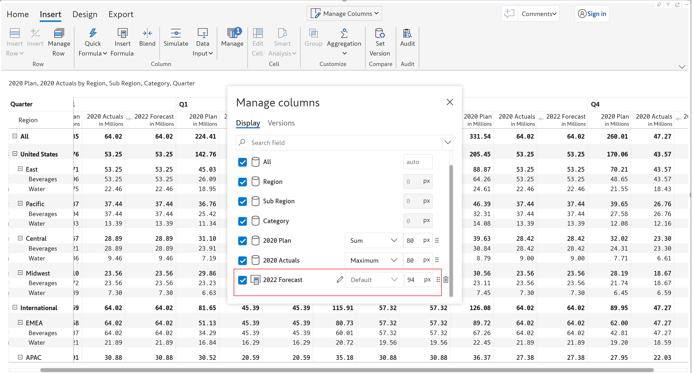

# Manage aggregation

While working with Power BI table/matrix reports, we would sometimes like to apply custom row aggregations for the measures in a specific report (e.g., average quantity sold) instead of using the default aggregation used in a data model (e.g., the sum of quantity sold).&#x20;

Inforiver’s aggregation feature allows you to override the native Power BI aggregation for measures without having to make extensive model-level changes.&#x20;

In this section, we will see how to set row aggregations for all the measures globally or specific measures per our needs. You can set them in the following ways:

1. [Report level:](manage-aggregations.md#id-1.-report-level) One way is using the 'Aggregation' button under the 'Insert' tab. Using this option, you can set an aggregation method globally to all the measures in the report or choose the specific measure/column whose rows have to be aggregated differently by clicking on the dropdown menu beside it.
2. [Column level:](manage-aggregations.md#id-2.-column-level) The second way is using the 'Manage Columns' dropdown at the top. With this, you can directly set aggregations to specific measures/columns in the report. You can also click on the corresponding column gripper and then click on 'Aggregations' in the context menu to set the aggregation for that column.
3. [Hierarchy level:](manage-aggregations.md#id-3.-hierarchy-level) Another way to set global level aggregation to all the measures is through the 'Hierarchy' tab in the 'Manage Aggregation' dialog box. If your data is hierarchical, Inforiver offers the flexibility to apply a specific row aggregation method for a selected hierarchical level. This way you can apply different aggregation methods for different levels simultaneously. For example, the 'Sub-category' dimension can have 'Minimum' aggregation while the 'Category' dimension can have 'Average' aggregation.

### 1. Report level

Aggregations such as sum, average, standard deviation, minimum, maximum, and visible rounding can be applied globally for all the measures in the report.&#x20;


Report level aggregation can be set only when there are more than 3 measures in the report.


In the 'Insert' tab of the toolbar, click the 'Aggregation' button. You can see the 'Manage Aggregation' dialog box. To set global aggregation for the report, select the aggregation method from the dropdown for the 'All' element.&#x20;

<figure><figcaption>
Manage Aggregation dialog box
</figcaption></figure>

#### Native

By default, the 'Native' option is applied which follows the native summarization set in Power BI.&#x20;

<figure><figcaption>
Native aggregation at report level
</figcaption></figure>

#### None

Choosing 'None' performs no aggregations for the selected measure or hierarchy. In the example below, the 'Discount' measure is not aggregated.

<figure><figcaption>
Aggregation is 'None'
</figcaption></figure>

#### Sum

'Sum' aggregation displays the sum of the immediate child nodes as the aggregate. In the highlighted example, the 'Computers' category is the sum of its immediate child nodes.

<figure><figcaption>
Sum aggregation type at report level
</figcaption></figure>

#### Minimum

'Minimum' aggregation displays the minimum value of the immediate child node as the aggregate. In the below example, the 'Computers' category displays the minimum value of its immediate child nodes which is 'Computers Accessories'.

<figure><figcaption>
Minimum aggregation type at report level
</figcaption></figure>

#### Maximum

'Maximum' aggregation displays the maximum value of the immediate child node as the aggregate. In the below image, the 'Computers' category displays the maximum value of its immediate child nodes which is 'Projectors and Screens'.

<figure><figcaption>
Maximum aggregation type at report level
</figcaption></figure>

#### Average (Children)

'Average (Children)' aggregation displays the average value of the immediate child nodes as the row aggregation. In the below example,  'Computers' category is calculated as the average of the immediate child nodes i.e. the 'SubCategory' field.

<figure><figcaption>
Average(children) aggregation type at report level
</figcaption></figure>

#### Average (Leaf)

'Average (Leaf)' aggregation displays the average value of all the leaf nodes of the row category as the row aggregation. In the below example, 'Computers' is calculated as the average of the leaf nodes i.e. the 'Class' field.

<figure><figcaption>
Average(leaf) aggregation type at report level
</figcaption></figure>

#### Standard deviation

'Standard deviation' aggregation displays the standard deviation of the child rows as the aggregate. In the below example, 'Computers' is calculated as the standard deviation of its immediate child nodes.

<figure><figcaption>
Standard Deviation as aggregation type at report level
</figcaption></figure>

#### Visible rounding

'Visible rounding' aggregation rounds off values in a way that the individual values add up properly to the subtotal' and grand total. This is a very common requirement in external financial statement reporting such as the income statement and balance sheet reporting.

<figure><figcaption>
Visible Rounding as aggregation type at report level
</figcaption></figure>

#### Weighted Average

In weighted average aggregation, each child value in a row category is multiplied with weights taken from another measure which are then summed and divided by the total weight.&#x20;

Weighted moving average = (w1\*a1 + w2\*a2 +...+wn\*an) / (w1+w2+...+wn),

where

n= number of child rows in the row category

w1,w2,w3,....wn = weights (data from measure 1)

a1,a2,a3,........an = data from measure 2

This type of averaging is sometimes more accurate than simple averaging as it considers the varying importance of the data points. This also smoothens any price point fluctuations and is commonly used for inventory accounting, portfolio analysis, statistical research, planning, and forecasting.&#x20;

In the example below, the product cost is calculated as the weighted average of the costs in each region with weights taken from the quantity of respective regions.&#x20;

Product Cost for _**Paseo**_ = \[(Quantity\*Cost) _in Canada_  + (Quantity\*Cost) _in_ _France_ + (Quantity\*Cost) _in United States_ + (Quantity\*Cost) _in Mexico_ + (Quantity\*Cost) _in Germany_ ] / Total Cost in all regions

Note that weighted average is a row aggregation method – only the total and subtotal rows will reflect the calculation.

<figure><figcaption>
Weighted Average as the row aggregation type for data input measure
</figcaption></figure>


'Weighted Average' aggregation can be applied only to data input, formula, and forecast measures.&#x20;


### 2. Column level

Another way to access 'Manage Aggregation' is by clicking on 'Manage columns' and then the 'Settings' icon. This allows you to manage aggregations for specific measures.

<figure><figcaption>
Settings in 'Manage Columns' dropdown
</figcaption></figure>

A pop-up displays a list of measures under the 'Display' section. You can change the aggregation type of multiple measures here.

<figure><figcaption>
Manage columns pop-up
</figcaption></figure>

Let's change the aggregation for '2020 Actuals' from 'Sum' to 'Maximum'. Select 'Maximum' aggregation from the dropdown.&#x20;

<figure><figcaption>
Column aggregation
</figcaption></figure>

In the image below, you can see that East -> 2020 Actuals shows 40.18 which is the maximum of Beverages and Water, whereas East -> 2020 Plan shows 45.03 which is the sum of the two categories. &#x20;

<figure><figcaption>
Sum &#x26; maximum aggregation
</figcaption></figure>


You cannot set aggregation for a simulation measure. In the below image, you can see that the aggregation field is disabled for the simulation column.


Note that the [row aggregation type](../working-with-inforiver/4.-adding-business-logic-and-formulae/insert-manual-input-columns/insert-manual-input-columns.md#i-row-aggregation-type) for calculated columns and manual data input columns can also be defined here in the 'Manage columns' dialog box in addition to the 'Insert formula' and 'Data input' [side panels](../working-with-inforiver/4.-adding-business-logic-and-formulae/insert-manual-input-columns/insert-manual-input-columns.md#id-3.-properties). &#x20;

<figure><figcaption>
Simulation column disabled
</figcaption></figure>

To set aggregation for a specific measure, you can also click on that column's gripper and choose 'Aggregation' from the context menu as shown below. Click on the required aggregation type to apply it to that measure.

<figure><figcaption>
Set aggregation using the column gripper
</figcaption></figure>

In the example below, the 'Forecast' measure has been aggregated to display the maximum value of the child rows using the aggregation method 'Maximum'.

<figure><figcaption>
'Maximum' aggregation method in 'Forecast'
</figcaption></figure>

In the same example, note how the category 'Games and Toys' is aggregated by adding the child values. This is because this hierarchical level has been configured as a 'Sum' aggregation. We'll see how to do this in the following section.

### 3. Hierarchy level

If your data is hierarchical, Inforiver offers the flexibility to apply row aggregations for all branches on a selected level of the hierarchy. You can set different aggregation methods for different levels simultaneously.

#### i) Selected parent row of a hierarchy

The global aggregation set at report level can be overridden and you can apply the required row aggregation method on a parent row. Click on the row gripper for the parent row, from the 'Aggregation' section of the menu, select the aggregation type.

<figure><figcaption>
Selecting parent level aggregation
</figcaption></figure>

Row level aggregation has been set to Minimum for the 'TV and Video' category while the other categories retain the Native Power BI aggregation.

<figure><figcaption>
Row level aggregation set to minimum
</figcaption></figure>

#### ii) Particular level of a hierarchy

To apply a uniform aggregation method to a given level of the hierarchy, select the **Aggregation** button from the **Insert** tab. Navigate to the 'Hierarchy' tab in the Manage Aggregation dialog box. Notice that we can assign different aggregation methods for different levels of the hierarchy.

<figure><figcaption>
Aggregation types for different levels of the hierarchy
</figcaption></figure>

The specified aggregation method is set for a specific level of the hierarchy.

<figure><figcaption></figcaption></figure>

In the next section, we will learn how to manage column aggregations.

#### Resources

[Change & manage aggregation in Power BI matrix](https://inforiver.com/blog/feature-highlights/define-visual-aggregation-power-bi-table-matrix/)
