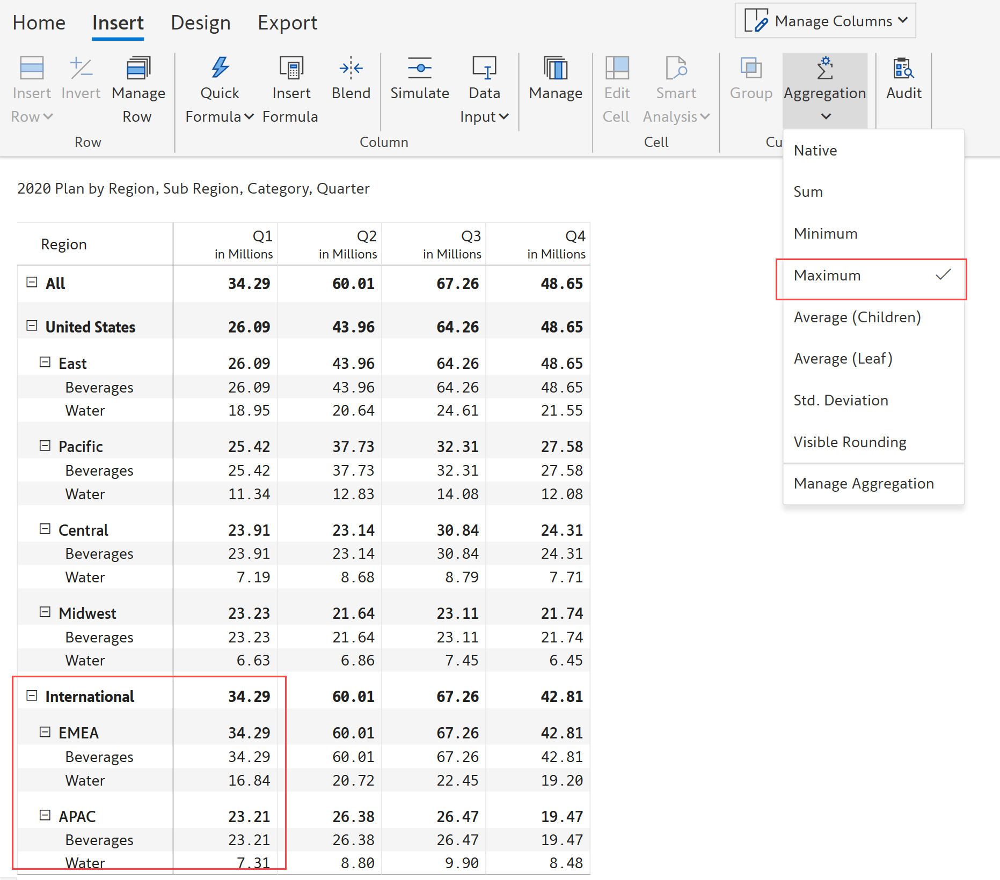

# Manage aggregations

While working with Power BI table/matrix reports, we would sometimes like to apply custom measure aggregations in a specific report (e.g., average quantity sold) instead of using the default aggregation used in a data model (e.g., the sum of quantity sold). 

Inforiver’s aggregation feature allows you to override the native Power BI aggregation for measures without having to make extensive model-level changes. 

### 1. Report level

Aggregations such as sum, average, standard deviation, minimum, maximum, and visible rounding can be applied globally for all the measures in the report.

In the 'Insert' tab of the toolbar, click the 'Aggregation' dropdown. You can see a list of aggregation options. 

<figure><figcaption>
Aggregation
</figcaption></figure>

a) By default, the 'Native' option is applied which follows the native summarization set in Power BI. 2022 Plan is set to Sum in Power BI in this example, hence the rows are summed up.

<figure><figcaption>
Native aggregation
</figcaption></figure>

b) 'Sum' aggregation displays the sum of the immediate child nodes as the aggregate. In this example, the 'East' subregion is the sum of its immediate child nodes 'Beverages' and 'Water'.

<figure><figcaption>
Sum aggregation
</figcaption></figure>

c) 'Minimum' aggregation displays the minimum value of the immediate child node as the aggregate. In the below example, you can see that the 'United States' region displays the minimum value of its immediate child nodes which is 'Midwest'.

<figure><figcaption>
Minimum aggregation
</figcaption></figure>

d) 'Maximum' aggregation displays the maximum value of the immediate child node as the aggregate. In the below image, 'International' displays the maximum value of its immediate child nodes which is 'EMEA'. &#x20;

<figure><figcaption>
Maximum aggregation
</figcaption></figure>

e) 'Average (Children)' aggregation displays the average value of the immediate child nodes as the row aggregation. In the below example, United States is calculated as the average of the immediate child nodes which are the categories.

<figure><figcaption>
Average of children
</figcaption></figure>

f) 'Average (Leaf)' aggregation displays the average value of all the leaf nodes of the row category as the row aggregation. In the below example, United States is calculated as the average of the leaf nodes which are the subcategories.

<figure><figcaption>
Average of leaf
</figcaption></figure>

g) 'Standard deviation' aggregation displays the standard deviation of the child rows as the aggregate. 'Central' sub-region displays the standard deviation of its immediate child nodes 'Beverages' and 'Water'.

<figure><figcaption>
Standard deviation
</figcaption></figure>

i) 'Visible rounding' aggregation rounds off values in a way that the individual values add up properly to the subtotal' and grand total. This is a very common requirement in external financial statement reporting such as the income statement and balance sheet reporting.

<figure><figcaption>
Visible rounding
</figcaption></figure>

### 2. Column level

The 'Manage aggregation' option allows you to manage aggregations for specific measures.

a) In the 'Insert' tab of the toolbar, click the 'Aggregation' dropdown and select 'Manage aggregation'.

<figure><figcaption>
Manage aggregation
</figcaption></figure>


Another way to access 'Manage Aggregation' is using 'Manage columns'. Click on 'Manage columns' and then the 'Settings' icon.


b) A pop-up opens showing a list of measures under the 'Display' section. You can change the aggregation type of multiple measures here.

<figure><figcaption>
Manage columns pop-up
</figcaption></figure>

c) Let's change the aggregation for '2020 Actuals' from 'Sum' to 'Maximum'. Select 'Maximum' aggregation from the dropdown.&#x20;

<figure><figcaption>
Change aggregation
</figcaption></figure>

d) In the below image, you can see that East -> 2020 Actuals shows 40.18 which is the maximum of Beverages and Water, whereas East -> 2020 Plan shows 45.03 which is the sum of the two categories. &#x20;

<figure><figcaption>
Sum &#x26; maximum aggregation
</figcaption></figure>


Report-level and column-level aggregations are applicable only for the data source rows.


e) In the below image, you can see that the aggregation field is disabled for the simulation column. Note that the [row aggregation type](../working-with-inforiver/4.-adding-business-logic-and-formulae/insert-manual-input-columns/insert-manual-input-columns.md#i-row-aggregation-type) for calculated columns and manual data input columns can be defined here in the 'Manage columns' dialog box in addition to the 'Insert formula' and 'Data input' side panels. &#x20;

<figure><figcaption>
Simulation column 
</figcaption></figure>

In the next section, we'll be covering the[ Invert sign](invert-sign.md) feature.
