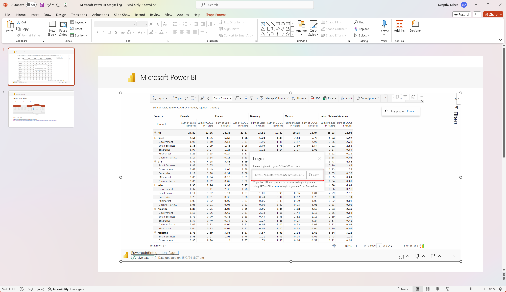

# PowerPoint integration

Power BI provides the option of using live data from visuals or reports in your PowerPoint presentations. Inforiver visuals can also be embedded in PPTs. You can view data but can't save any changes made from within PowerPoint. [Learn more about embedding Power BI visuals in PowerPoint.](https://learn.microsoft.com/en-us/power-bi/collaborate-share/service-power-bi-powerpoint-add-in-install)

You need to click the Sign in button in the Inforiver visual > copy the link from the pop-up window and sign in from a new browser tab.

<figure><figcaption>
URL to sign in from PowerPoint
</figcaption></figure>

You can apply formatting and add notes/comments from within PowerPoint, however, you need to be mindful that changes made from PowerPoint will not be saved.

<figure><figcaption>
Adding formatting, notes and comments from PowerPoint
</figcaption></figure>
