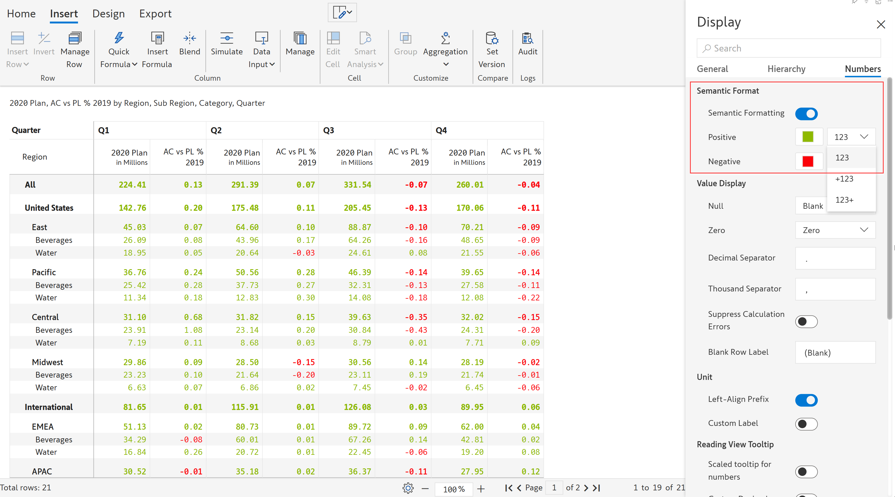
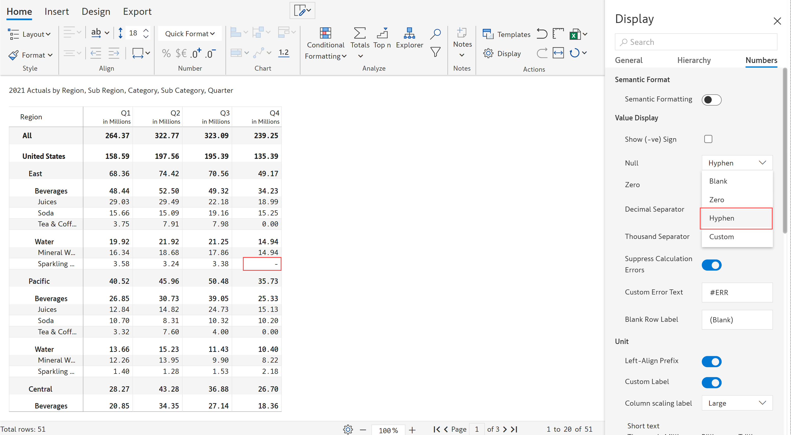
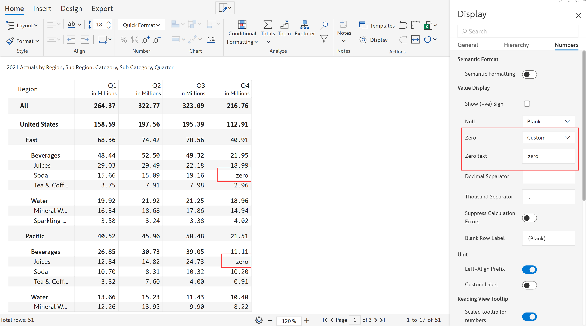
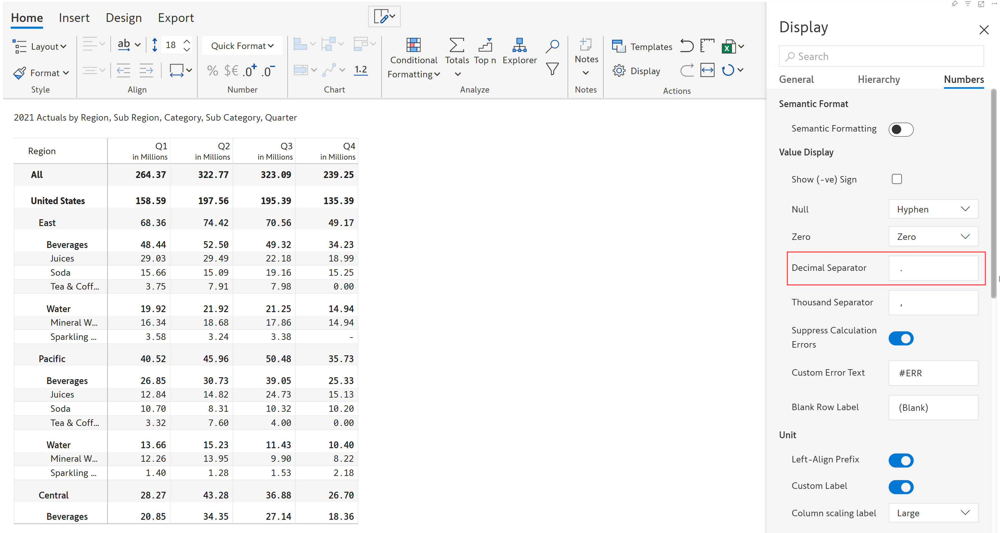
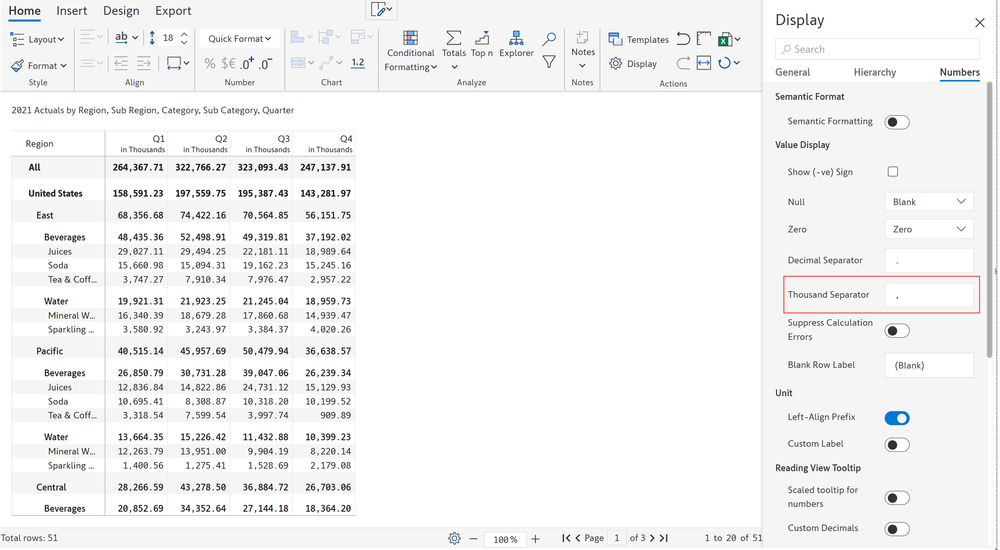
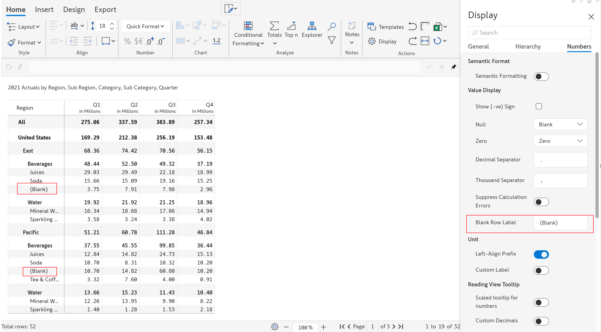
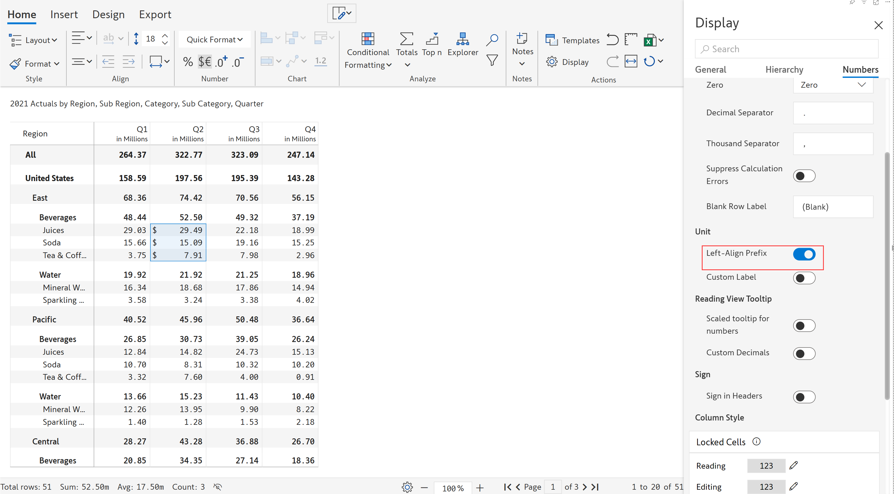
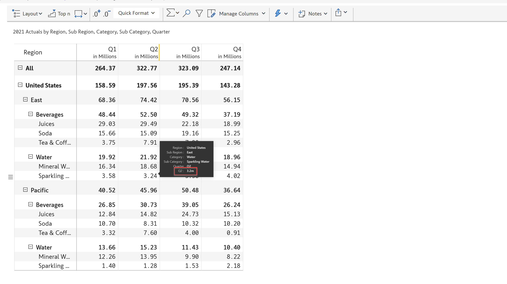

# Advanced number formatting

The advanced number formatting tab in the 'Display' settings is used for formatting the numbers in the report.

In the Inforiver toolbar click on the 'Home' tab. The 'Display' option is available in the 'Actions' section. Clicking on this option will open up the 'Display' side panel as shown.

<figure><figcaption>
Number display settings
</figcaption></figure>

Under the 'Numbers' section, you can find the following options for formatting the numbers in the report:

## i) Semantic format

Semantic formatting lets you highlight or emphasize positive and negative values.&#x20;

By enabling the toggle, you can see two new fields using which you can customize the color for the positive and negative values. You can also choose the format for displaying the positive and negative values from the drop-down.

<figure><figcaption>
Semantic formatting
</figcaption></figure>

## ii) Value display

This section provides options for null and zero display, decimal and thousand separators and more.

#### **a) Show (-ve) sign**

The 'Show (-ve) sign' checkbox is enabled only when the 'Semantic formatting' toggle is turned off.

<figure><figcaption>
Show negative sign
</figcaption></figure>

This option lets you show the negative numbers within parentheses as shown in the below image.

<figure><figcaption>
Negative values in parentheses
</figcaption></figure>

#### b) Null

You can display a null value using blank, zero, hyphen or enter custom text.

When 'Custom' is selected from the drop-down, the 'Null text' option is enabled, where you can provide the desired text (a maximum of six characters).

In the below image, the hyphen is used to represent the null value.

<figure><figcaption>
Hyphen-null value
</figcaption></figure>

#### c) Zero

You can display a zero value using blank, zero, hyphen or enter custom text.

When 'Custom' is selected from the drop-down, the 'Zero text' option is enabled, where you can provide the desired text (a maximum of six characters).&#x20;

In the below image, zero values are customized to show 'zero'.

<figure><figcaption>
Zero text
</figcaption></figure>

#### d) Decimal separator

You can insert the desired decimal separator in this field. By default, 'dot' is used.

<figure><figcaption>
Decimal separator
</figcaption></figure>

#### e) Thousand separator

You can insert the desired thousand separator in this field. By default, 'comma' is used.

<figure><figcaption>
Thousand separator
</figcaption></figure>

#### f) Suppress calculation errors

This option can be used to hide calculation errors. You can also define a 'Custom error text' which can be displayed in case of calculation errors.

<figure><figcaption>
Suppress calculation errors
</figcaption></figure>

#### g) Blank row label

By default, blank rows are identified as '(Blank)' as shown in the below image. This can be customized by entering the desired text in the field.

<figure><figcaption>
Blank row label
</figcaption></figure>

## iii) Unit

This section lets you specify the labels for units and left-align prefixes.

#### a) Left-align prefix

By default, the prefix is displayed right before the number. The image below indicates how the prefixes are displayed before enabling the left-align prefix option.

<figure><figcaption>
Left align prefix is disabled
</figcaption></figure>

On enabling the left-align prefix option, the prefix is aligned to the left of the cell.

<figure><figcaption>
Left align prefix is enabled
</figcaption></figure>

#### b) Custom label

This option lets you customize the unit labels. Once you turn on the toggle, you can see the Column scaling label, Short, Medium and Large text fields. The default settings are shown in the below image.

<figure><figcaption>
Default column scaling labels
</figcaption></figure>

The customized 'Medium' column scaling label is shown.

<figure><figcaption>
Medium column scaling label
</figcaption></figure>

## iv) Reading view tooltip

The customization options for the reading view tooltip are shown in the below image.&#x20;

<figure><figcaption>
Reading view tooltip
</figcaption></figure>

**Scaled tooltip for numbers** - Enabling this option will display the values in a scaled format in the tooltip

**Custom decimals** - Enabling this option lets you customize the decimal points to be displayed in the tooltip

**Decimal places** - Field where you can enter the number of decimal places

The below image shows the values in a scaled format with one decimal point as specified.

<figure><figcaption>
Scaled tooltip
</figcaption></figure>

## v) Sign

The following options are available to customise the signs for the row headers in the report. Note that the 'Show positive sign' and 'Show equal on totals' options are available only when the 'Sign in headers' toggle is on.

**Sign in headers** - **** This option lets you show/hide the negative sign in the row headers

**Show positive sign** - **** This option lets you show/hide the positive sign in the row headers

**Show equals on totals** - This option lets you show/hide the equal sign in the total and subtotal rows

In the below image, you can see the positive and equal signs on the data source and total rows.&#x20;

<figure><figcaption>
Sign
</figcaption></figure>

## vi) Column styles

You can customize the background and text color and fill type in the reading and editing modes for the following column types:

**Locked cells** - In the data input columns, when cells are locked

**Data input cells** - In the data input columns

**Other cells** - For data source columns, calculated and simulated columns

Let's customize the column style of the data input column (editing view). Click on the 'Pencil' icon next to the column. A dialog box opens as shown below.

<figure><figcaption>
Dialog box
</figcaption></figure>

You can customize the colors and fill type as shown below. Note that when you select the single/double side hatched pattern as the fill type, a new field called 'Fill color' gets enabled.&#x20;

A preview is shown as highlighted. To save the changes, click 'Save'.&#x20;

<figure><figcaption>
Preview and save style
</figcaption></figure>


Click 'Reset' to reset to the original settings.


In the below image, you can see that the styles selected for locked, data input and other cells in the editing mode are applied.

<figure><figcaption>
Column styles in editing mode
</figcaption></figure>

In the reading view, you can see that the styles selected for reading mode are used.

<figure><figcaption>
Column styles in reading mode
</figcaption></figure>

In the next section, we'll be covering [formula syntax](../formula-syntax/).
