# General settings

The general display settings are used to customize the appearance of the report.

In the Inforiver toolbar click on the 'Home' tab. The 'Display' option is available in the 'Actions' section. Clicking on this option will open up the 'Display' side panel as shown.

<figure>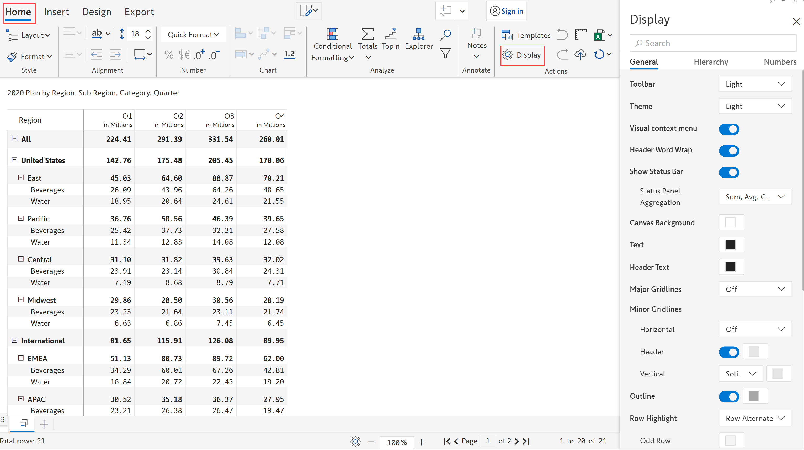<figcaption>
Display side panel
</figcaption></figure>

## i) Toolbar

The toolbar option lets you change the color of the toolbar to 'Light' or 'Dark'. In the below image, the color of the toolbar is chosen as 'dark' and the changes are reflected in the toolbar at the top and right.

<figure>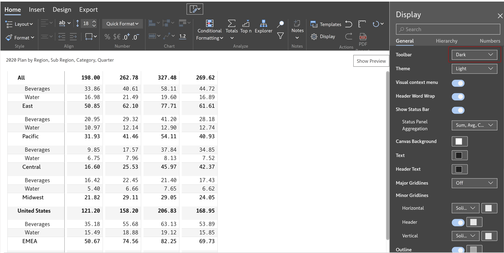<figcaption>
Tool bar theme
</figcaption></figure>

## ii) Theme

The theme option lets you change the theme of the Inforiver visual to 'Light' or 'Dark'. In the below image, a 'Dark' theme is chosen.

<figure>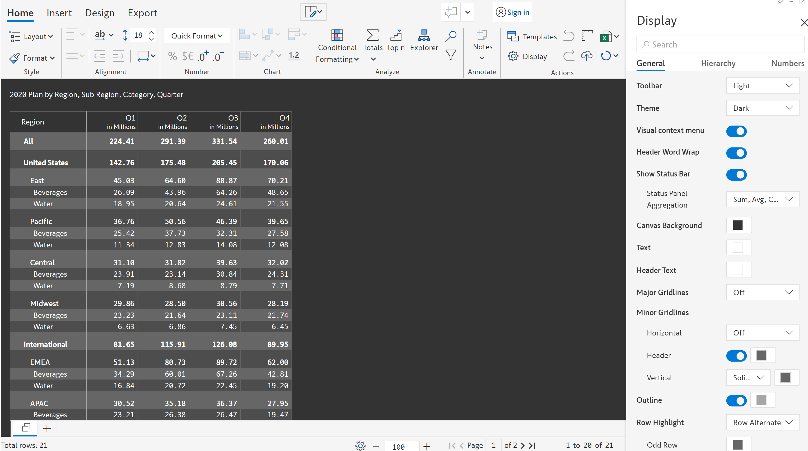<figcaption>
Dark theme color
</figcaption></figure>

## iii) Visual context menu

When the 'Visual context menu' option is enabled, a context menu gets displayed on right-click of a row.

<figure>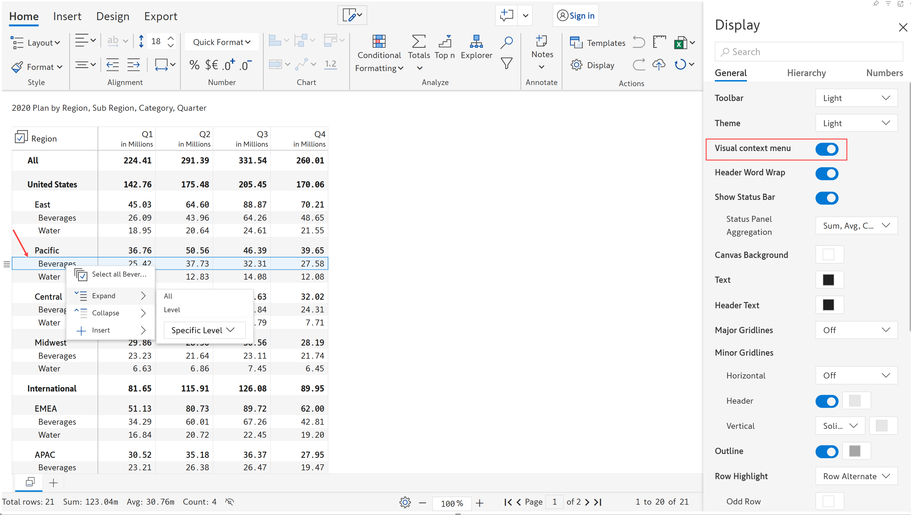<figcaption>
Visual context menu
</figcaption></figure>

## iv) Header word wrap

When the 'Header word wrap' option is enabled, the word gets wrapped according to the height of the cell.

The image below indicates how the headers are displayed before enabling the header word wrap option:

<figure><figcaption>
Header word wrap disabled
</figcaption></figure>

The image below indicates how the headers are displayed after enabling the header word wrap option:

<figure><figcaption>
Header word wrap enabled
</figcaption></figure>

## v) Show status bar

You can show/hide the status bar with this option. If this option is enabled, the 'Status panel aggregation' becomes available.&#x20;

#### Status panel aggregation

The 'Status panel aggregation' option allows you to show the aggregation such as _sum, average, min, max,_ and _count_ for the values selected in the visual.&#x20;

In the below example, you can see the _sum, average_, and _count aggregation_ for the selected values/measure in the status bar.


Only a maximum of three aggregations gets displayed in the status bar.


<figure><figcaption>
Status bar
</figcaption></figure>

## vi) Canvas background

You can change the background color of the canvas using this option.

<figure><figcaption>
Canvas background
</figcaption></figure>

## vii) Text

You can change the color of the text/value in the visual using this option.

<figure><figcaption>
Text color
</figcaption></figure>

## viii) Header text

You can change the color of the header text in the visual using this option.

<figure><figcaption>
Header text color
</figcaption></figure>

## ix) Major gridlines

This option lets you set the major gridlines for the parent rows in the visual. You can select from the following values:&#x20;

* **Single -** This option will insert a single gridline to the parent rows
* **Double -** This option will insert a double gridline to the parent rows
* **Off** - This option will turn off the major gridlines

<figure><figcaption>
Major gridlines
</figcaption></figure>

If the 'Single' or 'Double' option is selected for the major gridlines, then a color picker option becomes available right next to it. Using the color picker option you can customize the color of the single/double major gridlines.

In the below example, 'Double' major gridlines are inserted and their colors are set to 'blue' as shown.

<figure><figcaption>
Double major gridlines customized in blue color
</figcaption></figure>

If 'Off' is selected, the major gridlines will not get displayed. In the below image, the major gridlines have been turned off.

<figure><figcaption>
Major gridlines turned off
</figcaption></figure>

## x) Minor gridlines

You can add 'Horizontal', 'Header', and 'Vertical' minor gridlines.

#### Horizontal

This option lets you set the horizontal gridlines for child rows. You can select from the following options:&#x20;

* **Single -** This option will insert a single horizontal gridline to the child rows
* **Double -** This option will insert a double horizontal gridline to the child rows
* **Off** - This option will turn off the gridlines

<figure><figcaption>
Horizontal minor gridlines
</figcaption></figure>

If the 'Single' or 'Double' option is selected for the horizontal gridlines, then a color picker option becomes available right next to it. Using the color picker option you can customize the color of the single/double horizontal gridlines.

In the below example, 'Solid' horizontal gridlines are inserted and their colors are set to 'red' as shown.

<figure><figcaption>
Solid horizontal gridlines customized in red color
</figcaption></figure>

#### Header

This option lets you insert gridlines for the column headers. If this option is enabled, then a color picker option becomes available right next to it. Using the color picker option you can customize the color of the header gridline.


&#x20;The color of the header gridline is the same as that of the horizontal gridlines by default.&#x20;


<figure>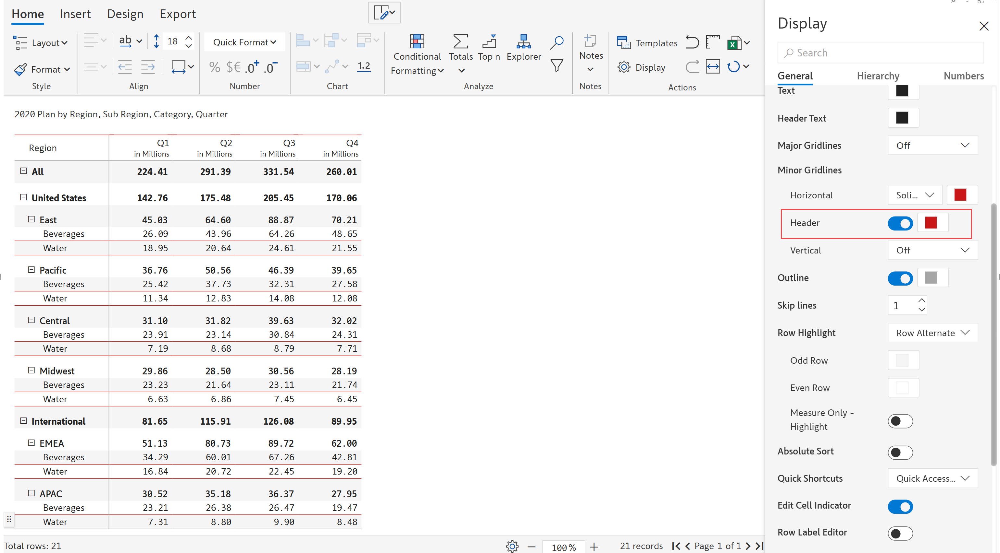<figcaption>
Header gridline
</figcaption></figure>

If you try to change the color of the header gridline, the color of the horizontal gridlines also gets changed accordingly as shown.

<figure><figcaption>
Header &#x26; horizontal gridlines
</figcaption></figure>

#### Vertical

This option lets you insert vertical lines between columns. You can select from the following options:&#x20;

* **Solid -** This option will insert solid vertical lines to the right of each column.
* **Off** - This option will turn off the vertical lines

<figure>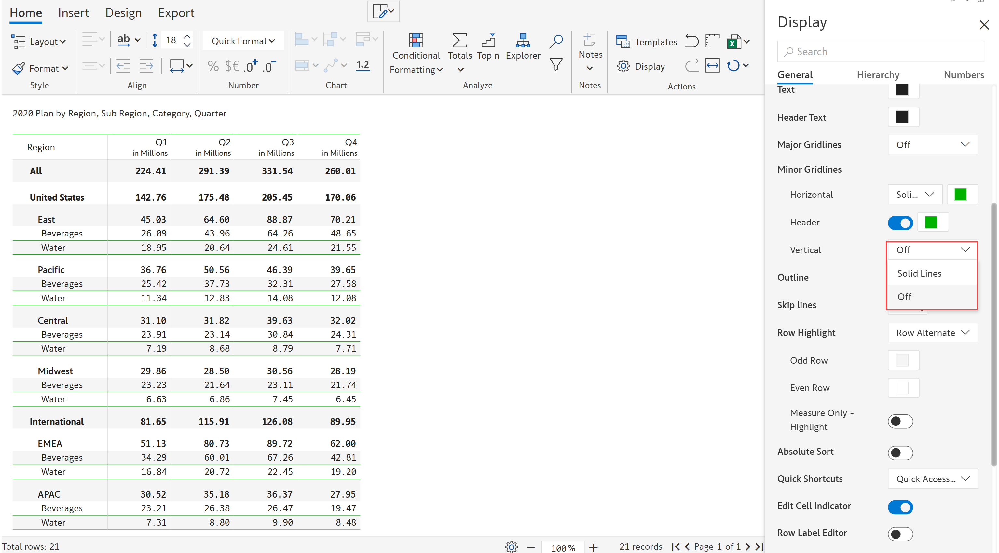<figcaption>
Vertical gridlines
</figcaption></figure>

If the 'Solid lines' option is selected for the vertical lines, then a color picker option becomes available right next to it. Using the color picker option you can customize the color of the solid vertical lines.

In the below example, 'Solid' vertical gridlines are inserted and their colors are set to 'yellow' as shown.

<figure>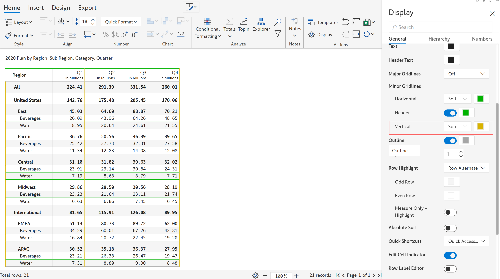<figcaption>
Solid vertical gridlines customized in yellow color
</figcaption></figure>

## xi) Outline

This option allows you to set the outline for the visual. If you enable this option, a color picker becomes available right next to it. The color picker lets you select the color of the outline. In the below image, the red outline is set for the visual.

<figure>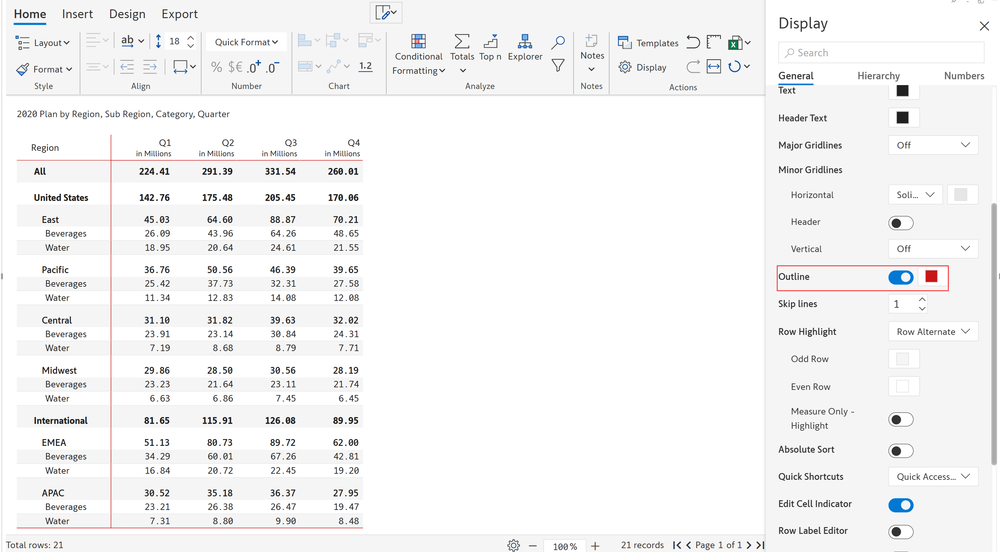<figcaption>
Red outline
</figcaption></figure>

## xii) Skip lines

This option allows you to set the minor grid line gap between the rows.&#x20;


The minimum and maximum skip line values are 1 and 10 respectively.


<figure>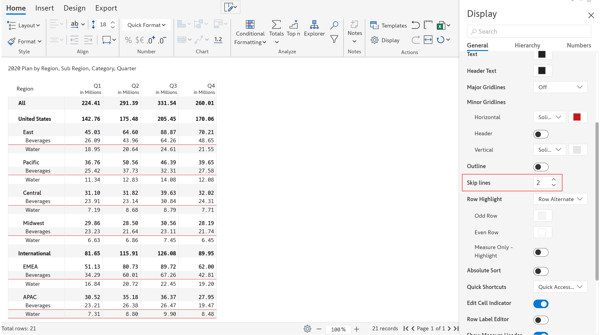<figcaption>
Skip lines
</figcaption></figure>

## xiii) Row highlight

This option allows you to highlight the rows in the report. The various row highlight options are:

* &#x20;**Row hover -** Highlights the row upon hovering over them. If you enable this option, the following options become available
  1. **Row text color** - This option lets you set the text color of the row on hover
  2. **Row background color** - This option lets you set the background color of the row on hover

In the below image, the row text color is set to red, and the row background color to blue on hover.

<figure><figcaption>
Row hover
</figcaption></figure>

* **Row alternate -** Highlights the alternate rows. All of the row highlight options are customized with predefined colors. By default, all the tables are configured with the 'Row alternate' highlight option. If you enable this option, the following options become available
  1. **Odd row** - This option lets you set the color of the odd rows
  2. **Even row** - This option lets you set the color of the even rows
  3. **Measure only highlight** - Enabling this option highlights only the measure

The row alternate highlight is shown in the below image.

<figure><figcaption>
Row alternate
</figcaption></figure>

* **Row alternate contrast -** Highlights the odd and even rows with contrasting color shades by default as shown. If you enable this option, the following options become available
  1. **Odd row** - This option lets you set the color of the odd rows
  2. **Even row** - This option lets you set the color of the even rows

The row alternate contrast highlight is shown in the below image.

<figure><figcaption>
Row alternate contrast
</figcaption></figure>

* **Row alternate flashy -** Highlights the odd and even rows with flashy color shades by default as shown. If you enable this option, the following options become available
  1. **Odd row** - This option lets you set the color of the odd rows
  2. **Even row** - This option lets you set the color of the even rows

The row alternate flashy highlight is shown in the below image.

<figure><figcaption>
Row alternate flashy
</figcaption></figure>

You can remove the row highlight by selecting the 'off' option from the drop-down.

## xiv) Absolute sort

This option allows you to arrange the values based on their magnitude ignoring the sign. If this option is enabled, the sign of the values (+ve or -ve) will not be considered and all the values will be sorted only based on their corresponding magnitude.&#x20;

## xv) Quick shortcuts

This option lets you add quick shortcut icons in the 'Actions' category. By default, the 'Undo', 'Redo', 'Export as excel', and 'Best fit' options are selected. You can select additional options including 'Export PDF', 'Aggregation', and 'Smart Analysis'.&#x20;

The shortcuts for all the selected options will get displayed in the 'Actions' category as highlighted.

<figure>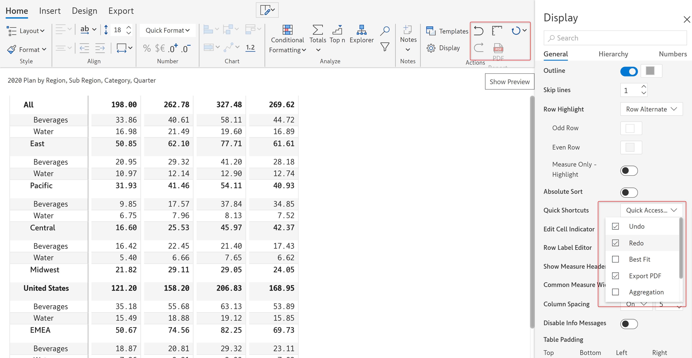<figcaption>
Quick shortcuts
</figcaption></figure>

## xvi) Edit cell indicator

This option allows you to identify the edited/modified cell values in the visual. If you enable this option, the modified cell values are indicated by a 'Pencil' icon displayed right next to the corresponding values.&#x20;

In the below image, the 'Beverages' value is edited and is indicated by a pencil icon next to it.

<figure><figcaption>
Edit cell indicator
</figcaption></figure>

## xvii) Row label editor

This option allows you to identify if the original row labels are modified in the visual. If you enable this option, the modified row labels are indicated by an 'Edit' icon displayed right next to the corresponding label.&#x20;

In the below image, you can see that the row label 'Beverage' has been modified and is indicated by an edit icon next to it.

<figure><figcaption>
Row label editor
</figcaption></figure>

## xviii) Show measure header

This option allows you to show/hide the header of the measure. By default, this option is enabled for all the reports, you can turn it off if required as shown in the below image.

<figure><figcaption>
Show measure header
</figcaption></figure>

## xix) Column measure width

If this option is enabled, changing the width of one column will change the width of all other columns accordingly.&#x20;

<figure><figcaption>
Common measure width
</figcaption></figure>

If this option is disabled, the width of every single column can be changed individually. In the below image, the width of the 'Q4' column alone is modified.

<figure><figcaption>
Q4 width modified 
</figcaption></figure>

## xx) Column spacing

This option allows you to adjust the spacing between the columns. It is 'Off' by default. If this option is turned on, then an input field becomes available right next to it. You can specify the required column spacing in this field.


The minimum and maximum values of column spacing are 0 and 20 respectively.


In the below image, the column spacing value is set to '15'.

<figure><figcaption>
Column spacing
</figcaption></figure>

## xxi) Disable info messages

Upon enabling this option, the informational messages will not be shown.

<figure>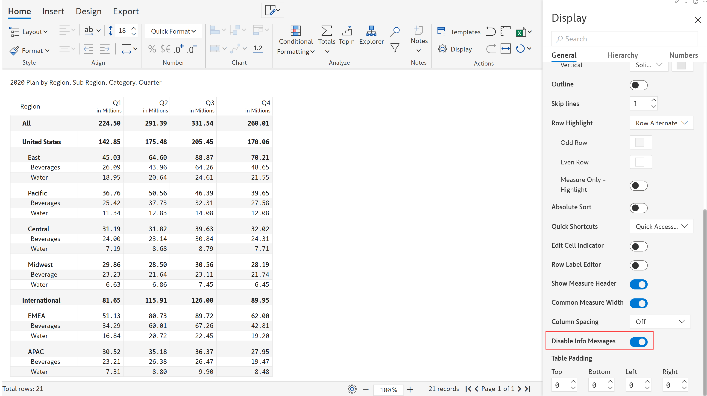<figcaption>
Disable info messages
</figcaption></figure>

## xxii) Table padding

This option allows you to insert spacing/padding for the table from the top, bottom, left, and right.&#x20;


The minimum and maximum padding values are 0 and 100 respectively.


<figure>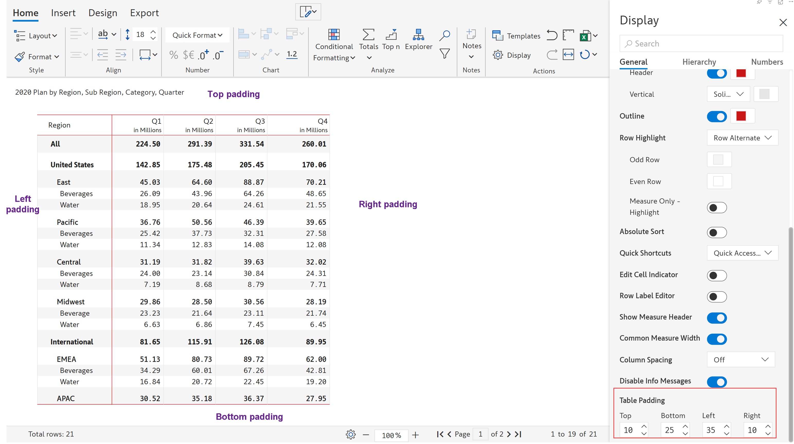<figcaption>
Table padding
</figcaption></figure>

In this section, we covered the general display settings. Navigate to the next section to learn more about [hierarchy settings](hierarchy-settings.md).
