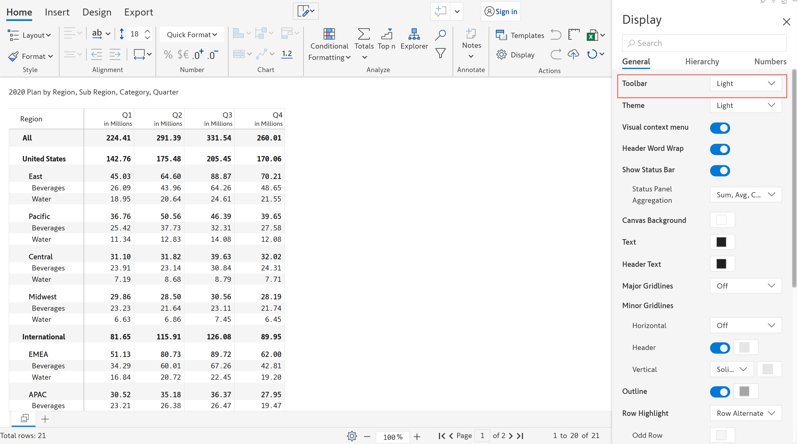
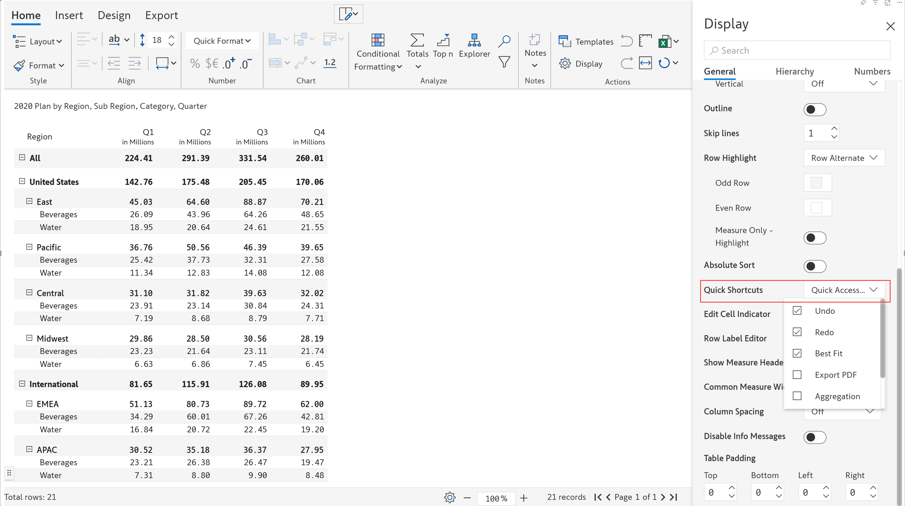

# General settings

In the 'Home' tab, click on the 'Display' option. The 'Display' side panel opens as shown.&#x20;

<figure><figcaption>
Display side panel
</figcaption></figure>

Under the 'General' section, you can find the following options for customizing the appearance of the visual:

#### Toolbar

The color of the toolbar can be applied as either 'light' or 'dark'. In the below image the color of the toolbar is chosen as 'light'.

<figure><figcaption>
Toolbar
</figcaption></figure>

#### Theme

The theme color can be applied as either 'light' or 'dark'. In the below image the color of the theme is chosen as 'dark'.

<figure><figcaption>
Dark theme color
</figcaption></figure>

#### Visual context menu

When the 'visual context menu' option is enabled, a context menu gets displayed on right-click of a row.

<figure><figcaption>
Visual context menu
</figcaption></figure>

#### Header word wrap

When the 'Header word wrap' option is enabled, the word gets wrapped according to the height of the cell.

<figure><figcaption>
Header word wrap disabled
</figcaption></figure>

After enabling the 'Header word wrap':

<figure><figcaption>
Header word wrap enabled
</figcaption></figure>

#### Show status bar

You can show/hide the status bar with this option. The 'Status panel aggregation' option allows you to show the aggregation such as sum, average, min, max and count for the values selected in the visual.&#x20;

In the below example, you can see the sum, average and count aggregation for the selected values/measure. Note that only three aggregations can be shown in the status bar.

<figure><figcaption>
Status bar
</figcaption></figure>

#### Canvas background

You can change the color for the canvas background using this option.

<figure><figcaption>
Canvas background
</figcaption></figure>

#### Text

You can change the color for the text/value in the visual using this option.

<figure><figcaption>
Text color
</figcaption></figure>

#### Header text

You can change the color for the header text in the visual using this option.

<figure><figcaption>
Header text color
</figcaption></figure>

#### Major gridlines

You can set the major gridlines for the parent row. Select the option as either 'single', 'double' from the dropdown.

<figure><figcaption>
Major gridlines
</figcaption></figure>

You can customize the major gridlines with different colors, select the color from the color panel available next to it. In the below example, 'double' major gridlines customized in 'blue' color is shown.

<figure><figcaption>
Double major gridlines customized in blue color
</figcaption></figure>

You can turn off the major gridlines, select 'off' option from the dropdown.

<figure><figcaption>
Turn off major gridlines
</figcaption></figure>

The major gridlines are removed as shown.

<figure><figcaption>
Major gridlines removed
</figcaption></figure>

#### Minor gridlines

Minor gridlines option can be set for 'Horizontal', 'Header' and 'Vertical'.&#x20;

(i) Horizontal: you can set the horizontal gridlines for child rows. Select the option as either 'solid lines' or 'dashed lines' from the dropdown.

<figure><figcaption>
Horizontal minor gridlines
</figcaption></figure>

You can customize the minor gridlines with different colors, select the color from the color panel available next to it. In the below example, 'solid' horizontal gridlines customized in 'red' color is shown.&#x20;

<figure><figcaption>
Solid horizontal gridlines customized in red color
</figcaption></figure>

(ii) Header: enable the 'Header' toggle to set the gridline for the header. The color of the header gridline remains similar to that of the horizontal gridlines by default.&#x20;

<figure><figcaption>
Header gridline
</figcaption></figure>

If you try to change the color of the header gridline, the horizontal gridlines also change to the same color chosen as shown.

<figure><figcaption>
Header &#x26; horizontal gridlines
</figcaption></figure>

(iii) Vertical: you can set the vertical gridlines for child rows. Select the option 'solid lines' from the dropdown.

<figure><figcaption>
Vertical gridlines
</figcaption></figure>

You can customize the vertical gridlines with different colors, select the color from the color panel available next to it. In the below example, 'solid' vertical gridlines customized in 'yellow' color is shown.&#x20;

<figure><figcaption>
Solid vertical gridlines customized in yellow color
</figcaption></figure>


You can remove the minor gridlines by selecting the 'off' option from the respective drop-down and to remove the header gridline, just turn off the 'Header' toggle.


#### Outline

Outline option allows you to set and apply color for the outline of the visual. In the below image, red outline is set for the visual.

<figure><figcaption>
Red outline
</figcaption></figure>

#### Skip lines

Skip lines option allows you to set the minor grid line gap in between the rows. The value ranges from 1 to 10

<figure><figcaption>
Skip lines
</figcaption></figure>

#### Row highlight

Row highlight option allows you to highlight the rows in the visual. The various row highlight options are: Row hover, Row alternate, Row alternate contrast, Row alternate flashy. By default, all the tables are chosen with 'Row alternate' highlight option.&#x20;

<figure><figcaption>
Row highlight options
</figcaption></figure>

(i) Row hover: highlights the row upon hovering over them. You can also customize the 'Row text color' and 'Row background color' using the respective color panel options available next to it.

In the below image, you can see the row text highlighted in red with a blue background on hover.

<figure><figcaption>
Row hover
</figcaption></figure>

(ii) Row alternate: highlights the odd and even rows. All of the row highlight options are customized with predefined color. However, you can select the color from the color panel available next to it.

If you want only the measure to be highlighted, you can enable the 'Measure only highlight' option. Row alternate highlight is shown in the below image.

<figure><figcaption>
Row alternate
</figcaption></figure>

(iii) Row alternate contrast: highlights the odd and even rows with color shades as shown.

<figure><figcaption>
Row alternate contrast
</figcaption></figure>

(iv) Row alternate flashy: highlights the odd and even rows with the color shades as shown.&#x20;

<figure><figcaption>
Row alternate flashy
</figcaption></figure>


You can remove the row highlight by selecting the 'off' option from the drop-down.


#### Absolute sort

Absolute sort option allows you to arrange the members based on the magnitude of the values ignoring the signage.

#### Quick shortcuts

You can add quick shortcuts icons of the following items from the drop-down to access from the toolbar.

<figure><figcaption>
Quick shortcuts
</figcaption></figure>

#### Edit cell indicator

Edit cell indicator option allows you to identify the edited cell value in the visual. You can see 'Central -> Beverages' value edited and indicated with a pencil icon in the below image. You can turn it off, if required.

<figure><figcaption>
Edit cell indicator
</figcaption></figure>

#### Row label editor

Row label editor option allows you to identify the modified row label in the visual. In the below image, you can see the row label 'Midwest -> Beverage' modified. You can turn it off, if required.

<figure><figcaption>
Row label editor
</figcaption></figure>

#### Show measure header

Show measure header option allows you to show/hide the header of the measure. By default, this option is enabled for all the reports, you can turn it off, if required as shown in the below image.

<figure><figcaption>
Show measure header
</figcaption></figure>

#### Column measure width

If the 'Common measure width' option is enabled, when you try changing the width of one column, all the other columns also adjust their width accordingly. Columns with common measure width is shown:&#x20;

<figure><figcaption>
Common measure width
</figcaption></figure>

On disabling this option, you can change the width of the selected column alone. In the below image, the width of the 'Q4' column alone is modified.

<figure><figcaption>
Q4 width modified 
</figcaption></figure>

#### Column spacing

Column spacing option allows you to adjust the spacing between the columns. The column spacing value ranges between 0 to 20.

In the below image, column spacing value '15' is given.

<figure><figcaption>
Column spacing
</figcaption></figure>

#### Disable info messages

Upon enabling 'disable info messages' option, the infomation messages will not be shown.

<figure><figcaption>
Disable info messages
</figcaption></figure>

#### Table padding

Table padding option allows you to insert spacing for the table from  top, bottom, left and right. Table padding is shown:

<figure><figcaption>
Table padding
</figcaption></figure>
