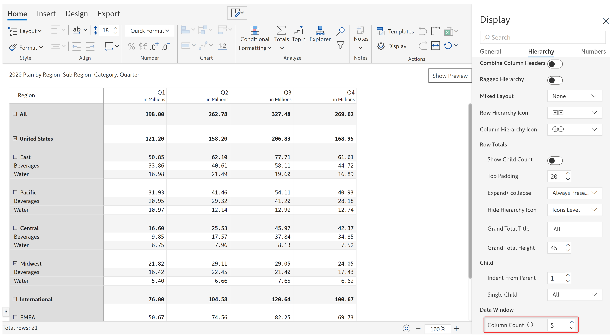

# Hierarchy settings

The hierarchy display settings are used to customize the appearance of the hierarchies in the report.

In the Inforiver toolbar click on the 'Home' tab. The 'Display' option is available in the 'Actions' section. Clicking on this option will open up the 'Display' side panel as shown.

<figure><figcaption>
Display settings side panel
</figcaption></figure>

Click on the 'Hierarchy' tab in this panel to view the hierarchy settings.

<figure><figcaption>
Hierarchy display settings
</figcaption></figure>

Under the 'Hierarchy' tab, you can find the following options to customize the hierarchies in the report.

## i) Category highlight&#x20;

This drop-down lets you show or hide the category highlight. This option is set to 'Off' by default.&#x20;

<figure><figcaption>
Category highlight off
</figcaption></figure>

If this option is set to “On”, then a color field appears right next to it.

<figure><figcaption>
Category highlight on
</figcaption></figure>

If you click on the color option, a color picker modal opens up in which you can select the category highlight color.

<figure><figcaption>
Category highlight color picker
</figcaption></figure>

## ii) Responsive columns&#x20;

If this option is enabled, when the report canvas is resized to a small size, then only columns that fit into the canvas will be displayed and other columns are hidden from the view.

<figure><figcaption>
Responsive column option
</figcaption></figure>

In the image below, after resizing the canvas to a much smaller size, out of the 3 measures added in the 'Values' field only 2 measures that fit into the view are getting displayed since the responsive columns option is enabled.

<figure><figcaption>
Responsive column option enabled
</figcaption></figure>

## iii) Combine column headers&#x20;

Enabling this option will combine the column headers and measure labels to display compact headers.


To enable this option, you need to have more than one category in the 'Columns' field.


As you can see from the below image, if this option is turned off, the column headers and measure labels are displayed separately.

<figure><figcaption>
Combine column header off
</figcaption></figure>

However, if this option is turned on, the column headers and measure labels are combined and displayed in a compact manner. If the 'Combine column header' option is enabled, then the 'Column header separator' option becomes available.

<figure><figcaption>
Combine column header on
</figcaption></figure>


If the 'Combine column headers' option is enabled, you won't be able to reorder the columns.


#### Column header separator&#x20;

This option lets you specify the separator that will get inserted between the column header and the measure label.

## iv) Ragged hierarchy&#x20;

In the case of ragged/unbalanced hierarchies where the number of levels is uneven, you can hide the blank rows. If you enable this option, the following sub-options become available:

<figure><figcaption>
Ragged hierarchy option
</figcaption></figure>

#### Hide blanks&#x20;

Using this option you can choose to hide the rows if the 'Category' is blank, 'Values' are blank or 'Values+Category' is blank.


This option becomes available only if the option chosen in the Hide Blanks is 'Value' or 'Value+Category'.


#### Suppress zeros&#x20;

If you enable this option, then the rows containing zeros will be suppressed.

#### Hide empty columns

By enabling this option, you can hide the columns with no values.

## v) Mixed layout

It will display the chosen field as a separate column similar to the stepped layout. By default, it is set to 'None'. In the below image, the 'Category' field has been selected and it gets displayed as a separate column in the visual.

<figure><figcaption>
Mixed layout option
</figcaption></figure>

## vi) Row hierarchy icon&#x20;

You can select custom icon styles to represent the row hierarchy. If 'None' is selected, no icon will be displayed. As you can see in the below image, a specific icon style has been selected, and it is displayed on the visual to expand/collapse the row hierarchy.

<figure><figcaption>
Row hierarchy icon
</figcaption></figure>

## vii) Column hierarchy icon&#x20;

You can select custom icon styles to represent the column hierarchy. If 'None' is selected, no icon will be displayed.&#x20;

<figure><figcaption>
Column hierarchy icon
</figcaption></figure>

## viii) Row totals

You can customize the totals and subtotals by adding child count, padding, border, editing titles, and more. The available options are explained below.

#### Show child count&#x20;

Enabling this option will display the count of child rows next to the name of the parent row in brackets.

<figure><figcaption>
Child count option
</figcaption></figure>

#### Top padding&#x20;

Using this option, you can configure the spacing/padding between row hierarchies.

<figure><figcaption>
Top padding option
</figcaption></figure>

#### Expand/collapse&#x20;

This option lets you specify when the expand/collapse icons for the hierarchies have to be displayed.

* **Always present** - Expand/collapse icon will be always present
* **Only on hover** - The expand/collapse icons are displayed only when you hover over the rows

<figure><figcaption>
Expand/collapse icon
</figcaption></figure>

#### Grand total title&#x20;


The options related to Grand total can be seen in effect only if the Row/Column Grand Total value has not been set to ‘Off’ under the ‘Totals’ option.&#x20;


The value that you specify here will be set as the grand total title.

<figure><figcaption>
Grand total title option
</figcaption></figure>

#### Grand total height&#x20;

The value that you specify here will override the default height of the grand total row.


The minimum and maximum values for grand total height are 5 and 45 respectively.


<figure><figcaption>
Grand total height
</figcaption></figure>

#### Grand total border &#x20;

This option lets you turn on or turn off the border of the grand total row. It can be set to:

* **On -** This option will turn off the border for the grand total row.
* **Off -** This option will turn on the border for the grand total row.
* **Custom** - If you select this option, then a 'Line height' field and a 'Line color' field will appear. The line height option lets you change the line height of the border, whereas the line color option lets you change the color of the border.

#### Hide hierarchy icon

With this option, you can specify the fields for which you want to hide the hierarchy icon. All the fields are selected by default, and unselecting any field will hide the hierarchy icon for that field. In the below image, the 'Region' field has been unselected, therefore the hierarchy icon for that field has been hidden.

<figure><figcaption>
Hide hierarchy icon option
</figcaption></figure>

## ix) Child

#### Indent from parent&#x20;

This option lets you set the amount of indentation that has to be applied to the child rows from the parent row.


The minimum and maximum indentation values are 1 and 25 respectively.


In the image below, every child row has been indented from its parent row by the specified amount.

<figure><figcaption>
Child indent option
</figcaption></figure>

#### Single child&#x20;

Using this option you can select which nodes to display when a parent hierarchy has only one child. In this example, we have a multi-level account hierarchy with several single-child rows and blank rows.&#x20;

The sales and marketing expenses row has only one child. The personnel cost row's child rows have blank rows. Let's see how this report is displayed for each of the options.

* **All** - Displays all the rows i.e the parent rows and the single child rows. There are blank rows at levels 5 and 6.

<figure><figcaption>
Single child - All
</figcaption></figure>

* **Parent only** - Displays the parent nodes of the single child. The blank rows at level 6 have all been hidden as shown below. The blank rows at level 5 are still shown.&#x20;

<figure><figcaption>
Single child - Parent only
</figcaption></figure>

* **Parent (Multi-level) -** Displays only the highest level row of the multi-level hierarchy. The blank rows at both levels 5 and 6 are not shown.&#x20;

<figure><figcaption>
Single child - Parent multi-level
</figcaption></figure>

* **Single child level as parent -** Displays the single child as the parent of its level.&#x20;

We are taking a different scenario to explain the single child level as parent and single child as parent options. As you can see below, under Operating expenses we have filtered only IT expenses. You can see blanks at levels 5 and 6.

<figure><figcaption>
Single child at level 4
</figcaption></figure>

On selecting 'Single child level as parent', you can see that the level 6 blank row is shown as the child for the level 4 row.

<figure><figcaption>
Single child level as parent
</figcaption></figure>

* **Single child as parent -** Displays only the single child at the lowest level. The blank row at level 6 is shown as the child for the level 3 row.

<figure><figcaption>
Single child as parent
</figcaption></figure>

## x) Data window

#### Column count&#x20;

Inforiver supports wide table use cases through the dynamic columns feature. You can fetch up to 1000 columns, however, the performance would be compromised. &#x20;

Every fetch from Power BI is 30,000 cells (No of rows x No of columns). This means you can load data chunks of different sizes dynamically as 500 Rows by 60 Columns (or) 30 Rows by 1000 Columns (or) 10,000 Rows by 3 Columns.

You can view the current column count by hovering over the 'i' icon and modify the column count if needed.

<figure><figcaption>
Column count option
</figcaption></figure>

Learn more about dynamically setting data chunk size using Power BI's [fetchMoreData API](https://learn.microsoft.com/en-us/power-bi/developer/visuals/fetch-more-data).

In this section, we covered the hierarchy display settings. Navigate to the next section to learn more about [advanced number formatting](advanced-number-formatting.md).\
