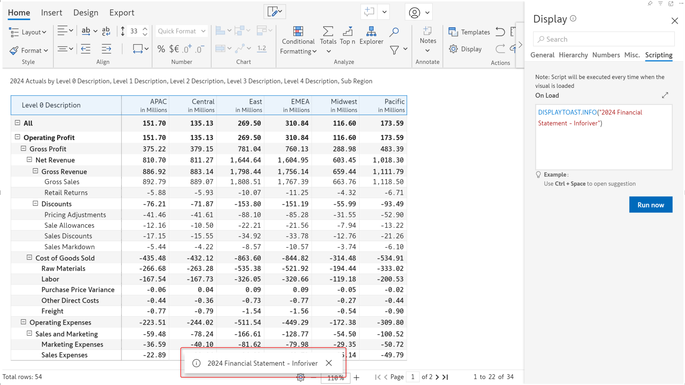

# On-load scripting

Inforiver’s on-load scripting feature enables you to list a set of actions to be performed on loading the visual. You can display messages, set the layout, hide columns, or apply filters as the visual is loaded. The scripts will be executed when you open the report, switch to the tab containing the visual, or refresh the visual. &#x20;

Inforiver offers an array of built-in functions that you can use to set up scripts effortlessly. [Learn more about scripting functions.](../formula-syntax/scripting-functions/)

<figure><figcaption>
On load scripts
</figcaption></figure>

Notice how all the scripts have been executed when the visual is loaded.


To see the scripts in action, click the Run now button


<figure><figcaption>
Executing on-load scripts
</figcaption></figure>

Let's look at some applications of on-load scripts.

#### 1. Displaying messages

You can display custom text as a toast message notification. The supported types include alerts, information, warnings, and success messages among others. [Learn more about the DISPLAYTOAST function.](../formula-syntax/scripting-functions/displaytoast.md)

<figure><figcaption>
Alert message
</figcaption></figure>

 

<figure><figcaption>
Info message
</figcaption></figure>

 

<figure><figcaption>
Warning message
</figcaption></figure>

#### 2. Setting the layout

You can set a particular theme or expand hierarchical data to a specific level. [Learn more about the LAYOUT function](../formula-syntax/scripting-functions/layout.md).

<figure><figcaption>
Setting the theme and layout
</figcaption></figure>

 

<figure><figcaption>
Navigating to a particular hierarchy level
</figcaption></figure>

#### 3. Filtering periodic data

You can filter the data to show only a specific time period, for instance, the last 4 months or the last 2 years. [Learn more about filtering time series data](../formula-syntax/scripting-functions/showbetweenperiod.md).

<figure><figcaption>
Displaying next 4 months when current month is May
</figcaption></figure>
