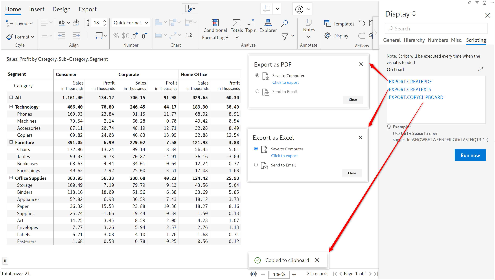

# EXPORT

You can export the report to PDF or Excel. You can also copy the report to the clipboard.

### Syntax

```javascript
EXPORT.CREATEPDF
EXPORT.CREATEXLS
EXPORT.COPYCLIPBOARD
```

### Example

<figure><figcaption><p>Export</p></figcaption></figure>
