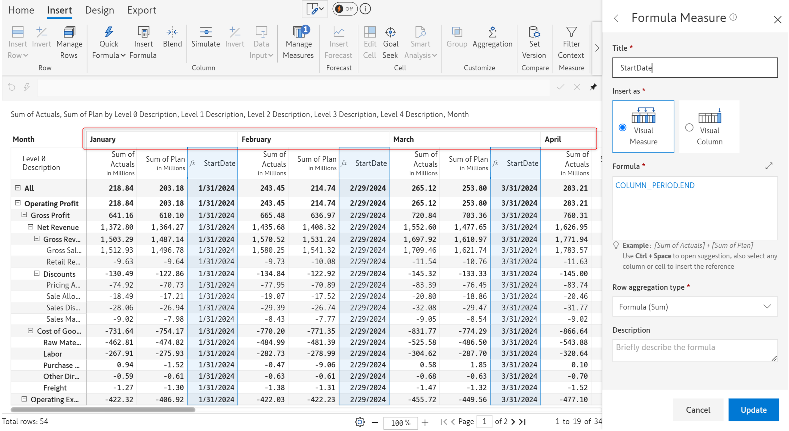

# COLUMN\_PERIOD

The COLUMN\_PERIOD function can be used to select data from a given measure, for a specified period.

|       |                                      |
| ----- | ------------------------------------ |
| START | Returns the start date of the period |
| END   | Returns the end date of the period   |

## 1. COLUMN\_PERIOD.START

## Syntax

```javascript
COLUMN_PERIOD.START
```

## Return value

Returns the first day of the month for the corresponding month, quarter, or year based on the granularity.

## Example

```javascript
COLUMN_PERIOD.START
//Returns the start date for a month, quarter, or year
```

<div>

<figure><figcaption><p>Month level</p></figcaption></figure>

 

<figure><figcaption><p>Year level</p></figcaption></figure>

 

<figure><figcaption><p>Quarter level</p></figcaption></figure>

</div>

## 2. COLUMN\_PERIOD.END

## Syntax

```javascript
COLUMN_PERIOD.END
```

## Return value

Returns the last day of the month for the corresponding month, quarter, or year based on the granularity.

## Example

```javascript
COLUMN_PERIOD.END
//Returns the end date for a month, quarter, or year
```

<div>

<figure><figcaption><p>Year level</p></figcaption></figure>

 

<figure><figcaption><p>Quarter level</p></figcaption></figure>

 

<figure><figcaption><p>Month level</p></figcaption></figure>

</div>
