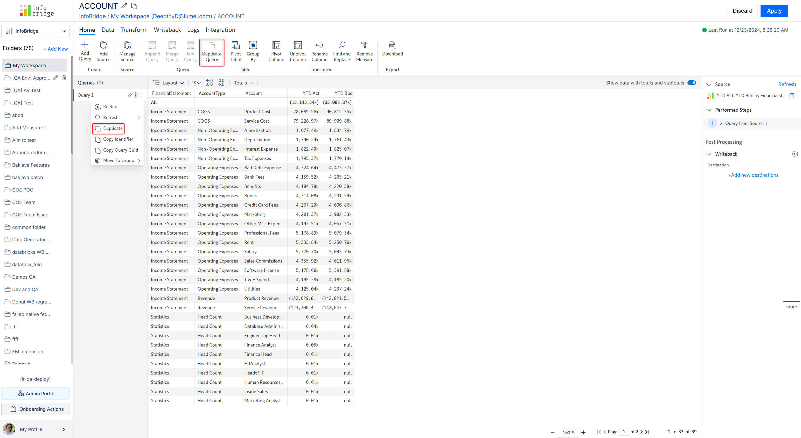

# Duplicate

You can create a copy or take a backup of your query before applying transformations. You can either hover over the query name and select **Duplicate** from the context menu or you can click the **Duplicate Query** option from the Home ribbon.

<figure><figcaption>
Duplicating queries
</figcaption></figure>
