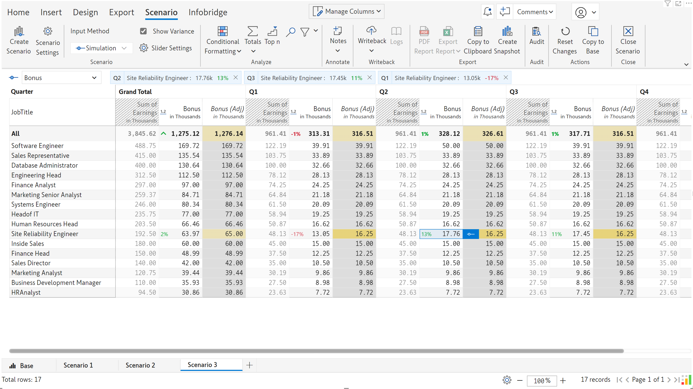
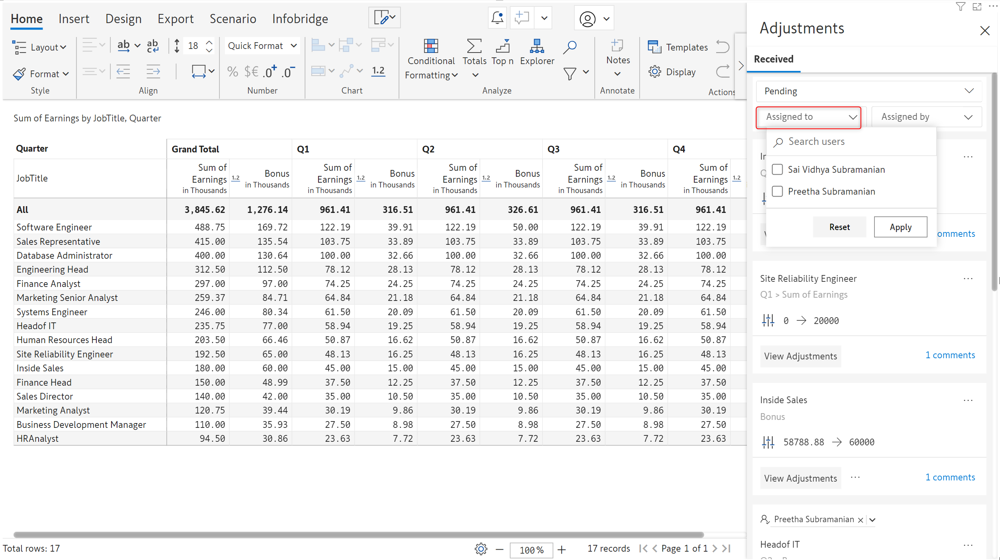

# Collaborative adjustments

To maintain data integrity, you will not be allowed to edit measures that you have imported from a bridge, even if they are data input measures. However, in business reporting, you may encounter situations where you need to adjust/correct the source data.

The adjustments workflow in Infobridge provides a mechanism for requesting and recommending updates to the source visual. To demonstrate the adjustment workflow, let’s consider a compensation report. The _Overall Compensation_ page contains data from the _Role-based compensation_ and _Dept Compensation_ visuals. At an organizational level, if we need to update the bonus component (data input measure) for a particular department or role, we can leverage the new Infobridge adjustments workflow. &#x20;

**STEP 1**: To request an adjustment, you can either double-click the cell or click on the adjustment icon that appears when you click a cell.  In the Request Adjustments popup, you can specify the new value in the **Requested Value** textbox. You can optionally add a comment and tag associates from the **Assign a user** dropdown.

<figure><figcaption></figcaption></figure>

**STEP 2:** Click Submit. The icon indicates that an adjustment has been requested for a particular cell.

<figure><figcaption>
Adjustment requested in the target visual
</figcaption></figure>

**STEP 3:** When you assign an adjustment request to a particular associate, they will receive an email that provides details about the adjustment. The email will contain links to the source and target visuals.

<figure><figcaption>
Adjustment notification email
</figcaption></figure>

When you open the source visual, you’ll notice a notification message indicating pending adjustments.

<figure><figcaption>
Pending adjustments notification
</figcaption></figure>

**STEP 4:** In the source visual, you’ll notice a bell icon that notifies the owner(s) that an adjustment has been requested. Click on the bell icon to open the Adjustments side pane. When you click on the comments link, you will be able to see the requested adjustment value, the assignee and any other comments associated with the request.

<figure><figcaption>
Viewing adjustment requests and comments
</figcaption></figure>

**STEP 5:** Before committing to an adjustment, Inforiver allows you to compare and gauge the impact of the adjustment by displaying the adjustment as an additional measure in your source report or by running simulations in a scenario.

&#x20;**Display the adjustment as a measure:** Click the **View Adjustments** button to display the adjustment as a measure in the source visual. The adjustment measure header will be italicized with “(Adj)” appended to it. The requested adjustment will be highlighted in yellow. If an update has been requested for the grand total, all the contributing cells will be highlighted as well.

<figure><figcaption>
View adjustment as measure
</figcaption></figure>


Use the column gripper for the adjustment measure and select **Remove Adjustment Measure** to close the adjustment field.


**Display the adjustment as a scenario:** You can even run simulations before making a decision about applying an adjustment. To assess the impact of an adjustment in the bigger picture, click the **View in Scenario** option. Inforiver will automatically create a scenario that contains the recommended adjustment. You can run simulations on your data and use the **Copy to Base** option to commit your updates.&#x20;

<figure><figcaption>
View in scenario option
</figcaption></figure>

 

<figure><figcaption>
Simulations for adjustments
</figcaption></figure>

**STEP 6:** After you apply the adjustment, click Submit for review.

<figure><figcaption>
Submit adjustment from source visual
</figcaption></figure>

**STEP 7:** In the target visual, the red time icon would have changed color to yellow - indicating that the adjustment has been submitted for review. From the adjustments pane, you can choose to resolve the thread if the adjusted value is acceptable or re-open the thread if the adjusted value needs to be revised.

<figure><figcaption>
Resolve or reopen thread
</figcaption></figure>

### Filters in the Adjustments pane

You can use the dropdown menus in the adjustments side pane to filter adjustments based on the status, assignee, or person who assigned the adjustment request.

<figure><figcaption>
Filter adjustments based on the status
</figcaption></figure>

 

<figure><figcaption>
Filter adjustments based on assignee
</figcaption></figure>

