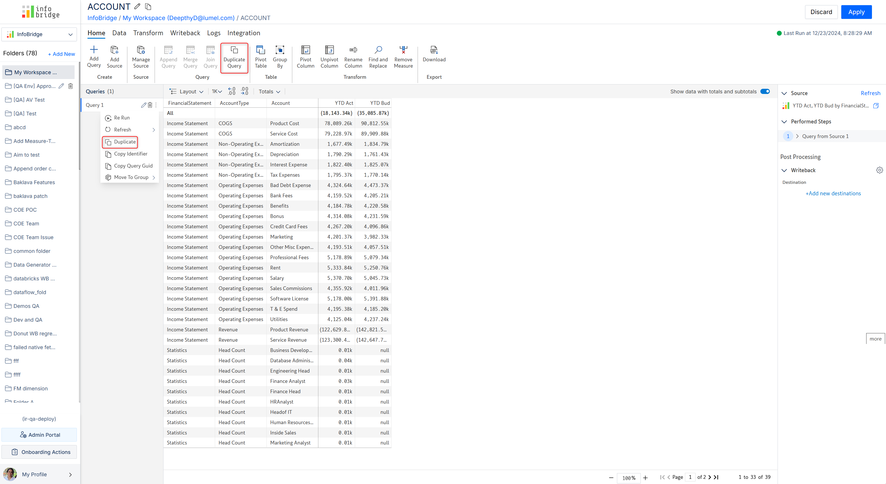

# Query transformations

Infobridge provides a wide range of transformations to pivot, aggregate, join, merge, and append queries. Let's dive in!&#x20;

<figure><figcaption>
Query transformations
</figcaption></figure>

### 1. Duplicating queries

You can create a copy or take a backup of your query before applying transformations. You can either hover over the query name and select **Duplicate** from the context menu or you can click the **Duplicate Query** option from the Home ribbon.

<figure><figcaption>
Duplicating queries
</figcaption></figure>

### 2. Pivoting dimensions and measures

Use the **Pivot Table** option to easily re-structure your dimensions and measures and select the aggregation for totals and subtotals.

<figure><figcaption>
Pivot table interface
</figcaption></figure>

#### 2.1. Converting rows into columns

You can pivot row and column dimensions by dragging them into the respective buckets. Let's look at how to convert the Region column dimension into a row dimension.

<figure><figcaption>
Region column dimension
</figcaption></figure>

Drag the Region dimension from the Columns bucket to the Rows bucket to pivot the columns into rows.

<figure><figcaption>
Column to row conversion
</figcaption></figure>

#### 2.2. Aggregating numeric measures

When you enable totals and subtotals, you can also specify the type of aggregation to apply: sum/average/minimum/maximum.

<figure><figcaption>
Aggregation type
</figcaption></figure>

In this query, we've applied summation for the Profit measure and average for the Sales measure.

<figure><figcaption>
Aggregated measures
</figcaption></figure>

#### 2.3. Converting text dimensions into measures

You can convert text dimensions into measures and vice versa. Drag the dimension into the Values bucket to convert it into a measure.

