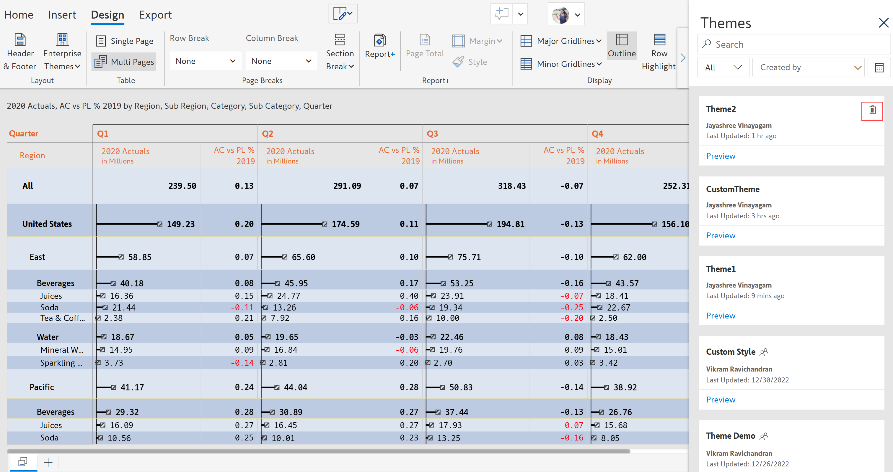
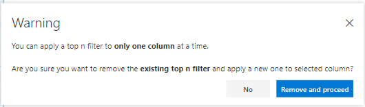

# Basic interactions

## Top n

In this document, let us get to know how the **Top n** feature works in Inforiver. **Top n** deals with classifying the Top and Bottom categories based on the measures.&#x20;

**Top n** can be applied to only **one column/measure** at a time. Though, you can add multiple Top or Bottom n conditions on the same measure.

Let us see about the **Top n** functionality in detail below.

Consider the example of displaying the Top 5 City Sales Value (2016 Sales) in each Subcategory.

* Select the **Sales** (2016 Sales) column/measure.
* Click **Home** from the toolbar and select **Top n** from the **Analyze** section.

<figure><figcaption>
Top n 
</figcaption></figure>

*   In the **Top n** dialog box that appears, input the following fields:

    * Top/Bottom/Both: Both displays Top and Bottom values **(Top)**
    * Number of items **(5)**
    * Condition-based on Value or Percentage **(Value)**
    * Field to which condition to be applied **(Sub-Category)**

    <figure><figcaption>
Choose from Top, Bottom or Both
</figcaption></figure>

* To display the remaining categories as **Others**, check the respective checkbox. Inorder to customize the name “**Others**”, click on the **Pen** icon.

<figure><figcaption>
Aggregate the Rest as Others
</figcaption></figure>

* Check “**Suffix Others with category name**”, to display the category label along with Others.

<figure><figcaption>
Show the category label as suffix
</figcaption></figure>

* Click **Apply**, the result is shown below.

<figure><figcaption>
Top 5 Subcategory based on the Value
</figcaption></figure>

* To apply another **Top n** condition, follow the same procedure as illustrated above.
* In the **Top n** dialog box, click on **Add rule**.
* Select the fields as shown in the below image:

<figure><figcaption>
Add Rule
</figcaption></figure>

<figure><figcaption>
Showing result with added rule
</figcaption></figure>

* To delete a **Top n** condition, click on the respective **Delete** icon.

<figure><figcaption>
Delete
</figcaption></figure>

* To clear all the **Top n** conditions, click on **Reset All** Button.

<figure><figcaption>
Reset all
</figcaption></figure>

* The following warning message gets displayed when you try to apply **Top n** on another column/measure simultaneously.

<figure><figcaption>
Warning Message
</figcaption></figure>

