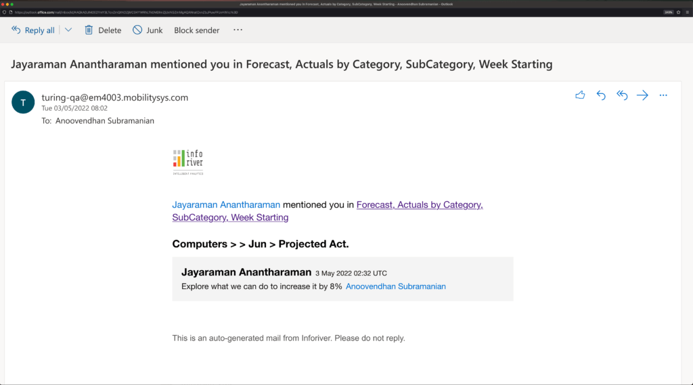
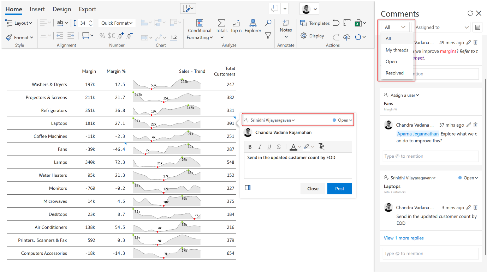

# Notes, annotations and comments

****

Power BI’s does provide a native, true, out-of-the-box commenting capability. It supports report-level and visual-level commenting including @mentions and collaborative conversations. However, data level commenting is not possible.

Data-level commentary is very common in real-life scenarios. If you are looking to implement true data-level commenting, you need to consider the following characteristics:

1. Notes vs. Annotations vs. Comments
2. Data-level comments
3. Footnotes
4. Replying to comments
5. Triggering email notifications
6. Sending commentary digests
7. Word wrap for long comments
8. Task assignment & tracking through comments
9. Commentary audit log
10. Exporting & writing back comments

Without holistically looking at the above, choosing a solution based on a limited set of considerations would hinder flexibility and ROI.

\* \* \*

1. Notes vs Annotations vs Comments

The first consideration is to evaluate what you need – not just today, but for the long run, and evaluate whether the solution can support it. In our opinion, when report users say they need the ability to ‘comment’, they can mean one of the three types – notes, annotations or comments.

**Notes**: Notes are static text added to a data point or visual to give some descriptive details. Observe that notes do not have options for reply and do not capture time stamps.

**Annotations**: Annotations provide context to enhance your storytelling experience with textual call outs and drive attention to important areas. It can be used to highlight a part of a text and add comments/notes on top of it. Annotations are very similar to notes but they are visibly displayed by default.

Annotations in the below small-multiples chart facilitate compelling data stories.

**Comments**: Comments allow multiple users to converse over a common thread through replies and mentions. User details and timestamps are accessible, and instant notifications are sent on mentions and replies.

Ideally, look for a solution that can support allwhat three capabilities. Do not go by how the vendors call it, as these terms are often used interchangeably.

2\. Data-level comments

A key requirement for a commenting solution is to deliver the ability to comment at the data-level – which could be at the cell, row, column, row-header or a column-header level.

An ancillary requirement for such data-level comments is that they must be filterable based on the context. In other words, if the filter or context is modified, they should disappear/re-appear accordingly. Support for rich text styling and formatting options also enhances the user experience.

Here is an example of cell, row, measure, and category-level comments.

3\. Footnotes

Footnotes are an integral part of financial statements and provide supplementary information such as the accounting method used or explanation of important financial results. This is a key requirement for financial reporting use cases.

4\. Replying to comments

Users should be able to use @mentions to grab the attention of another user and have threaded conversations at a cell, row or column-level.

5\. Triggering email notifications

The ‘@user’ mention in the comment or task assignment should automatically send an email notification to the user, with a link to the report so that the user can respond to this comment and/or update the report.

6\. Sending commentary digests

Users should be able to receive periodic commentary digests to quickly analyze the conversations, tasks and exceptions. Scheduling these digests should be out-of-the-box with flexible frequency options and must not require the involvement of IT.

7\. Word-wrap for long comments

Long-text comments are common in reports, and it should be possible to wrap them out-of-the-box.

8\. Task assignment & tracking through comments

Use commentary capabilities to assign tasks and track their status right within your Power BI report. Tracking status for comment assignments, using terms such as ‘resolved’, ‘open’, etc. is helpful when you are interacting with multiple stakeholders.

Users who only consume the report in reading view and do not have edit rights should also be able to see the tasks assigned to them.

9\. Commentary audit log

Tracking changes in the report using an interactive, filterable, and comment-enabled audit log that captures date, time, user details, task status and more is essential for ​data governance. You would know who commented on a specific data point, and when.

10\. Comments export & writeback

It should be possible to easily export and writeback notes and comments to Excel and databases. It is not helpful if the notes and comments cannot be persisted outside your report.

\*\*\*

Inforiver delivers out-of-the-box and user-friendly notes, annotations and comments to Power BI users using a no-code user experience. Key highlights of the commentary solution delivered by Inforiver are summarized below:

Inforiver Charts, Matrix and Enterprise are available in [Microsoft Appsource](https://appsource.microsoft.com/en-us/marketplace/apps?search=inforiver). Get started today!
