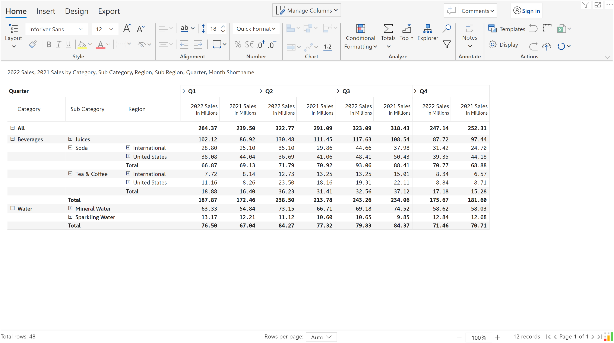
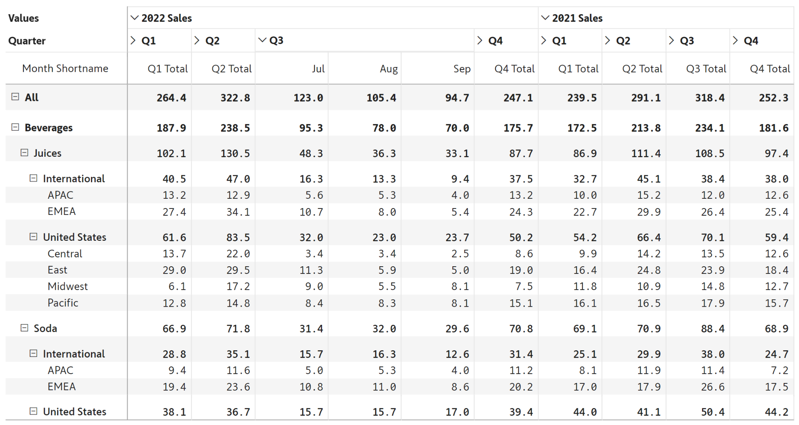

# Layout options

Inforiver offers two major types of layout options - **Table Layouts** and **Measure Layouts**. Each of these comes with its own set of variations, and can be used together in a single layout.&#x20;

The Table Layouts lets you determine how categories in rows need to be displayed.&#x20;

The Measure Layouts give you the flexibility specifically with respect to how measures are displayed.&#x20;

## 1. Table Layouts

### a. Hierarchy

By default, Inforiver delivers data in a hierarchical, expand/collapse-enabled format.

<figure><figcaption></figcaption></figure>

&#x20;When you select the Layout item from the menu, you will notice the selection defaulted to 'Hierarchy'.

<figure><figcaption></figcaption></figure>

Changing this selection helps you modify the report layouts to the other types listed below.

### b. Outline

The outline layout shows the row categories in individual columns.&#x20;

By default, the **ruler** is also enabled for this layout. The ruler is used to easily resize rows and columns as you do in spreadsheets, and to select a specific column. You can hide the ruler by de-selecting the ruler icon on the toolbar.

<figure><figcaption></figcaption></figure>

### c. Table

The table option shows categories in a tabular format, without any expand-collapse hierarchies for rows. Note that hierarchy expand/collapse option is available for columns (Quarter-Month).&#x20;

<figure><figcaption></figcaption></figure>

### d. Stepped

The stepped layout is similar to outline layout in that each category is listed in a column. The difference is in the availability of a separate Total row for each branch of the hierarchy.

<figure><figcaption></figcaption></figure>

### e. Drilldown

The drilldown layout lets you explore one branch at a time in the hierarchy. This is also an ideal option when you have a huge volume of rows.

<figure><figcaption></figcaption></figure>

## 2. Measure Layouts

The default Measure Layout is used in all the Table Layouts listed above.&#x20;

When you change this to 'In rows', the measures are displayed as below.&#x20;

<figure><figcaption></figcaption></figure>

When you change this to 'In columns', the measures are displayed above the column hierarchy categories.&#x20;

<figure><figcaption></figcaption></figure>

