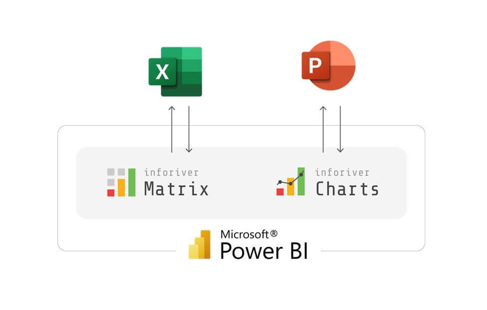
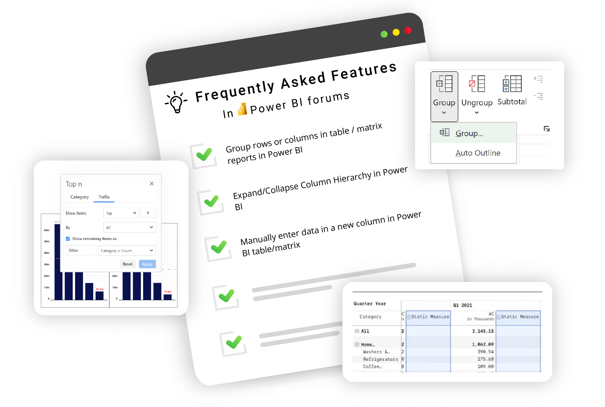
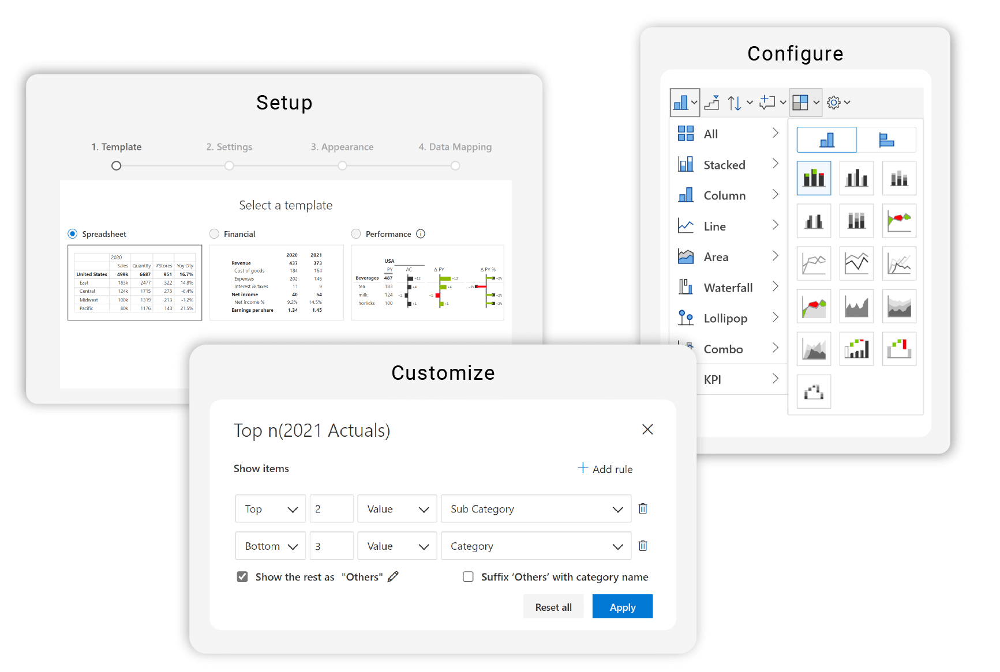
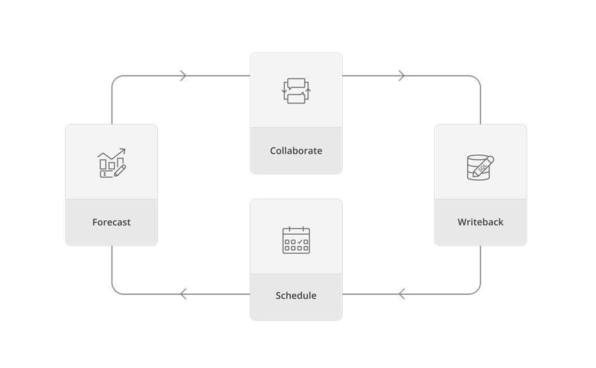
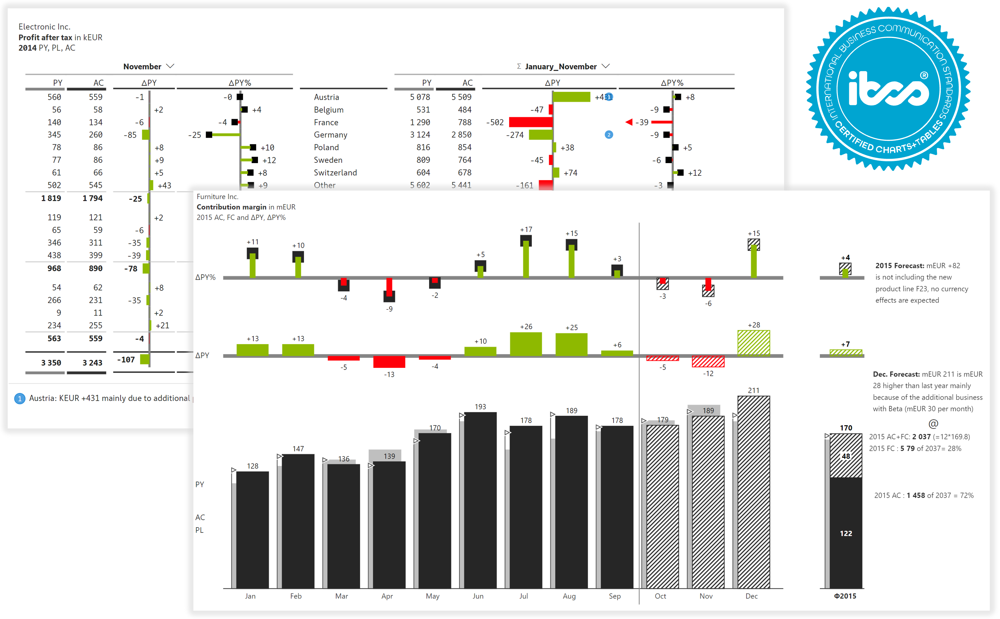

# Why Inforiver

Inforiver offers the **fastest** way to build Power BI reports, using a comprehensive set of **features** enabled by cutting edge **user experience**.

## 5 reasons to get started with Inforiver

### **1. Your productivity suite for data**

The Inforiver matrix & charts together constitute a **productivity suite for your data**. Just as products like Excel and PowerPoint help you stay highly productive when dealing with offline data, Inforiver Matrix and Charts get you to become highly productive while working with data right inside Microsoft Power BI. These capabilities help you build reports in a matter of minutes, instead of hours or days.&#x20;

<figure><figcaption></figcaption></figure>

### **2. Frequently asked features**

Get access to dozens of highly voted features in Power BI idea place and community forums. Inforiver delivers capabilities available in other BI & visualization software (such as Tableau, Spotfire, Qlik, Cognos and SAP BusinessObjects) but not in Power BI. This helps organizations consolidate their assets in Power BI.

<figure><figcaption></figcaption></figure>

### **3. Rich user experience**

With Inforiver, report creators and consumers can perform a wide variety of user actions unlike what they have experienced in traditional BI & visualization software. Just utilize the toolbar and shortcut keys for a variety of configuration and customization options, instead of having to navigate through a complex property sheet or lines and lines of code.

<figure><figcaption></figcaption></figure>

### **4. Accelerate your digital transformation**

Automate your Excel based processes by consolidating legacy BI reports and dashboards into Power BI, and eliminating data-silos with governed datasets. With capabilities such as formula engine & calculations, [runtime manual data entry](https://inforiver.com/blog/writeback/5-types-manual-data-entry-powerbi-table-matrix/), [forecasting](https://inforiver.com/blog/general/5-ways-to-run-dynamic-what-if-simulations-in-power-bi/), [writeback](https://inforiver.com/writeback-powerbi/), audit trail, [commenting and collaboration](https://inforiver.com/collaborate-powerbi/), Inforiver ensures success of your change management & digital transformation efforts.

<figure><figcaption></figcaption></figure>

### **5. Best practices and standards**

Inforiver adopts a business-responsive design, that can help users deliver [IBCS-compliant](https://inforiver.com/ibcs-reports-powerbi/) business, management, variance, and performance reports in a single click. Inforiver offers a wide variety of [charts](https://inforiver.com/ibcs-reports-powerbi/ibcs-charts-powerbi/) and [table](https://inforiver.com/ibcs-reports-powerbi/ibcs-tables-powerbi/) templates, advanced[ small multiples](https://inforiver.com/advanced-small-multiples-powerbi/), data-level comments, top N + others, pixel-perfect Export to PDF and many more.

Inforiver is certified by International Business Communication Standards (IBCS)

<figure><figcaption></figcaption></figure>
