# Inforiver Enterprise V 3.4

We have added a new custom visual to simplify data referencing for semantic model dropdowns: [**Inforiver add-on visuals/Lookup visuals**](inforiver-enterprise-v-3.4.md#id-13.-inforiver-add-on-visuals)

### **Other additions and enhancements:**

1. **Infobridge**

* [Option to select required measures and scenarios to import into the bridge.](inforiver-enterprise-v-3.4.md#id-1.1.-regulate-data-exposed-in-a-bridge)
* [Text measure support in bridge](inforiver-enterprise-v-3.4.md#id-1.2.-text-measure-support).
* ['Person' measure support in bridge](inforiver-enterprise-v-3.4.md#id-1.3.-person-measure-support).
* [Scheduled refreshes for native measures in the bridge.](inforiver-enterprise-v-3.4.md#id-1.4.-scheduled-refresh-for-native-measures)
* [Aggregate and concatenate text fields in bridge.](inforiver-enterprise-v-3.4.md#id-1.5.-aggregate-and-concatenate-text-fields)
* [Real-time help suggestions in the formula editor](inforiver-enterprise-v-3.4.md#id-1.6.-infobridge-intellisense).
* [Grouping the source queries to organize them within the bridge](inforiver-enterprise-v-3.4.md#id-1.7.-logical-query-groups).
* [Conditional Column feature to create dimensions based on specific conditions.](inforiver-enterprise-v-3.4.md#id-1.8.-conditional-columns)
* [Infobridge lineage on the visual side, to easily recognize and manage rows and measures sourced from multiple bridges.](inforiver-enterprise-v-3.4.md#id-1.9.-infobridge-lineage)
* [Support for blank forecast fields in the bridge.](inforiver-enterprise-v-3.4.md#id-1.10.-capture-blank-forecasts-in-infobridge)

2. **Writeback**&#x20;

* [Faster Writebacks](inforiver-enterprise-v-3.4.md#id-2.2.-refactored-writeback-payload)
* ['Last Updated at' filter](inforiver-enterprise-v-3.4.md#id-2.1.-last-updated-at-custom-filter)

3. **Data Input**

* [Pivot row option to create aggregate views/tables within Inforiver visual.](inforiver-enterprise-v-3.4.md#id-3.1.-pivot-row)
* [Data input - default value enhancements.](inforiver-enterprise-v-3.4.md#id-3.2.-data-input-default-value-enhancements)
* [Collaborative adjustments for data input and forecast fields within Inforiver visual.](inforiver-enterprise-v-3.4.md#id-3.3.-collaborative-adjustments-for-data-input-and-forecast-fields)
* [Localization options based on Power BI language settings for single-select option list.](inforiver-enterprise-v-3.4.md#id-3.4.-localization-settings-for-single-select-options)
* [Syncing custom-inserted rows between duplicate visuals.](inforiver-enterprise-v-3.4.md#id-3.5.-syncing-custom-inserted-rows-between-duplicate-visuals)
* [Row edit user validation - adding global permissions to specific users.](inforiver-enterprise-v-3.4.md#id-3.6.-row-edit-user-validation)

4. **Forecasts**

* [Configure multiple forecasts simultaneously.](inforiver-enterprise-v-3.4.md#id-4.1.-configure-multiple-forecasts-simultaneously)
* [Formulas for calculated open and closed period forecasts.](inforiver-enterprise-v-3.4.md#id-4.2.-formulas-for-calculated-open-and-closed-forecasts)
* [Forecast time slicer.](inforiver-enterprise-v-3.4.md#id-4.3.-forecast-time-slicer)
* [Hide closed forecasts and styling the forecast columns. ](inforiver-enterprise-v-3.4.md#id-4.4.-hide-closed-forecasts-and-styling-forecasts)

5. **Scenarios**&#x20;

* [All data input types supported in scenarios.](inforiver-enterprise-v-3.4.md#id-5.1.-all-data-input-types-supported-in-scenarios)
* [Create scenarios for a specific time frame.](inforiver-enterprise-v-3.4.md#id-5.2.-create-scenarios-for-a-specific-time-frame)

6. **Visual formulas**

* [Formula menu - with formulas organized based on function](inforiver-enterprise-v-3.4.md#id-6.1.-formula-menu).
* [Replicate formulas across visual columns.](inforiver-enterprise-v-3.4.md#id-6.2.-replicate-formulas-across-visual-columns)
* [Variance for simulations - Quick formula.](inforiver-enterprise-v-3.4.md#id-6.3.-variance-for-simulations)
* [On change formula – approval workflows](inforiver-enterprise-v-3.4.md#id-6.4.-on-change-formula-approval-workflows).
* [LOOKUP formula.](inforiver-enterprise-v-3.4.md#id-6.5.-lookup-formula)
* [Support for cell references in calculated and template rows.](inforiver-enterprise-v-3.4.md#id-6.6.-support-for-cell-references-in-calculated-and-template-rows)

7. **Goal Seek**

* [Reference forecasts in goal seek.](inforiver-enterprise-v-3.4.md#id-7.1.-reference-forecasts-in-goal-seek)
* [Variables with goal seek](inforiver-enterprise-v-3.4.md#id-7.2.-variables-with-goal-seek)&#x20;

8. **Scheduler**&#x20;

* [Performance mode – beta version.](inforiver-enterprise-v-3.4.md#id-8.5.-performance-mode-beta-version)
* [Dynamic subscriptions for Teams, SharePoint, and Google Drive destinations.](inforiver-enterprise-v-3.4.md#id-8.1.-report-compression)
* [PDF export compression](inforiver-enterprise-v-3.4.md#id-8.1.-report-compression).
* [Extract report as PPT.](inforiver-enterprise-v-3.4.md#id-8.3.-extract-report-as-ppt)
* [Continuous numbering for merged PDFs.](inforiver-enterprise-v-3.4.md#id-8.4.-continuous-numbering-for-merged-pdfs)

9. **Export**

* [Retain chip style in PDF exports ](inforiver-enterprise-v-3.4.md#id-9.1.-retain-chip-style-in-pdf-exports)

10. **Admin console**&#x20;

* [Writeback destination details in console.](inforiver-enterprise-v-3.4.md#id-10.1.-writeback-destination-details)
* [Access refresh tokens duration. ](inforiver-enterprise-v-3.4.md#id-10.2.-access-refresh-tokens)

11. **Audit**&#x20;

* [Audit entries for report creation and detach ](inforiver-enterprise-v-3.4.md#id-11.1.-audit-entries-for-report-creation-and-detach)

12. **Other Enhancements**&#x20;

* [Scheduled back-up for measures.](inforiver-enterprise-v-3.4.md#id-12.7.-scheduled-back-up-for-measures)
* [Login workflow with code verification.](inforiver-enterprise-v-3.4.md#id-12.2.-login-workflow)
* [File validations.](inforiver-enterprise-v-3.4.md#id-12.3.-file-validations)
* [Variables.](inforiver-enterprise-v-3.4.md#id-12.4.-variables)
* [Hide dimensions in MOR layout.](inforiver-enterprise-v-3.4.md#id-12.5.-hide-dimensions-in-mor-layout)
* [Scaling measure header in uniform number format.](inforiver-enterprise-v-3.4.md#id-12.6.-scaling-measure-header-in-uniform-number-format)
* [Date-based interface to show measures.](inforiver-enterprise-v-3.4.md#id-12.8.-date-based-interface-to-show-measures)
* [Hatched style for conditional formatting.](inforiver-enterprise-v-3.4.md#id-12.1.-hatched-style-for-conditional-formatting)

## 1. **Infobridge**

### **1.1. Regulate data exposed in a bridge**

Infobridge gives you more control over data that has to be imported to the bridge. You can now select the required measures and scenarios while adding sources to the bridge.

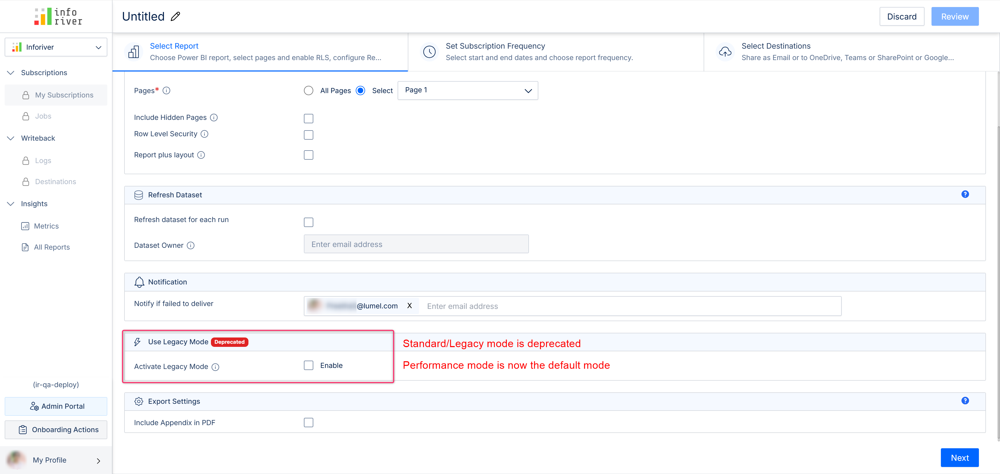

You have the flexibility to add or remove measures and scenarios from the bridge at any point.

### **1.2. Text measure support**

Infobridge can now support text measures, which means you can live stream text data between Inforiver visuals. Consider the example below, where the text measure containing the email IDs is selected to be imported into a bridge and then consumed in another visual as inserted measures.

**Importing text measure to a bridge:**

<figure><figcaption></figcaption></figure>

**Adding text measure from the bridge:**

<figure>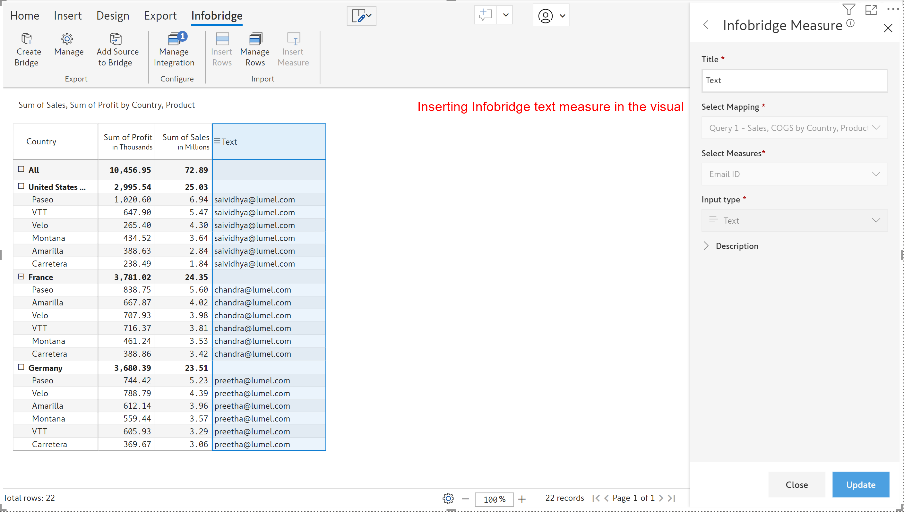<figcaption></figcaption></figure>

### **1.3. Person measure support**

You can also integrate and sync the ‘Person’ measure between Inforiver visuals. Infobridge can now support ‘Person’ column import from the visual and you can add the same from the bridge to another visual.

Integrating ‘Person’ measure between the visuals:

<figure><figcaption></figcaption></figure>

 

<figure><figcaption></figcaption></figure>

### **1.4. Scheduled refresh for native measures**

Infobridge automatically refreshes whenever there are changes in the data input fields. Native measures must be manually refreshed. In the latest version, you may set a refresh schedule for native measures, ensuring your data is up-to-date and eliminating manual intervention.

You can view the refresh jobs and milestones from the history tab.

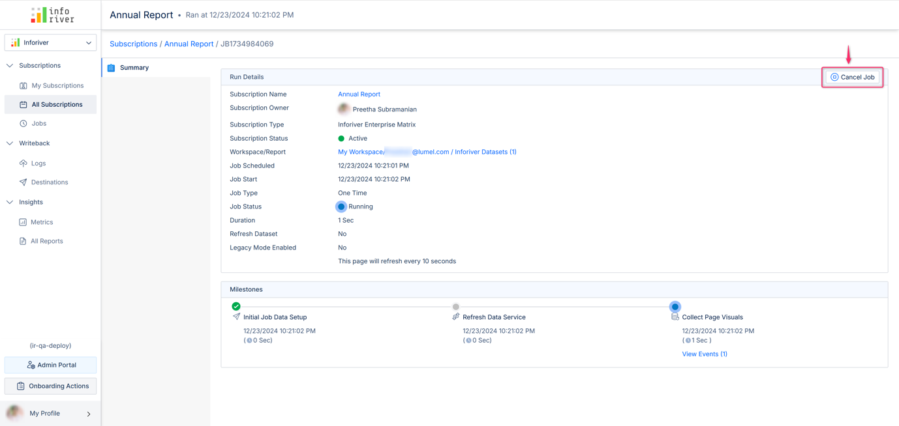

### **1.5. Aggregate and concatenate text fields**

Use the **Concat** option to aggregate strings from multiple rows into a single string, with a delimiter of your choice. For instance, you can concatenate all the accounts under a particular segment and analyze data at a higher granularity, without losing any information.

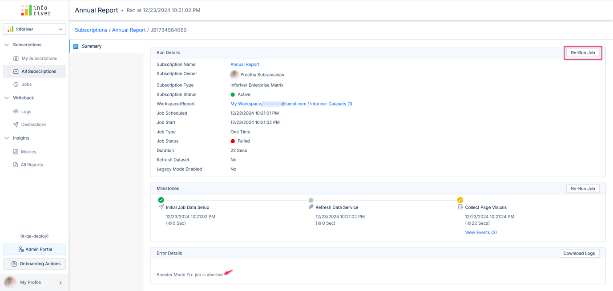

Individual accounts are rolled up at Account type level, providing a concise summary of the dataset.

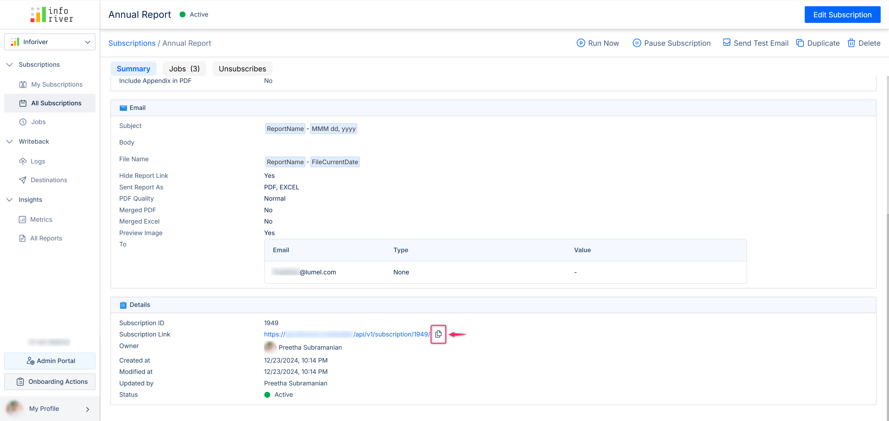

The aggregated rows can then be consumed in other destination visuals.

### **1.6. Infobridge IntelliSense**

Infobridge now ships with IntelliSense, which provides real-time help suggestions in the formula editor while adding calculated measures in the bridge.

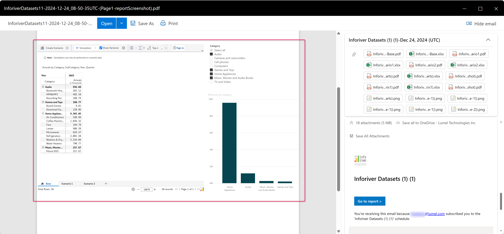

### **1.7. Logical query groups**

You can now group related data within Infobridge – allowing you to efficiently manage and govern your data.

### **1.8. Conditional columns**

In the latest version, you can leverage the Conditional Column feature to effortlessly create multi-conditional dimensions instead of writing cumbersome IF/ELSE or CASE statements, improving readability and maintenance.

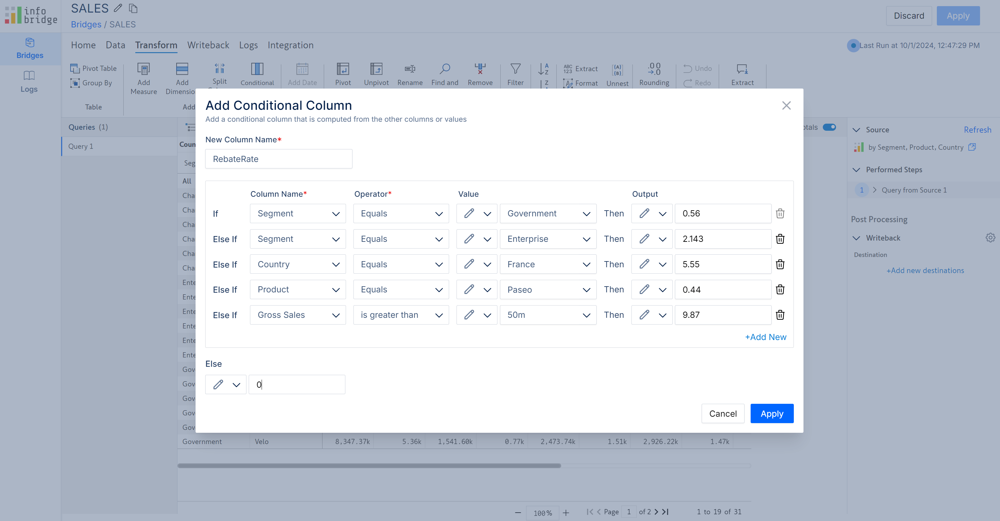

### **1.9. Infobridge lineage**

We have added a Lineage feature for rows and measures sourced from bridges. If your target visual has integrated data from a large number of source visuals, you can track and manage them quickly by clicking on the 'link' (lineage) icon beside them.

<figure>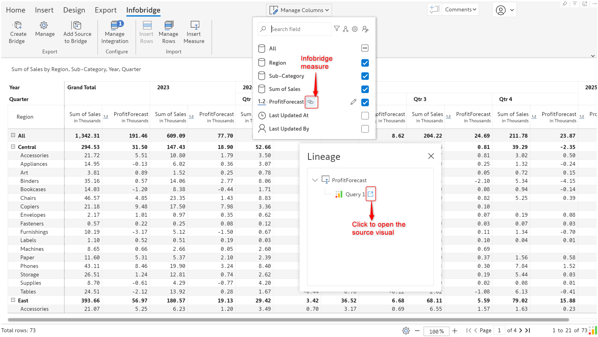<figcaption>
Lineage
</figcaption></figure>

### **1.10. Capture blank forecasts in Infobridge**

Inforiver forecasts can contain blank fields when you extend forecasts or when you choose to have a blank data input placeholder to manually enter values. Infobridge can now recognize and retain blank forecast fields.

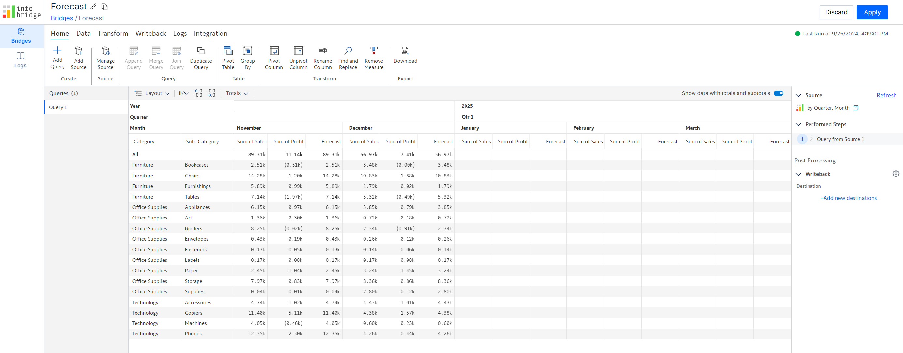

## **2. Writeback**

### **2.1. Last updated at - custom filter**

In this release, you will be able to writeback data based on the last updated date. For example, writeback only the data that was updated after, before, or on a specific date. Choose the ‘Last Updated At’ option in the custom filter type:

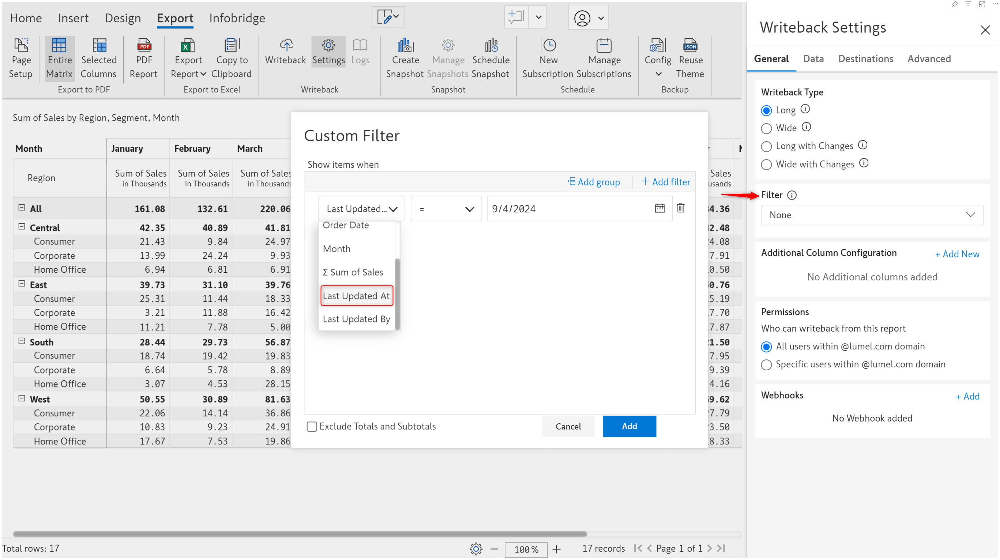

### **2.2. Refactored writeback payload**

We have now refactored and optimized writeback payloads for faster writebacks.

## **3. Data input**

### **3.1. Pivot row**

The new Pivot option allows you to create aggregated tables or views within the Inforiver visual, with different combinations of row dimensions. The Pivot Explorer, when enabled, retains all your pivot views so you can easily switch between them for analysis.

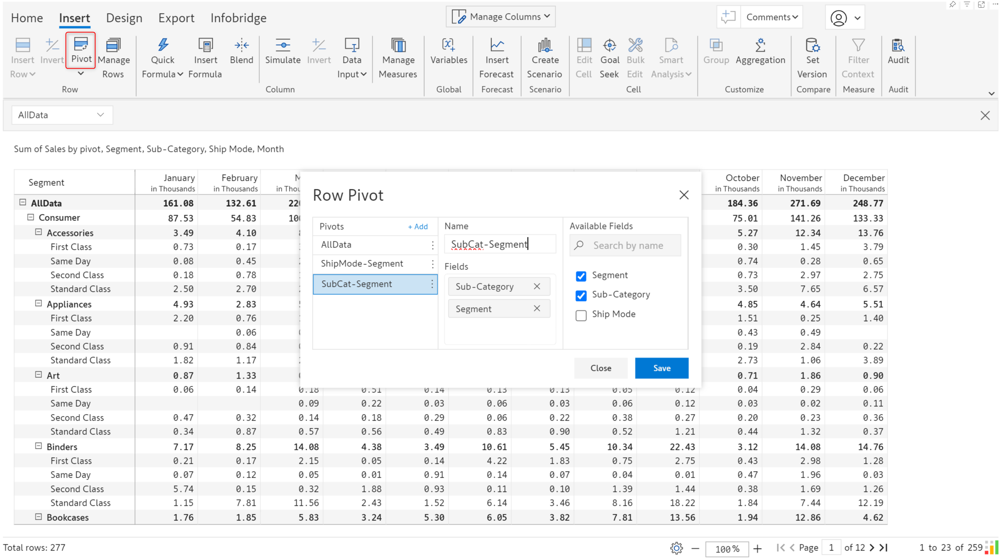

Within each pivot view, you can create data inputs, forecasts, formulas, snapshots, and scenarios corresponding to each combination of dimensions. The pivot view/table you create also lets you enter numbers at the higher level and allocate proportionally to all the relevant sub-levels.

Notice how the single select and formula values change based on the pivot selection.

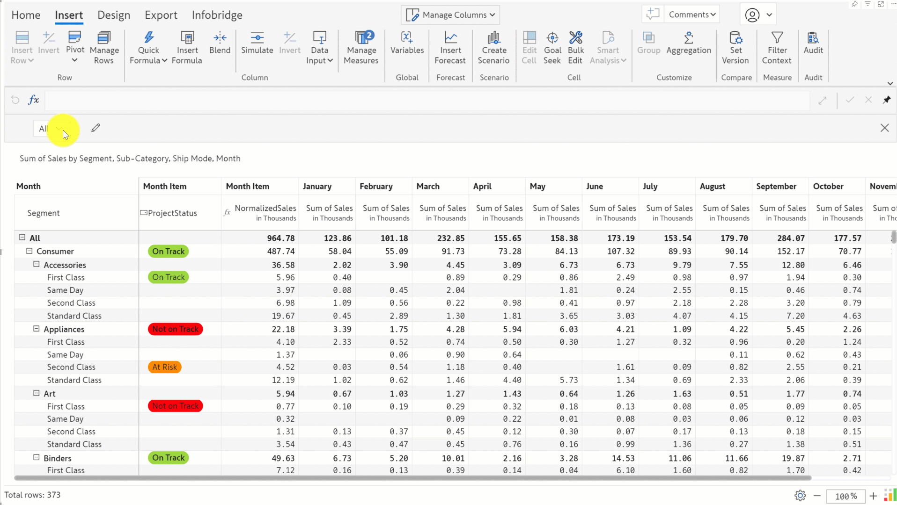

Please note that you cannot insert rows, writeback, or use Report+ in pivot mode.

### **3.2. Data input default value enhancements**

* **Default options for single select**

When you create a single-select data input field, you can specify a default choice to avoid blanks in your reports. In earlier versions, you would need to manually enter the default option. With this release, you’ll be able to select the relevant default value from the Value dropdown.

In this report, we’ve chosen the ‘Approval Status’ preset. Notice how the Value dropdown for default values contains options relevant to approval status. Even if you specify custom options with the Lists, Inforiver will populate the manually entered options in the default value dropdown.

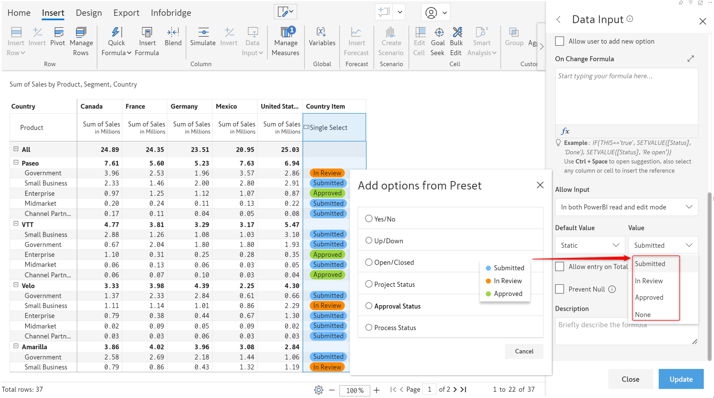

If you choose to source default values from a dimension, you will need to enable the **Allow user to add new option** checkbox

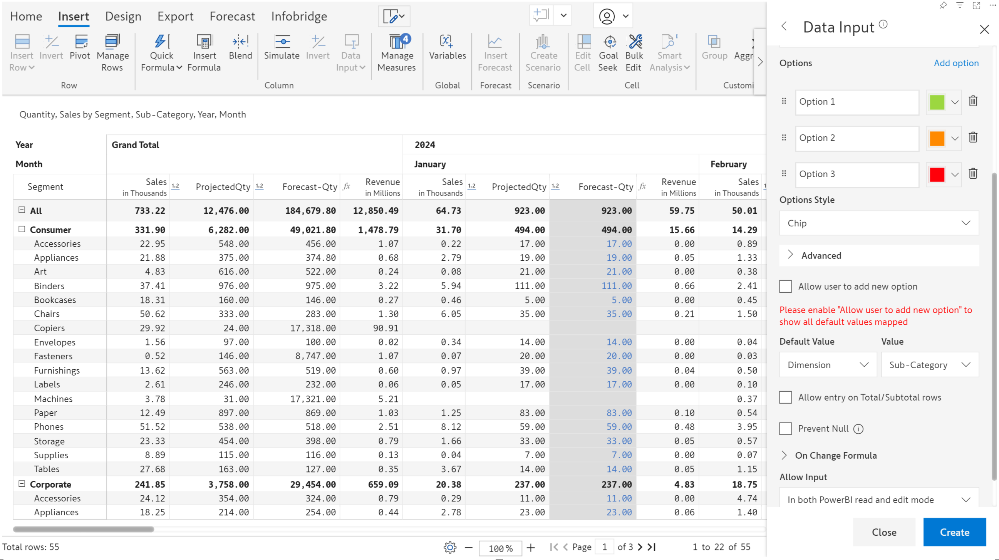

* **Data validations for default values**

With Inforiver, you can ensure data quality for data input fields by setting up data validations. This feature has been extended to default values as well. For numeric, date, and text data inputs, if you enter a default value that does not conform to the data validations, Inforiver will throw a warning message. For static default values, you cannot create the data input field if the default value does not satisfy the data validation.

Note: When you source default values from dimensions/measures, if the value does not satisfy the validation rule, the default value will not be applied and the cell will remain blank.

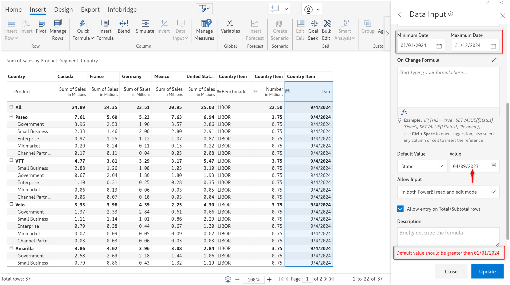

For single select, we can remove an option by clicking the X mark next to it.

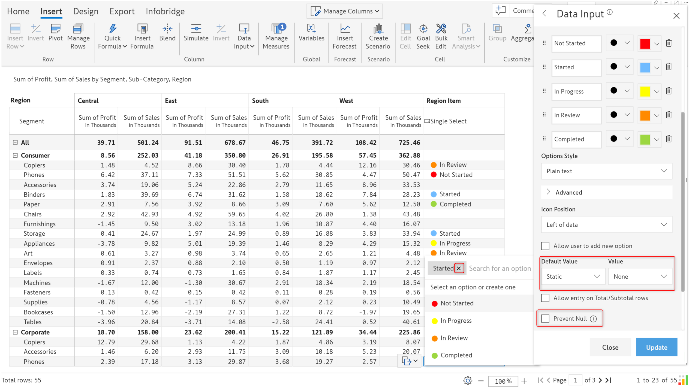

However, if a default value is specified and the Prevent Null checkbox is enabled, you will not be able to use the X icon to delete options – ensuring that the field does not contain any blanks.

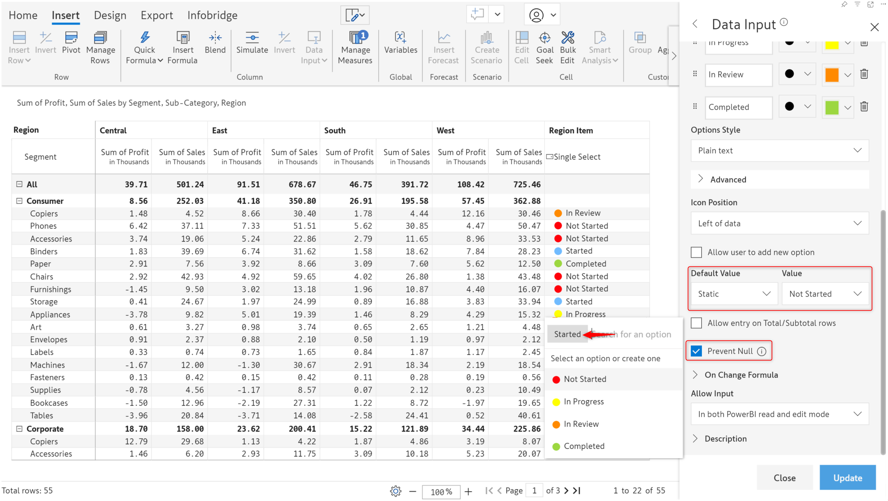

* **Default values and edit access for static rows**

Similar to the default value for data input fields, you can either use static values or values from other rows as default values for data input rows.

We have also added the **Allow Input** option – the report author can regulate manual data input for static rows by selecting the appropriate option from the dropdown.

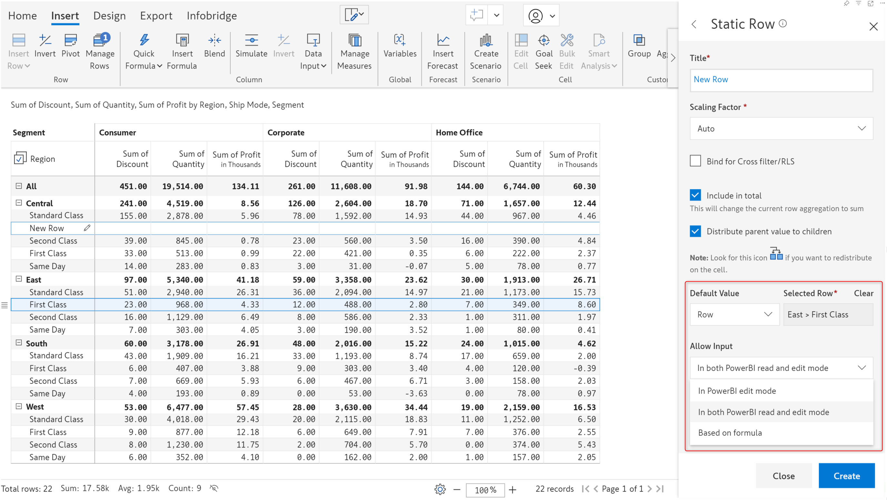

* **Use forecasts as default values**

You can now use Inforiver forecasts as a default value for numeric data input fields.

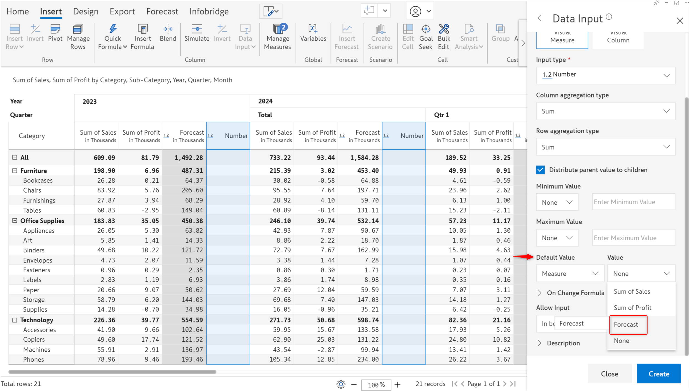

### **3.3. Collaborative adjustments for data input and forecast fields**

Adjustments can now be performed in the same visual, without using Infobridge. A new Enable Adjustments option has been added to Display Settings.

<figure><figcaption>
Enable adjustments
</figcaption></figure>

When multiple users collaborate on a report, the report author can mandate that any value changes should go through an adjustment workflow – requiring explicit approval from the report owner/designated approvers.

The report author needs to configure explicit read/write access for each data input field. The users who only have read permissions will need to go through the approval process to update values.

Data input fields will be in disabled state for users who only have read access. When they double-click a cell, the Request Adjustments window pops up. They can then enter the new value, and optionally assign an approver, and add a justification for the update in the comments section.

<figure><figcaption>
Request adjustments
</figcaption></figure>

A red time icon is displayed against each cell for which an adjustment is requested. Approvers can click on the red icon to view a particular adjustment or click on the bell icon to view all the adjustment requests received.

<figure><figcaption>
Adjustment request received
</figcaption></figure>

* **Evaluating adjustments as a read-only measure**&#x20;

Before committing to an adjustment, Inforiver allows you to display the adjustment as an additional measure in your source report, enabling you to compare and gauge the impact of the adjustment. Click the **View Adjustments** button to display the adjustment measure. Any updates that you make will be highlighted in yellow.&#x20;

<figure><figcaption>
Adjustments as read-only measure
</figcaption></figure>

* **Evaluating adjustments as a scenario**&#x20;

With Inforiver, you can even run simulations before making a decision about applying an adjustment. To assess the impact of an adjustment in the bigger picture, click the **View in Scenario** option. Inforiver will automatically create a scenario that contains the recommended adjustment. You can run simulations on your data and use the **Copy to Base** option to commit your updates.&#x20;

<figure><figcaption>
Adjustments as scenarios
</figcaption></figure>

The approver can click the arrow icon to accept the adjustment request and can then resolve the thread.

<figure><figcaption>
Accept adjustments
</figcaption></figure>

### **3.4. Localization settings for single-select options**

For organizations with a global presence, Inforiver allows you to provide translation support for users in their native language. In the [earlier release](https://inforiver.com/blog/release-notes/reporting-matrix-august-2024-updates/#Localization), we discussed how to set up translation entries for your report data in different languages. We have now expanded this support to include single-select data input column options.

This allows you to configure and display the dropdown options based on the current language settings in Power BI.

Navigate to Display Settings > General > Localization Settings to create necessary translation entries.&#x20;

<figure><figcaption>
Creating translation entries
</figcaption></figure>

After creating the entries, you can use the GETLOCALELABEL function to retrieve the preset options and the column title in the language that the report consumer has selected. In the example below, the locale is set to German, so the options are available in German.

<figure><figcaption></figcaption></figure>

### **3.5. Syncing custom-inserted rows between duplicate visuals**

Report developers often duplicate their reports to replicate the report structure and reuse existing data. Comments, snapshots, scenarios, simulations, forecasts, and all types of data input measures are synced between the duplicate visuals. If the duplication is not intended, Inforiver prompts you to detach the visuals.

In addition to these data types, we now also duplicate and sync the custom-inserted rows. If you have inserted static rows, calculated rows, or a row hierarchy, update them and then duplicate the visual, both visuals will sync the changes simultaneously. You can also detach the visuals.

In the example below, the inserted rows in the visual are also available in its duplicate visual.

<figure><figcaption></figcaption></figure>

Note: Row values will be duplicated and synced only for inserted data input—number type and forecast columns. After duplication and detachment, values in the native data measures and inserted formula measures will be blank.

### **3.6. Row edit user validation - global permissions**

Inforiver lets you set row-level edit permissions for the rows in the data input and forecast columns. When you set this, only the designated users will be able to edit their allowed rows in a report. Other users are restricted from editing such rows and these rows are shown as greyed-out hatched cells.

Consider this report that has data input and forecast columns. Navigate to Insert > Manage Rows > Row Settings > Row Edit User Validation.

Here, you can specify the workspace and the semantic model where you can select the list of users for each category/sub-category by specifying the Email ID column. In addition to the category-wise row edit permissions, you can also set global permissions for a few users, who will be able to access all rows.

<figure><figcaption></figcaption></figure>

## **4. Forecasts**

The latest version of Inforiver ships with an advanced, more intuitive forecasting feature that provides greater power and a wider array of configuration options. Forecasts created in earlier versions of Inforiver will be migrated to the new forecasting interface.

### **4.1. Configure multiple forecasts simultaneously**

The new and improved Inforiver forecasting feature allows you to create and configure multiple forecasts in parallel.

<figure><figcaption></figcaption></figure>

### **4.2. Formulas for calculated open and closed forecasts**

You can now fine-tune your forecasts with custom formulas on native, data input and calculated measures. The ability to use conditional statements and Inforiver’s wide range of formulas provides a structured, data-driven method to predict future trends based on your data.

<figure><figcaption></figcaption></figure>

You can change these configurations at any point even after configuring the forecast. Click Re-configure from the Forecast settings.

<figure><figcaption></figcaption></figure>

### **4.3. Forecast time slicer**

With Inforiver, you can create forecasts spanning multiple years. Managing and analyzing large forecasts can be challenging and can involve a lot of back-and-forth scrolling. We’ve added a forecast time slicer in this release that will streamline the forecast management process. You will now be able to select a specific time period to focus on and Inforiver will hide the rest of the forecasts.

<figure><figcaption></figcaption></figure>

### **4.4. Hide closed forecasts and styling forecasts**

In earlier versions, we delivered options to hide closed forecast periods and apply styling to easily identify forecasts. We’ve made these features more accessible, you can apply them directly from the dedicated Forecast toolbar instead of having to switch to the Home/Design ribbon.

<figure><figcaption></figcaption></figure>

## **5. Scenarios**

### **5.1. All data input types supported in scenarios**

You will be able to include all data input types like dropdowns, text fields, or checkboxes in scenarios – enabling you to see the full picture while running simulations on your data. In earlier versions, you would only be able to access numeric data input fields in scenarios. You will also be able to see measures added to the ‘Others’ parameter when we create scenarios.

<figure><figcaption></figcaption></figure>

### **5.2. Create scenarios for a specific time frame**

Throughout the year, financial parameters can vary due to factors such as seasonality, market conditions, and business cycles. With Inforiver, you can run simulations and analyze the impact of fluctuating measures for selected time windows.

When you have a date dimension in your report columns, you will be able to create different scenarios corresponding to targeted time periods. You can select the time frame from the Period Range date picker.

<figure><figcaption></figcaption></figure>

## **6. Visual formulas**

### **6.1. Formula menu**

Inforiver offers a comprehensive collection of formulas designed to cover every type of reporting requirement. We have brought in a formula menu that will simplify access and help you quickly locate the formula you are looking for. Click the _fx_ icon to open the formula menu.

<figure><figcaption></figcaption></figure>

### **6.2. Replicate formulas across visual columns**

Variance analysis or calculating depreciation or interest can involve using the same formula multiple times. An update to the formula would require opening and editing each visual column individually. We have added a **Copy to column** option to streamline this process.

When you click the Copy to column icon, you can select the visual columns across which the formula should be replicated.

<figure><figcaption></figcaption></figure>

### **6.3. Variance for simulations**

After simulating the values in a measure, you would also need to compare the variance between the original and simulated values. You can now use Quick Formulas to instantly calculate the variance for simulated fields.

<figure><figcaption></figcaption></figure>

### **6.4. On change formula – approval workflows**

With Inforiver, you can easily set up custom approval workflows based on your unique business cases.

When a data input or forecast value is updated, you can trigger actions like sending a notification email or setting a value in a related field. This feature comes into the picture when you need to set up an approval workflow for values changed in the report – a report user updates a value -> an approval/notification email is sent to their manager -> the manager can approve or reject the update by selecting the appropriate status from the manager approval dropdown.

Consider this report where a user can update the Tax Rate:

<figure><figcaption></figcaption></figure>

After a user enters/updates a value in the TaxRate data input field, they should manually change the ManagerApproval status to ‘Submitted’. In the ManagerApproval single select, we’ve listed the actions to be performed for each status change in the **On Change Formula** section.

<figure><figcaption></figcaption></figure>

* The **SETVALUE** function can be used to assign a particular value to a related cell. For example when the ManagerApproval status is ‘Approved’, the DirectorApproval status should change to ‘Pending’. Notice how the DirectorApproval status automatically changes based on the manager approval.

<figure><figcaption></figcaption></figure>

* The **SENDMAIL** function will trigger email(s) to the specified recipients. You can optionally provide an email subject and a short summary which will be used in the body of the email. The email body will also contain the details of the updated values.

<figure><figcaption></figcaption></figure>

### **6.5. LOOKUP formula**

Use the new LOOKUP formula to fetch measure values directly from Infobridge, without having to create an integration and import measures/rows into your report. To demonstrate this feature, we’ve used a bridge that stores product rebate rates.

<figure><figcaption></figcaption></figure>

Notice how we can fetch the rebate rates directly from the bridge from within the formula, without exposing the rates in the report or adding more fields/rows to the report.

<figure><figcaption></figcaption></figure>

### **6.6. Support for cell references in calculated and template rows**

You will now be able to reference individual cell values in the formula editor when you create calculated rows. If your formula involves references to multiple cell values, manually entering each value would prove to be error-prone and labor-intensive. With Inforiver, you can just click on a cell to reference it.

<figure><figcaption></figcaption></figure>

## **7. Goal Seek**

### **7.1. Reference forecasts in goal seek**

Inforiver’s Goal seek features will automatically adjust data input values to achieve a specified target value. In the latest version, Inforiver can adjust open forecasts to match a defined target value.

Let’s consider a report that captures the projected revenue based on the quantity and sales. The report contains a forecasted quantity field as well as a projected quantity data input field.

<figure><figcaption></figcaption></figure>

### **7.2. Variables with goal seek**

You can dynamically adjust values using numeric variables. When you use variables in formulas, you will also be able to use goal seek in conjunction with variables.

Consider the formula to calculate the profit margin:

* Profit: Native measure
* Revenue: Data input measure used to drive goal seek
* var\_Factor: Number variable

<figure><figcaption></figcaption></figure>

The variable value will be taken into consideration while performing goal seek.

<figure><figcaption></figcaption></figure>

## **8. Scheduler**

### **8.1. Report compression**

Inforiver generates fully formatted, high-resolution PDF extracts of your reports. For large reports, this can result in very large files. You can now choose to compress the extract and generate smaller files by selecting the **Low Quality** option.

<figure><figcaption></figcaption></figure>

### **8.2. Dynamic subscriptions for Teams, Sharepoint, and GoogleDrive destinations**

In this release, you will be able to configure dynamic subscriptions for Teams, Sharepoint, and Google Drive destinations.

<figure><figcaption></figcaption></figure>

### **8.3. Extract report as PPT**

In this release, Inforiver brings you the capability to generate PowerPoint extracts of your reports. Each page in your report will be extracted into one PowerPoint slide.

<figure><figcaption></figcaption></figure>

PPT extract from the scheduler:

<figure><figcaption></figcaption></figure>

### **8.4. Continuous numbering for merged PDFs**

You may have a multi-page Power BI report with each Inforiver visual also containing multiple pages. In such cases, when you choose the merged PDF option, the page numbers will be continuous irrespective of whether they are from different Inforiver visuals. If you choose the ‘Include Appendix in PDF’, each Inforiver visual in your report will begin with an index page.

### **8.5. Performance mode – beta version**

You will notice a significant performance boost in scheduler job runtimes, even for high data volume reports when this option is enabled. Please be mindful that this feature is a beta version.

<figure><figcaption></figcaption></figure>

## **9. Export**

### **9.1. Retain chip style in PDF exports**

Inforiver offers different styles for dropdowns. The latest version of Inforiver supports fully formatted PDF exports with support for chip-style dropdowns.

<figure><figcaption></figcaption></figure>

## **10. Admin console**

### **10.1. Writeback destination details**

In this release, we have simplified writeback destination management. From the new Destinations tab, Inforiver admins can browse through all the writeback destinations and filter based on the table name/destination type/created/updated fields. They can also view the configuration details of a particular destination from the Details column.

<figure><figcaption></figcaption></figure>

### **10.2. Access refresh tokens**

Inforiver generates an access token when you login. The Admin console > Settings page has a new section where the token expiry time limit can be configured. In the latest release, the access tokens will be refreshed automatically in the backend, provided it is within the configured refresh token expiry limit.

In earlier versions, the access token would expire every 30 minutes and users would see an error notification when they do an operation on the visual. Users would need to login again once the token expires.

<figure><figcaption></figcaption></figure>

## **11. Audit**

### **11.1. Audit entries for report creation and detach**

The audit log now captures details of the report creator or the person who detaches a report (in the case of duplicate visuals).

<figure><figcaption></figcaption></figure>

## **12. Other Enhancements**

### **12.1. Hatched style for conditional formatting**

Highlight your data with hatched cell backgrounds – the conditional formatting feature allows you to spotlight your data with hatched styling.

### **12.2. Login workflow**

You will notice an alphanumeric authentication code when you sign in to Inforiver.

You will need to confirm the code on the Inforiver login page. In the event of a security incident, login will be prevented unless the same code on the visual is used.

### **12.3. File validations**

Inforiver allows you to upload files for data, images, icons, or custom fonts. Any uploaded files will need to pass file extension and size checks for successful upload.

### **12.4. Variables**

Inforiver variables make reports more interactive and allow users to dynamically change filters or values used in the report. Navigate to the Insert tab to add variables to your reports.

### **12.5. Hide dimensions in MOR layout**

In the MOR layout, the show/hide options are disabled. In the sample report, consider that you need to hide the ‘Category’ dimension.

<figure><figcaption></figcaption></figure>

When you hide a dimension in the default layout, the same will be reflected in the MOR layout as well. The report below is in the default layout with the Category dimension suppressed.

<figure><figcaption></figcaption></figure>

The dimension is hidden even when we switch to the MOR layout.

<figure><figcaption></figcaption></figure>

### **12.6. Scaling measure header in uniform number format**

When you choose the ‘Uniform’ number format, the scaling information (whether the numbers are in hundreds, thousands, millions, etc.) is not displayed in the measure headers and is mentioned only in the report header.

If you wish to display the scaling in the measure headers for uniform scaling, go to Display Settings > Misc. > Scaling in Measure Header and enable the **Scaling in Measure Header** toggle.

<figure><figcaption></figcaption></figure>

If your report is in the Measures in Rows layout, you will receive a pop-up to confirm whether to hide the text measures because scaling is irrelevant for text-type row measures.

<figure><figcaption></figcaption></figure>

Note: This option is disabled for other number formats.

### **12.7. Scheduled back-up for measures**

You can retain point-in-time measure values with the new scheduled backup feature. The measure values are captured as separate read-only visual columns within the same visual. With this feature, you can easily calculate historical variances and analyze fluctuations in your numbers.

Navigate to Manage Measures > Settings > Schedule Backups for Measure to create monthly, weekly, or daily schedules.

<figure><figcaption></figcaption></figure>

The report below shows a daily measure backup:

<figure><figcaption></figcaption></figure>

### **12.8. Date-based interface to show measures**

Inforiver offers a range of time intelligence formulas to display your data for specific periods. If scripting is not your cup of tea, you can use the new **Show Measures** interface to display the data for a particular period of time. You just need to select the date range from the date picker to zoom in and analyze measures for a specific time frame.&#x20;

You can also hide measures for a specific time range by turning off the **Show** toggle.&#x20;

<figure><figcaption></figcaption></figure>

Once defined, you can smoothly switch between different time ranges.&#x20;

<figure><figcaption></figcaption></figure>

### **12.9. Null suppression**

Inforiver offers superior null handling capabilities, even for edge cases. If your reports contain rows that only have an Others measure but no actuals, you can choose to suppress that row. Navigate to Hierarchy Settings and set the **Hide Blanks** dropdown to ‘Visible Values’.

When you select Ignore Measure in Null Suppression from the column gripper, notice how the highlighted row is hidden.

<figure><figcaption></figcaption></figure>

## **13. Inforiver add-on visuals**

In this release, we are launching two Inforiver helper visuals:

* **Lookup visual**: A more efficient, streamlined approach to fetch values from the semantic model. [Learn more about the new lookup visual](https://inforiver.com/blog/feature-highlights/simplified-data-cross-referencing-inforiver-lookup-visuals-power-bi/).

<figure><figcaption></figcaption></figure>

