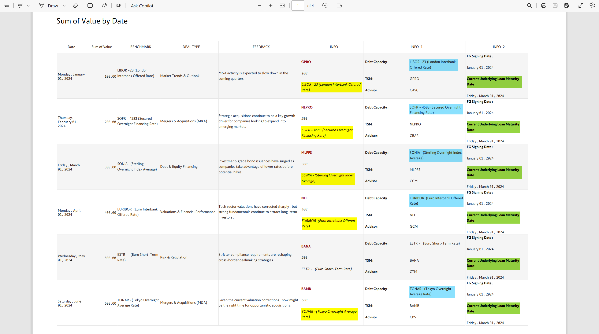
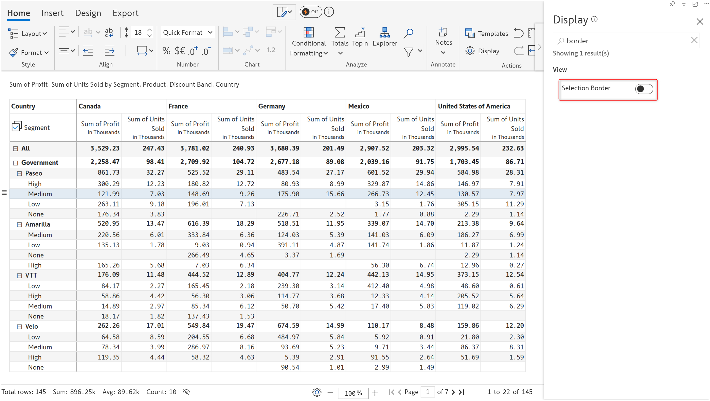

# Inforiver Reporting Matrix March 2025 - V3.3.3 -New formatting and export options

The latest version of the Reporting Matrix delivers faster rendering and smoother interactions with the canvas rendering enhancement. Explore additional formatting and export options to improve the readability of your reports and PDF extracts. The powerful variables feature has been re-launched with a more intuitive, user-friendly, and simplified interface. We've also added a new variable type - the single select - providing more flexibility in applying filters using variables. We've introduced additional display settings options that will help you customize the look and feel of your reports.

### 1. Variables

#### 1.1. Interface change for variable

Leverage variables to create highly interactive, user-driven reports. The new simplified interface enables you to quickly integrate variables into your reports and easily maintain them.

<figure><figcaption>
New interface for creating and editing variables
</figcaption></figure>

#### 1.2. Single select variable

Variables offer highly interactive visual controls like buttons, checkboxes, and toggle switches,  allowing report users to apply filters or run scripts. You can now create single select variables and use the dropdown to drive filters on your data.

<figure><figcaption>
Single select variable
</figcaption></figure>

#### 1.3. Functions for display settings

Report authors can choose to give users access to certain display settings like ragged hierarchy, semantic formatting, and null/zero handling with scripts. When used with variables, users will be able to turn these settings on or off although they cannot directly access display settings.

In this example, we've created 2 variables to enable and disable ragged hierarchy.

<figure><figcaption>
Ragged hierarchy scripting function used in variables
</figcaption></figure>

Notice how the blank category rows are suppressed when the EnableRaggedHierarchy button is clicked and displayed again when the DisableRaggedhierarchy button is clicked.

<figure><figcaption>
Accessing display settings like ragged hierarchy through scripts in the reading view
</figcaption></figure>

### 2. Formatting

#### 2.1. Column formatting for hierarchical dimensions

When column hierarchies are involved, Inforiver allows you to select a particular level of the hierarchy by right-clicking that level and choosing **Select column** from the context menu.&#x20;

<figure><figcaption>
Select column option
</figcaption></figure>

This feature comes in handy when you need to apply formatting to a particular level of the hierarchy. We've highlighted Q4 for 2023 in yellow.

For repeating dimensions, the formatting applied for a particular dimension can be automatically cascaded to other dimensions on the same level. For example, the formatting applied to a month or quarter will automatically be applied to the same month/quarter in future years, as and when the data becomes available. Select the **Apply format to Qtr 4**(the qtr or month will change according to your data) option from the format painter dropdown.

<figure><figcaption>
Format painter - Apply to option
</figcaption></figure>

Notice how the formatting is automatically applied to 2024 Q4 when the data is available.

<figure><figcaption>
Formatting automatically applied to future periods
</figcaption></figure>

### 3. Aggregation

#### 3.1. First and last for row aggregation

The latest version of the Reporting Matrix ships with built-in support for first and last aggregation types for row-level aggregation. The first and last aggregation is used to capture the starting and final values in trends - for instance, the initial and final revenue.


For the First and Last aggregation types, the aggregated parent row will get updated automatically when child rows are re-ordered.


<figure><figcaption>
First and last row aggregation
</figcaption></figure>

### 4. Export

#### 4.1. Display negative signs in Excel export

In earlier versions, when a Reporting Matrix report was exported to Excel, manually changing positive numbers to negative numbers would not be reflected in the cells. The negative sign would be displayed only in the toolbar when the cell was clicked. This issue has been rectified in the latest version.

<figure><figcaption>
Negative signs in Excel exports
</figcaption></figure>

#### 4.2. Word wrap options for export

The latest version of the Reporting Matrix brings you word wrap options - specifically intended for reports that are formatted using **table functions**.&#x20;

<figure><figcaption>
Word wrap options in page setup
</figcaption></figure>

The **"Precise"** option enables word wrapping, ensuring that overflowing rows are wrapped onto the next line and fully visible in the PDF export. In contrast, the **"Auto"** option does not apply word wrapping, which may result in truncated data. The highlighted text in the screenshots depicts the difference between Auto and Precise word wrapping.

<figure><figcaption>
Auto word wrap
</figcaption></figure> <figure><figcaption>
Precise word wrap
</figcaption></figure>

### 5. Display settings

#### 5.1. Enable canvas rendering

The canvas rendering option enables fast interactions with the matrix, smooth scrolling, and quick rendering. In earlier versions, users would have to explicitly enable this option. It will be enabled by default in the latest version.

<figure><figcaption>
Canvas rendering
</figcaption></figure>

#### 5.2. Show child count

If your reports have row hierarchies, you can now display the number of immediate children under each parent category. Enable the **Show Child Count** option from display settings.

<figure><figcaption>
Show Child Count
</figcaption></figure>

#### 5.3. Show descendants count

You can also display the total number of children including the leaf nodes under a parent category. Enable the Show Descendants Count toggle from display settings.


Prerequisite: the **Show Child Count** option should be enabled.


<figure><figcaption>
Show descendants count
</figcaption></figure>

#### 5.4. Selection border

You can optionally remove the border box that is rendered when a cell/column/row is selected. The border box will not be displayed when the Selection Border toggle is disabled from display settings.

<figure><figcaption>
Selection border enabled
</figcaption></figure> <figure><figcaption>
Border box removed
</figcaption></figure>

### 6. Other enhancements

#### 6.1. Column filters on native date and text measures

You can now filter native date and text measures with the column-level filters. The filter option was not available for date and text in earlier versions.

<figure><figcaption>
Column filter for date measure
</figcaption></figure>

#### 6.2. Suppress nulls

If your report has non-numeric data along with measures and all the measure values are null for certain rows, you may want to suppress such rows as they do not add value to the report.

Notice the row highlighted in the report below, all Sales values are null. You can suppress these rows with the **Ignore Measure in Null Suppression** option.


The Hide Blanks option under hierarchy settings should be set to **Visible Values**.


<figure><figcaption>
Ignore measure option in the row gripper
</figcaption></figure>

Notice how the highlighted row that has null measure values is suppressed.

<figure><figcaption>
Ignore measure in null suppression
</figcaption></figure>
