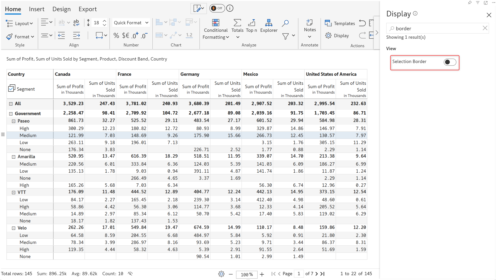

# Inforiver Reporting Matrix March 2025 - V3.3

### Variables

#### Single select variable

You can now create single select variables and use the dropdown to drive filters on your data.

<figure><figcaption>
Single select variable
</figcaption></figure>

### Formatting

#### Column formatting for time hierarchies

When column hierarchies are involved, Inforiver allows you to select a particular level of the hierarchy by right clicking that level and choosing **Select column** from the context menu.&#x20;

<figure><figcaption>
Select column option
</figcaption></figure>

This feature comes in handy when you need to apply formatting to a particular level of the hierarchy. We've highlighted Q4 for 2023 in yellow.

For time dimensions, the formatting applied for a particular month or quarter will automatically be applied to the same month/quarter in future years, as and when the data becomes available. Select the **Apply format to Qtr 4**(the qtr or month will change according to your data) option from the format painter dropdown.&#x20;

<figure><figcaption>
Format painter - Apply to option
</figcaption></figure>

Notice how the formatting is automatically applied to 2024 Q4 when the data is available.

<figure><figcaption>
Formatting automatically applied to future periods
</figcaption></figure>

### Aggregation

#### First and last for row aggregation

The latest version of Reporting Matrix ships with built-in support for first and last aggregation types for row-level aggregation. First and last aggregation is used to capture the starting and final values in trends - for instance, the initial and final revenue.


For First and Last aggregation types, the aggregated parent row will get updated automatically when child rows are re-ordered.


<figure><figcaption>
First and last row aggregation
</figcaption></figure>

### Export

#### Display negative signs in Excel export

In earlier versions, when a Reporting Matrix report was exported to Excel, manually changing positive numbers to negative numbers would not be reflected in the cells. The negative sign would be displayed only in the toolbar when the cell was clicked. This issue has been rectified in the latest version.

<figure><figcaption>
Negative signs in Excel exports
</figcaption></figure>

### Display settings

#### Enable canvas rendering

The canvas rendering option enables fast interactions with the matrix, smooth scrolling, and quick rendering. In earlier versions, users would have to explicitly enable this option. It will be enabled by default in the latest version.

<figure><figcaption>
Canvas rendering
</figcaption></figure>

#### Show child count

If your reports have row hierarchies, you can now display the number of immediate children under each parent category. Enable the **Show Child Count** option from display settings.

<figure><figcaption>
Show Child Count
</figcaption></figure>

#### Show descendants count

You can also display the total number of children including the leaf nodes under a parent category. Enable the Show Descendants Count toggle from display settings.


Prerequisite: the **Show Child Count** option should be enabled.


<figure><figcaption>
Show descendants count
</figcaption></figure>

#### Selection border

You can optionally remove the border box that is rendered when a cell/column/row is selected. The border box will not be displayed when the Selection Border toggle is disabled from display settings.

<figure><figcaption>
Selection border enabled
</figcaption></figure> <figure><figcaption>
Border box removed
</figcaption></figure>

