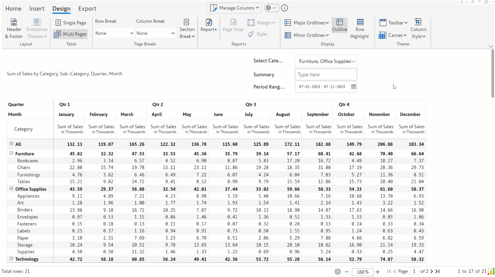
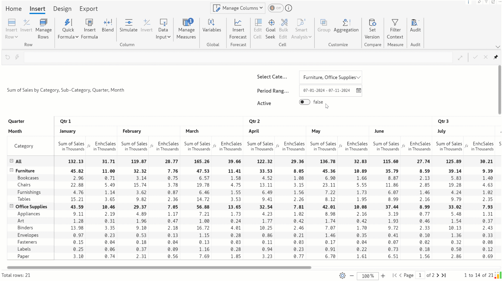
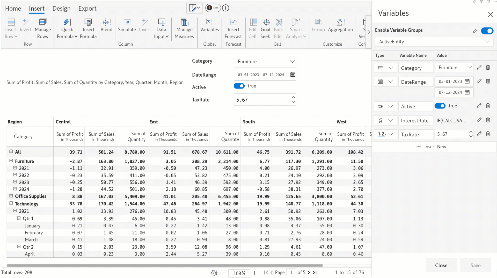
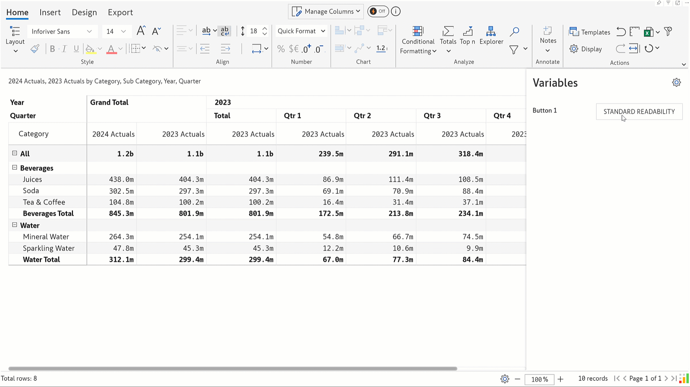
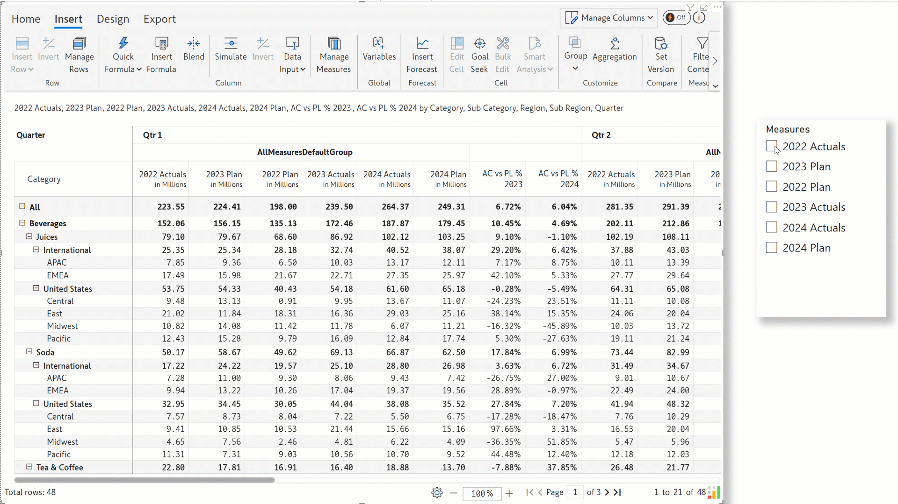
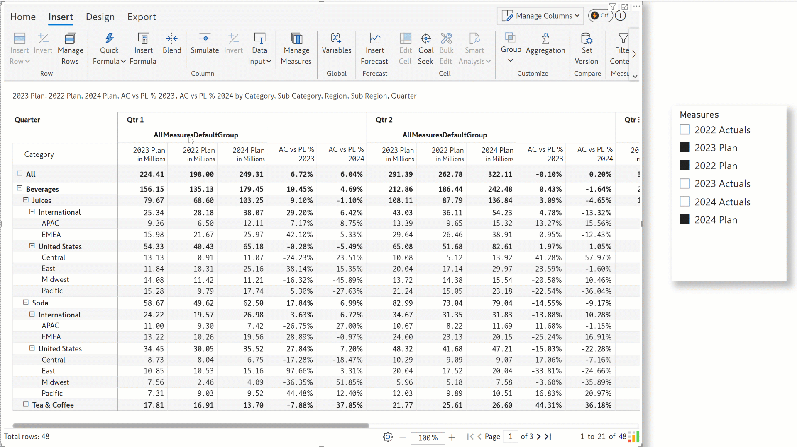
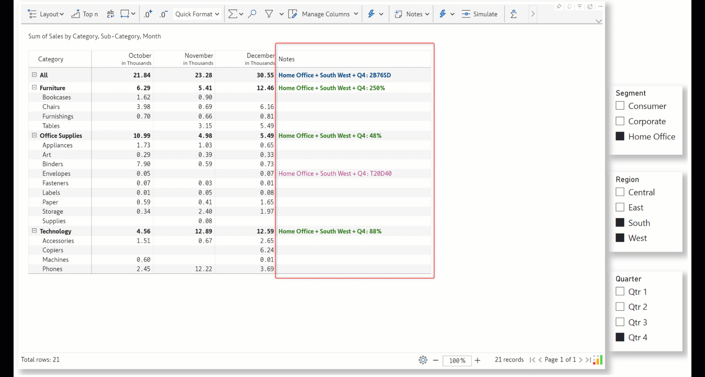
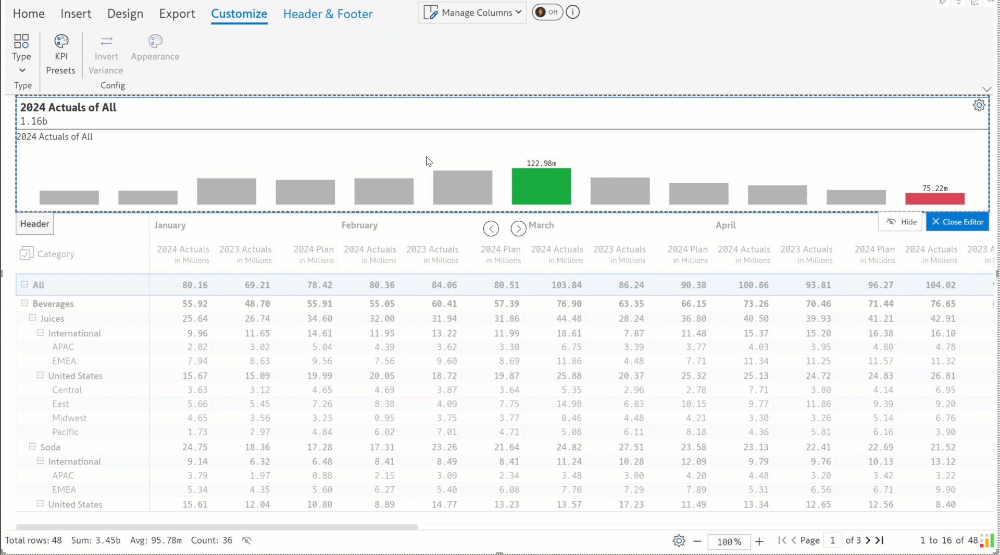
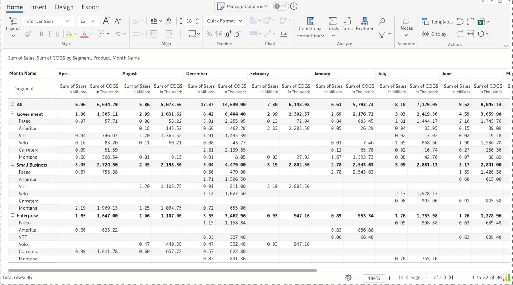

# Inforiver Reporting Matrix Nov 2024 - v3.3 - Variables

## Release notes for version v3.3

[**1. Formatting** ](inforiver-reporting-matrix-nov-2024-v3.3-variables.md#id-1.-formatting)

&#x20;1.1. [Display skipped rows in the report ](inforiver-reporting-matrix-nov-2024-v3.3-variables.md#id-1.1.-display-skipped-rows-in-the-report)

&#x20;1.2. [Date-based interface to show measures ](inforiver-reporting-matrix-nov-2024-v3.3-variables.md#id-1.2.-date-based-interface-to-show-measures)

&#x20;1.3. [Pie and donut – a new addition to row-level charts](inforiver-reporting-matrix-nov-2024-v3.3-variables.md#id-1.3.-pie-and-donut-a-new-addition-to-row-level-charts)&#x20;

&#x20;1.4. [Minimum and maximum threshold for outliers](inforiver-reporting-matrix-nov-2024-v3.3-variables.md#id-1.4.-minimum-and-maximum-threshold-for-outliers)&#x20;

&#x20;1.5. [Display marker values for sparklines](inforiver-reporting-matrix-nov-2024-v3.3-variables.md#id-1.5.-display-marker-values-for-sparklines)&#x20;

&#x20;1.6. [Border box option](inforiver-reporting-matrix-nov-2024-v3.3-variables.md#id-1.6.-border-box-option)

[**2. Analysis** ](inforiver-reporting-matrix-nov-2024-v3.3-variables.md#analysis)

&#x20;2.1. [Row groups in KPI explorer](inforiver-reporting-matrix-nov-2024-v3.3-variables.md#id-2.1.-row-groups-in-kpi-explorer)&#x20;

&#x20;2.2. [Date picker in filters](inforiver-reporting-matrix-nov-2024-v3.3-variables.md#id-2.2.-date-picker-in-filters)&#x20;

&#x20;2.3. [Filter based on measure name](inforiver-reporting-matrix-nov-2024-v3.3-variables.md#id-2.3.-filter-based-on-measure-name)&#x20;

&#x20;2.4. [Interface change for filters ](inforiver-reporting-matrix-nov-2024-v3.3-variables.md#id-2.4.-interface-change-for-filters)

&#x20;2.5. [Date range conditions in conditional formatting](inforiver-reporting-matrix-nov-2024-v3.3-variables.md#id-2.5.-date-conditions-in-conditional-formatting)&#x20;

&#x20;2.6. [Hide measure values with conditional formatting](inforiver-reporting-matrix-nov-2024-v3.3-variables.md#id-2.6.-hide-measure-values-with-conditional-formatting)&#x20;

&#x20;2.7. [Conditional formatting for measure headers](inforiver-reporting-matrix-nov-2024-v3.3-variables.md#id-2.7.-conditional-formatting-for-measure-headers)&#x20;

[**3. Settings** ](inforiver-reporting-matrix-nov-2024-v3.3-variables.md#settings)

&#x20;3.1. [Totals/subtotals for date fields](inforiver-reporting-matrix-nov-2024-v3.3-variables.md#id-3.1.-totals-subtotals-for-date-fields)&#x20;

&#x20;3.2. [APS options moved to display settings](inforiver-reporting-matrix-nov-2024-v3.3-variables.md#id-3.2.-aps-options-moved-to-display-settings)&#x20;

&#x20;3.3. [Custom suffix for row subtotals split](inforiver-reporting-matrix-nov-2024-v3.3-variables.md#id-3.3.-custom-suffix-for-row-subtotals-split)&#x20;

&#x20;3.4. [Custom labels for blank row and column categories ](inforiver-reporting-matrix-nov-2024-v3.3-variables.md#id-3.4.-custom-labels-for-blank-row-and-column-categories)

&#x20;3.5. [Show column filter](inforiver-reporting-matrix-nov-2024-v3.3-variables.md#id-3.5.-show-column-filter)&#x20;

&#x20;3.6. [Rotate the first row dimension vertically](inforiver-reporting-matrix-nov-2024-v3.3-variables.md#id-3.6.-rotate-the-first-row-dimension-vertically)&#x20;

&#x20;3.7. [Suppress null visual columns](inforiver-reporting-matrix-nov-2024-v3.3-variables.md#id-3.7.-suppress-null-visual-columns)&#x20;

&#x20;3.8. [On data change scripts](inforiver-reporting-matrix-nov-2024-v3.3-variables.md#id-3.8.-on-data-change-scripts)&#x20;

&#x20;3.9. [Reset formats for selected cells](inforiver-reporting-matrix-nov-2024-v3.3-variables.md#id-3.9.-reset-formats-for-selected-cells)&#x20;

&#x20;3.10. [Populate missing FC with PY/PL](inforiver-reporting-matrix-nov-2024-v3.3-variables.md#id-3.10.-populate-missing-fc-with-py-pl)&#x20;

&#x20;3.11. [Right-to-left support](inforiver-reporting-matrix-nov-2024-v3.3-variables.md#id-3.11.-right-to-left-support)&#x20;

&#x20;3.12. [Localization settings](inforiver-reporting-matrix-nov-2024-v3.3-variables.md#id-3.12.-localization-settings)&#x20;

&#x20;3.13. [Hide repeating parent rows](inforiver-reporting-matrix-nov-2024-v3.3-variables.md#id-3.13.-hide-repeating-parent-rows)&#x20;

[**4. Annotations** ](inforiver-reporting-matrix-nov-2024-v3.3-variables.md#id-4.-annotations)

&#x20;4.1. [Identify notes added in the MOR layout ](inforiver-reporting-matrix-nov-2024-v3.3-variables.md#id-4.1.-identify-notes-added-in-the-mor-layout)

[**5. Manage columns**](inforiver-reporting-matrix-nov-2024-v3.3-variables.md#manage-columns)&#x20;

&#x20;5.1. [Absolute moving average ](inforiver-reporting-matrix-nov-2024-v3.3-variables.md#id-5.1.-absolute-moving-average)

&#x20;5.2. [Flexible position for simulation percentage](inforiver-reporting-matrix-nov-2024-v3.3-variables.md#id-5.2.-flexible-position-for-simulation-percentage)&#x20;

&#x20;5.3. [Empty measures and columns ](inforiver-reporting-matrix-nov-2024-v3.3-variables.md#id-5.3.-empty-measures-and-columns)

[**6. Manage rows** ](inforiver-reporting-matrix-nov-2024-v3.3-variables.md#manage-rows)

&#x20;6.1. [Template rows retained after base rows removed](inforiver-reporting-matrix-nov-2024-v3.3-variables.md#id-6.1.-template-rows-retained-after-base-rows-removed)&#x20;

&#x20;6.2. [Time intelligence formulae ](inforiver-reporting-matrix-nov-2024-v3.3-variables.md#id-6.2.-time-intelligence-formulae)&#x20;

&#x20;6.3.  [Access the measure name in the formula ](inforiver-reporting-matrix-nov-2024-v3.3-variables.md#id-6.3.-access-the-measure-name-in-the-formula)

&#x20;6.4. [Select rows based on date range](inforiver-reporting-matrix-nov-2024-v3.3-variables.md#id-6.4.-select-rows-based-on-date-range)&#x20;

[**7.  Variables** ](inforiver-reporting-matrix-nov-2024-v3.3-variables.md#variables)

[**8.  Groups for field parameters** ](inforiver-reporting-matrix-nov-2024-v3.3-variables.md#field-parameters)

[**9.  Aggregation - new column aggregation types – first and last** ](inforiver-reporting-matrix-nov-2024-v3.3-variables.md#aggregation)

[**10.  Filter context - context awareness for notes columns** ](inforiver-reporting-matrix-nov-2024-v3.3-variables.md#filter-context)

&#x20;10.1. [Context awareness for notes columns ](inforiver-reporting-matrix-nov-2024-v3.3-variables.md#id-10.1-context-awareness-for-notes-columns)

[**11. Design** ](inforiver-reporting-matrix-nov-2024-v3.3-variables.md#design)

&#x20;11.1. [Hyperlinks in the header/footer ](inforiver-reporting-matrix-nov-2024-v3.3-variables.md#id-11.1.-hyperlinks-in-the-header-footer)

&#x20;11.2. [Headers will be retained in the Report+ layout](inforiver-reporting-matrix-nov-2024-v3.3-variables.md#id-11.2.-headers-will-be-retained-in-the-report-layout)&#x20;

&#x20;11.3. [Row category displayed for KPI ](inforiver-reporting-matrix-nov-2024-v3.3-variables.md#id-11.3.-row-category-displayed-for-kpi)

&#x20;11.4. [Show dimension category with markers](inforiver-reporting-matrix-nov-2024-v3.3-variables.md#id-11.4.-show-dimension-category-with-markers)&#x20;

[**12. Conditional formatting for exports** ](inforiver-reporting-matrix-nov-2024-v3.3-variables.md#conditional-formatting-exports)

&#x20;12.1. [Conditional formatting for exports ](inforiver-reporting-matrix-nov-2024-v3.3-variables.md#id-12.1.-conditional-formatting-for-exports)

&#x20;12.2. [Decimal precision for exports](inforiver-reporting-matrix-nov-2024-v3.3-variables.md#id-12.2.-decimal-precision-for-exports)&#x20;

[**13. Performance mode enhancements** ](inforiver-reporting-matrix-nov-2024-v3.3-variables.md#performance-mode)

[**14. Re-ordering rows** ](inforiver-reporting-matrix-nov-2024-v3.3-variables.md#re-ordering)

[**15. Image URLs in measure headers**](inforiver-reporting-matrix-nov-2024-v3.3-variables.md#image-urls)

[**16. Row gripper enhancements** ](inforiver-reporting-matrix-nov-2024-v3.3-variables.md#row-gripper)

&#x20;16.1. [Select descendants ](inforiver-reporting-matrix-nov-2024-v3.3-variables.md#id-16.1.-select-descendants)

&#x20;16.2. [Edit/Delete measures in MOR layout ](inforiver-reporting-matrix-nov-2024-v3.3-variables.md#id-16.2.-edit-delete-measures-in-mor-layout)

&#x20;16.3. [Select column option ](inforiver-reporting-matrix-nov-2024-v3.3-variables.md#id-16.3.-select-column-option)

&#x20;16.4. [Multi-select row option in gripper](inforiver-reporting-matrix-nov-2024-v3.3-variables.md#id-16.4.-multi-select-option-in-row-dimension-header-gripper)&#x20;

[**17. Reading view enhancements** ](inforiver-reporting-matrix-nov-2024-v3.3-variables.md#reading-view)

[**18. Convert native measures to visual columns**](inforiver-reporting-matrix-nov-2024-v3.3-variables.md#view-enhancements)

[**19. Other New Functions**](inforiver-reporting-matrix-nov-2024-v3.3-variables.md#other-enhancements)

[**20. Other Enhancements**](inforiver-reporting-matrix-nov-2024-v3.3-variables.md#id-20.-other-enhancements)

## 1.      Formatting

#### 1.1. Display skipped rows in the report

Inforiver allows you to exclude rows from total/subtotal calculations using the Skip row option. The skipped row will then be masked from the report. With the latest release, you can retain skipped rows in the report with the Skip and Show Row option in the row gripper. This feature allows you to cherry-pick the categories contributing to the subtotals and display the excluded categories.

Notice how the Bookcases row is still displayed in the report after skipping it. The subtotals for the Furniture and Central categories and the grand total have changed after excluding the Bookcases row.

<figure><figcaption>
Skip and show row
</figcaption></figure>

Select the **Include All Skipped Rows** option from the row gripper to include skipped rows again.&#x20;

#### **1.2. Date-based interface to show measures**&#x20;

Inforiver offers a range of time intelligence formulas to display your data for specific periods. If scripting is not your cup of tea, you can use the new **Show Measures** interface to display the data for a particular period of time. You only need to select the date range from the date picker.&#x20;

You can also hide measures for a specific time range by turning off the **Show** toggle.&#x20;

<figure><figcaption>
Show measures setup
</figcaption></figure>

Once defined, you can smoothly switch between different time ranges and analyze your data for specific periods.

<figure><figcaption>
Defining multiple time periods and switching between them
</figcaption></figure>

#### **1.3. Pie and donut – a new addition to row-level charts**&#x20;

Add a pie or donut chart to your report to visualize the proportions of different categories in your dataset. To embed pie charts, add a minimum of 2 measures.  &#x20;

<figure><figcaption>
Embedding pie and donut charts
</figcaption></figure>

#### **1.4. Minimum and maximum threshold for outliers**&#x20;

Inforiver can highlight outlier values for lollipop charts, and you can specify the threshold beyond which a data point will be considered an outlier. In earlier versions, we only had the option to specify a negative and positive outlier, but what if you only have positive values in your data? In the latest version, you can specify a minimum and maximum threshold or use the existing positive/negative option based on your data.&#x20;

<figure><figcaption>
Outlier threshold
</figcaption></figure>

#### **1.5. Display marker values for sparklines**

Inforiver enables you to visualize your numbers by embedding row-level charts. By checking the **Show Marker Label** option, you can now display markers alongside the charts, allowing you to grasp insights quickly from the charts.&#x20;

<figure><figcaption>
Sparkline markers
</figcaption></figure>

#### **1.6. Border box option**&#x20;

You can now create a box highlighting specific rows/columns or cells in your reports.&#x20;

<figure><figcaption>
Border box
</figcaption></figure>

If you have applied Power BI filters on row/column dimensions, the border box will automatically expand to accommodate the filtered categories when they are added back. &#x20;

Please remember that this will work only when you use the row/column gripper options to select data when you apply a border.&#x20;

<figure><figcaption>
Power BI filter compatibility
</figcaption></figure>

## 2. Analysis  

#### **2.1. Row groups in KPI explorer**&#x20;

With Inforiver, you can group rows and create visual-level hierarchies. In earlier releases, row groups could not be viewed or selected from the KPI explorer. From this release, row groups will be supported in the explorer view.&#x20;

<figure><figcaption>
Row groups in KPI explorer
</figcaption></figure>

#### **2.2. Date picker in filters**&#x20;

Inforiver makes it easier for you to apply filters for date fields. You can select the date ranges from the date picker, which is now available in the filter interface.&#x20;

Note: You need to have a date dimension in your report to enable the date picker.&#x20;

<figure><figcaption>
Date picker in filters
</figcaption></figure>

When you have a date dimension in your rows, you can use the new **Date Period** option to filter your row data between 2 specific dates.&#x20;

<figure><figcaption>
Date period filter
</figcaption></figure>

#### **2.3. Filter based on measure name**

Navigating and locating specific measures may prove time-consuming when your reports contain many measures. You can now display selected measures by creating measure-name-based filters.

<figure><figcaption>
Measure filter
</figcaption></figure>

You can quickly switch between different relevant measure combinations with this option.

<figure><figcaption>
Measure filters
</figcaption></figure>

#### **2.4. Interface change for filters**&#x20;

Is deciphering complex, multi-condition filters proving to be laborious? The filter interface has been upgraded to show the links between filter conditions, making them much easier to grasp.&#x20;

<figure><figcaption>
New filter interface
</figcaption></figure>

#### **2.5. Date conditions in conditional formatting**&#x20;

You can directly use date range conditions, such as the order date being in the last n days or the ship date being in the next n days, as a conditional formatting rule.&#x20;

<figure><figcaption>
Date-based conditional formatting
</figcaption></figure>

#### **2.6. Hide measure values with conditional formatting**&#x20;

Business reporting may require withholding certain information to protect strategic interests. You can now use conditional formatting to mask values based on specific criteria.&#x20;

We’ve hidden the COGS values when the Discount is less than 10k.&#x20;

<figure><figcaption>
Hiding measure values
</figcaption></figure>

#### **2.7. Conditional formatting for measure headers**&#x20;

Based on your data, you can highlight measure headers. For instance, you can highlight the quarters/months in which the overall sales exceed a target amount. You can select the dimensions from the **Target column** box.&#x20;

<figure><figcaption>
CF for measure headers
</figcaption></figure>

## 3. Settings  

#### **3.1. Totals/subtotals for date fields**&#x20;

Aggregation may not necessarily apply to non-numeric fields. Inforiver provides the option of leaving the total and subtotal cells blank for non-numeric fields. This feature has been extended to date fields as well in this release.&#x20;

<figure><figcaption>
Disable totals/subtotals for non-numeric measures
</figcaption></figure>

#### **3.2. APS options moved to display settings**&#x20;

* **Absolute search:** Locate a value irrespective of its sign. This option has been added to the Misc tab.&#x20;

<figure><figcaption>
Absolute search
</figcaption></figure>

* **Populate missing AC with FC:** When the AC measure is unavailable, the missing values can be substituted with the corresponding FC measure.&#x20;

<figure><figcaption>
Replace missing AC with FC
</figcaption></figure>

* **Customize for Indian numbering system:** This enables the lakhs and crores units that are specific to the Indian number system.&#x20;

<figure><figcaption>
Indian number system
</figcaption></figure>

* **Show Info logo:** The Inforiver logo will be displayed at the bottom right corner of the visual.

<figure><figcaption>
Show info logo
</figcaption></figure>

#### **3.3. Custom suffix for row subtotals split**&#x20;

Inforiver allows you to customize the row and column totals and subtotals with the Totals feature. The subtotal is displayed as a separate row when you choose the split option for row subtotals. After splitting subtotals, you can set a custom suffix for the row subtotal.

<figure><figcaption>
Subtotal suffix
</figcaption></figure>

#### **3.4. Custom labels for blank row and column categories**&#x20;

Inforiver provides numerous options for handling null data in the source. With the latest version, you can provide a default label for blank row and column dimension categories.

<figure><figcaption>
Custom labels for blank dimensions
</figcaption></figure>

#### **3.5. Show column filter**&#x20;

We’ve added a new, easily accessible column filter interface. This can be enabled by turning on the **Show Column Filter** option in the Misc tab. The **Enable Canvas Rendering** option should also be enabled from the General tab.

<figure><figcaption>
Show column filter
</figcaption></figure>

#### **3.6. Rotate the first row dimension vertically**&#x20;

You can display the dimension in the Rows parameter in a banner format with the categories rotated vertically. To turn on this option, the General settings > Enable Canvas Rendering option also needs to be enabled.&#x20;

<figure><figcaption>
Rotate row dimension
</figcaption></figure>

#### **3.7. Suppress null visual columns**&#x20;

You may have calculated fields in your report that are null for certain categories. Inforiver provides the option of suppressing such fields that do not add value to the report.

<figure><figcaption>
Suppress null visual columns
</figcaption></figure>

Enable the **Suppress Null Visual Columns** option to hide visual measures/columns that are entirely blank

<figure><figcaption>
Suppress null visual columns
</figcaption></figure>

#### **3.8. On data change scripts**&#x20;

You can now execute scripts on changing the data selections in an external slicer/filter. For instance, you can enhance the relevance of data by drilling up/down or mask data in response to a specific selection. The exact scripting functions used in variables or on-load can be used for data changes.

<figure><figcaption>
On data change scripts
</figcaption></figure>

* We have introduced a new SETCOLUMNSORT scripting function to sort columns in ascending or descending order.

<figure><figcaption>
SETCOLUMNSORT function
</figcaption></figure>

#### **3.9. Reset formats for selected cells**&#x20;

Have you ever applied a series of formatting changes and found it challenging to undo them? Inforiver provides a handy **Reset Formats** option. Select the cells and click **Reset Formats** to instantly restore default formatting.

<figure><figcaption>
Reset formats for selected cells
</figcaption></figure>

#### **3.10. Populate missing FC with PY/PL**&#x20;

If your reports contain forecast measures with missing values for certain periods, you can use either PL or PY values to replace the null forecast values.&#x20;

<figure><figcaption>
Missing FC values
</figcaption></figure>

Populate missing FC with PY:

<figure><figcaption>
Populate missing FC with PY
</figcaption></figure>

Populate missing FC values with PL:

<figure><figcaption>
Populate missing FC with PL
</figcaption></figure>

#### **3.11. Right-to-left support**&#x20;

Reports with RTL support improve the user experience for readers of RTL languages, making it easier for them to navigate, understand, and interpret the information presented. When the right-to-left option is enabled:&#x20;

* Data is arranged from right to left; notice how the months are arranged from December to January. &#x20;
* The row categories are displayed on the right-hand side.&#x20;
* Toolbar options are arranged from right to left.&#x20;
* The header is positioned at the right end of the report.

<figure><figcaption>
RTL support
</figcaption></figure>

#### **3.12. Localization settings**&#x20;

You can configure translations in Inforiver based on the language settings in Power BI. If your report has a global audience, you can configure calculated rows/columns or column groups to display dimension categories based on pre-defined translations when the language is switched.&#x20;

Navigate to Display Settings > General > Localization Settings to create translation entries.&#x20;

<figure><figcaption>
Localization settings
</figcaption></figure>

Use the GETLOCALELABEL function in the Title field and pass the Key specified in the translation config.

<figure><figcaption>
GETLOCALELABEL
</figcaption></figure>

Notice how the row categories and column groups are implicitly changed to French and German.

<figure><figcaption>
French
</figcaption></figure> <figure><figcaption>
German
</figcaption></figure>

#### **3.13. Hide repeating parent rows**&#x20;

Hierarchical datasets may contain categories with the same name on multiple levels.

<figure><figcaption>
Repeating categories
</figcaption></figure>

You can now suppress parent levels with the same name by enabling the **Hide Repeating Parent Rows** option.

<figure><figcaption>
Hide repeating parent rows
</figcaption></figure>

## 4. Annotations

#### **4.1. Identify notes added in the MOR layout**&#x20;

While analysing your report, you may need to switch between the regular layout and the measure-on-rows layout. The notes added in the measure-on-rows layout will have an MOR tag. This will enable users to identify and differentiate between the notes added in different layouts. The notes added in the MOR layout can only be viewed and not edited in the default layout. The reverse happens when we add notes in the normal layout and switch to the measure-on-rows layout.&#x20;

<figure><figcaption>
Notes added in MOR non-editable in default layout
</figcaption></figure>

## 5. Manage Columns  

#### **5.1. Absolute moving average**&#x20;

We have expanded the moving average functionality to include an absolute moving average option. In the sample report, we calculate the moving average over two days. When you choose the ‘Absolute’ average type, if the previous day’s data is unavailable, the current day value will be considered for the average.&#x20;

For example, the data for Jan 5th is not available, so the moving average for Jan 6th considers only that day’s quantity of 13, and the moving average is calculated as 6.50.&#x20;

On the other hand, on Jan 12th, data for Jan 11th is also available. The moving average of 17.50 accounts for both the quantities of 8 and 27.&#x20;

<figure><figcaption>
Absolute Moving Average
</figcaption></figure>

The current period value is used when the average type is set to ‘Rolling’ and the previous period is unavailable. Notice how the moving average on Jan 6th is the same value as the quantity.&#x20;

<figure><figcaption>
Rolling Average
</figcaption></figure>

#### **5.2. Flexible position for simulation percentage**&#x20;

Inforiver supports what-if analysis with the simulation feature. A **Simulation Value** option has been added, allowing you to display the simulation percentage to the right or left of the simulated value. You can also display only the percentage and suppress the value itself. You must first add simulations to a measure to display the simulation percentage alone.&#x20;

<figure><figcaption>
Flexible position for simulation percentage
</figcaption></figure>

#### **5.3. Empty measures and columns**&#x20;

Do your reports appear overloaded with information? De-congest your reports by inserting empty measures or columns.  You can re-order the empty measure/column by dragging it to the required position.&#x20;

Please remember that the empty measures and columns feature is intended for aesthetics only. They can be used primarily to demarcate your data.&#x20;

<figure><figcaption>
Empty measures and columns
</figcaption></figure>

## 6. Manage rows  

#### **6.1. Template rows retained after base rows removed**&#x20;

Inforiver allows you to insert calculated rows at each level of the hierarchy. In earlier versions, the template row was lost if the base row was removed from the report. From this release, template rows will be retained regardless of whether the base row is present.&#x20;

In the sample report, notice how the template row _Furniture tax_ is preserved in the report, although the base row, _Furniture_, has been removed.&#x20;

<figure><figcaption>
Template rows retained after base rows removed 
</figcaption></figure>

#### **6.2. Time intelligence formulae** &#x20;

The release allows you to access the following/previous time periods using the new COLUMN\_PERIOD.NEXT/LAST time intelligence formulae. &#x20;

Please remember that a date dimension should be added as a column parameter to use this function.&#x20;

<figure><figcaption>
Time intelligence formula
</figcaption></figure>

When you click on a cell, Inforiver highlights the cells contributing to that value. Notice how the Actuals from the previous quarter have been highlighted.&#x20;

<figure><figcaption></figcaption></figure>

#### **6.3.  Access the measure name in the formula**&#x20;

You may need to assign values based on the measure name. Instead of manually keying in the values for each cell, you can now use the ROW.MEASURENAME identifier to access the respective measure names in a formula.&#x20;

<figure><figcaption>
Access the measure name in the formula
</figcaption></figure>

#### **6.4. Select rows based on date range**&#x20;

In business reporting, you may need to apply formulas to a specific range of data. For instance, you could calculate the average for a week or a fortnight. When you have a time dimension in your rows, you can use the SELECTROWS formula to fetch the rows for a particular time period.&#x20;

<figure><figcaption>
Select rows based on date range 
</figcaption></figure>

## 7.  Variables  

Inforiver variables facilitate user-driven data navigation and filtering. We will be adding controls in the upcoming releases, which, powered by variables, will serve as an indispensable tool for drawing instant interpretations from your data.&#x20;

* **Variable types**&#x20;

Inforiver supports text, numeric, date, date range, and boolean data types. The advanced data type allows you to provide a formula or calculation within the variable. Click on the pencil icon to customize the variables, i.e., to set default values, assign option values, or rename the variable.&#x20;

<figure><figcaption>
Variable types
</figcaption></figure>

* **Inserting variables into the visual**&#x20;

You can insert variables into your reports from the Header & Footer tab. Navigate to Type > Variables. All the variables created in the visual will be inserted in the header.&#x20;

Note: To hide a variable, enable the **Hide on visual** toggle in the edit variable side pane.&#x20;

<figure><figcaption>
Inserting variables
</figcaption></figure>

* **Using variables to filter data**&#x20;

Let’s look at how to use a _Select_ variable to dynamically filter dimension categories. We’ve created a variable that contains the category values as options.&#x20;

<figure><figcaption>
Using variables to filter data
</figcaption></figure>

We need to create an Inforiver filter using the _Select_ variable as input. Notice how the _Select_ variable can be accessed from the filter IntelliSense.&#x20;

<figure><figcaption>
Select variable
</figcaption></figure>

You can then filter and navigate your data using the dropdown control in the header. Instead of using a _Select_ variable, you can also use a _Text_ variable. The user can key in their selection, and Inforiver will use the text entered to filter data.&#x20;

<figure><figcaption>
Text filter
</figcaption></figure>

* **Using variables in formulas**&#x20;

You can reference variables within formulas. Inforiver’s IntelliSense will display _the technical name_ of the variable when you key in the first letter(s).&#x20;

<figure><figcaption>
Using variables in formulas
</figcaption></figure>

Notice how the formula measure, EnhcSales, changes when we enable and disable the ‘Active’ toggle control.&#x20;

<figure><figcaption>
Variable as toggle
</figcaption></figure>

You can also use a _Number_ variable to pass user input values to a formula measure. For example, you can pass the interest rate and determine its impact on your profits.&#x20;

* **Filtering dates**&#x20;

Inforiver provides _Single date_ and _Date range_ variables that you can use to select data for a specific date or period.&#x20;

When you have a date dimension in your rows, you can choose the **Single Date** option in your Inforiver filter. IntelliSense will display the _Single date_ variables in your visual, which you can pass to the filter. Similarly, when you choose the **Date Range** option as your comparison method, IntelliSense will display the _Date Range_ variables you created.&#x20;

<figure><figcaption>
Date variable
</figcaption></figure>

We can select a date range from the header control to filter rows for a specific period.&#x20;

<figure><figcaption>
Select date range from header control
</figcaption></figure>

* **Variable groups**&#x20;

With Inforiver, you can save variable configurations to filter or select data by creating groups. &#x20;

<figure><figcaption>
Variable groups
</figcaption></figure>

You can then easily switch between configurations. Notice how the date range, number variable, and options have different values when we switch between groups.&#x20;

<figure><figcaption>
Switch variable groups
</figcaption></figure>

* **New scripting functions**&#x20;

We’ve introduced additional scripting functions for variables, on-load, or data change scripts.

<figure><figcaption>
New Variable-based Scripting functions
</figcaption></figure>

<figure><figcaption>
Scripting function used
</figcaption></figure>

All the formatting, font, and row/column total position changes are applied when we run the script.&#x20;

<figure><figcaption>
Output after running the script
</figcaption></figure>

* **Enable toggle scripts**&#x20;

When you work with variables, you can specify one set of scripts for the active state of the variable and another for the inactive state. In this example, when the button is enabled, the label reads “ENHC READABILITY,” and the corresponding scripts are executed. Similarly, the button is disabled, the **Disabled script** section is executed.&#x20;

<figure><figcaption>
Toggle button script
</figcaption></figure>

Notice how different scripts are executed each time we click the button.&#x20;

<figure><figcaption>
Toggle script execution
</figcaption></figure>

* **Floating toolbar for buttons in reading mode**&#x20;

The Allowed User Controls setting allows you to display a floating toolbar in reading mode. Report users can enable button variables in the floating toolbar and access them. You can also provide access to features like conditional formatting or export with the floating toolbar and restrict access to the regular toolbar. Report users can only use variable buttons to run scripts.&#x20;

<figure><figcaption>
Display floating toolbar
</figcaption></figure>

Floating toolbar in reading view:&#x20;

<figure><figcaption>
Floating toolbar in reading view
</figcaption></figure>

* **Global functions**&#x20;

Inforiver allows you to reuse scripts/formulae by defining them inside a global function. Instead of repeating the logic in multiple places, you can call the global function inside a variable/on-load script or on-data change script. Navigate to Display settings > Scripting > Insert New to create a global formula.&#x20;

<figure><figcaption>
Global functions
</figcaption></figure>

You can use the global function name in the script section to create a variable or set up on-load/on-data change scripts.&#x20;

<figure><figcaption>
Execute the global function
</figcaption></figure>

* **Editing variables**&#x20;

After creating variables, if the variable panel is enabled, you will see an edit icon when you hover over the variable. You can always click the Variables button in the toolbar and edit from the Variables side pane. &#x20;

<figure><figcaption>
Editing variables
</figcaption></figure>

## 8. Groups for field parameters  

Field parameters are often used in Power BI to create dynamic reports where users can interactively change the dimensions or measures displayed in visuals. In the latest version, you can create custom groups with field parameters.&#x20;

Creating custom groups was supported in earlier versions as well with the **Add New Group** option.&#x20;

<figure><figcaption>
Add New Group
</figcaption></figure>

Custom groups are created under the column dimension category from where the measures are selected and not replicated across all categories. Notice how the group is created under Qtr1 only.&#x20;

<figure><figcaption>
Custom group
</figcaption></figure>

When you work with field parameters, you can create parameter groups using the **Group Parameters** option. Parameter groups are replicated across all column dimension categories. To start with, we’ll create a field parameter group that includes all the measures in the field parameter.&#x20;

<figure><figcaption>
Create Parameter Group
</figcaption></figure>

Even when you change the measure selection, the measures from the field parameter are still grouped together.&#x20;

<figure><figcaption>
Grouping is retained even when measures are changed
</figcaption></figure>

You can even create sub-groups. In this example, we’ve renamed the default group to: &#x20;

* **Actuals** when the actuals measures are selected&#x20;
* **Plan** when the plan measures are selected&#x20;
* **2024** when 2024 Actuals + 2024 Plan are selected&#x20;

Notice how the group name changes dynamically when we select measures corresponding to the groups. For other measure selections, the default group name is used.&#x20;

<figure><figcaption></figcaption></figure>

## 9.  Aggregation  

#### **9.1. New column aggregation types – first and last**&#x20;

P\&L or cash flow statements often require the values from the first or last periods as the column subtotals and grand totals.&#x20;

* First aggregation type: The values from the first period are used for the column subtotals and grand totals. In the example, the Actuals from Q1 are used as the subtotals at the year level. The Actuals from 2022 (the earliest year) are used for the grand total.&#x20;

<figure><figcaption>
Aggregation type- First
</figcaption></figure>

* Last aggregation type: The last period is used to populate the grand totals and subtotals. &#x20;

<figure><figcaption>
Aggregation type - Last
</figcaption></figure>

## 10.  Filter Context 

#### **10.1 Context awareness for notes columns**&#x20;

The Inforiver visual is receptive to changes in external filters. With the current release, context awareness has been extended to note columns as well. Row-level notes will be updated dynamically based on slicer selections.&#x20;

<figure><figcaption>
Filter context for Notes column
</figcaption></figure>

## 11. Design  

#### **11.1. Hyperlinks in the header/footer**&#x20;

Including the brand name in the report header/footer helps reinforce brand recognition among readers. This can be particularly useful in documents shared with stakeholders who may not be familiar with the brand. For additional context, you can now include hyperlinks in the header/footer. Key in the text, select it, and use the link icon from the toolbar to convert the text into a hyperlink to the website.&#x20;

<figure><figcaption>
Hyperlinks in header
</figcaption></figure>

#### **11.2. Headers will be retained in the Report+ layout**&#x20;

In earlier versions, the header would be replaced by the Report+ header when working in the Report+ mode. Custom headers will still be visible in the Report+ layout with the current release.&#x20;

<figure><figcaption>
Headers retained in the Report+ layout
</figcaption></figure>

#### **11.3. Row category displayed for KPI**&#x20;

You will now see the row category data used to populate the KPI presets in the header. Since Inforiver allows you to manually change the underlying data, this enhancement lets you put the KPI metrics and charts in perspective.&#x20;

<figure><figcaption>
Row category displayed for KPI
</figcaption></figure>

#### **11.4. Show dimension category with markers**&#x20;

Similar to the row category option for KPI, for header charts, when you enable markers, you can choose to show the dimension categories – users will be able to correlate the metrics with the associated categories.&#x20;

<figure><figcaption>
Show dimension category with markers
</figcaption></figure>

## 12. **Export** 

#### **12.1. Conditional formatting for exports** &#x20;

Inforiver reports support a variety of conditional formatting options that enable you to highlight your data and draw quick insights at a glance. You can retain or remove conditional formatting when exporting the report. Navigate to the Export tab > Page Setup > Export with conditional formatting. You can select the conditional formatting rules for the report extract.&#x20;

<figure><figcaption>
Conditional formatting for exports
</figcaption></figure>

Notice how the classification text has been removed from the PDF extract.&#x20;

<figure><figcaption></figcaption></figure>

You may have conditional formatting rules that have been disabled, but you can still include them in the export. For example, the CF rule to highlight negative values in the variance column has been disabled in the report but enabled in export settings.&#x20;

<figure><figcaption>
conditional formatting - only for exports
</figcaption></figure>

The Excel export contains the conditional formatting on the variance column, which was turned off in the report.&#x20;

<figure><figcaption></figcaption></figure>

#### **12.2. Decimal precision for exports**&#x20;

You can set a specific decimal precision for exports in the latest version. You can also set different precisions for the report and the export. &#x20;

Navigate to Export > Page Setup and select the precision from the dropdown. When you choose ‘Auto,’ the report and export will have the same precision.&#x20;

<figure><figcaption>
Decimal precision for exports
</figcaption></figure>

In this example, although the report has a precision of 2 decimal places, the PDF extract has six decimal places.&#x20;

<figure><figcaption>
export result
</figcaption></figure>

## 13. Performance mode enhancements  

The Inforiver architecture provides extensive support for hierarchical data. In performance mode, you can drill down and roll up operations on large datasets of more than 100k cells. In the latest version, you can use performance mode even with **two dimensions**; in earlier versions, you could switch to performance mode with only a minimum of 3 dimensions.&#x20;

You can now use the filter and data input (except numeric) capabilities previously restricted in performance mode. &#x20;

Note: the current version does not support named filters. &#x20;

* **Data input in performance mode:**&#x20;

<figure><figcaption>
Data input in performance mode
</figcaption></figure>

* **Filters in performance mode**:

<figure><figcaption>
Filters in performance mode
</figcaption></figure>

## 14. Re-ordering rows  

You may need to manually change the order of rows at the visual level. When you have a hierarchy with child categories that repeat across all the levels, you would want a row rearrangement to be reflected across every level. In earlier versions, you would have to painstakingly reorder the rows for each level. In the latest version, you just need to change the order in one level which will be reflected across the entire hierarchy.&#x20;

<figure><figcaption>
Re-ordering rows in all levels
</figcaption></figure>

## 15. Image URLs in measure headers  

In earlier versions, we introduced support for image URLs, allowing you to embed images in your rows, categories, or cells. Images make reports more interactive and help add visual context to your data. In this release, you can also use image URLs as measure headers.&#x20;

To use the image throughout the measure header, navigate to the Display settings > Misc > View section and enable the **Fill Image** toggle.&#x20;

<figure><figcaption>
Image URLs in headers
</figcaption></figure>

## 16. Row gripper enhancements  

#### **16.1. Select descendants**&#x20;

In the latest version, you will notice multiple options for selecting descendants from the row gripper. You can choose the dimension, parent + children, only the categories, children only, etc.&#x20;

With the Select Descendants option, you can uniformly format all the child rows under a parent node in one stroke. Instead of manually selecting each row and applying formatting, you can select all the child rows in one click.&#x20;

<figure><figcaption>
Select descendants
</figcaption></figure>

#### **16.2. Edit/Delete measures in MOR layout**&#x20;

We have improved accessibility in the measure-on-rows layout. You can now directly edit and delete visual measures from the row gripper. &#x20;

<figure><figcaption>
Edit/delete measure in MOR layout
</figcaption></figure>

#### **16.3. Select column option**&#x20;

You can right-click a column dimension category and choose the **Select Column** option to select all the measures under that category. You can then apply formatting or apply a border to the selected columns.&#x20;

<figure><figcaption>
Select Column option
</figcaption></figure>

#### **16.4. Multi-select option in row dimension header gripper**&#x20;

Inforiver allows you to enable checkboxes against each row category to easily select rows. We have made this option more accessible by adding it to the row dimension header gripper.&#x20;

<figure><figcaption>
Multi-select rows option in gripper
</figcaption></figure>

## 17. Reading view enhancements  

You can adjust the font size in the reading view, making the content more accessible to a broader audience.&#x20;

<figure><figcaption>
Reading view enhancements
</figcaption></figure>

## 18. Convert native measures to visual columns  

When you assign measures or dimensions to the AC/PY/PL/FC/Others parameters, the native measures and dimensions are displayed for each column dimension category. You now have the option to display them as visual columns. Navigate to **Manage Columns > Settings**. Enable the toggle buttons against native fields to display them like visual columns.&#x20;

<figure><figcaption>
Convert native measures to visual columns
</figcaption></figure>

Notice how the quantity, profit, and segment are displayed at the end of the report in a similar way to the visual columns. &#x20;

<figure><figcaption>
As visual columns
</figcaption></figure>

## 19. Other New Functions 

\- **GETMEASUREBYINDEX**: The GETMEASUREBYINDEX() formula will fetch measure values based on the index. For example, the first measure can be referenced using its index of 0, the second will have an index of 1, etc.&#x20;

\- **GETCOLUMNBYINDEX**: Similar to GETMEASUREBYINDEX, you can use GETCOLUMNBYINDEX() to fetch column values based on the index.&#x20;

\- **SHOWMEASUREBETWEENPERIOD**: The SHOWMEASUREBETWEENPERIOD script now accepts multiple measures. You can use a single script to display various measures between a specific period instead of repeating the script for each measure. E.g., SHOWMEASUREBETWEENPERIOD(LASTNMONTH(5),\[\[2024 Actuals], \[2023 Actuals], \[2022 Actuals]])&#x20;

## 20. Other Enhancements

\- **Expand formula for edit cells**: When you edit cells, Inforiver enables you to enter long, complex formulae by providing an option to expand the formula bar. Click the new expand icon at the right end of the formula bar to maximize it.&#x20;

\- **Expand/Collapse for Hierarchical Column Dimensions:** You can always display the expand/collapse icon for hierarchical column dimensions. In earlier versions, the icon appeared only on hover, and users may not be aware that the column dimension is hierarchical. Navigate to Display Settings > Hierarchy > Column Totals > Expand/Collapse—select ‘Always Present’ from the dropdown.&#x20;

\- **Total cell count in statistics**: You can now see the total number of cells in your report when you click the Inforiver logo and open the Statistics tab.&#x20;

\- **License validity:** The license validity will now be displayed in the License tab when you click on the Inforiver logo.&#x20;

\- **Edit measure headers for PY/PL/FC/Others:** You will be able to double-click and edit measure headers even when measures/dimensions are added to the PY/PL/FC/Others fields, which was not allowed in earlier versions.&#x20;

\- **Hide hierarchy options**: The ‘Hide Icon & Children’ and ‘Hide Icon for Level’ options will be available in the row gripper even when the hierarchy level is collapsed.&#x20;

\- **Double border:** You can apply a double border to native measures/forecasts/locked cells/data inputs from the Column Style > Customize window. Please bear in mind that the row height needs to be more than 26 for the double border style option to be enabled.&#x20;

That brings us to the end of the Inforiver Reporting Matrix v3.3 release updates.
