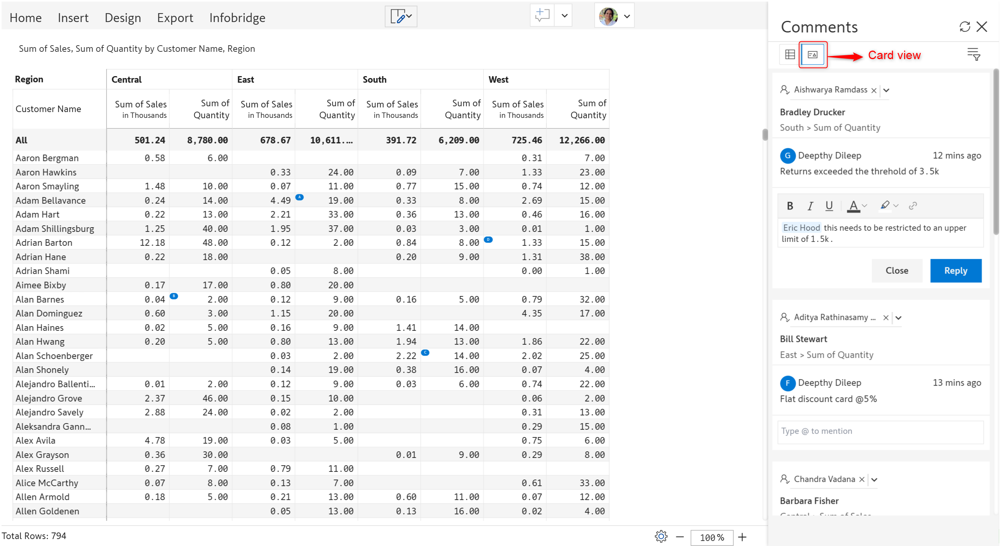

# Inforiver Writeback Matrix April 2025 - v4.4.

With the 4.4 release, you now have greater control over your data — choose whether or not to import future periods from a bridge, depending on what works best for your report. We've also made minor UI improvements in the Comments feature.

### 1. Match date periods in Infobridge

Infobridge supports forecasts and allows you to capture projections or data for future time periods. Your target reports, however, may not require future data. We've added a new **Show All Periods from Infobridge** option in the Manage Measures side pane:&#x20;

* When the toggle is enabled, all the time periods available in the bridge will be imported into the target report, irrespective of whether they exist in the target visual.
* When disabled, only the time periods in the bridge that exist in the target visual will be imported.


This option will be enabled only after creating an integration to a bridge


<figure><figcaption>
<strong>Show All Periods from Infobridge option</strong>
</figcaption></figure>

In the bridge, we have the allocated budgets for 2023 and 2024 as well as the projected budgets for 2025.

<figure><figcaption>
Projected and allocated budgets in the bridge
</figcaption></figure>

The target report contains the profits for 2023 and 2024. We need to integrate the budgets for 2023 and 2024 with this report. The projected budgets for 2025 are not required in this case.

<figure><figcaption>
Target report 
</figcaption></figure>

Since we've disabled the **Show All Periods from Infobridge** toggl&#x65;**,** when we insert the budget from the bridge, it will be inserted only for the time periods that exist in the target report.

<figure><figcaption>
Inserting budgets for existing time periods
</figcaption></figure>

### 2. Comments UI changes

In card view, you can track the details of the cells that have comments. When filters are applied, the comment icon will turn blue, making it easy to spot filtered comments at a glance.

<figure><figcaption></figcaption></figure>

You will be able to switch between 2 different views in the comments panel when you select number or alphabet as the comment indicator:

* **List view:** Displays all the comments in the visual.&#x20;
* **Card view:** Displays additional details like the reference to the cell to which the comment was added, assignee, and an option to reply to the comment.

<figure><figcaption>
List view
</figcaption></figure> <figure><figcaption>
Card view
</figcaption></figure>

### Bug fixes

* Allocations made to numeric data input fields with default values were not being reflected in formulas that referenced the numeric measure. In the latest version, allocations will automatically be reflected in the formula without a page switch.
* With Inforiver Matrix, you can update configured forecasts at any point with the reforecast option. The reforecast option, however, was not capturing native or formula measures that contained zeroes. This has been fixed.
* Infobridge refreshes were not triggered when a non-zero value was replaced with a blank value during reforecasting. In the latest version, reforecasting to a blank value will be automatically updated in the bridge and target visual as well.
