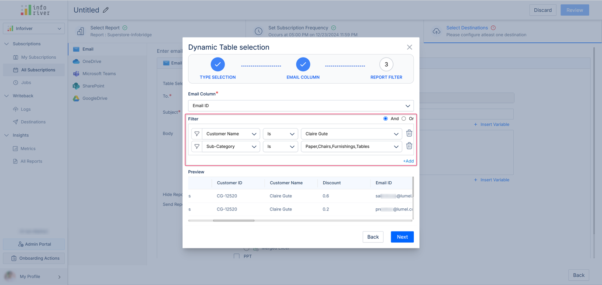
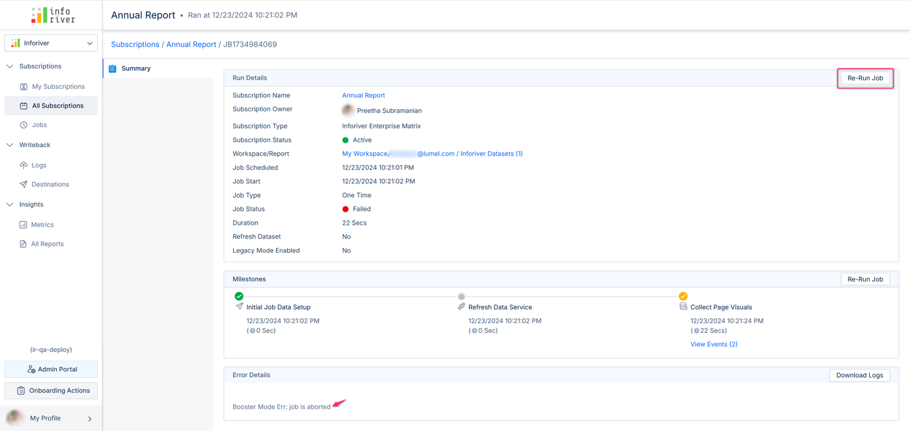
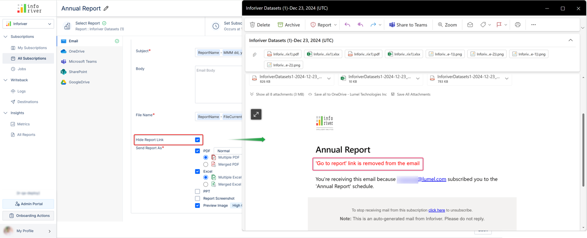

# Inforiver Writeback Matrix December 2024- v3.8 - Improved Scheduler Performance & Other Enhancements

Welcome to the Inforiver Writeback Matrix v3.8 release updates!&#x20;

This release is about our **optimized, high-performance scheduler** and **improvements to the scheduler user interface**, making your scheduling experience easier than ever.

Other enhancements include:

* Redesigned user interface for dynamic scheduler with multi-filter&#x20;
* Option to cancel ongoing subscription jobs
* Hiding the report link in email subscriptions
* Including report screenshots in emails along with native visuals
* Detailed error logs and messages. and much more.

Let’s dive into them quickly.

## Scheduler

### 1. High-performance scheduler for faster run times

Experience faster run times with our enhanced subscription scheduler. We have optimized our processes to significantly reduce job run times. Scheduler jobs are now thrice as fast compared to our previous standard mode.&#x20;

Also, the high-performance mode is now the default, while the standard mode is deprecated and can be chosen if necessary.&#x20;

### 2. Improved dynamic subscription scheduler UI

We have enhanced the dynamic subscription scheduler user interface by providing a user-friendly, step-by-step flow for easier and more intuitive report scheduling.

### 3. Multi-filter in dynamic subscription scheduler

When scheduling dynamic subscriptions, you can now include multiple filter criteria, combine them logically using AND/OR, and further customize your report deliveries for the recipients.

### 4. Cancel ongoing subscription jobs

We have added a ‘Cancel job’ option with which you can suspend ongoing subscription jobs. Cancelled jobs are recorded in error logs, and for email subscriptions, they would trigger an email notification.

After cancelling a job, you can choose to rerun it after making necessary changes.

### 5. One-click copy for subscription links

Inforiver lets you [initiate subscriptions from external applications](https://inforiver.com/blog/release-notes/inforiver-enterprise-2-9-8-updates/#Trigger-subscriptions) apart from scheduling them from the console. This requires you to copy the API token and the subscription link. We now provide a one-click copy option to copy the subscription link without any hassle.

### 6. Include report screenshot with native visuals

In email subscriptions, you can now include a PDF screenshot of the scheduled report along with native visuals. This feature allows you to simultaneously capture both Inforiver and native visuals through our subscription scheduler.

### 7. Hide report link in emails

When setting up an email subscription, you can choose to restrict your recipients from accessing the complete report and deliver only the specified report data.

By enabling the option highlighted below, you can remove the link to the report from the subscription emails.

### 8. Other Enhancements

* **Support for Reporting matrix visual export:** Inforiver’s subscription scheduler can now export Inforiver Reporting matrix visuals.
* **Page count limit check:** When scheduling reports that have more than six pages, there is a risk of job failure, which may require you to re-run the job after reducing the page count. Inforiver now prompts you well in advance, if the selected report exceeds the maximum allowable page limit of 6.
* **Export scenarios with row and column breaks:** The scenario exports can now retain row and column breaks, allowing you to present your scenario results in an organized and clutter-free format.
* **Scenario-based PowerPoint exports with simulations:** When exporting your scenarios in PPT, each scenario appears on a separate slide along with the applied simulations.
* **Label change:** The option label for compressing large PDF reports has been changed from 'Low Quality' to 'Compressed', and the 'High Quality' option has been renamed to 'Normal'.
* **Milestones integrated:** The subscription summary now presents a more concise event flow, displaying fewer milestones.
* **Detailed error messages:** Error logs and messages have been improved for clarity, better understanding and remediation.

This summarizes the improvements and enhancements included in this update.
