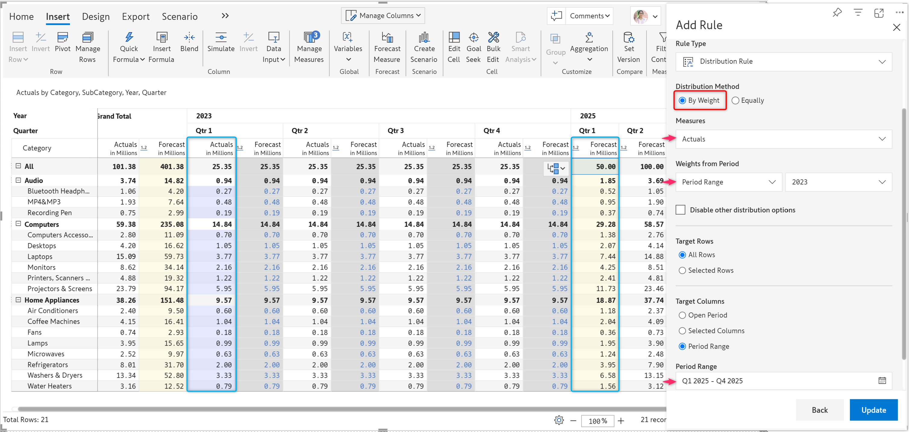
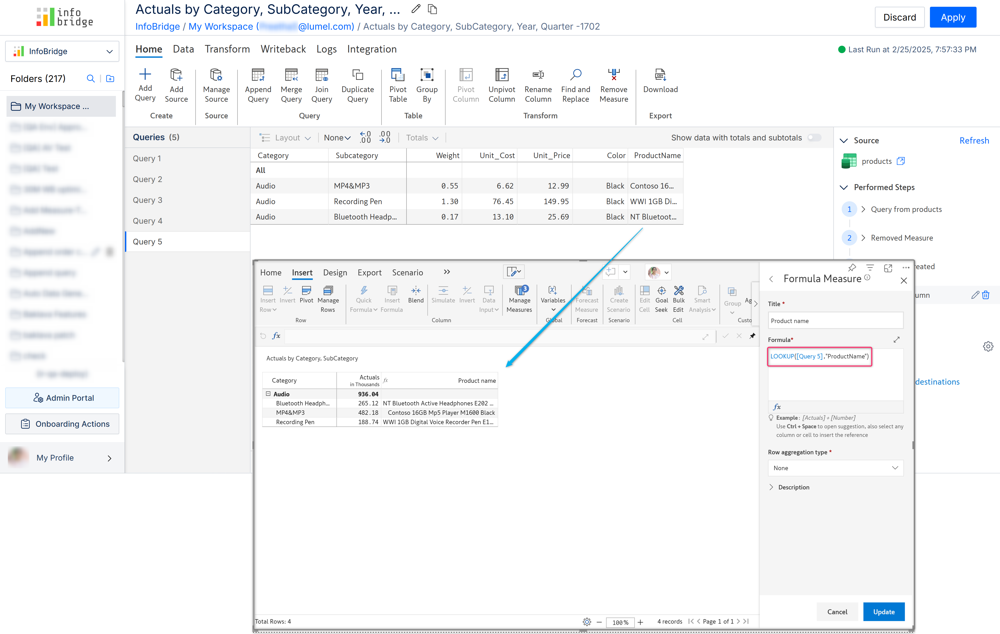

# Inforiver Writeback Matrix Feb 2025 - v4.0 -  User permissions, High-performance mode, Input rules

This release brings you significant updates such as the role-based access control, data input rules, high-performance mode, and much more. We have also added several other enhancements based on your feedback—specifically to the audit log, comment panel, and scheduler to enhance your overall experience with Inforiver.

Thank you for your feedback, which inspires us to continuously improve and innovate our product.

## 1. Introducing user roles and permissions

User management in Inforiver is now more secure and streamlined with our new, role-based access control policies.

Previously, there were only admin and member roles. In this release, we have introduced additional user roles with clearly defined access permissions .

If you are an admin, you can assign roles to users (or Active Directory groups) to specify what they can or cannot do with their Inforiver reports. For instance, an ‘input user’ can create data input entries, forecasts, scenarios, etc., while only an ‘input admin’ can change the related settings.

.png>)

Here is a summary of default roles available and their associated permissions:

<table><thead><tr><th>Roles</th><th width="483">Permissions</th></tr></thead><tbody><tr><td>Admin</td><td>Complete control within the product</td></tr><tr><td>Contributor</td><td>Member users have been migrated to this policy</td></tr><tr><td>Passive Viewer</td><td>View-only access to reports</td></tr><tr><td>Input Admin</td><td>Can create visual measures, modify data input settings and execute writeback</td></tr><tr><td>Input User</td><td>Can create data input entries, add comments, create bridge and execute writeback</td></tr><tr><td>Writeback Admin</td><td>Complete control over writeback settings</td></tr><tr><td>Forecast Admin</td><td>Can create forecast, bridge, input data entry and execute writeback</td></tr><tr><td>Subscription Admin</td><td>Create and manage subscriptions at tenant level</td></tr><tr><td>Subscription User</td><td>Create and manage report subscriptions</td></tr><tr><td>Infobridge Admin</td><td>Can create and manage bridge folders, enter data input and execute writeback</td></tr></tbody></table>

In addition to these default roles, workspace admins can create custom roles and policies on a granular level, ensuring enhanced data governance and security.

.png>)

Note: Existing admins and members have been moved to the ‘Admin’ and ‘Contributor’ roles, respectively. Admins retain their permissions for user management and writeback settings, while contributors can access all report-level settings.

You can refer to [this page](../admin-console/user-management/user-roles-and-permissions.md) to learn more about the default roles and their associated permissions.

## 2. Data Input

### 2.1. Input rules for data input and forecast measures

Manage your planning and forecasting workflows proactively by setting clear business controls in the form of input rules. These rules can include setting minimum and maximum thresholds, locking and unlocking cells to prevent changes to key values, and changing the distribution method.

When adding input and forecast columns to your report, you can configure these settings in the 'Data Input' and 'Forecast' side panels.

Additionally, we have now introduced a centralized menu option, 'Input Rules' for effective and collaborative management of input and forecast rules.

.png>)

With this, you can:

* Configure input and distribution rules for measures and columns in one place.
* Set global rules for all data input and forecast measures or apply them to specific measures.
* Choose the rows, columns, and period range to which the rules should apply.
* View additional details such as who set the rules, when they were configured, and the applicable rows, columns, and measures.

**Locking rule:** Configure which cells should be locked and restricted from changes during distribution and forecasting to ensure key values remain unchanged.

.png>)

**Min-Max rule:** Set limits on the minimum and maximum values users can enter in these measures. These constraints ensure that the measure values do not fall below or exceed your specified limits during forecasting and distribution.

.png>)

**Distribution rule:** Choose whether to distribute the total equally or to use a weighted distribution. You can also define the period range from which the weights will be derived, as well as the target rows and columns where they will be applied.

## 3. Data streaming to Analytics+

Want to create Analytics+ charts for your Inforiver reports? We have the solution with our new **Data Streamer** feature. With this, you can quickly stream your report’s dimension data, as well as native and custom input measures to an Analytics+ visual.

Create a sample Analytics+ visual with some measure added to it, as displayed below, side by side. Then, go to **Settings > Global Settings > Data Streamer**.

.png>)

Create a new data source in the Data Streamer by configuring the necessary fields and values for your visualization. Add filters, if needed. In the Analytics+ visual, customize your chart with options such as Chart Type, Pivot Data, etc., and you’re all set.

.png>)

## 4. Optimized performance for large datasets

Inforiver now supports faster and seamless working with large datasets, up to 1 million records with our new, high-performance mode.

This mode transforms the way the data input values are stored, retrieved, and updated. When enabled, you’ll notice improved performance and reduced processing times, especially with larger datasets.

.png>)

Please remember to **enable this mode before creating any data input measures** or columns in your report. Switching between modes is not supported after data input columns are created and updated unless you delete them.

## 5. Infobridge

### 5.1. Faster writeback up to 30 million records

Experience **three times faster writebacks** in Infobridge, with enhanced efficiency and scalability. We have improved the Infobridge writeback process to accommodate larger datasets, now supporting up to 10 million records. For Azure SQL destinations, Infobridge writebacks can handle up to 30 million records.

### 5.2. OneLake as data source

You can now add data sources from OneLake to Infobridge. Ensure that you’re connected to your Fabric Lakehouse and Azure Data Lake Storage from the ‘My Integrations’ page in the console, and you are good to go.

### 5.3. Support for EDITABLE data source

Infobridge can now fetch data from EDITable, enabling new possibilities for integrated and connected planning.

[EDITable](https://inforiver.com/editable/) supports a wide range of cloud-based and on-premises databases, including Fabric Warehouse, Fabric SQL, Azure SQL, Snowflake, Amazon Redshift, BigQuery, Databricks, and PostgreSQL. The data tables from these destinations can now be imported into Infobridge via EDITable for real-time and connected planning.

For example, in the image below, we have integrated data from EDITable into a bridge. This data can be accessed live from an Inforiver report using the ‘LOOKUP’ function.This way, you can seamlessly connect to multiple data sources from your Inforiver report.

<figure><figcaption>
Lookup from Infobridge
</figcaption></figure>

## 6. Writeback:

### 6.1. Seamless Auto-writeback

No more distracting notifications and pauses during the auto-writeback process. The auto-writeback process is now seamless, with the event notifications displayed at the bottom of the visual.

## 7. Forecast

The 'Forecast' tab now has an input rules menu where users can set up locking rules, the minimum and maximum values users can enter, and the distribution method for forecast measures and columns. To know more, click [here](inforiver-writeback-matrix-feb-2025-v4.0-user-permissions-high-performance-mode-input-rules.md#id-2.1.-input-rules-for-data-input-and-forecast-measures).

<figure><figcaption>
Input rules for forecast measures
</figcaption></figure>

## 8. Audit log – enhanced

The audit log now displays a complete and comprehensive overview of all changes made to the report. This includes changes to data input measures, forecast measures, scenarios, snapshots, writeback settings, comments settings, conditional formatting, and more.

You can filter the logs by type, date range, the user who made the changes, and logs that include comments.

<figure><figcaption>
Enhanced audit log
</figcaption></figure>

## 8. Scheduler:

### 8.1. Filter child jobs

Search and filter options have been added to the scheduler summary, allowing users to select child jobs based on table name, category, sub-category, job status, and recipients for email destinations.

<figure><figcaption>
Filter child jobs
</figcaption></figure>

## 9. Visual Formulas

The latest version supports statistical formulas for calculating standard deviation, variance, mean, median, mode, percentiles, and much more. Below is the list of all statiscal formulas supported in Inforiver:

<table data-full-width="false"><thead><tr><th>Function</th><th>Description</th></tr></thead><tbody><tr><td>RANK.EQ(number, ref, [order])</td><td>Returns the rank of a number in a list; gives the top rank if there are duplicates (similar to RANK).</td></tr><tr><td>RANK.AVG(number, ref, [order])</td><td>Returns the rank of a number in a list, but gives the average rank if there are duplicates.</td></tr><tr><td>PERCENTRANK.INC(array, x, [significance])</td><td>Returns the rank of a value as a percentage between 0 and 1 of the data set, including 0 and 1.</td></tr><tr><td>PERCENTRANK.EXC(array, x, [significance])</td><td>Returns the rank of a value as a percentage between 0 and 1 of the data set, excluding 0 and 1.</td></tr><tr><td>PERCENTILE(array, k)</td><td>Returns the k-th percentile in the given data.</td></tr><tr><td>PERCENTILE.EXC(array, k)</td><td>Returns the k-th percentile of values in a range, excluding the lowest and highest percentiles.</td></tr><tr><td>PERCENTILE.INC(array, k)</td><td>Returns the k-th percentile of values in a range, including the lowest and highest percentiles.</td></tr><tr><td>QUARTILE.EXC(array, quart)</td><td>Returns the quartile (1, 2, 3, or 4) of a data set, excluding the minimum and maximum values.</td></tr><tr><td>QUARTILE.INC(array, quart)</td><td>Returns the quartile of a data set, including the minimum and maximum values.</td></tr><tr><td>NORM.S.DIST(z, cumulative)</td><td>Returns the standard normal cumulative distribution function.</td></tr><tr><td>NORM.DIST(x, mean, standard_dev, cumulative)</td><td>Returns the normal distribution for a specified mean and standard deviation.</td></tr><tr><td>RANK(number, ref, [order])</td><td>Older version of RANK.EQ, which also returns a rank for a number within a list.</td></tr><tr><td>MODE.SNGL(number1, [number2], ...)</td><td>Returns the most frequently occurring value in a data set (single mode).</td></tr><tr><td>VAR.P(number1, [number2], ...)</td><td>Calculates the variance based on the entire population.</td></tr><tr><td>VAR.S(number1, [number2], ...)</td><td>Calculates the variance based on a sample.</td></tr><tr><td>STDEV.P(number1, [number2], ...)</td><td>Calculates standard deviation based on the entire population.</td></tr><tr><td>STDEV.S(number1, [number2], ...)</td><td>Calculates standard deviation based on a sample.</td></tr></tbody></table>

## 10. Commenting and Collaboration

The comment panel now features simple and detailed views, allowing users to edit comments inline on the panel, resize the panel to view longer comments, and manage who can add starred comments.

<figure><figcaption>
simple and detailed views
</figcaption></figure>

<figure><figcaption>
Manage permissions for starred comments
</figcaption></figure>

## 11. Other Enhancements

* This release adds Bulgarian language translation support within the Localization Settings.
* Granular forecast controls are included in the ‘Allowed User Controls’ window to manage permissions for closing periods, reforecasting, and distributing deficits in the Reading view.
* You can now writeback your snapshot data to the configured destinations using the Writeback option available in the Snapshots tab.
* The staging table is enabled by default in supported destinations, with an option to disable it if required.
* The author's name and date in comments will now be included in exports only if the corresponding option is checked in the Page Setup settings.
* The ‘Metrics’ page in the admin console now shows detailed information about the health of all worker services for better monitoring.
* Security/Active Directory groups without their emails enabled can also be included in the writeback settings user list, allowing them to use admin connections and add writeback destinations.
* The pivot explorer window is now bigger for improved readability.
* The issue with the 'LOOKUP' function for Infobridge query measures has been fixed.
