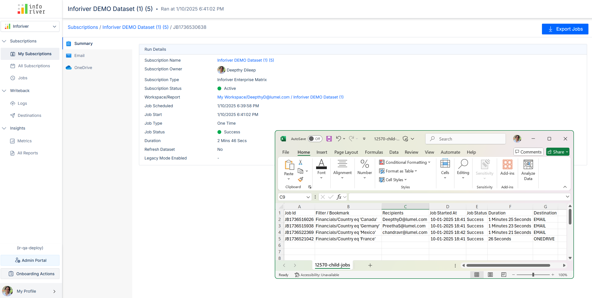

# Inforiver Writeback Matrix January 2025 - v3.9 - Fabric support, upgraded variables interface

## 1. Infobridge

#### 1.1. Support for Fabric Lakehouse sources

We’ve expanded Infobridge data integration capabilities – you can now import Fabric Lakehouse tables and cascade them into your connected planning reports in Inforiver!

Enter the workspace, Lakehouse, and table name to integrate the Lakehouse source. Please bear in mind that Fabric Lakehouse and Azure Data Lake Storage need to be in “Connected” state in the Admin console > My Integrations section.

<figure><figcaption>
Fabric lakehouse support
</figcaption></figure>

#### 1.2. Writeback to Fabric SQL destinations

Inforiver’s signature Writeback can now connect to Fabric SQL destinations. You can consolidate Inforiver reports and connected planning reports from Infobridge into Fabric SQL destinations.

<figure><figcaption>
Writeback to Fabric
</figcaption></figure>

#### 1.3. Visual column support

Inforiver reports often contain visual columns like tax rates or multiplier factors. Infobridge supports visual columns as well – you can integrate visual columns into your connected planning reports.

Note: the visual column will be treated as a visual measure within Infobridge, with the same values repeated for each column dimension category.

<figure><figcaption></figcaption></figure>

#### 1.4. Context-aware connected planning

Connected planning reports often have varying granularities. For example, you may have a regional budget that is cascaded into a global budget target report. The target report is likely to have slicers on dimensions like quarters, product lines, tax segments, etc.

Inforiver’s built-in context awareness has been extended to Infobridge sources - enabling context-aware connected planning. Let’s look at a quick demonstration. Our bridge contains quarterly Discounts that we need to integrate into our yearly profitability report.

<figure><figcaption></figcaption></figure>

The target Yearly Profitability report contains data at year-level. Before integrating the discounts from Infobridge, let’s use Inforiver’s Super Filter visual to set up context awareness in the target.&#x20;

<figure><figcaption></figcaption></figure>

The target visual has data at a higher granularity, i.e. year-level and the source bridge has quarterly data. When we create an integration to the discount bridge, we need to map the Quarter dimension to the filter context measure in the target profitability visual.

<figure><figcaption></figcaption></figure>

Note: When you need to import a measure/column from Infobridge, the filter context measure needs to be mapped to the column dimension. When you import rows and have a slicer for row dimensions, the filter context measure should be mapped to the row dimension.

Notice how the Infobridge measure, Discount, also changes in response to slicer selections.

<figure><figcaption></figcaption></figure>

#### 1.5. Automatic retry for data preparation jobs

The Inforiver suite is being constantly upgraded to provide a seamless user experience. In the latest version, you'll notice that when an initial data preparation job fails in Infobridge, it will automatically be re-triggered once.&#x20;

<figure><figcaption>
Automatic retry
</figcaption></figure>

#### 1.5. Measure and scenario selection interface&#x20;

You'll notice that the measure and scenario selection window has a more user-friendly interface.&#x20;

<figure><figcaption></figcaption></figure>

## 2. Data input

#### 2.1. Refined UI for data input rows

\-          Row gripper and Toolbar options

The Insert custom row options from the row gripper are now more accessible and better organized. Some of the options have also been renamed to make them more user-oriented – ‘Static rows’ to ‘Data Input’ and ‘Calculated rows’ to ‘Formula’.

Similar to the Row gripper options, the Insert Row options from the toolbar have also been reorganized to streamline your experience.

<figure><figcaption>
Insert row options,
</figcaption></figure>

\-          Changing the row type

You have the flexibility to switch between data input, calculated, and aggregated rows at any time with the new Row Type dropdown. For instance, you may have used a formula and referred to the values of an existing row dimension while creating the row. You can easily change it to data input and enter values without having to create a new data input row.

<figure><figcaption></figcaption></figure>

\-          Convert to template rows

You can also convert a custom row to a template row – i.e. the row will be available across all levels of the hierarchy. For instance, you may create a product line specific to a particular region. You can use the Templated option to replicate the same product line across all regions.

<figure><figcaption></figcaption></figure>

\-          Row management interface

The **Manage Rows** interface has been redesigned to enable you to efficiently govern custom rows in your Inforiver reports. Each type of row: calculated, aggregated, data input, and template can be identified based on the row icons. Use the Tree View to easily identify the hierarchy level where a specific row was created.

<figure><figcaption></figcaption></figure>

The **List** view displays rows in the order that they were inserted.

<figure><figcaption></figcaption></figure>

\-          Add child rows and sibling rows

You can instantly add child rows and sibling(at the same level of the hierarchy) rows right from the Manage Rows side pane.

<figure><figcaption></figcaption></figure>

\-          Search and filter custom rows

Use the Search and Filter options to search for a particular row category or display rows based on the type.

<figure><figcaption></figcaption></figure>

#### 2.2. Parent rows as calculated rows

With Inforiver, you can add organizational hierarchies or product lines on the fly with the Insert Rows feature. In the latest version, you have the flexibility to apply custom calculations on parent rows. In earlier versions, we would need to manually enter values for data input rows.

Select _Formula_ from the **Row Type** dropdown. You can enter custom calculations and refer to row dimensions categories.

<figure><figcaption>
Calculated parent rows
</figcaption></figure>

#### 2.3. Disable insert row should not allow entry for parent dimensions

If you have hierarchical row dimensions and want to disable row insertion for a specific dimension, this will automatically disable row insertion for all levels above it.

<figure><figcaption></figcaption></figure>

## 3.     Variables

Variables accept user input and enable report users to navigate hierarchies, apply filters, run scripts, perform dynamic calculations, and rank data on the fly. The new easy-to-navigate UI ensures a smooth experience for creating and maintaining your variables.

<figure><figcaption></figcaption></figure>

See how variables can make report navigation and editing easier without creating Inforiver filters or manually editing the header or visual measures.

<figure><figcaption></figcaption></figure>

## 4. Scheduler

#### 4.1. Cancel parent job option

If your subscription job is running long or you need to make additional modifications to your report before sending it out, you can use the new Cancel Job option in the scheduler. This will immediately abort the subscription and cancel both the parent and child jobs without having to abort each child job individually.

<figure><figcaption></figcaption></figure>

You’ll notice that the status of all your jobs is changed to Failed.

<figure><figcaption></figcaption></figure>

#### 4.2. Export jobs

You can now persist the status of your child job runs and save it to your desktop. Click the Export Jobs button to create an Excel extract.  &#x20;

<figure><figcaption></figcaption></figure>

## 5. Excel-like nested sorting

We’ve upgraded the Inforiver Sorting algorithm to provide advanced nested sorting options. You can sort your data based on multiple dimensions or measures. Please bear in mind that you can either sort based on row dimensions or based on measures, not both together.

<figure><figcaption></figcaption></figure>

## 6. Commenting and collaboration

#### 6.1. Comments settings revamp

With Inforiver’s Comments feature, you can allow users to collaborate and add more context to your reports. It doesn’t stop at that – you can set priorities for comments, post replies, schedule comment digests, and assign permissions. In this version, the Comment settings have been re-structured to enhance accessibility.

<figure><figcaption></figcaption></figure>

You can create starred comments, filter based on resolved/starred/your threads, and sort comments on priority/creation time from the View All Comments side pane.

#### 6.2. Marker mode enhancements

When you create notes in Inforiver, you can enable marker mode to highlight important observations while presenting your report. You can now set the color, shape, and width of markers.

<figure><figcaption></figcaption></figure>

## 7. Performance mode

Inforiver’s differentiated architecture enables faster processing of large hierarchies, ensuring optimal performance while creating reports with complex hierarchical data. To efficiently analyze extensive hierarchical datasets without compromising on performance, we recommend switching to the new Performance Table layout.

<figure><figcaption></figcaption></figure>

Note: This layout can be applied only when the report does not contain any column dimensions.

## 8. Audit log enhancements

Inforiver’s audit log feature now captures a much higher level of information:

\- User details along with timestamp when the report is modified. &#x20;

\- Changes to settings like default values will be recorded in the audit trail for custom columns and rows,

\- Measure resets will be recorded.

<figure><figcaption></figcaption></figure>

## 9. Visual formulas

#### 9.1. Normal distribution formulae

Normal distribution is widely used in financial reports and analysis for performance benchmarking, portfolio risk management, interest rate modeling, and other purposes. The latest version of Inforiver allows you to use normal and inverse distribution formulae.

<figure><figcaption></figcaption></figure>

Supported formulae:

<figure><figcaption></figcaption></figure>

## 10. Formatting

#### 10.1. Conditional formatting for charts

Visualize your numbers better with inline charts in your matrix reports. You can now apply conditional formatting for inline charts, enabling stakeholders to identify trends and outliers easily. &#x20;

<figure><figcaption>
Conditional formatting for inline charts
</figcaption></figure>

#### 10.2. Conditional formatting for row headers

You can highlight row headers with conditional formatting when your actuals satisfy pre-defined conditions. Select _Row Headers_ from the **Apply to** dropdown. You can use conditional formatting to set a border, font style, font color, and cell background for row headers.

<figure><figcaption></figcaption></figure>

#### 10.3. Conditional formatting icons & text for date measures

You can use icons and text to highlight date measures with conditional formatting.&#x20;

<figure><figcaption></figcaption></figure>

#### 10.4. Icons in visual measures, columns, and rows

Enhance the visual appeal of your reports with icons and symbols in measures headers, column headers, and inserted rows. You can copy the preferred icon and paste it in the title section.

<figure><figcaption>
Using symbols in measure and row headers
</figcaption></figure>

#### 10.5. Conditional formatting for data input fields

Highlight your data input fields like number, dropdown, and person columns with conditional formatting. When users enter values, you can specify rules to automatically apply formatting when the rules are satisfied e.g. spotlight the cells when the budget entered exceeds a certain limit.

<figure><figcaption></figcaption></figure>

#### 10.6. Scaling options for charts

In the Customize tab, you have options to apply common scaling for all measures or individual scaling for each measure.

<figure><figcaption></figcaption></figure>

## 11. Other enhancements

#### 11.1. Sort icon upgrade

When you sort measures from the column gripper, you'll notice that the sort icons have been upgraded to a more intuitive version.

<figure><figcaption>
New sort icons
</figcaption></figure>

#### 11.2. Refer to visual measures, simulations, and forecasts in headers

With Inforiver, you can select the data displayed in header charts and KPIs. In the latest version, you can refer to visual measures, formulae, forecasts, simulations, and data inputs in header charts and KPIs.

<figure><figcaption></figcaption></figure>

#### 11.3. Custom date formatting for non-hierarchical dates

You can now use custom date formats when you have non-hierarchical date fields in your dataset.

<figure><figcaption></figcaption></figure>

#### 11.4. Aggregation notification while converting to percentages

When you convert a measure to a percentage or vice-versa, Inforiver will provide a link in the notification that will allow you to easily switch to native aggregation if needed.

<figure><figcaption></figcaption></figure>

#### 11.5. Ungroup and remove group in row gripper

You can use the row gripper to flatten custom row hierarchies. Notice how the parent _Operations_ group is removed and the child categories are converted into parent categories after ungrouping.

<figure><figcaption></figcaption></figure>

The Remove Group option will delete the parent category i.e. remove the selected level of the hierarchy including all child records.

#### 11.6. WAF compatibility

Infobridge, Inforiver, and Editable can now work together with client-side Web Application Firewalls (WAF) to stay secure. [Learn more about WAF compatibility in Inforiver](https://docs.inforiver.com/inforiver-enterprise-on-prem/how-to-guides/application-gateway-integration#for-web-application-firewall-waf-support-you-must-consider-things-like).

#### 11.7. Performance boost for allocations

Significant performance optimizations will enable you to seamlessly distribute and allocate forecasts/data inputs for up to 1 million cells.&#x20;

#### 11.8. Unlock cells in the Read view

Report users will be able to lock and unlock cells in read view. They will not however be able to unlock cells that were locked by the report author.

#### 11.9. Functions for Display Settings

Report authors can choose to give users access to certain display settings like ragged hierarchy, semantic formatting, and null/zero handling with scripts. When used with variables, users will be able to turn these settings on or off although they cannot directly access display settings.

#### 11.10. Search bar for scenarios and semantic models

We've added a search bar to enable you to quickly locate dimensions while creating scenarios or fetching options from a semantic model.

<figure><figcaption></figcaption></figure>

#### 11.12. Semantic formatting from column gripper

You can override the global semantic model format set in Display settings and apply individual semantic formatting for measures from the column gripper.

<figure><figcaption></figcaption></figure>

#### 11.13. Sign in headers for all templates

The Sign in Headers option could be applied only to IBCS templates in earlier versions. You can now use it for all Inforiver templates.

<figure><figcaption></figcaption></figure>

#### 11.14. Enhancements to minimal with tabs toolbar

Crop issues in the Customize tab while using the Minimal with tabs toolbar have been fixed.

<figure><figcaption></figcaption></figure>
