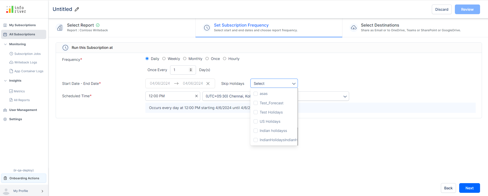

# Inforiver Writeback Matrix January 2025 - v3.9

## Data input

### Parent rows as calculated rows

With Inforiver, you can add organizational hierarchies or product lines on the fly with the Insert Rows feature. In the latest version, you have the flexibility to apply calculations on parent rows.

## Formatting

### Conditional formatting for charts

Visualize your numbers better with inline charts in your matrix reports. You can now apply conditional formatting for inline charts, enabling stakeholders to identify trends and outliers easily. &#x20;

<figure><figcaption>
Conditional formatting for inline charts
</figcaption></figure>

### Conditional formatting for row headers

You can highlight row headers with conditional formatting when your actuals satisfy pre-defined conditions. Select _Row Headers_ from the **Apply to** dropdown. You can use conditional formatting to set a border, font style, font color, and cell background for row headers.

<figure><figcaption></figcaption></figure>

### Conditional formatting icons & text for date measures

You can use icons and text to highlight date measures with conditional formatting.&#x20;

<figure><figcaption></figcaption></figure>

### Icons in visual measures, columns, and rows

Enhance the visual appeal of your reports with icons and symbols in measures headers, column headers, and inserted rows. You can copy the preferred icon and paste it in the title section.

<figure><figcaption>
Using symbols in measure and row headers
</figcaption></figure>

## Other enhancements

### Sort icon upgrade

When you sort measures from the column gripper, you'll notice that the sort icons have been upgraded to a more intuitive version.

<figure><figcaption>
New sort icons
</figcaption></figure>

### Refer to visual measures, simulations, and forecasts in headers

With Inforiver, you can select the data displayed in header charts and KPIs. In the latest version, you can refer to visual measures, formulae, forecasts, simulations, and data inputs in header charts and KPIs.

<figure><figcaption></figcaption></figure>

### Custom date formatting for non-hierarchical dates

You can now use custom date formats when you have non-hierarchical date fields in your dataset.

<figure><figcaption></figcaption></figure>

### Aggregation notification while converting to percentages

When you convert a measure to a percentage or vice-versa, Inforiver will provide a link in the notification that will allow you to easily switch to native aggregation if needed.

<figure><figcaption></figcaption></figure>

