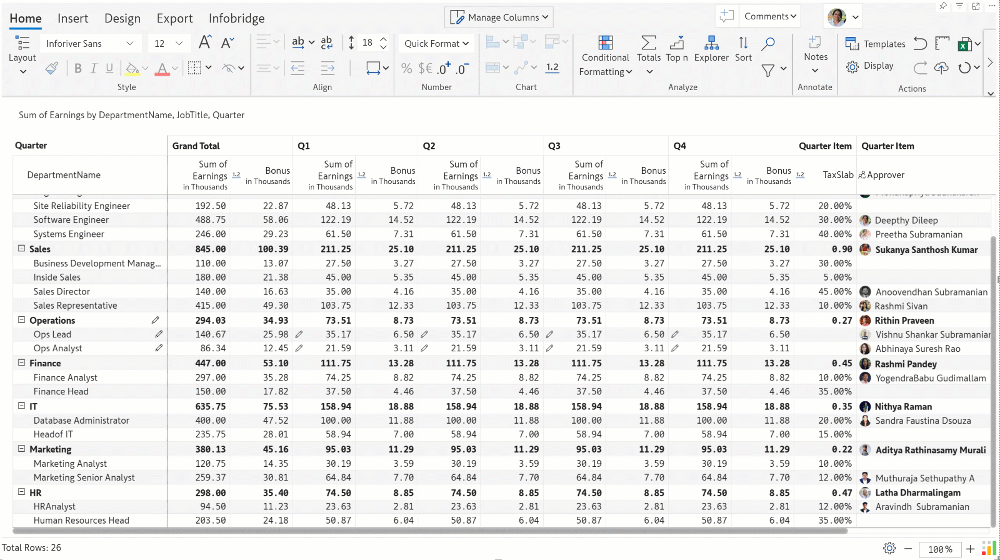

# Inforiver Writeback Matrix January 2025 - v3.9

## Infobridge

### Automatic retry for data preparation jobs

The Inforiver suite is being constantly upgraded to provide a seamless user experience. In the latest version, you'll notice that when an initial data preparation job fails in Infobridge, it will automatically be re-triggered once.&#x20;

<figure><figcaption>
Automatic retry
</figcaption></figure>

### Measure and scenario selection interface&#x20;

You notice that the measure and scenario selection window has a more user-friendly interface.&#x20;

<figure><figcaption></figcaption></figure>

## Data input

### Refined UI for data input rows

\-          Row gripper and Toolbar options

The Insert custom row options from the row gripper are now more accessible and better organized. Some of the options have also been renamed to make them more user-oriented – ‘Static rows’ to ‘Data Input’ and ‘Calculated rows’ to ‘Formula’.

Similar to the Row gripper options, the Insert Row options from the toolbar have also been reorganized to streamline your experience.

<figure><figcaption>
Insert row options,
</figcaption></figure>

\-          Changing the row type

You have the flexibility to switch between data input, calculated, and aggregated rows at any time with the new Row Type dropdown. For instance, you may have used a formula and referred to the values of an existing row dimension while creating the row. You can easily change it to data input and enter values without having to create a new data input row.

<figure><figcaption></figcaption></figure>

\-          Convert to template rows

You can also convert a custom row to a template row – i.e. the row will be available across all levels of the hierarchy. For instance, you may create a product line specific to a particular region. You can use the Templated option to replicate the same product line across all regions.

<figure><figcaption></figcaption></figure>

\-          Row management interface

The **Manage Rows** interface has been redesigned to enable you to efficiently govern custom rows in your Inforiver reports. Each type of row: calculated, aggregated, data input, and template can be identified based on the row icons. Use the Tree View to easily identify the hierarchy level where a specific row was created.

<figure><figcaption></figcaption></figure>

The **List** view displays rows in the order that they were inserted.

<figure><figcaption></figcaption></figure>

\-          Add child rows and sibling rows

You can instantly add child rows and sibling(at the same level of the hierarchy) rows right from the Manage Rows side pane.

<figure><figcaption></figcaption></figure>

\-          Search and filter custom rows

Use the Search and Filter options to search for a particular row category or display rows based on the type.

<figure><figcaption></figcaption></figure>

### Parent rows as calculated rows

With Inforiver, you can add organizational hierarchies or product lines on the fly with the Insert Rows feature. In the latest version, you have the flexibility to apply custom calculations on parent rows. In earlier versions, we would need to manually enter values for data input rows.

Select _Formula_ from the **Row Type** dropdown. You can enter custom calculations and refer to row dimensions categories.

<figure><figcaption>
Calculated parent rows
</figcaption></figure>

## Formatting

### Conditional formatting for charts

Visualize your numbers better with inline charts in your matrix reports. You can now apply conditional formatting for inline charts, enabling stakeholders to identify trends and outliers easily. &#x20;

<figure><figcaption>
Conditional formatting for inline charts
</figcaption></figure>

### Conditional formatting for row headers

You can highlight row headers with conditional formatting when your actuals satisfy pre-defined conditions. Select _Row Headers_ from the **Apply to** dropdown. You can use conditional formatting to set a border, font style, font color, and cell background for row headers.

<figure><figcaption></figcaption></figure>

### Conditional formatting icons & text for date measures

You can use icons and text to highlight date measures with conditional formatting.&#x20;

<figure><figcaption></figcaption></figure>

### Icons in visual measures, columns, and rows

Enhance the visual appeal of your reports with icons and symbols in measures headers, column headers, and inserted rows. You can copy the preferred icon and paste it in the title section.

<figure><figcaption>
Using symbols in measure and row headers
</figcaption></figure>

## Other enhancements

### Sort icon upgrade

When you sort measures from the column gripper, you'll notice that the sort icons have been upgraded to a more intuitive version.

<figure><figcaption>
New sort icons
</figcaption></figure>

### Refer to visual measures, simulations, and forecasts in headers

With Inforiver, you can select the data displayed in header charts and KPIs. In the latest version, you can refer to visual measures, formulae, forecasts, simulations, and data inputs in header charts and KPIs.

<figure><figcaption></figcaption></figure>

### Custom date formatting for non-hierarchical dates

You can now use custom date formats when you have non-hierarchical date fields in your dataset.

<figure><figcaption></figcaption></figure>

### Aggregation notification while converting to percentages

When you convert a measure to a percentage or vice-versa, Inforiver will provide a link in the notification that will allow you to easily switch to native aggregation if needed.

<figure><figcaption></figcaption></figure>

### Ungroup and remove group in row gripper

You can use the row gripper to flatten custom row hierarchies. Notice how the parent _Operations_ group is removed and the child categories are converted into parent categories after ungrouping.

<figure><figcaption></figcaption></figure>

The Remove Group option will delete the parent category.
