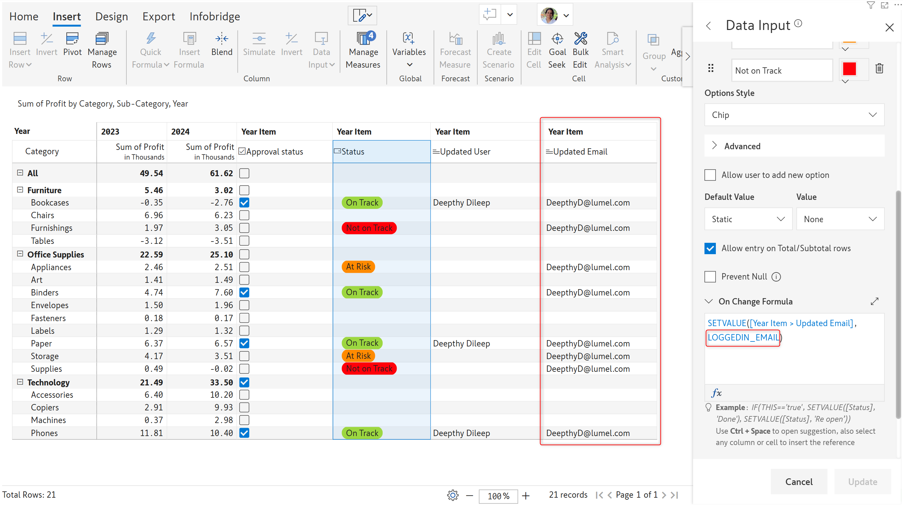

# Inforiver Writeback Matrix March 2023 - v4.1

As part of this release, we've brought performance improvements in Infobridge and new identifiers to capture the last updated user/email for writeback.

### 1. Infobridge - Performance optimization for data input updates

We've optimized the data preparation time for updates to data input values. Large datasets with more than 90k records can be processed faster. Data preparation that used to previously take a few minutes to complete, is now completed in seconds.

### 2. Writeback for last updated user and email

The Writeback Matrix offers built-in housekeeping columns to capture the last updated user and time for data input fields. However, these fields cannot be exported while writing back.

Instead of using the built-in housekeeping columns, you can leverage the SETVALUE function with the new <mark style="color:green;">LOGGEDIN\_NAME</mark> and <mark style="color:green;">LOGGEDIN\_EMAIL</mark> identifiers and store them in a text field. [Learn how to use the SETVALUE function](../working-with-inforiver/16.-approval-workflows.md#id-1.-using-scripts).

In this example, we're capturing the user name when the approval checkbox is changed and the user email when the project status single select is changed.

<figure><figcaption>
Capturing the user name in a text field
</figcaption></figure> <figure><figcaption>
Capturing the user email in a text field
</figcaption></figure>

The text fields can then be written back to the preferred destination(s).

### Bug fix

* Date data input fields were throwing an "Invalid date" error when the SETVALUE function was used to assign NULL values. This issue has been remediated.
