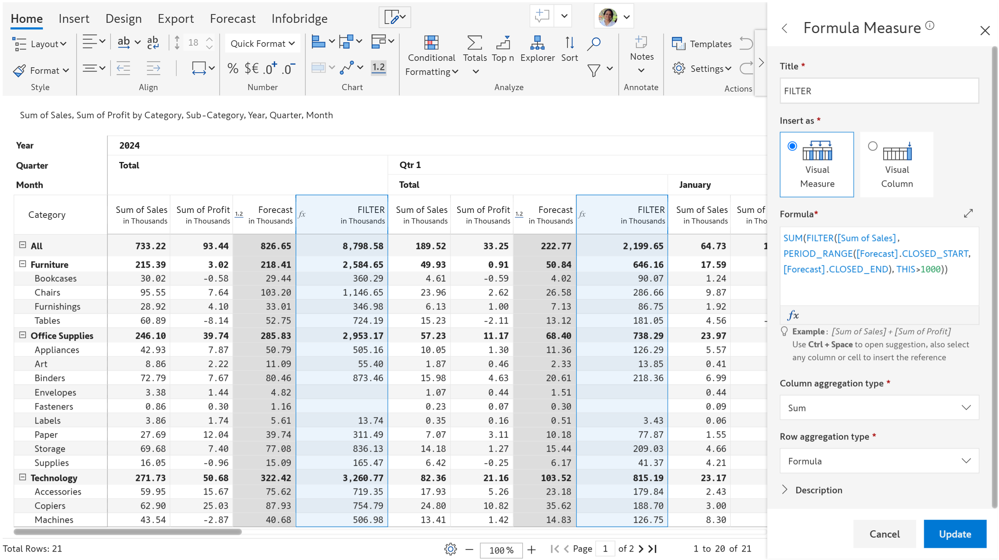
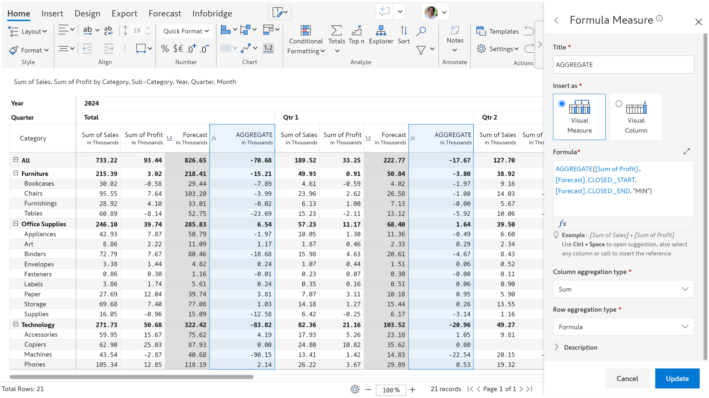
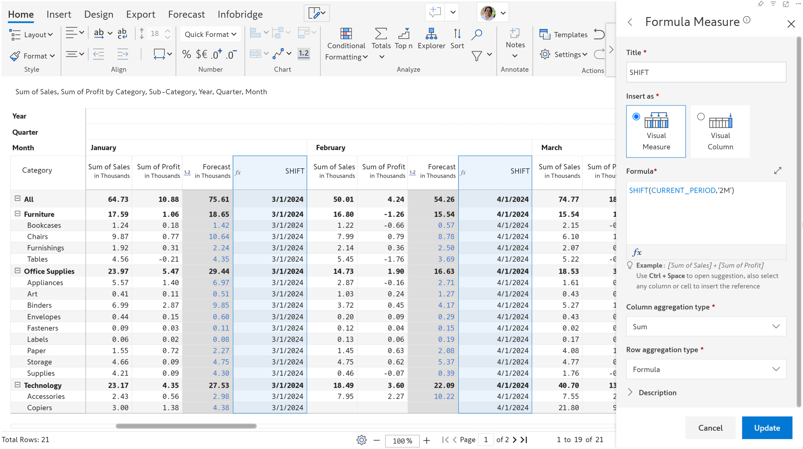
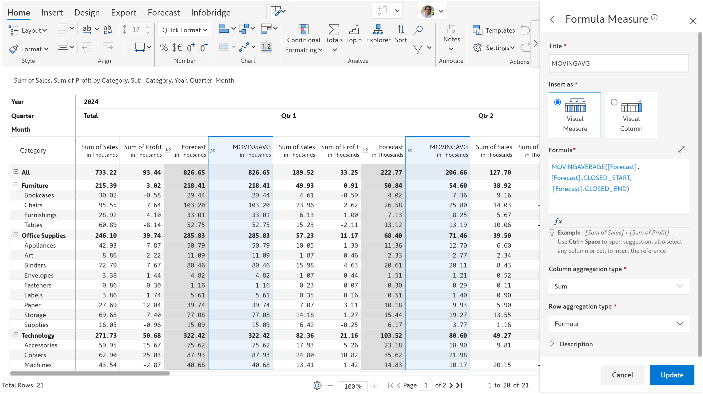
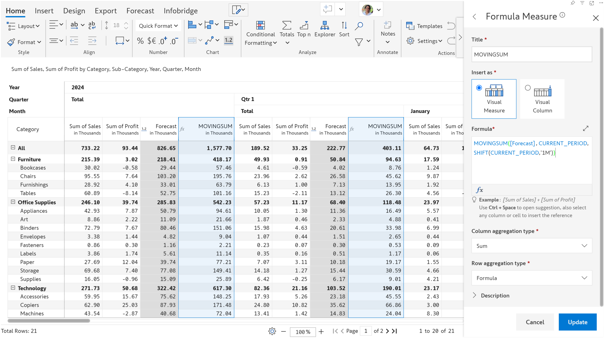
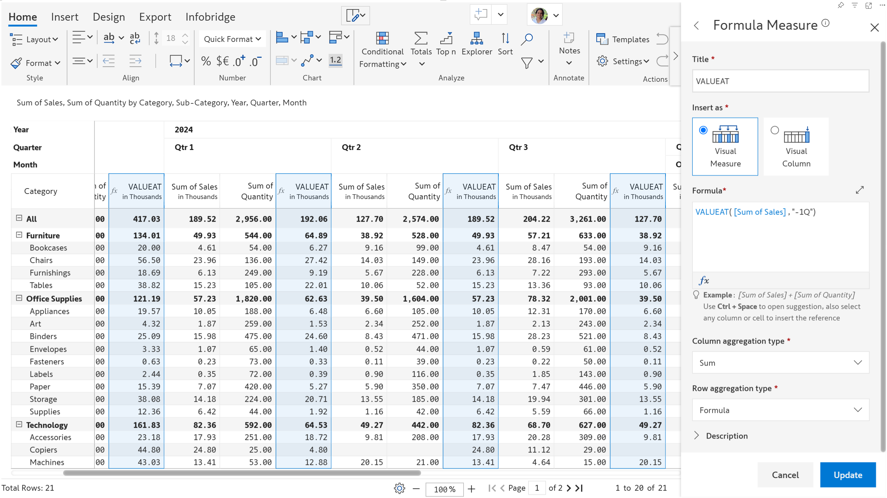

# Inforiver Writeback Matrix March 2025 - v4.2.2 - Time series formulae

## New time series formulae

We've introduced a range of easy-to-use formulas for manipulating time series data. Whether you are tracking financial trends, analyzing sales performance, or identifying anomalies, these formulas enable you to filter and compare data efficiently.

<table><thead><tr><th width="178">FUNCTION NAME</th><th>DESCRIPTION</th></tr></thead><tbody><tr><td>VALUEAT</td><td>Returns the value of a measure for a specified date or a date shift relative to the current column</td></tr><tr><td>MOVINGSUM</td><td>Returns the sum of a measure over a specified date range</td></tr><tr><td>MOVINGAVERAGE</td><td>Returns the average of a measure over a specified date range</td></tr><tr><td>SHIFT</td><td>Shifts a date by a specified time period like a month, quarter or year</td></tr><tr><td>AGGREGATE</td><td>Performs a specific aggregation like min/max/avg/sum on a measure over a specified time range</td></tr><tr><td>PERIOD_RANGE</td><td>Returns a date range array between two specified dates</td></tr><tr><td>FILTER</td><td>Returns the measure values over a time range, only values satisfying the filter condition will be returned</td></tr></tbody></table>

<figure><figcaption>
FILTER
</figcaption></figure> <figure><figcaption>
AGGREGATE
</figcaption></figure> <figure><figcaption>
SHIFT
</figcaption></figure>

<figure><figcaption>
MOVINGAVERAGE
</figcaption></figure> <figure><figcaption>
MOVINGSUM
</figcaption></figure> <figure><figcaption>
VALUEAT
</figcaption></figure>

## Other enhancements

* As part of our commitment to security, we have identified and resolved high-priority vulnerabilities, strengthening the overall security of the Inforiver Writeback Matrix.
*
