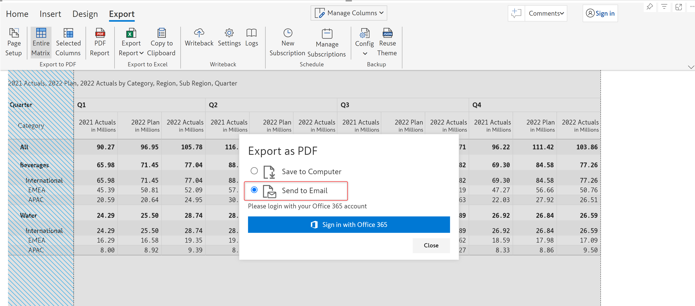
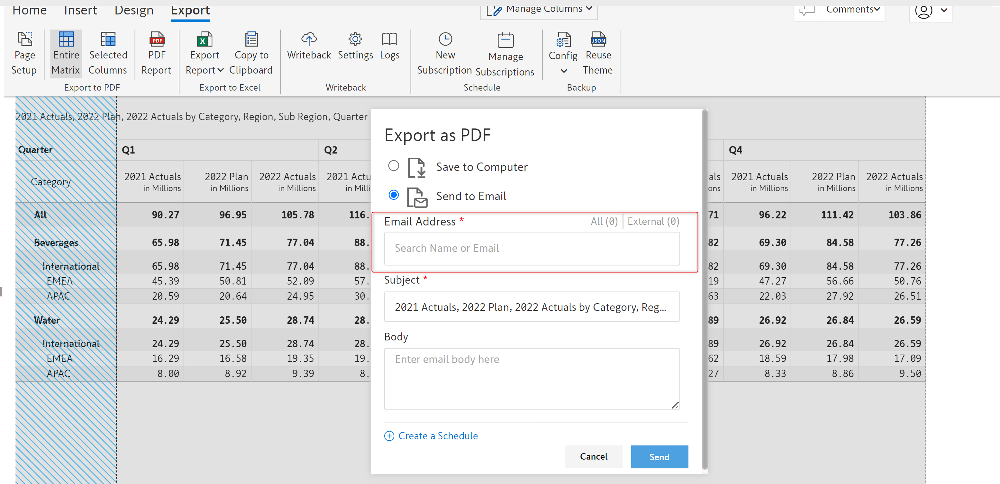
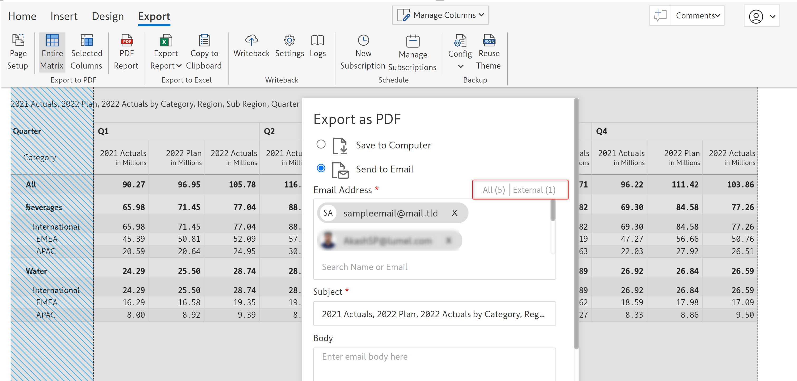
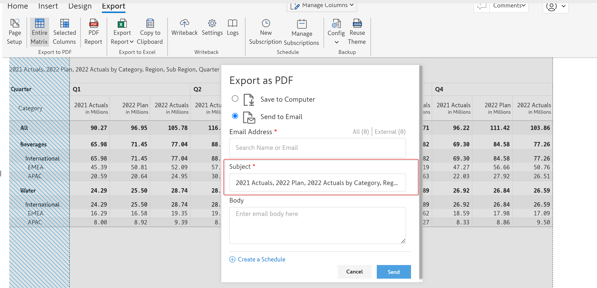
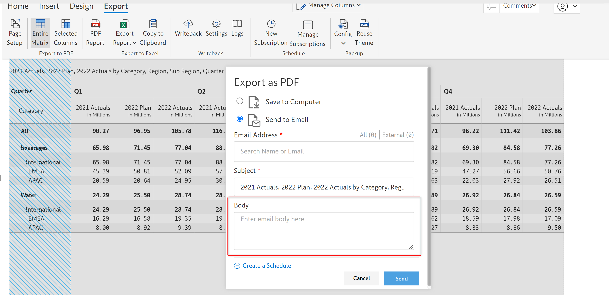
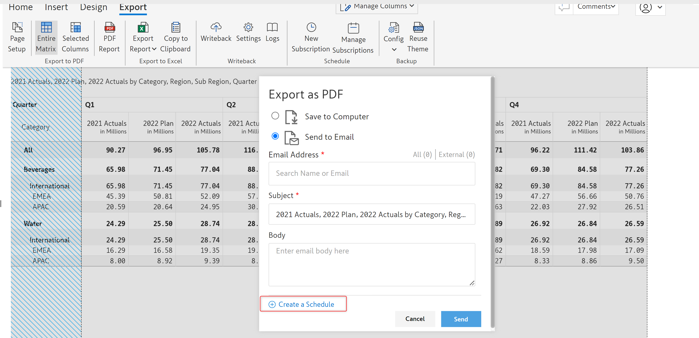
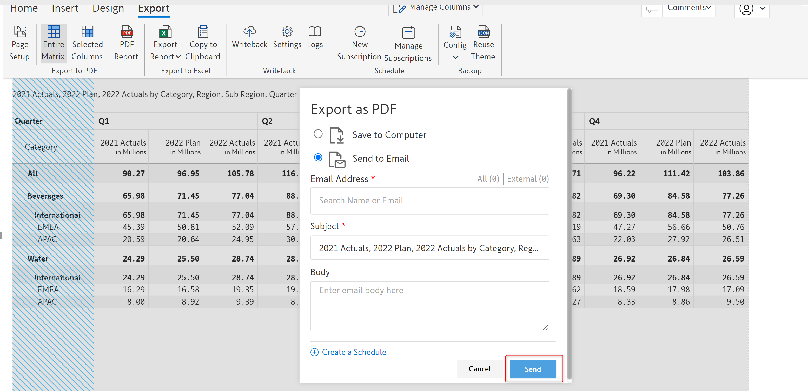
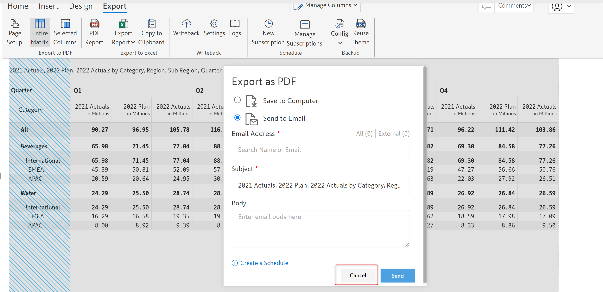

# Ad-hoc emails

When you export the report as a 'PDF' or as an 'Excel' file, you can either save the report to your computer or send it as an email.


Ad-hoc emails are supported only in Inforiver Enterprise


If you select the 'Send to Email' option, you will be asked to authenticate with your Microsoft 365 account.&#x20;

<figure><figcaption>
Send to email authentication option
</figcaption></figure>

After successful authentication, the following fields will be shown.

#### i) Email address&#x20;

Here you can mention all the email addresses and AD groups to whom you want to send the report. You can also search recipients using their names.

<figure><figcaption>
Email address option
</figcaption></figure>

You can also mention external email addresses (emails of people who are not a part of the organization).

<figure><figcaption>
Selecting and inserting email recipients
</figcaption></figure>

There are two labels at the top of the field. &#x20;

* **All** - Indicates the count of all the email recipients
* **External** - Indicates the count of the external email recipients

<figure><figcaption>
Email labels option
</figcaption></figure>

#### ii) Subject&#x20;

In this field, you can enter the subject of the email. By default, it will have the names of all the fields added to the report. You can edit it if needed.

<figure><figcaption>
Email subject option
</figcaption></figure>

#### iii) Body&#x20;

In this field, you can enter the email body.

<figure><figcaption>
Email body option
</figcaption></figure>

#### iv) Create a schedule&#x20;

Clicking on this link will create a new schedule for the report. You can learn more about creating and managing schedules in the [schedule reports](broken-reference) section.

<figure><figcaption>
Create a schedule option
</figcaption></figure>

#### v) Send

Click 'Send' to send the email to the entered recipients.

<figure><figcaption>
Send option
</figcaption></figure>

#### vi) Cancel

Click 'Cancel' to close the modal.

<figure><figcaption>
Cancel option
</figcaption></figure>

In the next section, we'll look at [scheduling reports](broken-reference).
