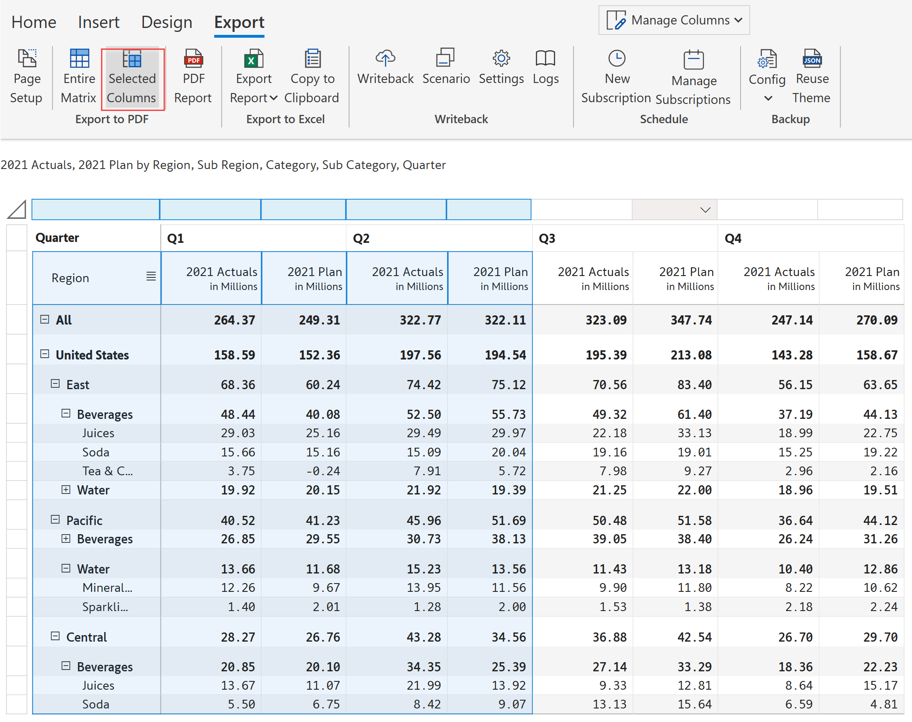

# Export to PDF & Excel

Inforiver allows you to export the table/matrix as either PDF or Excel. The industry-leading export capability delivers the following:

* Export with formatting, category/value structure and notes ​
* Export table/matrix along with scaled number formatting​
* Export calculated rows, columns, and edited cells​
* ​End-users in the reading view can customize export options​​
* ​Export to Excel with expand/collapse capability
* Export to multiple Excel worksheets based on category values​
* ​Pagination & page-break support for Export to PDF

You can find the export option under the 'Export' tab of the toolbar. There are two sections: 'Export to PDF' & 'Export to Excel'. Let's take a look one by one.

<figure><figcaption>
Export options
</figcaption></figure>


Export to PDF/Excel is supported only in Power BI Service.


### 1. Export to PDF

The first step in exporting as a PDF file is configuring the page setup.&#x20;

### i) Page setup

The page setup section provides options to customize the page size, orientation, margin etc. Click 'Page Setup', and a window opens as shown.

<figure><figcaption>
Page setup
</figcaption></figure>

a) When the number of rows/columns doesn't fit on a single page, you can define the order in which the rows/columns are exported using the '**Content order**' option.

Let's consider the below example. Based on the page scaling, only 8 columns and 20 rows can be accommodated on a single page.&#x20;

When the '**Row first**' option is chosen, the remaining rows for the first 8 columns are displayed on the second page. The third and fourth-page contents are highlighted in the image.

<figure><figcaption>
Row-first export
</figcaption></figure>

When the '**Column first**' option is chosen, the remaining columns for the first 20 rows are displayed on the second page. The third and fourth-page contents are highlighted in the image.

<figure><figcaption>
Column-first export
</figcaption></figure>

b) Select the '**Page size**' from the drop-down - Available sizes are Letter, A3, A4, A5. Tabloid and Legal.

c) You can select either Landscape or Portrait as page '**Orientation**'.

d) You can scale the page manually by percentages or automatically scale to fit all columns in a single page using the '**Scaling**' option.

e) You can apply a Narrow, Normal or Wide '**Margin**' as per the requirement.

f) You can select 'Font' style from the available options in the dropdown. Custom fonts can also be used when exporting.


If the data is customized with different fonts, the font chosen in the Settings panel is used for PDF export.


g) You can '**Show header and footer**' either only on the First Page or on Every Page

h) You can create a cover page for your report by **First page image** toggle. Select a custom image to use as the cover page.

<figure><figcaption>
Cover image
</figcaption></figure>

&#x20;i) If you want the image to fill the entire cover page, select the **Use as background image** checkbox**.**

<figure><figcaption>
Use as background image for PDF extracts
</figcaption></figure>

j) You can capture comments and replies **i**n the fully formatted PDF exports. Check the **'Include comment replies'** to export the replies in the comments column.

<figure><figcaption>
Report that has comments and replies
</figcaption></figure>

After exporting the report to a PDF, you will be able to see formatted comments and replies in the file.

<figure><figcaption>
Comments and replies
</figcaption></figure>

k)You can select the '**Include footnotes**' option to export the footnotes along with the table/matrix

l) You can set the '**Footnote position**' as

* Last Page: Footnotes get printed on the last page.
* Dynamic: Based on the available space, footnotes get printed either on the same page where they are added or on the last page.

m) Click on 'Update' to save your page setup selection. Click on 'Reset' to reset all your selections.&#x20;

### ii) Exporting

Once the page setup is complete, you need to choose whether the entire matrix needs to be exported or just selected columns.&#x20;

#### Entire matrix

a) You can export all the rows and columns by clicking 'Entire Matrix'. Click on 'PDF Report' to export the file in PDF format.

<figure><figcaption>
Export entire matrix PDF
</figcaption></figure>

c) A pop-up appears as shown. The PDF file can be either saved to the computer or it can be sent by email. To save the document, choose 'Save to Computer', and click on the 'Click to export' option.&#x20;

<figure><figcaption>
Pop up
</figcaption></figure>

e) A pop-up appears showing a warning, click 'Download'.

<figure><figcaption>
Download popup
</figcaption></figure>

f) The entire matrix gets exported as shown.

<figure><figcaption>
Entire matrix PDF
</figcaption></figure>

#### Selected columns

If you need to export only selected columns of your report, click 'Selected Columns' as highlighted in the below image.

<figure><figcaption>
Export selected columns
</figcaption></figure>

The selected columns 'Quarter, Q1, Q2' are downloaded as shown.

<figure><figcaption>
Selected columns PDF
</figcaption></figure>


Export to PDF does not support image columns.


### &#x20;2. Export to Excel

You can export your report as an Excel file by clicking on the 'Export report' dropdown as shown in the below image.

When there are row/column hierarchies, there are three ways to export:  'Fully Expanded', 'With Expand/Collapse', and 'Current State'.&#x20;

<figure><figcaption>
Export report
</figcaption></figure>


Note that 'Page setup' is not applicable for export to Excel.


Let's look at the three options one by one.

### i) Fully expanded

You can export the visual with all rows fully expanded by choosing the 'Fully Expanded' option. In the Inforiver visual, you can see that 'East' and Pacific -> Beverages are collapsed.&#x20;

<figure><figcaption>
Fully expanded option
</figcaption></figure>

In the exported Excel, you can see that 'East' and Pacific -> Beverages are fully expanded.

<figure><figcaption>
Fully expanded excel report
</figcaption></figure>

### ii) With expand/collapse

To export as Excel with expand/collapse-enabled row hierarchies, select the 'With Expand/collapse' option.

<figure><figcaption>
With expand/collapse option
</figcaption></figure>

The downloaded Excel shows the same expand/collapse state as in the report and also has the expand/collapse buttons.

<figure><figcaption>
Excel report with expand/collapse
</figcaption></figure>


Export to Excel retains the expand/collapse state only for row hierarchy and not for column hierarchy.


### iii) Current state&#x20;

To export the current expand/collapse state without an option to expand/collapse in the Excel file, you can select the 'Current state' option.

<figure><figcaption>
Current state option
</figcaption></figure>

The downloaded Excel shows the same expand/collapse state as in the report.

<figure><figcaption>
Current state report
</figcaption></figure>


Export to Excel does not support images and charts. Only basic icons that are available in excel, rating, and data bars are supported.


### 3. Copy to clipboard

You can copy the data from your Inforiver visual including the calculated row, columns, edits, and notes (if there are any). The copied data can be easily pasted into an Excel sheet.&#x20;


The keyboard shortcut for the copy to clipboard option is **'Ctrl+C+L'**


<figure><figcaption>
Copy to clipboard
</figcaption></figure>

The above data has been copied and pasted in an Excel sheet and it gets displayed as shown in the below image.

<figure><figcaption>
Pasted data in Excel
</figcaption></figure>

Another way to share reports is by sending ad-hoc emails. To learn more, refer to [Send to email](ad-hoc-emails.md).

#### Resources

[Formatted Export to PDF in Power BI](https://inforiver.com/blog/general/formatted-export-to-pdf-in-power-bi/)

[Formatted Export to Excel/Spreadsheets in Power BI](https://inforiver.com/blog/general/formatted-export-to-excel-spreadsheets-in-microsoft-power-bi/)
