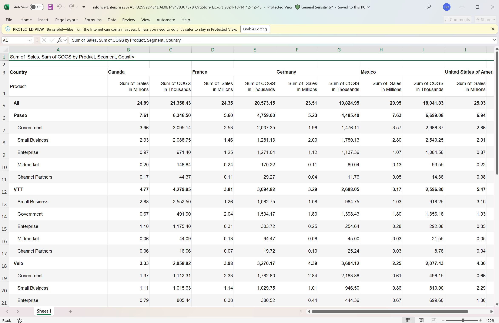
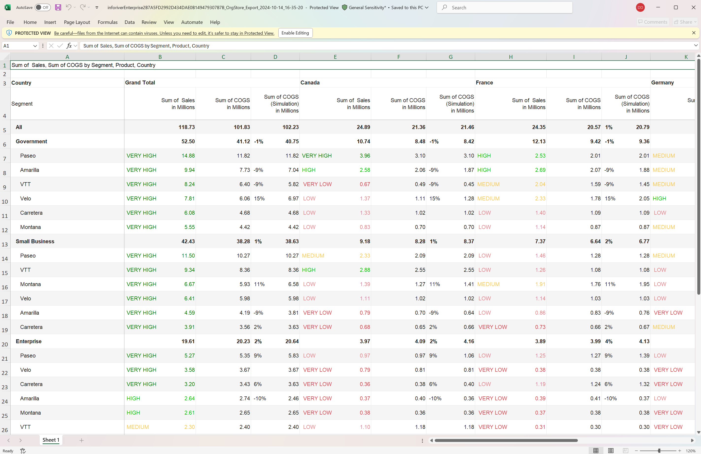
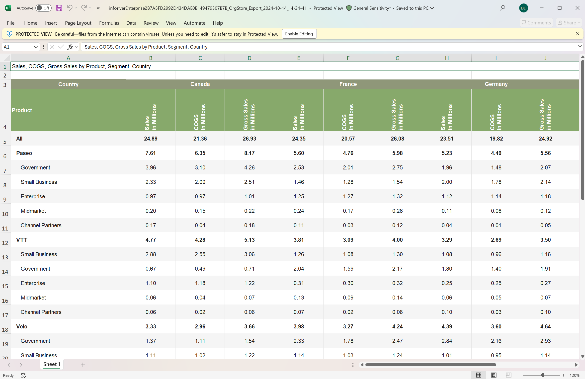
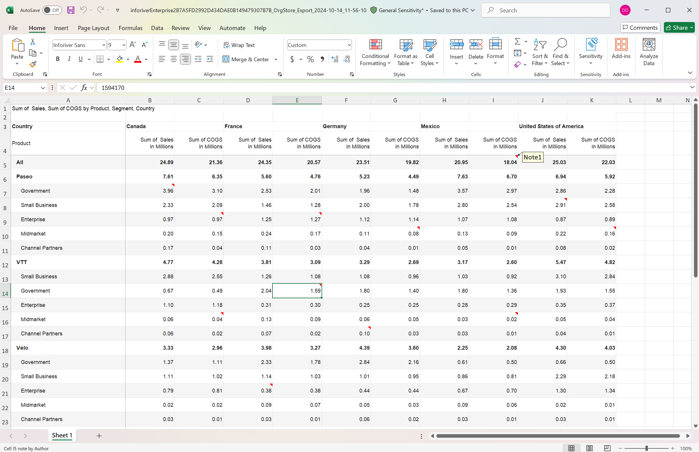
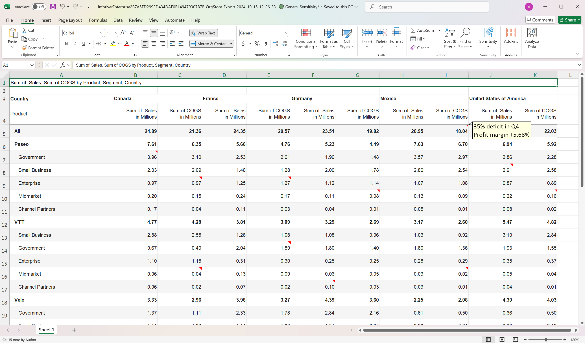
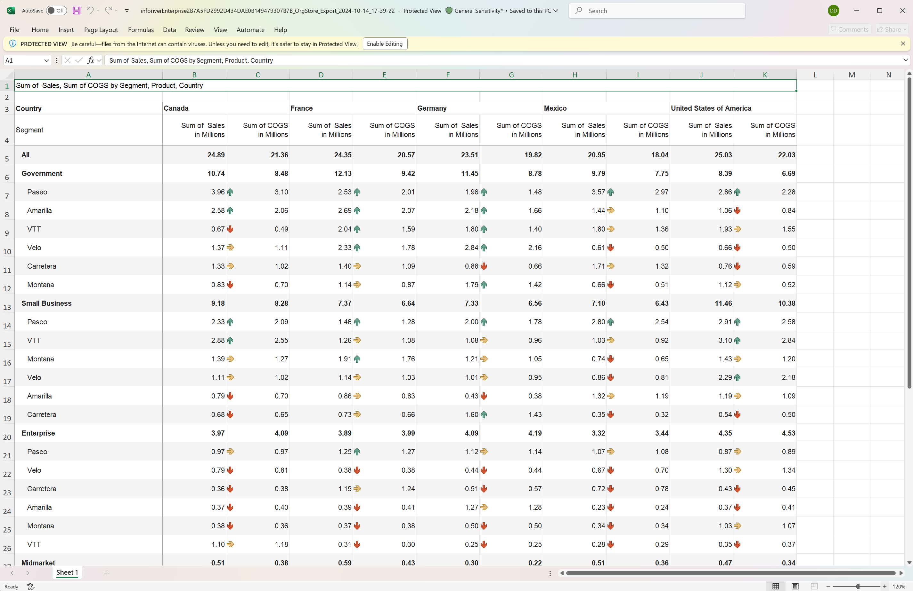
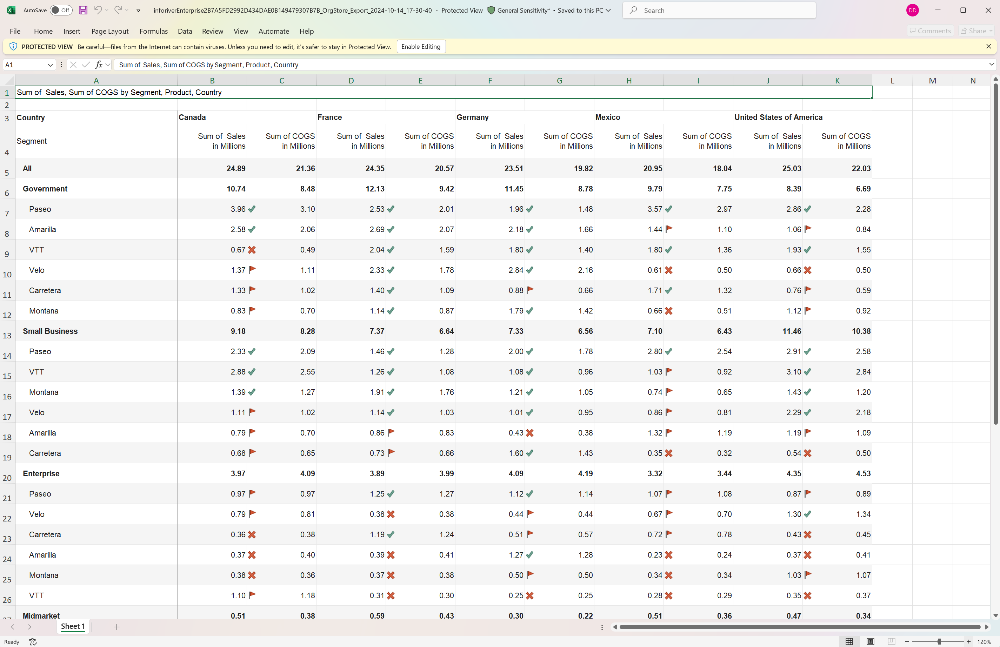
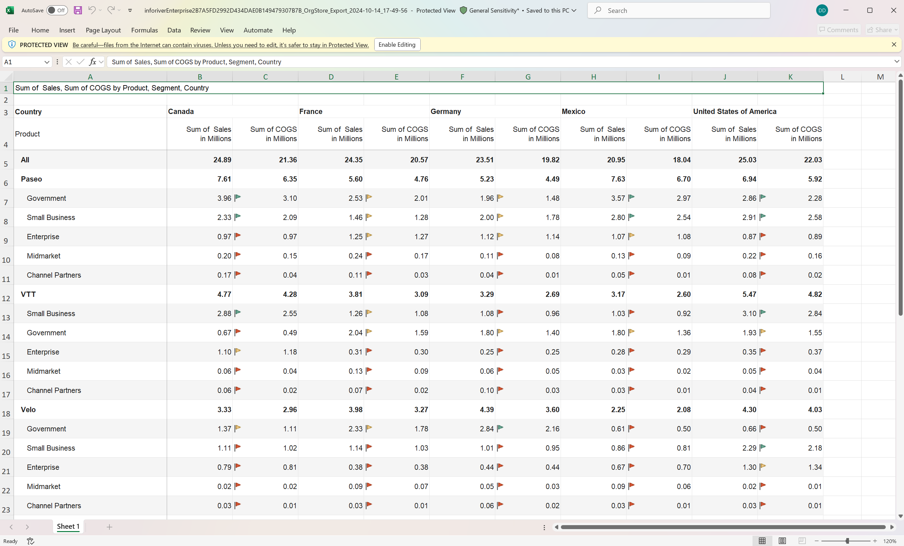

# Excel export - operational boundaries

Inforiver offers a vast range of formatting and visualization options within the Matrix, some of which are not supported in Excel exports. While generating exports, you will need to be mindful of the Inforiver features that cannot be captured in Excel exports have been listed in this section.

### 1. Formatting

1.1. Custom thousand and decimal separators can be enforced from display settings. These cannot be exported to Excel.&#x20;

<figure><figcaption>
Custom thousand separator in Inforiver
</figcaption></figure> <figure><figcaption>
Default comma separator in Excel export
</figcaption></figure>

1.2. You cannot blend columns in exports.

1.3. Export to Excel does not support hatched formatting.

1.4. Signed row headers that are enabled by turning on the Sign in Headers display setting will not be captured.

<figure><figcaption>
Signed row headers, blend measures and hatched cells
</figcaption></figure>

1.5. Multiple colors in a single cell (when you run simulations or apply conditional formatting)  cannot be exported. The contents of the entire cell will have the same color in the exported file.&#x20;

In this example, the positive and negative simulation percentages are exported in black. The number and text have the same color in the export for the classification-based conditional formatting.&#x20;

<figure><figcaption>
Inforiver report with multiple colors in each cell
</figcaption></figure> <figure><figcaption>
Excel extract with single-color cells
</figcaption></figure>

### 2. Display and themes

2.1. Pinned rows are not supported in Excel.

2.2. You can enable Rails for ease of selection and formatting but cannot export them.

<figure><figcaption>
Rails and pinned rows in Inforiver
</figcaption></figure> <figure><figcaption>
Excel export without rails and pinned rows
</figcaption></figure>

2.3. Row-level charts cannot be exported. Bar charts&#x20;

<figure><figcaption>
Row-level charts in Inforiver
</figcaption></figure>

2.4. Themes cannot be applied for Excel exports.

2.5. Display padding is not supported in Excel.

### 3. Annotations

3.1. Comments cannot be exported. Excel only supports notes.

3.2. Excel exports cannot capture serial numbers assigned to notes in Inforiver. The export will contain only a note indicator. Hover over the note indicator to view the content.

<figure><figcaption>
Numbered notes in Inforiver
</figcaption></figure> <figure><figcaption>
Notes indicators in Excel
</figcaption></figure>

&#x20;3.3. Excel exports cannot capture rich text formatting applied to notes.

<figure><figcaption>
Notes with rich text formatting in Inforiver
</figcaption></figure> <figure><figcaption>
Notes exported to Excel in plain text
</figcaption></figure>

3.4. You can enable marker mode for highlighting data points. Markers however cannot be captured in exports.

<figure><figcaption>
Marker mode in Inforiver
</figcaption></figure>

### 4. Data volume

4.1. A maximum of 500k cells can be exported to Excel. For higher data volumes, we encourage you to use the scheduler.

4.2. For unlicensed versions of Inforiver, you will be able to export upto 500 rows to PDF and Excel.

### 5. Visual measures and columns

5.1. Single/multi-select dropdowns are not supported in Excel.

### 6. Report server

6.1. Right-click and save as an Excel file to export reports from the report server.

### 7. Layouts and column selection

7.1. When you export to Excel, you have 3 options: export the entire report, export with expand/collapse for hierarchies, and expand the current state of the report. All these options are available in the default Hierarchy layout however some export options will be disabled based on the layout chosen.&#x20;

<figure><figcaption>
Export options in table layout
</figcaption></figure>

7.2. Selected columns - only the Current State export option will be enabled if you want to export selected columns.

<figure><figcaption>
Current state export option for selected columns
</figcaption></figure>

### 8. Icons

8.1. A maximum of 3 conditions are supported for custom icons. Inforiver provides predefined value ranges and icons when you use classification-based conditional formatting. When you change an icon or add or remove value ranges, the icons are considered a custom set.&#x20;

Only 3 conditions will be supported in such scenarios.

<figure><figcaption>
Custom icons with additional ranges used in Inforiver
</figcaption></figure> <figure><figcaption>
Icons in Excel export 
</figcaption></figure>

8.2. Color customizations - If you have overridden the default colors, Excel may substitute different icons or change the color.

<figure><figcaption>
Colors and custom icons in Inforiver
</figcaption></figure> <figure><figcaption>
Icons and colors used in the Excel export
</figcaption></figure>

8.3. Icon repetition -  If the same icon is used multiple times with different colors, only the colors that Excel supports will be exported.

<figure><figcaption>
Same icons with different colors applied in Inforiver
</figcaption></figure> <figure><figcaption>
Icon color changed in Excel export
</figcaption></figure>

8.4. Rating icons are not supported. The Excel export will not have any icons when ratings are applied.

<figure><figcaption>
Rating icons in Inforiver
</figcaption></figure>

### 9. Pagination

9.1. Excel exports do not support the default page break applied in Inforiver. The data will be exported to a single Excel tab irrespective of the number of pages in Inforiver. If you explicitly specify a page break based on a row dimension category, each category will be exported to a different Excel tab.

<figure><figcaption>
Default page breaks in Inforiver
</figcaption></figure>
