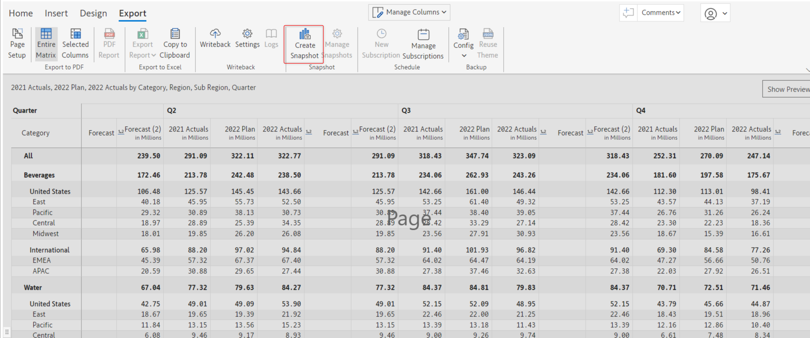
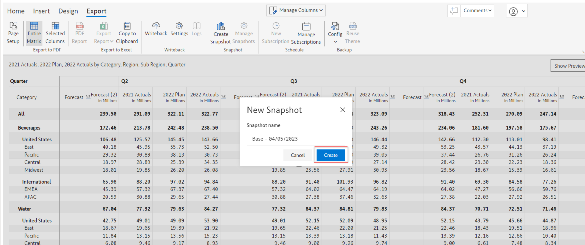
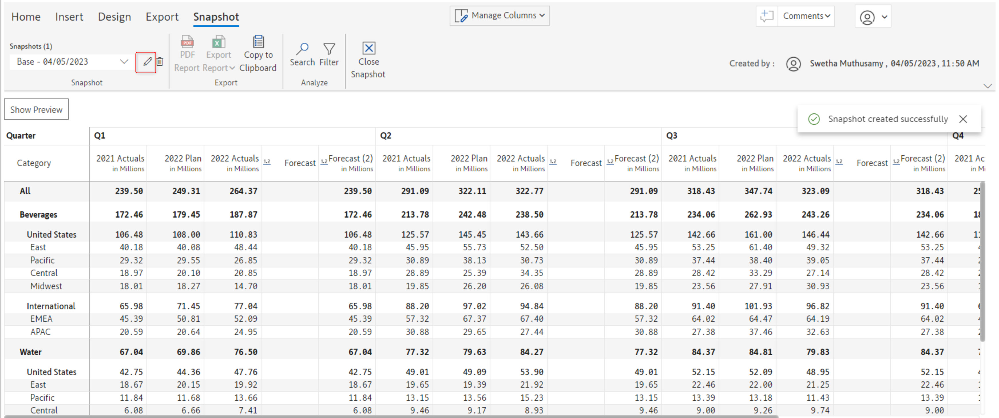
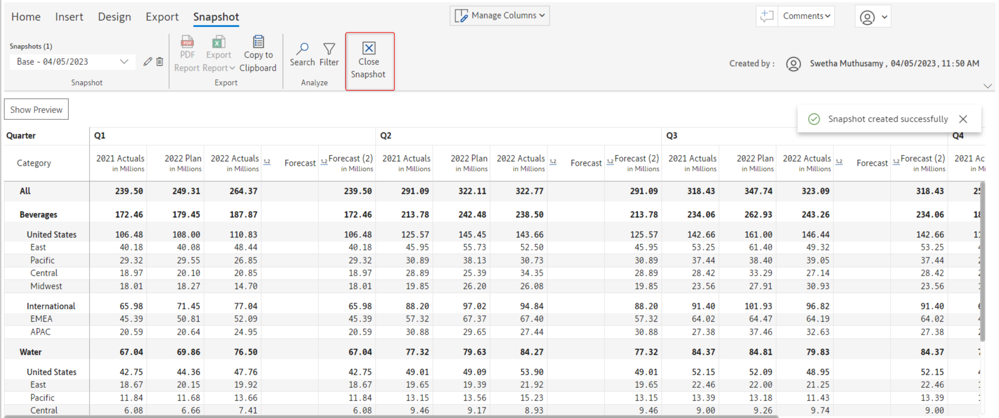

# Snapshot (Enterprise only)

In the edit mode, the current state of the report can be saved as a snapshot. Snapshots are read-only versions that can be used to freeze the data at month-end accounting/financial closes for future comparisons that are not impacted by source data changes and dataset refreshes.&#x20;

Data cannot be edited in a snapshot view. And the created snapshots are not available to the viewers of the report.

Write back of snapshots will be supported with our next release (Inforiver Enterprise 2.1).

## 1. Create a snapshot


A snapshot can be created only in the 'Edit' mode and not in the 'Reading' view mode


To create a snapshot, click the 'Create snapshot' option under the 'Export' tab of the Inforiver toolbar.

<figure><figcaption></figcaption></figure>

This will open up the 'New snapshot' modal.

In this modal, you can specify the name of the snapshot and click 'Create' to create the snapshot.

<figure><figcaption></figcaption></figure>

## 2. Configure snapshot

If a snapshot is successfully created, a 'Snapshot' tab will be available in the Inforiver toolbar.

This toolbar has the following snapshot-related configuration options:

### i) Snapshot name

Clicking on this drop-down will display a list of all the created snapshots. You can click on any specific snapshot to open and view it.

<figure><figcaption></figcaption></figure>

### ii) Edit icon

Using this option, you can edit the current snapshot name. Clicking this icon will open up the 'Create snapshot' modal in which you can edit the snapshot name.

<figure><figcaption></figcaption></figure>

### iii) Delete icon

If you want to delete the created snapshot you can do so by clicking on this trash/delete icon.

<figure><figcaption></figcaption></figure>

Clicking on this icon will open up the 'Confirm delete' modal. Click 'Confirm' to delete the snapshot permanently.

<figure><figcaption></figcaption></figure>

### iv) Close

Click this icon to close the snapshot and return to the edit/reading mode view.

<figure><figcaption></figcaption></figure>

In the next section, we'll look at [scheduling reports](../11.-scheduling-reports/).
