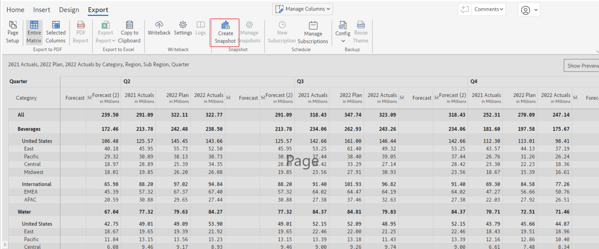
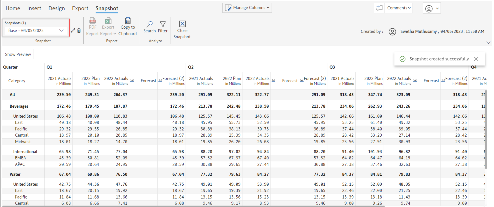
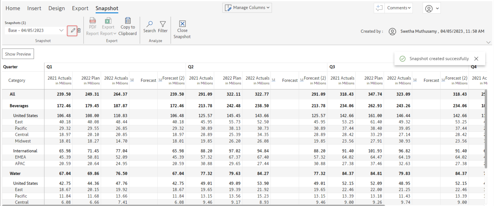
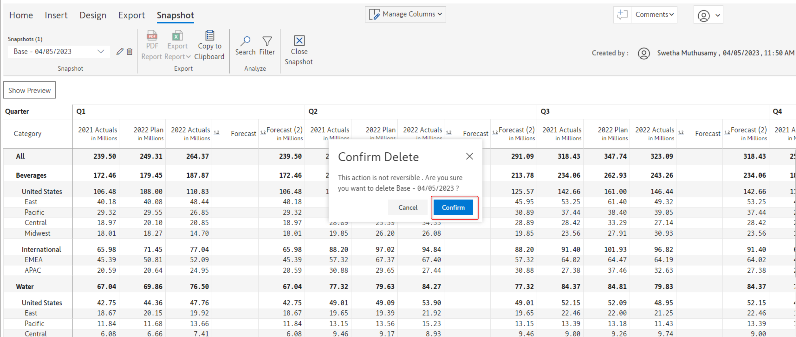
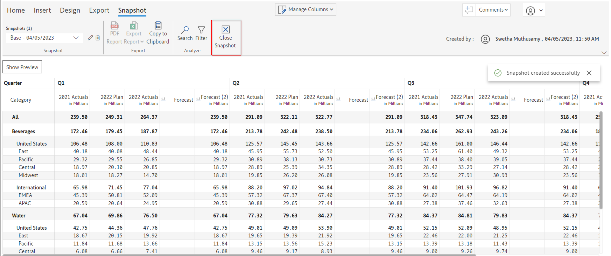

# Snapshot (Writeback Matrix only)

&#x20;Snapshots are read-only versions that can be used to freeze the data at month-end accounting/financial closes for future comparisons that are not impacted by source data changes and dataset refreshes. In the edit mode, the current state of the report can be saved as a snapshot.

Data cannot be edited in a snapshot view. Snapshots are available to the viewers of the report based on permissions.

Writeback of snapshots will be supported in upcoming releases.

## 1. Create a snapshot


A snapshot can be created only in the 'Edit' mode and not in the 'Reading' view mode


To create a snapshot, click the 'Create snapshot' option under the 'Export' tab of the Inforiver toolbar.

<figure><figcaption></figcaption></figure>

This will open up the 'New snapshot' modal.

In this modal, you can specify the name of the snapshot and click 'Create' to create the snapshot.

<figure><figcaption></figcaption></figure>

## 2. Configure snapshot

If a snapshot is successfully created, a 'Snapshot' tab will be available in the Inforiver toolbar.

This toolbar has the following snapshot-related configuration options:

### i) Snapshot name

Clicking on this drop-down will display a list of all the created snapshots. You can click on any specific snapshot to open and view it.

<figure><figcaption></figcaption></figure>

### ii) Edit icon

Using this option, you can edit the current snapshot name. Clicking this icon will open up the 'Create snapshot' modal in which you can edit the snapshot name.

<figure><figcaption></figcaption></figure>

### iii) Delete icon

If you want to delete the created snapshot you can do so by clicking on this trash/delete icon.

<figure><figcaption></figcaption></figure>

Clicking on this icon will open up the 'Confirm delete' modal. Click 'Confirm' to delete the snapshot permanently.

<figure><figcaption></figcaption></figure>

### iv) Close

Click this icon to close the snapshot and return to the edit/reading mode view.

<figure><figcaption></figcaption></figure>

## 3. Schedule snapshots

The snapshot feature comes packaged with a built-in scheduler. Click on the _Schedule Snapshot_ button in the Export ribbon to open the Schedule Snapshot side pane. Click on _Setup snapshot schedule._ In the schedule configuration, you can set the start and end dates, the time and timezone, and the frequency for snapshots to be captured.


Snapshots can be scheduled only from the Power BI service, not from the desktop.


<figure><figcaption>
Snapshot scheduler
</figcaption></figure>

After saving the schedule settings, you will have options to initiate, reset, and pause the schedule and view logs.

<figure><figcaption>
Scheduler options
</figcaption></figure>

Click on **View jobs** to see all the snapshot jobs and to view logs. The logs will show details such as the total time taken to run the job, the time taken for each milestone and the steps under each milestone.

<figure><figcaption></figcaption></figure>

## 4. Snapshots in reading view

Report viewers can also view, export, and [compare](comparing-snapshots.md) snapshots if they are permitted by the report author. To give access to a snapshot, click on the Manage Permission button in the Snapshot ribbon - the Reading View Permission side pane opens. In this window, you can add the email IDs of users who can access snapshots in reading mode.


Users who have access to a snapshot have elevated access. They can view all the data irrespective of RLS settings.&#x20;


<figure><figcaption>
Snapshot permissions
</figcaption></figure>

After adding users, you can assign permissions to view/compare/export snapshots from the Allowed User Controls settings.

<figure><figcaption></figcaption></figure>

Users who have permissions will have the Snapshot ribbon enabled in reading view and will be able to access snapshots.

<figure><figcaption></figcaption></figure>
