# Administration

Inforiver provides a comprehensive and business-friendly user interface for managing and administering schedules. The 'All subscriptions' page is similar to the 'My subscriptions' page except for the fact that it is available only for admin users to view and manage the subscriptions of all other members.

<figure><figcaption>
All subscriptions page
</figcaption></figure>

The options available on the 'All subscriptions' page are the same as the ones available on the 'My subscriptions' page. Refer to the [Manage your subscriptions](manage-your-subscriptions.md) section to learn more about each of these options in detail.


The 'All subscriptions' and 'User management' pages are available only to admin users.


A subscription can contain multiple jobs. You can also monitor, view, and gather insights into the subscription jobs of other users.

## 1. Monitoring subscription jobs

All scheduled jobs will be displayed on the **Jobs** page, along with their details.&#x20;

<figure><figcaption>
Subscription jobs
</figcaption></figure>

### a) Job details

* **ID:** The unique ID of the scheduled job.
* **Subscription:** The name of the subscription.
* **Workspace:** The name of the workspace the subscription belongs to.
* **Report:** The name of the report.
* **Started by:** Name of the person who started the schedule.
* **Job type:** The job type of the schedule (one-time or scheduled).
* **Started** At: The date and the time when the job started.
* **Duration:** The exact duration of the job runtime.
* **Status:** The current status of the job (success or failure).


Each of these column values can be sorted in ascending/descending order by clicking on their respective column headers.


Clicking on any of the scheduled job IDs will display a detailed summary of the job in the 'Summary' tab.

<figure><figcaption>
Subscription summary
</figcaption></figure>

Clicking on the 'Email Jobs' tab will display a summary of all the emails sent along with the recipients, delivered date, time, status, filter, and bookmarks.

<figure>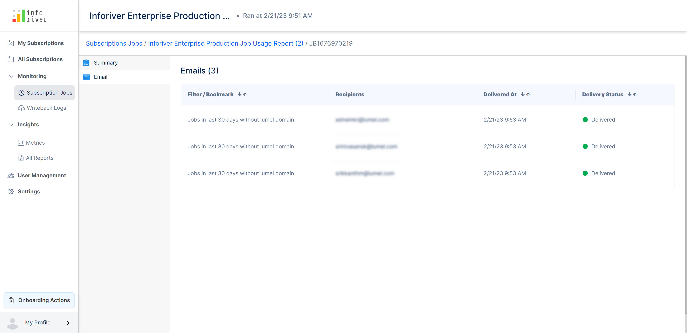<figcaption>
Subscription jobs email summary
</figcaption></figure>

You can filter the jobs using the following:

<figure>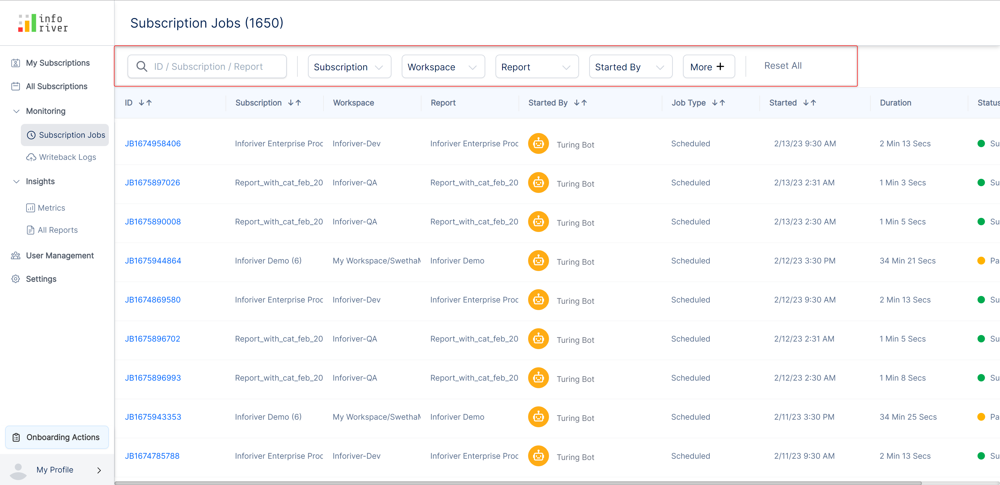<figcaption>
Subscription jobs filter option
</figcaption></figure>

### **b) Search bar**&#x20;

Using this search bar you can search for the job you need. If you have an enormous list of job subscriptions this feature comes in handy

### **c) Subscription**&#x20;

Using this drop-down you can filter the jobs based on the subscription. Only the jobs of the selected subscriptions will get displayed.

<figure>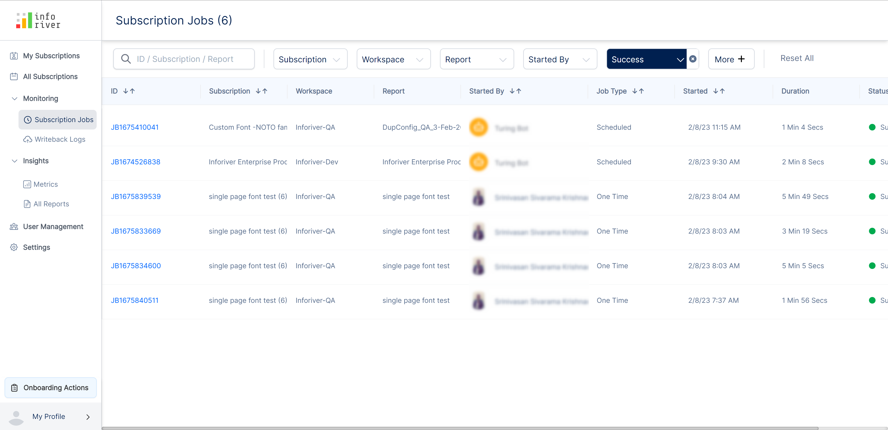<figcaption>
Subscription jobs filter
</figcaption></figure>

### **d) Workspace**

Using this drop-down you can filter the jobs based on the workspaces. Only the jobs of the selected workspaces will get displayed.

<figure>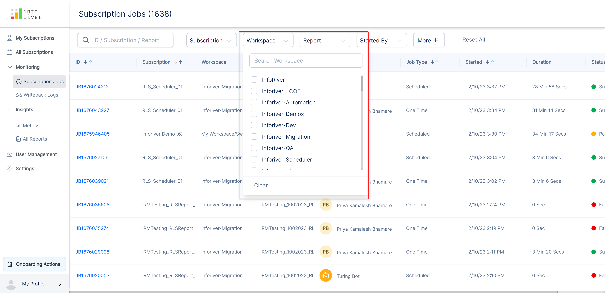<figcaption>
Subscription jobs workspace filter
</figcaption></figure>

### **e) Report**&#x20;

Using this drop-down you can filter the jobs based on the reports. Only the jobs of the selected reports will get displayed.

<figure>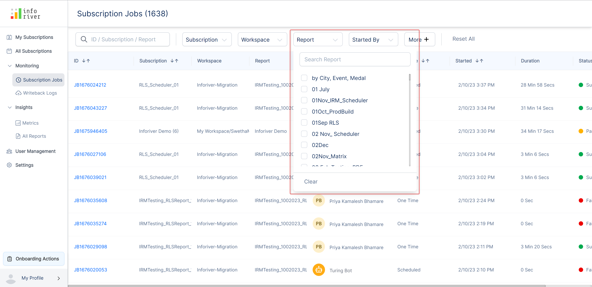<figcaption>
Subscription jobs reoprt filter
</figcaption></figure>

### **f) Started by**&#x20;

Using this drop-down you can filter the jobs based on the users who started the jobs. Only the jobs started by the selected users will get displayed.

<figure>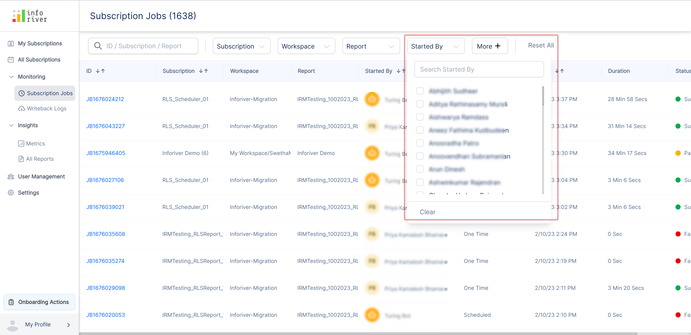<figcaption>
Subsription jobs starteby filter
</figcaption></figure>

### **g) More**&#x20;

Click on this option to view additional filter options for the jobs. The additional filter options include filtration by

* **Destination** - Enabling this option will filter your jobs based on the selected destination
* **Status** - Enabling this option will filter your jobs based on the job status
* **Job type** - Enabling this option will filter your jobs based on the job type
* **Start time** - Enabling this option will filter your jobs based on the start time

<figure>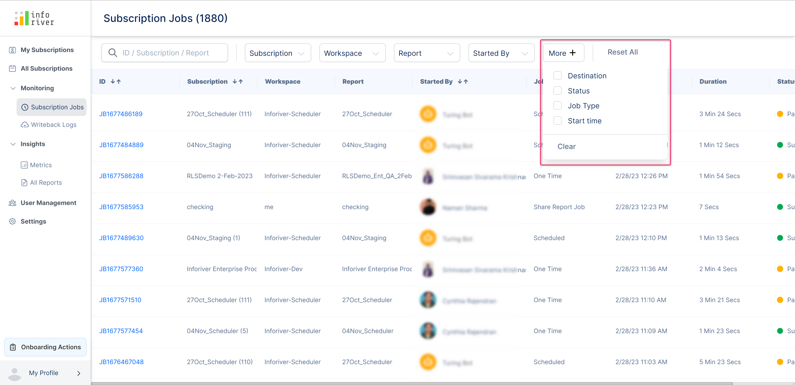<figcaption>
Subscription jobs more filter
</figcaption></figure>

### **h) Reset all**&#x20;

Clicking on this option will reset all the applied filters.

## 2. Insights

This tab displays insights about the subscription job runs like the number of failures and availability of services like emails and message queues.

### a) Metrics&#x20;

Dashboard with details about the number of completed, queued, running, skipped, and failed jobs.

Clicking on either of the job types will take you back to the subscription jobs page of the monitoring section with the corresponding status filter applied.

<figure><figcaption>
Metrics
</figcaption></figure>

You can use the dropdown filter to display job metrics for time ranges such as the current day, the past week, or the last 30 days.

<figure><figcaption>
Filtering metrics
</figcaption></figure>

Click any of the metrics to navigate to the subscription jobs window where you can see all the subscription runs. For instance, clicking the **Failed Jobs** button will display the details of all the failed jobs.

<figure><figcaption>
Failed jobs
</figcaption></figure>

### b) All reports

&#x20;You can see a list of all the report subscription runs in the 'All reports' tab,

<figure>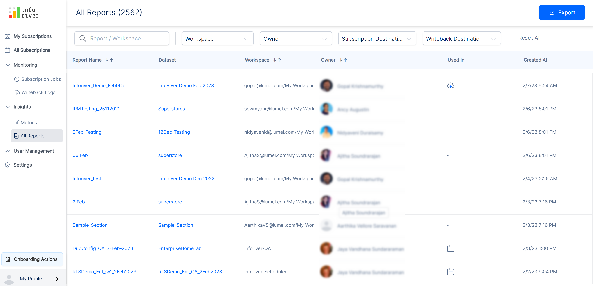<figcaption>
All reports page
</figcaption></figure>

Clicking on any of the report names will redirect to the 'Report details' page which displays several details.&#x20;

#### i) Lineage

In the 'Lineage' tab, you can see the lineage view of the report. You can see the data sources such as Excel/CSV/Databases, followed by the Power BI dataset, the Power BI report, and the Inforiver subscriptions.

<figure>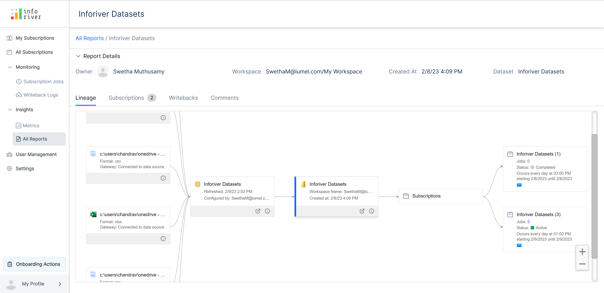<figcaption>
Report lineage view
</figcaption></figure>

#### ii) Subscription

In the 'Subscriptions' tab, you can see the list of job subscriptions related to the selected report.

<figure>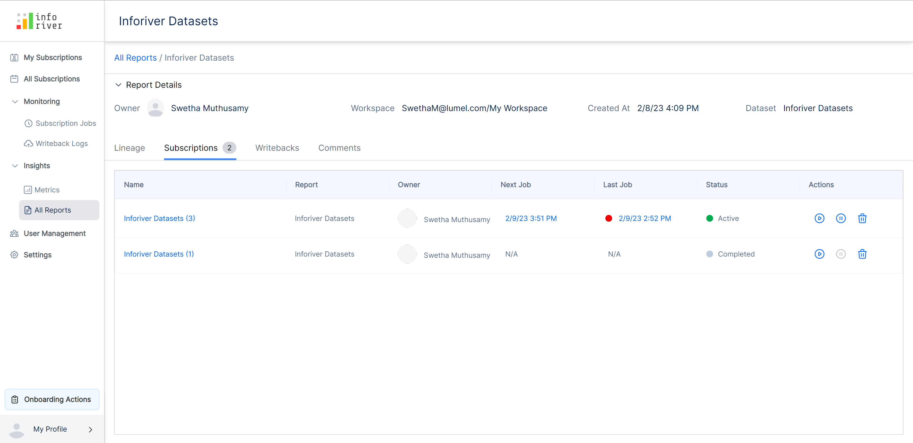<figcaption>
Report subscriptions list
</figcaption></figure>

#### iii) Writeback

In the 'Writeback' tab of the 'All reports' page, you can view a list of the writebacks performed in the report.

<figure>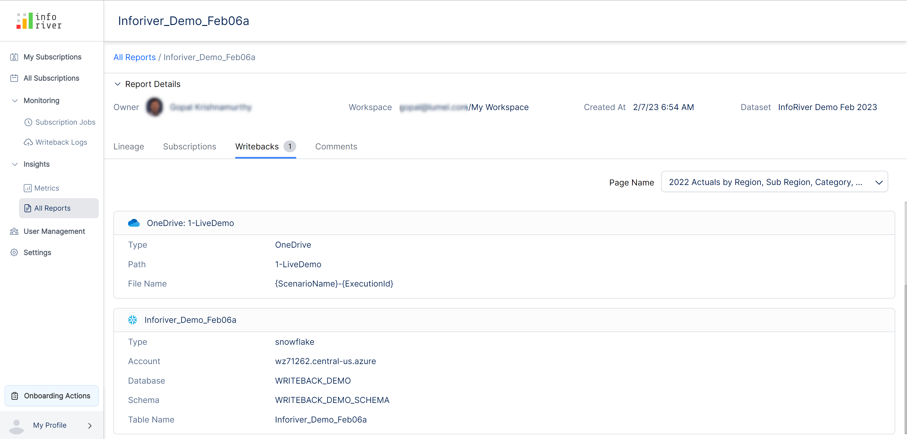<figcaption>
Reports writeback page 
</figcaption></figure>

#### iv) Comments

In the 'Comments' tab of the 'All reports' page, you can see details regarding all the comments in the report

<figure>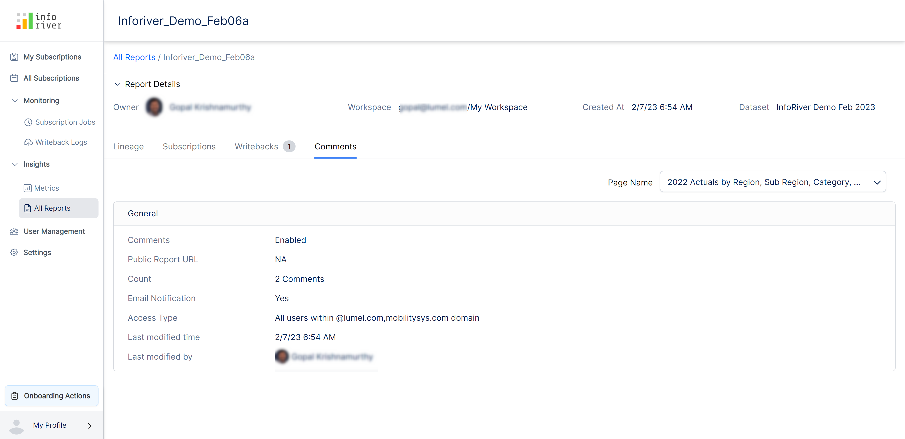<figcaption>
Reports comments page
</figcaption></figure>

Clicking on any of the 'Datasets' in the 'All reports' page will redirect to the 'Dataset details' page.

<figure>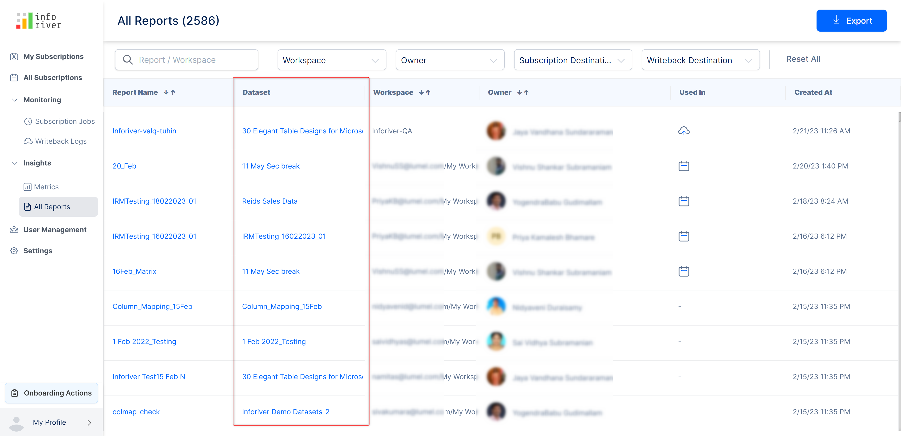<figcaption>
Datasets in all reports page
</figcaption></figure>

#### i) Lineage

The lineage tab displays the lineage view of the dataset.

<figure>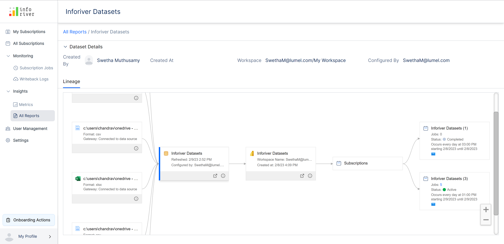<figcaption>
Dataset lineage view
</figcaption></figure>

In this section, we covered subscription administration. Navigate to the next section to learn more about [data writeback](../12.-data-writeback/).
