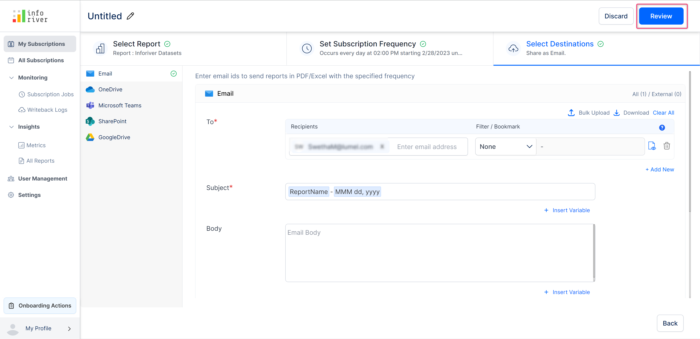
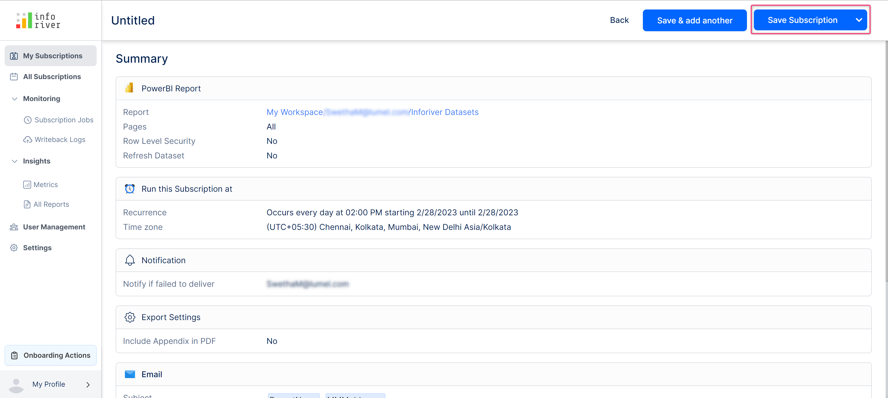
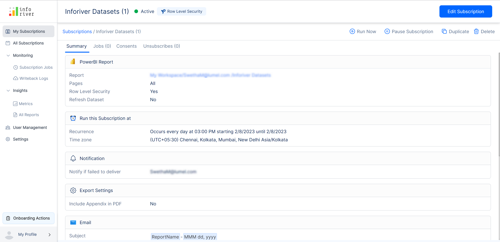

# Review & save subscription

Once you have entered all the required details, you can review all the configurations and save your subscription to create a new subscription.

## 1. Review subscription

To review your subscription, click on the 'Review' button at the top of the page as highlighted.

<figure><figcaption>
Review subscription
</figcaption></figure>

## 2. Save subscription

After reviewing the configurations you can complete the subscription creation process by clicking on the 'Save subscription' option.

<figure><figcaption>
Save subscription
</figcaption></figure>

## 3. Save and add another

You can also save the report by clicking on the 'Save and add another' button.

But clicking on 'Save and add another' will create a subscription and open the 'New subscription' screen again with all the previously entered 'Select report' options retained.

<figure><figcaption>
Save and add another
</figcaption></figure>

After a new schedule is created, a summary of all the previously mentioned details will be displayed on the 'Summary' page.

<figure><figcaption>
Subscription summary page
</figcaption></figure>

## 4. Edit subscription

To edit the subscription, click the 'Edit subscription' button on the top right corner of the schedule summary page, as highlighted in the image below. We'll cover this in more detail in the [manage ](../manage-your-subscriptions.md)[your subscriptions](../manage-your-subscriptions.md) section.

<figure><figcaption>
Edit subscription
</figcaption></figure>

In the next section, we'll look at how to [manage your subscriptions](../manage-your-subscriptions.md).
