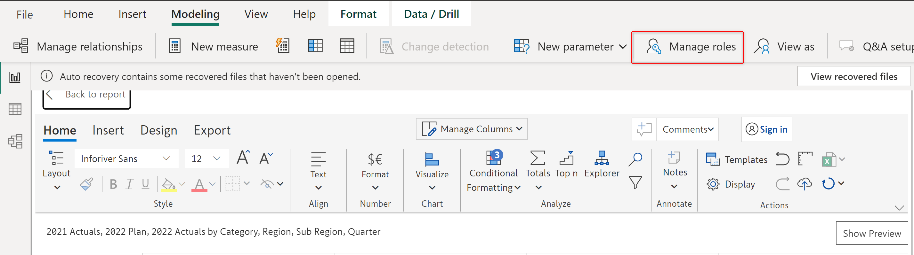
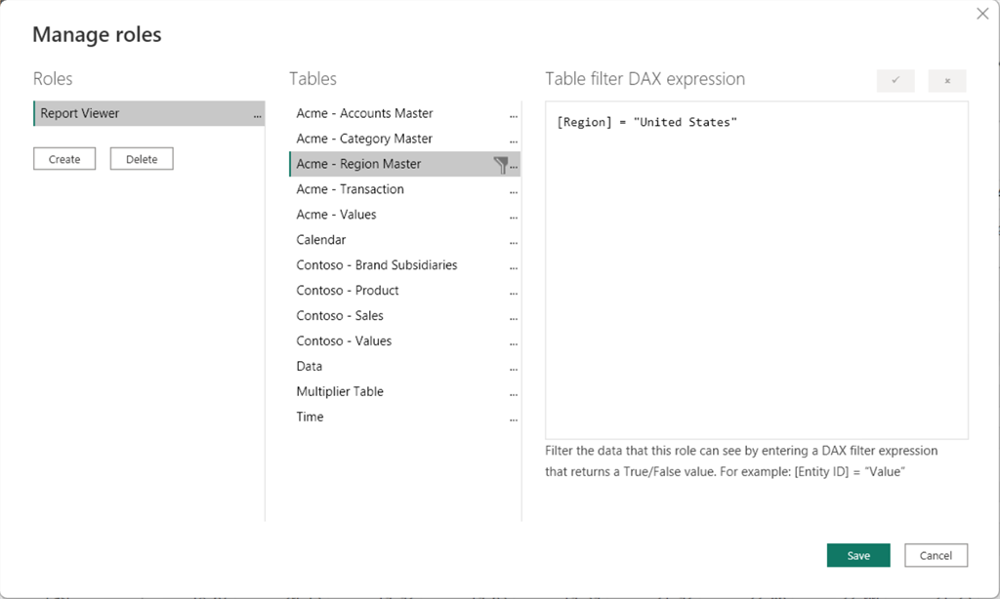
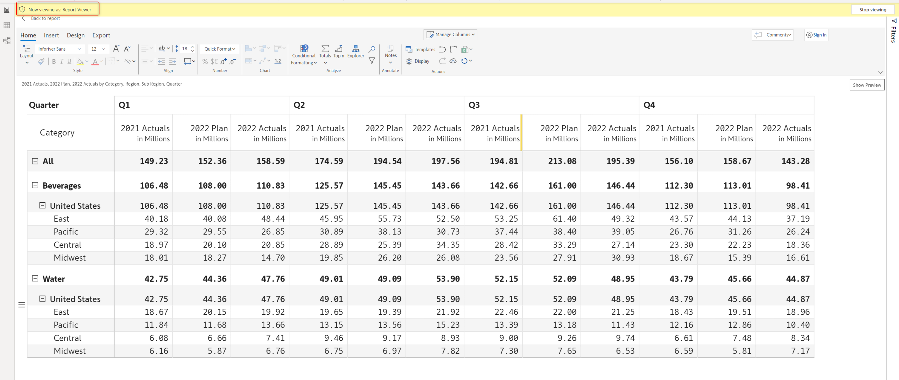
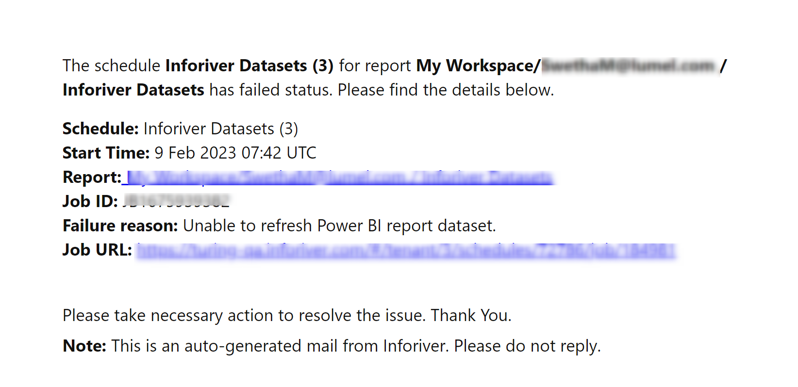
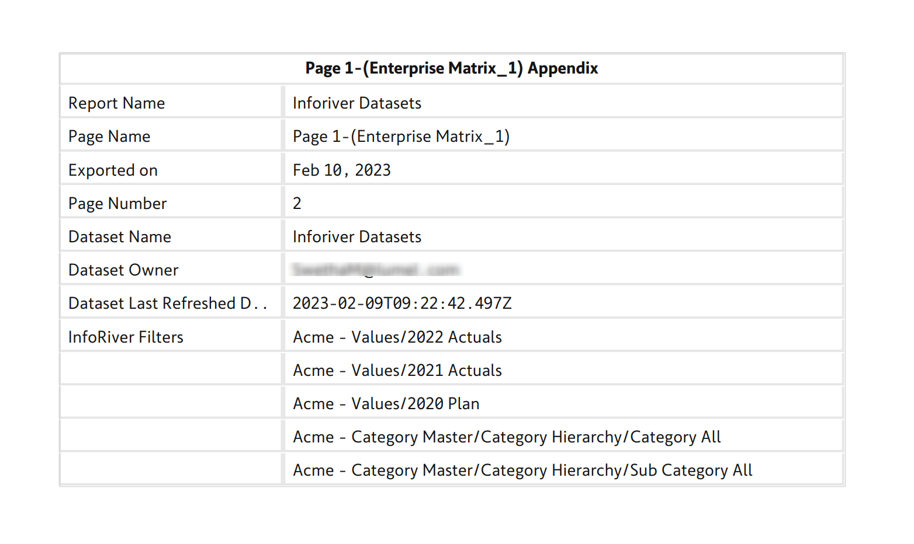

# Select a report

## 1. Select a Power BI report

In this section, you need to provide all the report-related details and configurations. This section has the following options:

### i) Select report

In the first drop-down, choose the Power BI workspace where the report you want to schedule is published.

If you schedule the subscription from the Power BI report, the 'Workspace' and 'Report' fields will be auto-populated with the workspace and report names, respectively. If you wish to schedule a different report, you can update the details here.

<figure><figcaption>
Select workspace
</figcaption></figure>

Based on the selection made in the first drop-down, the second drop-down gets populated with reports available in the selected workspace.&#x20;

In the second drop-down, select the report for which you want to create a subscription.

<figure><figcaption>
Select report 
</figcaption></figure>

### ii) Pages

Here you can choose which pages of the report to schedule.&#x20;

* **All pages:** Send all the pages of the report.
* **Select:** If you select this option, a drop-down menu appears, allowing you to choose which pages to schedule and send. Multiple pages can be selected.

<figure><figcaption>
Select pages
</figcaption></figure>

### iii) Include hidden pages&#x20;

You can also publish reports containing hidden pages. When you set up your subscription, you will have the option to include hidden pages.&#x20;

<figure><figcaption>
Include hidden pages
</figcaption></figure>

### iv) Row-level security

Enabling this option will export the report based on the row-level security applied. If this option is enabled, initially a consent email will be sent to the selected recipients, and only after the approval of the consent email will the scheduled reports be sent to the recipients.

Recipients with 'Admin' and 'Member' access roles will be able to view the entire report, whereas the recipients with 'Viewer' access would be able to view only the relevant data based on their role.&#x20;

You can manage the roles of the members using the 'Manage roles' option under the 'Modelling' tab in the Power BI toolbar.

<figure><figcaption>
Manage roles option
</figcaption></figure>

For example, in the following image, the 'Report Viewer' role has been set to view only the data related to the 'United States' region.

<figure><figcaption>
Applying security roles
</figcaption></figure>


If RLS is enabled then only the 'Email' destination is supported.


As seen below, members with the 'Report viewer' member role would be able to see only 'United States' under the categories while viewing the report.

<figure><figcaption>
Report with RLS
</figcaption></figure>

You can learn more about row-level security and how to define user roles and rules [here](https://learn.microsoft.com/en-us/power-bi/enterprise/service-admin-rls).

### v) Report plus layout

You can create subscriptions based on the Report+ categories. In this report, we have two categories: _Beverages_ and _Water_. These categories are available with page breaks, with each category taking up a page. You can send the records corresponding to each category to separate email IDs.&#x20;

Learn more about Report+ [here](../../8.-paginated-reporting/report-layouts-report+.md).

<figure><figcaption>
Report plus view
</figcaption></figure>

Once you select 'Report plus layout', the scheduler automatically detects the number of categories present in the report page selected.

<figure><figcaption>
Report plus layout categories
</figcaption></figure>

These categories can be viewed and selected on the 'Select Destinations' page, under the 'Category' section.

<figure><figcaption>
Report category in destination
</figcaption></figure>


If both the 'Report plus layout' and 'Row level security' options are enabled, only the 'Email' destination would be available.


## 2. Refresh dataset

### i) Refresh dataset for each run

If you have reports where the data gets frequently updated and you want the updated data to be sent every time the schedule is run, then you can enable the 'Refresh dataset for each run' option. If this option is enabled, only 'Email' can be chosen as the 'Destination' and other third-party destinations won't be available.

<figure><figcaption>
Refresh dataset for each run option
</figcaption></figure>

### ii) Dataset owner

If the 'Refresh dataset for each run' option is enabled, a consent email must be sent before the data refresh. This email will be sent to the recipients specified in the dataset owner option.

When you enable the 'Refresh dataset for each run' option, the dataset owner's name is automatically populated in this field. You can also include the email addresses of additional dataset owners or users if needed.&#x20;

<figure><figcaption>
Dataset owner
</figcaption></figure>

A sample consent email is shown in the image below.

<figure><figcaption>
Refresh dataset consent email
</figcaption></figure>


The subscription will be created only if the dataset owner(s) provide consent. The scheduled jobs will keep failing until consent is provided.


## 3. Notifications

### Notify if failed to deliver&#x20;

Here you can specify the email addresses to which notifications should be sent in case of failure in report delivery. The schedule owner's name will be added by default.&#x20;

You can choose to add other members' names by typing in the input box or choosing from the drop-down. You can also add external email addresses of members who are not part of your team/organization.

<figure><figcaption>
Notify if failed to deliver option
</figcaption></figure>

If in case any of the scheduled runs fails, then an email will be sent to all the selected members with the reason for failure, an error log, and a link to track back the error as shown in the image below.

<figure><figcaption>
Failed schedule email
</figcaption></figure>

## 4. Legacy mode

We have recently optimized our processes, significantly reducing job run times. Scheduler jobs now run three times faster than before. This high-performance mode is the default, but the standard mode can be selected if necessary.

<figure><figcaption>
Legacy Mode
</figcaption></figure>

## 5. Export settings

### Include an appendix in PDF&#x20;

Enabling this option will display an appendix for each report page with information like the font used, page name, filters applied, etc.

<figure><figcaption>
Include Appendix
</figcaption></figure>

A sample appendix is shown below.

<figure><figcaption>
PDF appendix
</figcaption></figure>

In the next section, we'll look at configuring the subscription frequency.
